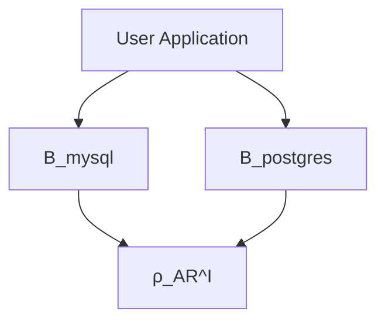

# RhoSocial ActiveRecord Mathematical Notation System Design

## 1. Basic Symbol Definitions

### 1.1 Core Symbols
- $\rho$: Represents the rhosocial ecosystem
- $\mathbf{AR}$: Represents the ActiveRecord component
- $\mathcal{I}$: Represents the abstract interface layer (Interface)
- $\mathcal{B}$: Represents the backend implementation (Backend)

### 1.2 Version Symbols
- $v$: Version number, e.g., $v_{1.0}$, $v_{2.3}$
- $V$: Set of all possible versions
- $\sim$: Version compatibility relation

## 2. Architectural Symbol System

### 2.1 Core Package Definitions

**Abstract Interface Layer:**
$$\rho_{\mathbf{AR}}^{\mathcal{I}}$$

This is the pure abstract backend definition, which specifies the interfaces that all backends must implement.

**Official Main Package (includes Interface + SQLite Reference Implementation):**
$$\rho_{\mathbf{AR}} := \rho_{\mathbf{AR}}^{\mathcal{I}} \boxplus \mathcal{B}_{\text{sqlite}}^{\rho}$$

Where:
- $\boxplus$: Represents "packaging combination" (packaging, not a dependency relationship)
- $\mathcal{B}_{\text{sqlite}}^{\rho}$: Represents the official SQLite implementation
- Superscript $\rho$: Indicates it is provided by rhosocial officially

**Important Note:** $\boxplus$ only signifies convenience in distribution packaging and does not imply coupling.

### 2.2 Backend Implementation Definitions

**Official Backend Package:**
$$\rho_{\mathbf{AR}\text{-}b} := \mathcal{B}_{b}^{\rho} \triangleright \rho_{\mathbf{AR}}^{\mathcal{I}}$$

Where:
- $b \in \{\text{mysql}, \text{postgres}, \text{mongodb}, \ldots\}$
- $\triangleright$: Represents a "unidirectional dependency" relationship
- $\mathcal{B}_{b}^{\rho}$: Represents the official implementation for backend $b$

**Third-Party Backend Package:**
$$\mathcal{B}_{b}^{\text{3rd}} \triangleright \rho_{\mathbf{AR}}^{\mathcal{I}}$$

Where superscript $\text{3rd}$ indicates a third-party implementation.

**User-Defined SQLite Backend (to replace the official one):**
$$\mathcal{B}_{\text{sqlite}}^{\text{custom}} \triangleright \rho_{\mathbf{AR}}^{\mathcal{I}}$$

### 2.3 Formal Definition of Dependency Relationships

**Unidirectional Dependency Property:**
$$\mathcal{B}_{b} \triangleright \rho_{\mathbf{AR}}^{\mathcal{I}} \quad \text{and} \quad \rho_{\mathbf{AR}}^{\mathcal{I}} \not\triangleright \mathcal{B}_{b}$$

**Independence Between Backends:**
$$\forall b_1, b_2 \in \mathcal{B}: b_1 \neq b_2 \implies \mathcal{B}_{b_1} \not\triangleright \mathcal{B}_{b_2}$$

**Interface Implementation Relation:**
$$\mathcal{B}_{b} \vDash \rho_{\mathbf{AR}}^{\mathcal{I}}$$

Where $\vDash$ represents "implements/satisfies" the interface specification.

## 3. Versioning System

### 3.1 Package Definitions with Versions

**Main Package Version:**
$$\rho_{\mathbf{AR}}(v) = \rho_{\mathbf{AR}}^{\mathcal{I}}(v) \boxplus \mathcal{B}_{\text{sqlite}}^{\rho}(v)$$

**Backend Package Version:**
$$\rho_{\mathbf{AR}\text{-}b}(v') = \mathcal{B}_{b}^{\rho}(v') \triangleright \rho_{\mathbf{AR}}^{\mathcal{I}}$$

### 3.2 Version Compatibility

**Compatibility Constraint Function:**
$$\Gamma: V_{\mathbf{AR}} \times V_{\mathcal{B}} \rightarrow \{\top, \bot\}$$

Where:
- $V_{\mathbf{AR}}$: Set of main package versions
- $V_{\mathcal{B}}$: Set of backend package versions
- $\top$: Represents compatible
- $\bot$: Represents incompatible

**Compatibility Relation Representation:**
$$\rho_{\mathbf{AR}}(v) \sim \rho_{\mathbf{AR}\text{-}b}(v') \iff \Gamma(v, v') = \top$$

**Common Compatibility Patterns:**

1.  **Strict Version Matching:**
    $$\Gamma_{\text{strict}}(v, v') = \begin{cases} \top & \text{if } v = v' \ \bot & \text{otherwise} \end{cases}$$ 

2.  **Major Version Compatibility (Semantic Versioning):**
    $$\Gamma_{\text{semver}}(v_{\text{major.minor.patch}}, v'_{\text{major.minor.patch}}) = \begin{cases} \top & \text{if } v_{\text{major}} = v'_{\text{major}} \ \bot & \text{otherwise} \end{cases}$$ 

3.  **Range Compatibility:**
    $$\rho_{\mathbf{AR}\text{-mysql}}(v') \sim \rho_{\mathbf{AR}}(v) \quad \text{where } v \in [v_{\min}, v_{\max}]$$

### 3.3 Version Constraint Expression

**Backward Compatibility Promise:**
$$\rho_{\mathbf{AR}}^{\mathcal{I}}(v_n) \supseteq \rho_{\mathbf{AR}}^{\mathcal{I}}(v_{n-1})$$

This indicates that a new version of the interface is a superset of the old version (backward compatible).

**Backend Version Constraint Declaration:**
$$\mathcal{B}_{\text{mysql}}^{\rho}(2.1) \models \rho_{\mathbf{AR}}^{\mathcal{I}}(v \geq 1.5 \land v < 3.0)$$

Where $\models$ represents "requires/depends on".

## 4. Complete Formal System

### 4.1 System Composition

$$\Sigma_{\rho\mathbf{AR}} = \langle \mathcal{I}, \mathcal{B}, \triangleright, \vDash, V, \Gamma, \sim \rangle$$

Where:
- $\mathcal{I}$: Set of interface specifications
- $\mathcal{B} = \{\mathcal{B}_b^{\rho}\} \cup \{\mathcal{B}_b^{\text{3rd}}\} \cup \{\mathcal{B}_b^{\text{custom}}\}$: All backend implementations
- $\triangleright$: Dependency relation
- $\vDash$: Implementation relation
- $V$: Version space
- $\Gamma$: Compatibility function
- $\sim$: Compatibility relation

### 4.2 System Invariants (Eternal Constraints)

$$\begin{aligned}
&\text{(INV-1) } \forall b \in \mathcal{B}, v \in V: \mathcal{B}_b(v) \triangleright \rho_{\mathbf{AR}}^{\mathcal{I}} \\
&\text{(INV-2) } \forall b \in \mathcal{B}, v \in V: \rho_{\mathbf{AR}}^{\mathcal{I}} \not\triangleright \mathcal{B}_b(v) \\
&\text{(INV-3) } \forall b_1, b_2 \in \mathcal{B}, v_1, v_2 \in V: b_1 \neq b_2 \implies \mathcal{B}_{b_1}(v_1) \not\triangleright \mathcal{B}_{b_2}(v_2) \\
&\text{(INV-4) } \forall b \in \mathcal{B}, v \in V: \mathcal{B}_b(v) \vDash \rho_{\mathbf{AR}}^{\mathcal{I}}
\end{aligned}$$

### 4.3 Evolutionary Constraints (Variable Constraints)

$$\begin{aligned}
&\text{(EVO-1) } \Gamma(v, v') \text{ may change with versioning strategy} \\
&\text{(EVO-2) } \rho_{\mathbf{AR}}^{\mathcal{I}}(v_{n+1}) \text{ may extend or deprecate interfaces} \\
&\text{(EVO-3) } \mathcal{B}_b^{\rho}(v') \text{ version number is independent of } \rho_{\mathbf{AR}}(v)
\end{aligned}$$

## 5. Practical Application Examples

### 5.1 Package Dependency Graph (DAG)

**Formal Expression:**
$$\text{App} \triangleright \begin{cases} 
\rho_{\mathbf{AR}} \\
\rho_{\mathbf{AR}\text{-mysql}} \triangleright \rho_{\mathbf{AR}}^{\mathcal{I}}
\end{cases}$$ 

### 5.2 Example of Version Compatibility Matrix

| Backend Version ↓ / Main Package Version → | $\rho_{\mathbf{AR}}(1.x)$ | $\rho_{\mathbf{AR}}(2.x)$ | $\rho_{\mathbf{AR}}(3.x)$ |
|:-------------------------------------------:|:-------------------------:|:-------------------------:|:-------------------------:|
| $\mathcal{B}_{\text{mysql}}^{\rho}(1.x)$     | ✓                         | ✗                         | ✗                         |
| $\mathcal{B}_{\text{mysql}}^{\rho}(2.x)$     | ✗                         | ✓                         | ✓                         |
| $\mathcal{B}_{\text{mysql}}^{\rho}(3.x)$     | ✗                         | ✗                         | ✓                         |

**Formal Expression:**
$$\Gamma_{\text{example}} = \{(1.x, 1.x), (2.x, 2.x), (2.x, 3.x), (3.x, 3.x)\}$$

### 5.3 Replacing the Official SQLite Implementation

**Default Configuration:**
$$\text{App} \triangleright \rho_{\mathbf{AR}}(v) = \rho_{\mathbf{AR}}^{\mathcal{I}}(v) \boxplus \mathcal{B}_{\text{sqlite}}^{\rho}(v)$$

**User-Defined Replacement:**
$$\text{App} \triangleright \begin{cases}
\rho_{\mathbf{AR}}^{\mathcal{I}}(v) \\
\mathcal{B}_{\text{sqlite}}^{\text{custom}} \triangleright \rho_{\mathbf{AR}}^{\mathcal{I}}(v)
\end{cases}$$ 

Where $\mathcal{B}_{\text{sqlite}}^{\text{custom}} \vDash \rho_{\mathbf{AR}}^{\mathcal{I}}(v)$ (satisfies the interface specification).

### 5.4 Multi-Backend Deployment

$$\text{App} \triangleright \begin{cases}
\rho_{\mathbf{AR}}(2.1) \\
\mathcal{B}_{\text{mysql}}^{\rho}(2.0) \triangleright \rho_{\mathbf{AR}}^{\mathcal{I}}(2.1) \\
\mathcal{B}_{\text{postgres}}^{\rho}(2.1) \triangleright \rho_{\mathbf{AR}}^{\mathcal{I}}(2.1)
\end{cases}$$ 

Where:
$$\Gamma(2.1, 2.0) = \top \land \Gamma(2.1, 2.1) = \top$$ 

## 6. Symbol Summary

### Core Symbol Table

| Symbol                            | Meaning                          | Example                  |
|:----------------------------------:|:---------------------------------|:-------------------------|
| $\rho_{\mathbf{AR}}^{\mathcal{I}}$ | Abstract interface definition    | Pure interface spec      |
| $\rho_{\mathbf{AR}}$               | Official main package            | Interface + SQLite       |
| $\mathcal{B}_{b}^{\rho}$           | Official backend implementation  | MySQL, PostgreSQL        |
| $\mathcal{B}_{b}^{\text{3rd}}$     | Third-party backend              | Community implementation |
| $\mathcal{B}_{b}^{\text{custom}}$  | User-defined backend             | Custom SQLite impl       |
| $\triangleright$                   | Unidirectional dependency        | Backend depends on interface |
| $\boxplus$                         | Packaging combination            | Non-coupled distribution |
| $\vDash$                           | Implements/satisfies             | Backend implements interface |
| $\models$                          | Requires/depends on              | Version constraint decl. |
| $\sim$                             | Version compatible               | Main pkg compatible with backend |
| $\Gamma$                           | Compatibility function           | Checks version compatibility |
| $V$                                | Version space                    | All possible versions    |

### Key Design Principles

1.  **Unidirectional Dependency:** Use $\triangleright$ to clearly express one-way dependency, and $\not\triangleright$ for non-dependency.
2.  **Packaging Not Coupling:** Use $\boxplus$ to distinguish distribution convenience from true coupling.
3.  **Interface Contract:** Use $\vDash$ to express that an implementation must satisfy the interface.
4.  **Independent Versioning:** Backend versions are independent of the main package but constrained by $\Gamma$.
5.  **System Invariants:** (INV-1) to (INV-4) are always true.
6.  **Evolutionary Variability:** (EVO-1) to (EVO-3) can be adjusted as the project evolves.

## 7. Mapping Mathematical Expressions to Actual Package Names

This section serves as a quick reference, mapping the mathematical symbols defined in this document to their corresponding actual package names on PyPI.

### 7.1 `rhosocial-activerecord`

*   **Mathematical Symbol**: $\rho_{\mathbf{AR}}$
*   **Formal Definition**: $\rho_{\mathbf{AR}} := \rho_{\mathbf{AR}}^{\mathcal{I}} \boxplus \mathcal{B}_{\text{sqlite}}^{\rho}$
*   **Meaning**:
    *   Represents the `rhosocial-activerecord` official main package.
    *   It is defined as a **packaging combination** ($\boxplus$) of the abstract interface layer ($\rho_{\mathbf{AR}}^{\mathcal{I}}$) and the official SQLite implementation ($\mathcal{B}_{\text{sqlite}}^{\rho}$).
    *   This means the main package includes both the interface specifications that all backends must follow and a built-in SQLite reference implementation.

### 7.2 `rhosocial-activerecord-mysql`

*   **Mathematical Symbol**: $\rho_{\mathbf{AR}\text{-mysql}}$
*   **Formal Definition**: $\rho_{\mathbf{AR}\text{-mysql}} := \mathcal{B}_{\text{mysql}}^{\rho} \triangleright \rho_{\mathbf{AR}}^{\mathcal{I}}$
*   **Meaning**:
    *   Represents the `rhosocial-activerecord-mysql` official backend package.
    *   It is defined as the official MySQL implementation ($\mathcal{B}_{\text{mysql}}^{\rho}$) having a **unidirectional dependency** ($\triangleright$) on the abstract interface layer ($\rho_{\mathbf{AR}}^{\mathcal{I}}$).
    *   This means `rhosocial-activerecord-mysql` depends on the interfaces defined by the core package and provides a concrete implementation for MySQL.

### 7.3 `rhosocial-activerecord-postgres`

*   **Mathematical Symbol**: $\rho_{\mathbf{AR}\text{-postgres}}$
*   **Formal Definition**: $\rho_{\mathbf{AR}\text{-postgres}} := \mathcal{B}_{\text{postgres}}^{\rho} \triangleright \rho_{\mathbf{AR}}^{\mathcal{I}}$
*   **Meaning**:
    *   Represents the `rhosocial-activerecord-postgres` official backend package.
    *   It is defined as the official PostgreSQL implementation ($\mathcal{B}_{\text{postgres}}^{\rho}$) having a **unidirectional dependency** ($\triangleright$) on the abstract interface layer ($\rho_{\mathbf{AR}}^{\mathcal{I}}$).
    *   This means `rhosocial-activerecord-postgres` depends on the interfaces defined by the core package and provides a concrete implementation for PostgreSQL.
