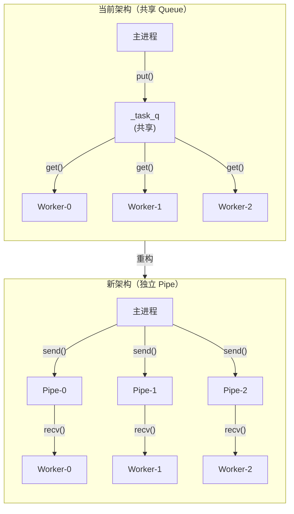
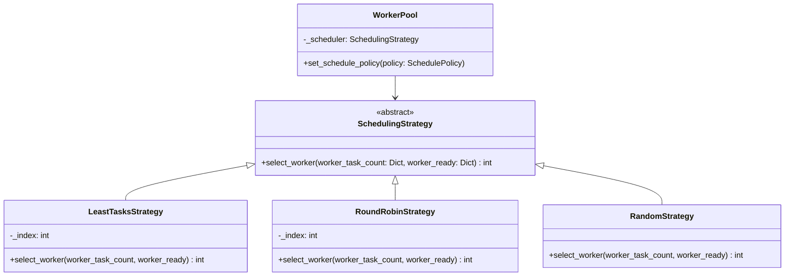
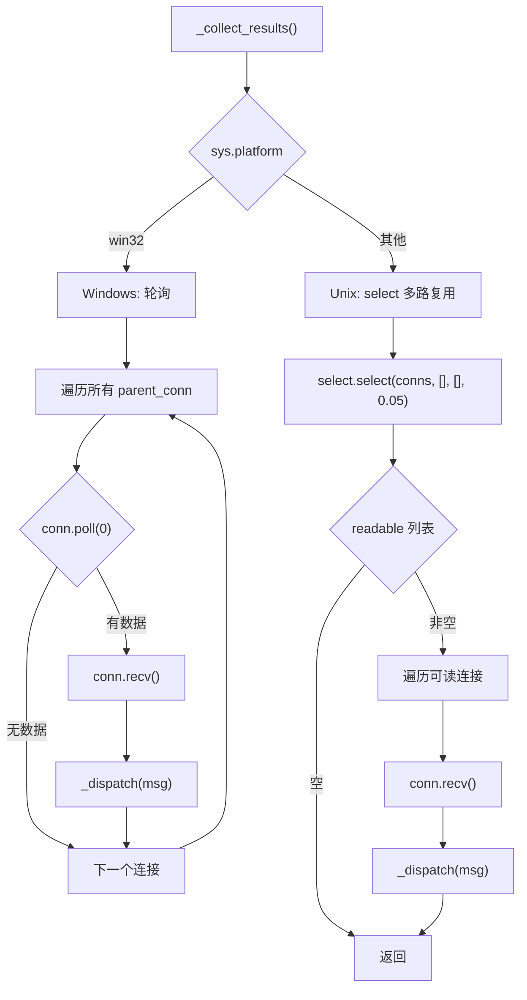
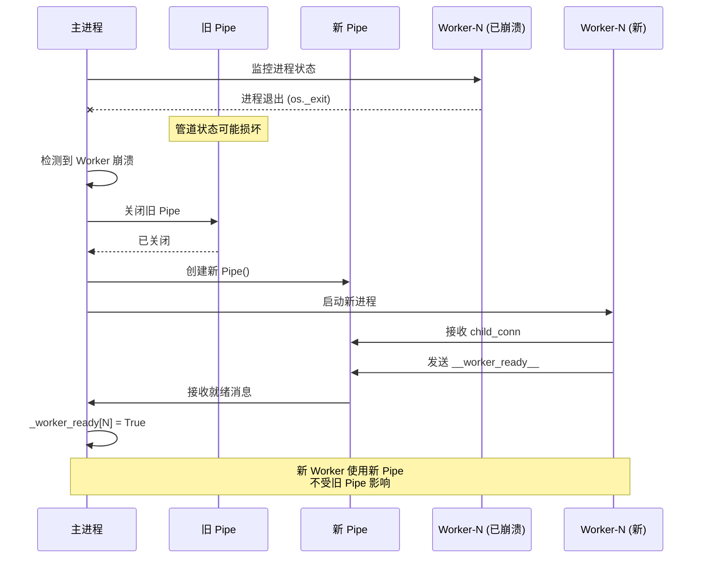
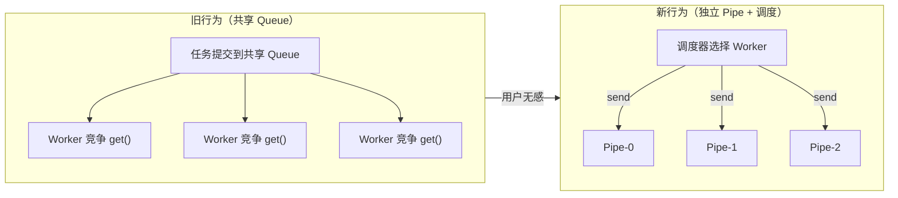

# WorkerPool 独立 Pipe 通信方案实施计划

## Status: ✅ COMPLETED

## Context

### 问题背景
当 Worker 进程使用 `os._exit()` 异常退出时，会绕过 Python 正常清理机制，可能导致共享的 `multiprocessing.Queue` 管道状态损坏。重启后的 Worker 无法通过损坏的 Queue 发送消息，导致：
- `__worker_ready__` 消息丢失
- `ready_workers` 计数无法恢复
- 后续任务被错误标记为孤儿

### 目标
将共享 Queue 改为每个 Worker 独立的 Pipe，实现：
1. 单个 Worker 异常退出不影响其他 Worker 的通信
2. 重启的 Worker 使用新的 Pipe，不受之前损坏影响
3. 保持现有的 API 和负载均衡能力
4. **跨平台支持**：Unix 和 Windows 均可运行
5. **可插拔调度策略**：支持运行时切换

---

## Design

### 架构变更



### 核心数据结构

```python
# Pipe 结构
self._worker_pipes: Dict[int, Tuple[Connection, Connection]] = {}
# wid → (parent_conn, child_conn)

# 任务计数（用于调度）
self._worker_task_count: Dict[int, int] = {}

# Worker 就绪状态
self._worker_ready: Dict[int, bool] = {}
```

### 可插拔调度策略



### 调度策略说明

| 策略 | 说明 | 适用场景 |
|------|------|----------|
| `LeastTasksStrategy` | 选择当前任务数最少的 Worker | 默认策略，负载均衡最优 |
| `RoundRobinStrategy` | 轮询分配，依次选择每个 Worker | 任务执行时间均匀时高效 |
| `RandomStrategy` | 随机选择一个就绪 Worker | 简单场景，避免热点 |

### 跨平台结果收集



### Worker 崩溃恢复流程



---

## API Compatibility

### 用户侧变更影响

**结论：对用户而言是无感变更，完全向后兼容。**

### 保持不变的公开 API

| API | 说明 |
|-----|------|
| `WorkerPool(n_workers, check_interval, orphan_timeout, ...)` | 构造函数签名不变，新增参数有默认值 |
| `pool.submit(fn, *args, **kwargs) -> Future` | 提交任务接口不变 |
| `pool.shutdown(wait=True)` | 关闭接口不变 |
| `pool.ready_workers` 属性 | 就绪 Worker 计数属性不变 |
| `pool.n_workers` 属性 | Worker 数量属性不变 |

### 新增的可选 API

| API | 说明 | 默认值 |
|-----|------|--------|
| `schedule_policy: SchedulePolicy` | 构造函数新参数 | `SchedulePolicy.LEAST_TASKS` |
| `pool.set_schedule_policy(policy)` | 运行时切换调度策略 | N/A |
| `SchedulePolicy` 枚举 | 调度策略枚举类型 | N/A |

### 私有属性变更（用户不应访问）

```python
# 移除（私有，用户不应访问）
_task_q: multiprocessing.Queue  # 共享任务队列
_result_q: multiprocessing.Queue  # 共享结果队列

# 新增（私有，用户不应访问）
_worker_pipes: Dict[int, Tuple[Connection, Connection]]  # 独立 Pipe
_worker_task_count: Dict[int, int]  # 任务计数（用于调度）
_scheduler: SchedulingStrategy  # 调度器实例
```

### 行为差异分析



| 方面 | 旧行为 | 新行为 | 用户感知 |
|------|--------|--------|----------|
| 任务分发 | Worker 竞争获取 | 调度器主动推送 | 无差异 |
| 负载均衡 | 依赖竞争自然均衡 | 调度算法精确控制 | 可能更优 |
| 崩溃影响 | 可能影响其他 Worker | 完全隔离 | 更可靠 |
| 内存开销 | 2 个 Queue | N 个 Pipe | 略增，可忽略 |

### 迁移成本

| 场景 | 迁移工作 |
|------|----------|
| 现有代码，不关心调度 | **零成本**：无需任何修改 |
| 现有代码，访问私有属性 | 需调整（但私有属性本不应访问） |
| 新代码，需要自定义调度 | 可选使用 `schedule_policy` 参数 |
| 新代码，需要运行时切换 | 可选使用 `set_schedule_policy()` 方法 |

### 兼容性保证

```python
# ✅ 现有代码无需修改，行为一致
pool = WorkerPool(n_workers=4)
future = pool.submit(my_task, arg1, arg2)
result = future.result()
pool.shutdown()

# ✅ 新功能可选使用
pool = WorkerPool(n_workers=4, schedule_policy=SchedulePolicy.ROUND_ROBIN)
pool.set_schedule_policy(SchedulePolicy.RANDOM)  # 运行时切换

# ✅ 默认调度策略（最少任务优先）与原竞争行为效果相近
pool = WorkerPool(n_workers=4)  # schedule_policy=LEAST_TASKS
```

---

## Implementation Plan

### Phase 1: 调度策略模块

**新增文件**: `src/rhosocial/activerecord/worker/scheduling.py`

```python
from abc import ABC, abstractmethod
from typing import Dict
from enum import Enum

class SchedulePolicy(Enum):
    """调度策略枚举"""
    LEAST_TASKS = "least_tasks"
    ROUND_ROBIN = "round_robin"
    RANDOM = "random"

class SchedulingStrategy(ABC):
    @abstractmethod
    def select_worker(self, worker_task_count: Dict[int, int],
                      worker_ready: Dict[int, bool]) -> int:
        pass

class LeastTasksStrategy(SchedulingStrategy):
    """最少任务优先"""
    def select_worker(self, worker_task_count, worker_ready):
        ready_workers = [w for w, r in worker_ready.items() if r]
        return min(ready_workers, key=lambda w: worker_task_count.get(w, 0))

class RoundRobinStrategy(SchedulingStrategy):
    """轮询"""
    def __init__(self):
        self._index = 0

    def select_worker(self, worker_task_count, worker_ready):
        ready_workers = sorted(w for w, r in worker_ready.items() if r)
        wid = ready_workers[self._index % len(ready_workers)]
        self._index += 1
        return wid

class RandomStrategy(SchedulingStrategy):
    """随机选择"""
    def select_worker(self, worker_task_count, worker_ready):
        import random
        ready_workers = [w for w, r in worker_ready.items() if r]
        return random.choice(ready_workers)
```

### Phase 2: 数据结构变更

**文件**: `src/rhosocial/activerecord/worker/pool.py`

修改 `__init__` 方法：
- 移除 `self._task_q` 和 `self._result_q`
- 新增 `self._worker_pipes: Dict[int, Tuple[Connection, Connection]]`
- 新增 `self._worker_task_count: Dict[int, int]`
- 新增 `self._scheduler: SchedulingStrategy`

新增初始化参数：
```python
def __init__(
    self,
    n_workers: int = 4,
    check_interval: float = 0.5,
    orphan_timeout: Optional[float] = None,
    schedule_policy: SchedulePolicy = SchedulePolicy.LEAST_TASKS,  # 新增
    # ... hooks ...
):
```

### Phase 3: Worker 启动变更

修改 `_start_worker` 方法：

```python
def _start_worker(self, wid: int) -> WorkerHandle:
    # 创建该 Worker 专用的 Pipe
    parent_conn, child_conn = self._ctx.Pipe()

    p = self._ctx.Process(
        target=_worker_entry,
        args=(
            wid,
            child_conn,  # 传递 Worker 端的 Connection
            # ... 其他参数
        ),
        ...
    )
    p.start()

    with self._lock:
        self._worker_pipes[wid] = (parent_conn, child_conn)
        self._worker_task_count[wid] = 0
        self._worker_ready[wid] = False

    return handle
```

### Phase 4: Worker 入口函数变更

修改 `_worker_entry` 和 `_run_sync_worker` 函数：

```python
def _worker_entry(worker_id, conn, pool_id, ...):
    # conn 是该 Worker 专用的 Connection
    # 使用 conn.recv() 接收任务
    # 使用 conn.send() 发送结果

def _run_sync_worker(ctx, conn, ...):
    # ...
    conn.send(("__worker_ready__", ctx.worker_id, ctx.pid))

    while True:
        try:
            msg = conn.recv()  # 阻塞等待
        except (EOFError, OSError):
            break

        if msg == _STOP:
            break

        task_id = msg[0]
        conn.send(("__dequeued__", ctx.worker_id, task_id))
        # ...
```

### Phase 5: 任务提交变更

修改 `submit` 方法：

```python
def submit(self, fn: Callable, *args, **kwargs) -> Future:
    # ... 生成 task_id 和 Future ...

    # 使用调度器选择目标 Worker
    with self._lock:
        wid = self._scheduler.select_worker(
            self._worker_task_count, self._worker_ready
        )
        self._worker_task_count[wid] += 1

    # 发送任务到该 Worker 的 Pipe
    parent_conn = self._worker_pipes[wid][0]
    parent_conn.send((task_id, fn, args, kwargs))

    return fut
```

### Phase 6: 结果收集变更

修改 `_supervise` 方法：

```python
def _supervise(self) -> None:
    while self._state not in (PoolState.KILLING, PoolState.STOPPED):
        # 跨平台结果收集
        self._collect_results()

        # 定期健康检查
        now = time.monotonic()
        if now - last_check >= self._check_interval:
            last_check = now
            self._check_workers()
            self._check_orphaned_tasks()
```

### Phase 7: 关闭流程变更

修改 `shutdown` 方法：

```python
def shutdown(self, ...):
    # 向所有 Worker 的 Pipe 发送 STOP 哨兵
    for wid, (parent_conn, _) in self._worker_pipes.items():
        try:
            parent_conn.send(_STOP)
        except (EOFError, OSError):
            pass  # Pipe 已关闭

    # ... 等待和清理逻辑 ...
```

### Phase 8: Worker 崩溃恢复增强

修改 `_check_workers` 方法：

```python
def _check_workers(self) -> None:
    for handle in dead_handles:
        wid = handle.wid

        # 关闭旧的损坏 Pipe
        old_pipe = self._worker_pipes.get(wid)
        if old_pipe:
            try:
                old_pipe[0].close()
                old_pipe[1].close()
            except Exception:
                pass

        # 启动新 Worker（会创建新 Pipe）
        new_handle = self._start_worker(wid)
```

### Phase 9: 调度策略运行时切换

新增方法：

```python
def set_schedule_policy(self, policy: SchedulePolicy) -> None:
    """运行时切换调度策略"""
    self._scheduler = _create_scheduler(policy)
```

---

## Files to Modify

| 文件路径 | 修改内容 |
|---------|---------|
| `src/rhosocial/activerecord/worker/scheduling.py` | 新增：调度策略模块 |
| `src/rhosocial/activerecord/worker/pool.py` | 主要实现变更 |
| `src/rhosocial/activerecord/worker/__init__.py` | 导出新增类型 |

---

## Testing Plan

### 1. 单元测试
- 测试 Pipe 创建和关闭
- 测试三种调度策略
- 测试跨平台结果收集

### 2. 集成测试
- 运行现有所有 WorkerPool 测试
- 验证基本功能不变

### 3. 崩溃恢复测试（核心目标）
```python
def test_worker_crash_with_pipe():
    """验证独立 Pipe 方案下崩溃恢复"""
    with WorkerPool(n_workers=2) as pool:
        # 等待 Worker 就绪
        assert pool.ready_workers == 2

        # 提交导致崩溃的任务
        crash_fut = pool.submit(crash_task)

        # 等待崩溃检测和恢复
        time.sleep(2)

        # 验证新 Worker 已就绪
        assert pool.ready_workers == 2

        # 验证新任务正常执行
        new_fut = pool.submit(simple_task, 42)
        assert new_fut.result(timeout=10) == 84
```

### 4. 调度策略测试
```python
def test_schedule_policies():
    pool = WorkerPool(n_workers=3, schedule_policy=SchedulePolicy.LEAST_TASKS)
    # 测试最少任务优先...

    pool.set_schedule_policy(SchedulePolicy.ROUND_ROBIN)
    # 测试轮询...

    pool.set_schedule_policy(SchedulePolicy.RANDOM)
    # 测试随机...
```

### 5. 跨平台测试
- 在 Linux/macOS 上运行测试
- 在 Windows 上运行测试

---

## Risks and Mitigations

| 风险 | 缓解措施 |
|-----|---------|
| 负载不均衡 | 实现三种调度策略，默认最少任务优先 |
| Pipe 数量增加 | 使用连接池管理，及时关闭失效 Pipe |
| Windows 性能 | 轮询方案使用 `poll(0)` 非阻塞检查 |
| 代码复杂度增加 | 抽象 `SchedulingStrategy` 类封装逻辑 |

---

## Estimated Effort

- **调度策略模块**：约 100 行
- **Pool 核心变更**：约 250-300 行
- **测试更新**：约 100-150 行
- **预估工时**：2-3 天
