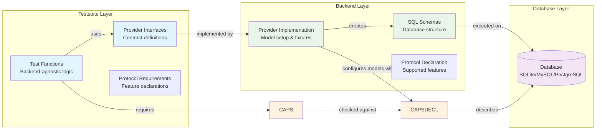
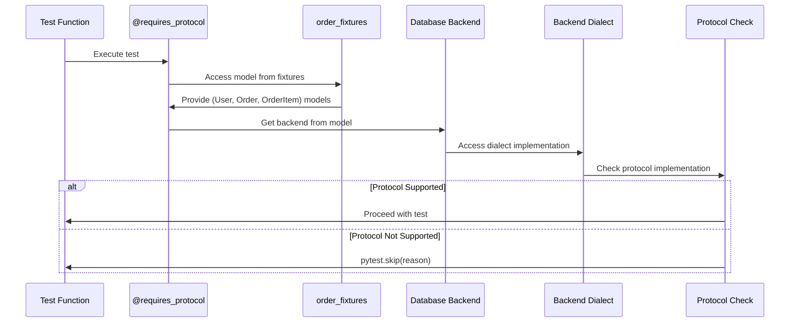

# Testing Architecture and Execution Guide

> **AI Assistant Note**: This document is optimized for AI code assistants (Claude Code, Gemini CLI, etc.). It uses imperative language and front-loads critical execution requirements.

## Python Version Support

**Python 3.8 Support**: Although Python 3.8 has reached end-of-life, we continue to support it in the current major version due to its widespread user base. However, the next major version will be the last to support Python 3.8, and future versions will not guarantee compatibility.

**Python 3.14 Compatibility**: Python 3.14 introduces significant changes that impact core dependencies. Specifically, `pydantic`, `pydantic-core`, and `PyO3` require major version updates to maintain compatibility. This is why we maintain separate dependency lists for Python 3.14 in our requirements specifications.

As of the release of this software, the latest version of pydantic is 2.12.x. This version supports Python 3.14 free-threaded mode (PEP 703).

Note that pydantic 2.11+ has dropped support for Python 3.8. If you need to use Python 3.8, please stick with pydantic 2.10.

Also note that according to Python's official development plan (https://peps.python.org/pep-0703/), the free-threaded mode will remain experimental for several years and is not recommended for production environments, even though both pydantic and this project support it.

## Architecture Overview

### Testsuite and Backend Relationship

```mermaid
graph TB
    subgraph "Backend Packages" 
        direction TB
        MYSQL[rhosocial-activerecord-mysql<br/>- Backend implementation<br/>- Schema definitions<br/>- Backend-specific tests]
        DEFAULT[rhosocial-activerecord<br/>- Default backend<br/>- Core functionality<br/>- Backend-specific tests]
    end

    subgraph "Testsuite Package" 
        direction TB
        TS[rhosocial-activerecord-testsuite<br/>- Standardized test contracts<br/>- Feature tests<br/>- Real-world scenarios<br/>- Performance benchmarks]
    end

    subgraph "Backend Developer Responsibilities" 
        direction TB
        PROVIDER[Implement test providers<br/>- Set up database schemas<br/>- Configure test models<br/>- Provide fixtures]
        SCHEMA[SQL Schema Creation<br/>- Create backend-specific<br/>  schema files<br/>- Match testsuite structure]
        REPORT[Generate compatibility reports<br/>- Run standardized tests<br/>- Track compatibility scores]
    end

    subgraph "Testsuite Author Responsibilities" 
        direction TB
        TESTDEF[Test Definition<br/>- Write backend-agnostic<br/>  test functions<br/>- Define test contracts<br/>- Provide test utilities]
        MARKER[Test Marking<br/>- Standard pytest markers<br/>- Categorization system<br/>- Feature identification]
        UTIL[Test Utilities<br/>- Schema generators<br/>- Helper functions<br/>- Provider interfaces]
    end

    %% Relationship arrows
    MYSQL -.->|uses| TS
    DEFAULT -.->|uses| TS
    PROVIDER -->|fulfills| TS
    SCHEMA -->|supports| TS
    REPORT -->|verifies| TS
    TESTDEF -->|provides| TS
    MARKER -->|organizes| TS
    UTIL -->|facilitates| TS

    style TS fill:#e1f5fe,stroke:#01579b,stroke-width:2px
    style MYSQL fill:#f3e5f5,stroke:#4a148c,stroke-width:2px
    style DEFAULT fill:#f3e5f5,stroke:#4a148c,stroke-width:2px
    style PROVIDER fill:#e8f5e8,stroke:#1b5e20,stroke-width:2px
    style SCHEMA fill:#e8f5e8,stroke:#1b5e20,stroke-width:2px
    style REPORT fill:#e8f5e8,stroke:#1b5e20,stroke-width:2px
    style TESTDEF fill:#fff3e0,stroke:#e65100,stroke-width:2px
    style MARKER fill:#fff3e0,stroke:#e65100,stroke-width:2px
    style UTIL fill:#fff3e0,stroke:#e65100,stroke-width:2px
```



### Testing Layer Architecture



## CRITICAL: PYTHONPATH Configuration

**MUST configure PYTHONPATH before running tests.** The test directory (`tests/`) is **NOT** on the Python path by default.

### Why PYTHONPATH is Required

```
project-root/
├── src/rhosocial/activerecord/    # ← Python can import this
└── tests/                          # ← NOT importable by default
```

Tests import from `rhosocial.activerecord`, but the test files themselves are not in the package structure. Without PYTHONPATH, pytest cannot find the source code.

### Platform-Specific Commands

**Linux/macOS (bash/zsh):**
```bash
# Single command execution
PYTHONPATH=src pytest

# Persistent for session
export PYTHONPATH=src
pytest
```

**Windows (PowerShell 7 - Recommended):**
```powershell
# Single command execution
$env:PYTHONPATH="src"; pytest

# Persistent for session
$env:PYTHONPATH="src"
pytest
```

**Windows (Legacy CMD - Not Recommended):**
```cmd
REM Single command execution
set PYTHONPATH=src && pytest

REM Persistent for session
set PYTHONPATH=src
pytest
```

### Common Errors Without PYTHONPATH

```python
# Error you'll see:
ModuleNotFoundError: No module named 'rhosocial.activerecord'

# Solution:
# Set PYTHONPATH=src before running pytest
```

### IDE Configuration

**PyCharm:**
- Mark `src/` as "Sources Root"
- Test runner automatically adds it to PYTHONPATH

**VS Code:**
```json
// .vscode/settings.json
{
    "python.testing.pytestArgs": [
        "tests"
    ],
    "python.testing.pytestEnabled": true,
    "python.envFile": "${workspaceFolder}/.env"
}
```

```bash
# .env file
PYTHONPATH=src
```

## CRITICAL: Test Suite Dependency (`rhosocial-activerecord-testsuite`)

**MUST install the `rhosocial-activerecord-testsuite` package.** Tests in this project rely heavily on the shared test contracts and fixtures provided by the `rhosocial-activerecord-testsuite` package. Without it, you will encounter `ModuleNotFoundError` for `rhosocial.activerecord.testsuite`.

### Installation Methods

There are several ways to ensure `rhosocial-activerecord-testsuite` is available in your testing environment:

#### 1. Install from PyPI (Recommended for most users)

```bash
pip install rhosocial-activerecord-testsuite
```

#### 2. Install from Git Repository (for development or specific versions)

If you need to install directly from its Git repository, use the following command (replace with the actual repository URL):

```bash
pip install git+https://github.com/Rhosocial/python-activerecord-testsuite.git  # Replace with actual URL
```

#### 3. Install in Editable Mode (for local development of the test suite)

If you are developing or modifying the `rhosocial-activerecord-testsuite` locally, you should install it in editable mode. Assuming it's a sibling directory to your current project:

```bash
pip install -e ../python-activerecord-testsuite
```

This ensures any changes to the test suite's source code are immediately reflected in your testing environment.

## Responsibilities Division

### Testsuite Authors MUST:
- Write backend-agnostic test logic
- Define provider interfaces
- Create test fixtures and utilities
- NEVER assume backend-specific features
- NEVER write SQL directly in tests
- Document required protocols using correct protocol+method format

### Backend Developers MUST:
- Implement provider interfaces
- Create backend-specific schema files
- Handle database connection/cleanup
- Write backend-specific tests separately
- Generate compatibility reports
- Declare backend capabilities using add_* methods

### Division of Labor

| Component | Testsuite | Backend |
|-----------|-----------|---------|
| Test logic | ✅ Defines | Uses |
| SQL schemas | Provides templates | ✅ Implements |
| Database setup | Defines interface | ✅ Implements |
| Model configuration | Defines fixtures | ✅ Provides models |
| Cleanup/teardown | Defines hooks | ✅ Implements |
| Protocol declaration | Defines requirements | ✅ Declares support |

## Protocol-Based Test Selection

### Overview

The testing system now uses a protocol-based approach instead of the legacy capability system. This approach leverages Python's Protocol classes to define and check for specific database feature support. Protocols enable fine-grained feature detection and graceful error handling. The legacy system used centralized capability registries with CapabilityCategory and specific capability classes, while the new system distributes protocol implementations directly in backend dialect classes.

### Protocol Architecture

```python
# Protocol hierarchy structure
WindowFunctionSupport                    # Protocol for window functions
    ├── supports_window_functions()      # Method to check support
    ├── supports_window_frame_clause()   # Method to check frame support
    └── format_window_function_call()    # Method to format calls

CTESupport                              # Protocol for CTE support
    ├── supports_basic_cte()            # Method to check basic CTE support
    ├── supports_recursive_cte()        # Method to check recursive CTE support
    └── format_cte()                    # Method to format CTEs

JoinSupport                             # Protocol for JOIN support
    ├── supports_inner_join()           # Method to check INNER JOIN support
    ├── supports_left_join()            # Method to check LEFT JOIN support
    ├── supports_right_join()           # Method to check RIGHT JOIN support
    └── supports_full_join()            # Method to check FULL JOIN support
```

### Backend Protocol Implementation

```python
# Backend implements protocols
# src/rhosocial/activerecord/backend/impl/sqlite/dialect.py
from rhosocial.activerecord.backend.dialect.protocols import (
    CTESupport,
    JoinSupport,
    WindowFunctionSupport
)

class SQLiteDialect(CTESupport, JoinSupport):
    """SQLite dialect implementing specific protocols."""

    def supports_basic_cte(self) -> bool:
        """Check if basic CTEs are supported (SQLite 3.8.3+)"""
        return self.version >= (3, 8, 3)

    def supports_recursive_cte(self) -> bool:
        """Check if recursive CTEs are supported (SQLite 3.8.3+)"""
        return self.version >= (3, 8, 3)

    def supports_inner_join(self) -> bool:
        """Check if INNER JOIN is supported"""
        return True

    def supports_left_join(self) -> bool:
        """Check if LEFT JOIN is supported"""
        return True

    def supports_right_join(self) -> bool:
        """Check if RIGHT JOIN is supported (not supported by SQLite)"""
        return False

    def supports_full_join(self) -> bool:
        """Check if FULL JOIN is supported (not supported by SQLite)"""
        return False
```

### Declaring Test Requirements

Tests use the `@requires_protocol` decorator to specify required protocol support:

```python
# Correct format: requires_protocol(ProtocolClass, method_name)
from rhosocial.activerecord.backend.dialect.protocols import JoinSupport
from rhosocial.activerecord.testsuite.utils import requires_protocol

# Single protocol requirement
@requires_protocol(JoinSupport, 'supports_right_join')
def test_right_join(order_fixtures):
    """Test requires RIGHT JOIN support."""
    pass

# Protocol-level requirement (checks if dialect implements protocol)
@requires_protocol(CTESupport)
def test_basic_cte(tree_fixtures):
    """Test requires CTE support at protocol level."""
    pass

# Multiple protocol requirements (handled by multiple decorators)
@requires_protocol(JoinSupport, 'supports_full_join')
@requires_protocol(CTESupport, 'supports_recursive_cte')
def test_complex_query(order_fixtures):
    """Test requires FULL JOIN and recursive CTE support."""
    pass
```

### Protocol Checking Process



### Protocol-based Test Skipping

The system automatically skips tests when required protocols are not supported:

1. **Test Execution**: When a test with `@requires_protocol` runs
2. **Protocol Check**: The system checks if the backend's dialect implements the required protocol
3. **Method Verification**: If a specific method is required, it checks if the method exists and returns True (for support-checking methods)
4. **Conditional Skip**: If protocol/method is not supported, the test is skipped with a clear message

**Example Skip Message:**
```
SKIPPED [1] test_file.py:XX: Skipping test - backend dialect does not implement JoinSupport protocol
SKIPPED [2] test_file.py:YY: Skipping test - backend dialect does not support right_join
```

### Protocol vs Legacy Capability Comparison

| Aspect | Old Capability System | New Protocol System |
|--------|----------------------|---------------------|
| Implementation | Centralized capability registry | Distributed protocol implementations |
| Type Safety | Runtime checks only | Compile-time type checking with Protocols |
| Extensibility | Required modifying central capability classes | Easy to add new protocols independently |
| Backend Integration | Backends declared capabilities | Backends implement protocols directly |
| Test Flexibility | Fixed capability categories | Dynamic protocol combinations |
| Maintenance | Centralized changes required | Decentralized, modular updates |

## Provider Pattern Implementation

### Core Concept

The provider pattern enables test reuse across backends:

1. **Testsuite defines** test logic and provider interface
2. **Backend implements** provider to configure models/schemas
3. **Test execution** uses provider to run same tests on different backends
4. **Protocol checking** determines which tests can run

### Synchronous and Asynchronous Test Equivalence

An important characteristic of the test suite is the parallel structure of synchronous and asynchronous tests. Each test functionality has both sync and async versions that are logically equivalent:

**Sync/Async Test Pairing:**
- For each feature, there are both synchronous and asynchronous test methods
- The async tests mirror the sync tests with `async def` and `await` calls
- Both versions test the same functionality using the same logical steps
- Async tests use `@pytest.mark.asyncio` decorator
- Async fixtures (e.g., `async_order_fixtures`) correspond to sync fixtures (e.g., `order_fixtures`)

**Example of Sync/Async Test Pair:**
```python
# Synchronous version
def test_where_with_predicate(self, order_fixtures):
    User, Order, OrderItem = order_fixtures

    user = User(username='test_user', email='test@example.com', age=30)
    user.save()

    order = Order(user_id=user.id, order_number='ORD-TEST', status='pending')
    order.save()

    # Use predicate query to find the specific order
    found = Order.query().where(Order.c.order_number == 'ORD-TEST').all()
    assert len(found) == 1
    assert found[0].order_number == 'ORD-TEST'

# Asynchronous version - logically equivalent
@pytest.mark.asyncio
async def test_where_with_predicate_async(self, async_order_fixtures):
    AsyncUser, AsyncOrder, AsyncOrderItem = async_order_fixtures

    user = AsyncUser(username='async_test_user', email='async_test@example.com', age=30)
    await user.save()

    order = AsyncOrder(user_id=user.id, order_number='ORD-TEST', status='pending')
    await order.save()

    # Use predicate query to find the specific order (with await)
    found = await AsyncOrder.query().where(AsyncOrder.c.order_number == 'ORD-TEST').all()
    assert len(found) == 1
    assert found[0].order_number == 'ORD-TEST'
```

**Benefits of Sync/Async Equivalence:**
- Ensures both sync and async code paths are equally tested
- Maintains consistency in test coverage between sync and async operations
- Allows for comprehensive validation of async-specific behaviors
- Facilitates easier maintenance as both versions follow the same structure
- Enables backend developers to verify both sync and async implementations

### Provider Interface Example

```python
# Testsuite defines this
# src/rhosocial/activerecord/testsuite/feature/query/interfaces.py
from abc import ABC, abstractmethod
from typing import Type, List, Tuple
from rhosocial.activerecord.model import ActiveRecord


class IQueryProvider(ABC):
    """Provider interface for query feature tests."""
    
    @abstractmethod
    def get_test_scenarios(self) -> List[str]:
        """Return available test scenarios (e.g., 'local', 'docker')."""
        pass
    
    @abstractmethod
    def setup_order_fixtures(self, scenario_name: str) -> Tuple[Type[ActiveRecord], Type[ActiveRecord], Type[ActiveRecord]]:
        """
        Setup order-related models (User, Order, OrderItem).
        
        Returns:
            Tuple of (User, Order, OrderItem) model classes
        """
        pass
    
    @abstractmethod
    def setup_tree_fixtures(self, scenario_name: str) -> Tuple[Type[ActiveRecord]]:
        """
        Setup tree structure model (Node).
        
        Returns:
            Single-element tuple containing (Node,)
        """
        pass
    
    @abstractmethod
    def cleanup_after_test(self, scenario_name: str):
        """Cleanup after test execution."""
        pass
```

### Backend Provider Implementation

```python
# Backend implements this
# rhosocial-activerecord-mysql/tests/providers/mysql_query_provider.py
from rhosocial.activerecord.testsuite.feature.query.interfaces import IQueryProvider
from rhosocial.activerecord.backend.mysql import MySQLBackend

class MySQLQueryProvider(IQueryProvider):
    def get_test_scenarios(self):
        return ["local_mysql", "docker_mysql"]
    
    def setup_order_fixtures(self, scenario):
        """Setup and return User, Order, OrderItem models."""
        config = self._get_config(scenario)
        backend = MySQLBackend(config)
        
        # Configure models with backend
        User.configure(backend)
        Order.configure(backend)
        OrderItem.configure(backend)
        
        # Execute schema
        self._execute_schema_file("schemas/feature/query/order_models.sql", scenario)
        
        # MUST return tuple (even for single model)
        return (User, Order, OrderItem)
    
    def setup_tree_fixtures(self, scenario):
        """Setup and return Node model."""
        config = self._get_config(scenario)
        backend = MySQLBackend(config)
        
        Node.configure(backend)
        self._execute_schema_file("schemas/feature/query/tree_model.sql", scenario)
        
        # MUST return single-element tuple
        return (Node,)
    
    def cleanup(self, scenario):
        self._drop_all_tables(scenario)
```

### Composite Fixtures Usage Pattern

Tests receive fixtures as tuples and can unpack or index them:

```python
# Pattern 1: Unpacking multiple models
def test_basic_cte(order_fixtures):
    """Test with multiple models."""
    # Unpack the tuple returned by provider
    User, Order, OrderItem = order_fixtures
    
    user = User(username='test', email='test@example.com')
    order = Order(user_id=user.id, order_number='ORD-1')


# Pattern 2: Indexing single model from tuple
def test_recursive_cte_basics(tree_fixtures):
    """Test with single model in tuple."""
    # Extract the model from single-element tuple
    Node = tree_fixtures[0]
    
    root = Node(id=1, name="Root", parent_id=None)


# Pattern 3: Multiple models with indexing
def test_complex_scenario(order_fixtures):
    """Alternative access pattern."""
    User = order_fixtures[0]
    Order = order_fixtures[1]
    OrderItem = order_fixtures[2]
```

**Key Points:**
- Providers ALWAYS return tuples (even for single model: `(Model,)`)
- Tests can unpack: `Model1, Model2 = fixture`
- Tests can index: `Model = fixture[0]`
- Tuple unpacking is preferred for multiple models
- Indexing is acceptable for single-model tuples
- Tuples prevent accidental modification in tests

### Pytest Fixture Integration

```python
# Backend's conftest.py
import pytest
from .providers.mysql_query_provider import MySQLQueryProvider

# Register provider
_provider = MySQLQueryProvider()

@pytest.fixture
def order_fixtures(request):
    """Provide order-related models for tests."""
    scenario = request.config.getoption("--scenario", default="local_mysql")
    
    # Provider returns tuple
    fixtures = _provider.setup_order_fixtures(scenario)
    
    yield fixtures
    
    # Cleanup
    _provider.cleanup_after_test(scenario)


@pytest.fixture
def tree_fixtures(request):
    """Provide tree model for tests."""
    scenario = request.config.getoption("--scenario", default="local_mysql")
    
    # Provider returns single-element tuple
    fixtures = _provider.setup_tree_fixtures(scenario)
    
    yield fixtures
    
    _provider.cleanup_after_test(scenario)
```

## Directory Structure and Naming

### Testsuite Package Structure

```
python-activerecord-testsuite/
└── src/rhosocial/activerecord/testsuite/
    ├── feature/           # Core functionality tests
    │   ├── basic/         # CRUD operations
    │   ├── query/         # Query building
    │   │   ├── interfaces.py          # Provider interface
    │   │   ├── test_cte_basic.py      # Basic CTE tests
    │   │   └── test_cte_recursive.py  # Recursive CTE tests
    │   ├── relation/      # Relationships
    │   ├── events/        # Event hooks
    │   └── mixins/        # Mixin functionality
    ├── realworld/         # Business scenarios
    │   ├── ecommerce/
    │   ├── finance/
    │   └── social/
    ├── benchmark/         # Performance tests
    ├── core/              # Core testing infrastructure
    │   ├── registry.py    # Provider registry
    │   └── provider.py    # Base provider interface
    └── utils.py           # Testing utilities
```

### Backend Package Structure

```
rhosocial-activerecord-{backend}/
└── tests/
    ├── rhosocial/
    │   └── activerecord_test/
    │       ├── feature/
    │       │   ├── basic/             # Basic CRUD tests
    │       │   ├── query:             # Query functionality tests
    │       │   ├── relation/          # Relationship tests
    │       │   ├── events/            # Event hook tests
    │       │   ├── mixins/            # Mixin functionality tests
    │       │   └── backend/           # Backend-specific tests (Note: The structure below is an example from the current repository. Other backend implementations may use different directory names based on their specific needs and conventions)
    │       │       ├── common/        # Common backend interface tests
    │       │       ├── sqlite/       # SQLite backend tests (example from current repository)
    │       │       └── sqlite2/       # SQLite2 backend tests (example from current repository)
    │       └── realworld/             # Real-world scenario tests
    ├── providers/                     # Provider implementations
    │   └── {backend}_query_provider.py
    ├── schemas/                       # SQL schema files
    │   └── feature/
    │       └── query/
    │           ├── order_models.sql
    │           └── tree_model.sql
    ├── conftest.py                   # pytest configuration
    └── test_{backend}_*.py           # Backend-specific tests
```

### Naming Conventions

**Testsuite tests (backend-agnostic):**
- `feature/basic` → `python-activerecord-testsuite/.../feature/basic/`
- `feature/query` → `python-activerecord-testsuite/.../feature/query/`
- NO backend-specific naming

**Backend-specific tests:**
- `test_sqlite_*.py` → SQLite-specific tests
- `test_mysql_*.py` → MySQL-specific tests
- `test_pgsql_*.py` → PostgreSQL-specific tests
- MUST use prefix or subdirectory to distinguish from testsuite

## Test Execution Commands

### Quick Reference

> Note: Running `pytest` without arguments executes all tests defined in `testpaths` (`pyproject.toml`). To run a specific subset, provide a path to a directory or file.

```bash
# ALWAYS set PYTHONPATH first
export PYTHONPATH=src  # or equivalent for your platform

# Run all tests (as configured in pyproject.toml)
pytest

# Run specific feature tests by directory
pytest tests/rhosocial/activerecord_test/feature/basic/  # Run basic CRUD tests
pytest tests/rhosocial/activerecord_test/feature/query/  # Run query tests
pytest tests/rhosocial/activerecord_test/feature/backend/sqlite/  # Run SQLite backend tests
```

### Test Organization and Execution

Tests are now primarily organized by directory structure rather than pytest markers. The following directory-based execution patterns are recommended:

```bash
# Feature tests by category
pytest tests/rhosocial/activerecord_test/feature/basic/     # Basic CRUD tests
pytest tests/rhosocial/activerecord_test/feature/query/     # Query functionality tests
pytest tests/rhosocial/activerecord_test/feature/relation/  # Relationship tests
pytest tests/rhosocial/activerecord_test/feature/events/    # Event hook tests
pytest tests/rhosocial/activerecord_test/feature/mixins/    # Mixin functionality tests

# Backend-specific tests
pytest tests/rhosocial/activerecord_test/feature/backend/common/   # Common backend interface tests
pytest tests/rhosocial/activerecord_test/feature/backend/sqlite/  # SQLite backend tests
pytest tests/rhosocial/activerecord_test/feature/backend/sqlite2/  # SQLite2 backend tests

# Real-world scenarios
pytest tests/rhosocial/activerecord_test/realworld/ecommerce/  # E-commerce scenarios
pytest tests/rhosocial/activerecord_test/realworld/finance/   # Financial scenarios

# Benchmarks
pytest tests/benchmark/                                     # Benchmark tests
```

While pytest markers still exist for backward compatibility and certain global classifications, the preferred method for test selection is through the directory structure, which provides clearer organization and eliminates the need for extensive marker definitions in conftest.py files.

Some commonly used markers for global classification:

## Writing Tests

### For Testsuite Authors

**Rules:**
- NEVER import backend-specific modules
- NEVER write SQL directly (use provider interface)
- NEVER assume database features without declaring protocol requirements
- ALWAYS use fixtures provided by provider
- ALWAYS use pytest markers
- ALWAYS specify protocol class and optional method name in requirements

**Example:**

```python
# Good - backend-agnostic with protocol declaration
from rhosocial.activerecord.backend.dialect.protocols import JoinSupport
from rhosocial.activerecord.testsuite.utils import requires_protocol

@pytest.mark.feature
@pytest.mark.feature_query
@requires_protocol(JoinSupport, 'supports_right_join')
def test_right_join(order_fixtures):
    """Test RIGHT JOIN functionality."""
    User, Order, OrderItem = order_fixtures

    user = User(username='test', email='test@example.com')
    assert user.save()

# Bad - backend-specific
def test_right_join():
    from rhosocial.activerecord.backend.mysql import MySQLBackend
    # DON'T DO THIS
```

### For Backend Developers

**Rules:**
- MUST implement all provider interface methods
- MUST create schema files matching testsuite structure
- MUST prefix backend-specific tests with `test_{backend}_`
- MUST handle database connection pooling
- MUST clean up test data
- MUST declare backend capabilities accurately using add_* methods
- MUST return tuples from provider methods (even for single model)

## Debugging Test Failures

### Common Issues

**Issue: ModuleNotFoundError**
```bash
# Cause: PYTHONPATH not set
# Fix: Set PYTHONPATH before running tests
export PYTHONPATH=src
pytest tests/
```

**Issue: Test skipped due to capabilities**
```bash
# Cause: Backend doesn't support required feature
# Fix: Check backend protocol implementation
pytest tests/ --run-testsuite --show-skipped-capabilities
```

**Issue: Fixture returns wrong type**
```bash
# Cause: Provider not returning tuple
# Fix: Ensure provider returns tuple
return (Model,)  # Correct
return Model     # Wrong
```

**Issue: Cannot determine protocol requirement**
```bash
# Cause: Using old capability system instead of protocol system
# Fix: Always use @requires_protocol(ProtocolClass) or @requires_protocol(ProtocolClass, 'method_name')
@requires_protocol(CTESupport, 'supports_basic_cte')  # Correct
@requires_capabilities((CapabilityCategory.CTE, CTECapability.BASIC_CTE))  # Wrong - old system
```

**Issue: Plugin registration conflicts**
```bash
# Error: RuntimeError: Plugin already registered under a different name
# Cause: Same plugin registered in multiple places (e.g., pytest_plugins and entry points)
# Fix: Remove duplicate registrations - choose one method (preferably entry points in pyproject.toml)
```

**Issue: Backend access method confusion**
```bash
# Old approach: model.get_backend() - does not exist
# Correct approach: model.backend() or model.__backend__
# In protocol checking plugins, ensure using the IActiveRecord interface methods
```

**Issue: Fixtures accessed incorrectly in pytest hooks**
```bash
# Problem: Accessing fixtures in pytest_runtest_setup can cause:
# AssertionError: (<Function test_func[memory]>, {})
# Solution: Access fixtures in pytest_runtest_call via item.funcargs
# Or access them in auto-use fixtures using request.getfixturevalue()
```

**Issue: Tuple vs Object fixture mismatches**
```python
# Problem: Tests expect tuple indexing (fixture[0]) but fixture yields raw object
# Error: TypeError: cannot be parametrized because it does not inherit from typing.Generic
# Solution: Ensure fixture returns tuple if test code uses indexing
@pytest.fixture
def tree_fixtures(request):
    result = provider.setup_tree_fixtures(scenario)
    # Ensure we return a tuple for consistency 
    if isinstance(result, tuple):
        yield result
    else:
        yield (result,)  # Wrap single object in tuple
```

**Issue: Environment variable not set**
```bash
# Error: RuntimeError: The TESTSUITE_PROVIDER_REGISTRY environment variable is not set
# Cause: Missing environment variable that points to provider registry
# Fix: Set the environment variable, typically in testsuite conftest.py:
import os
os.environ.setdefault(
    'TESTSUITE_PROVIDER_REGISTRY',
    'providers.registry:provider_registry'
)
```

**Issue: Understanding skip messages**
```bash
# In the test output, you'll see skip messages like this:
# SKIPPED [1] ..\python-activerecord-testsuite\src\rhosocial\activerecord\testsuite\feature\query\conftest.py:235:
# Skipping test - backend dialect does not implement JoinSupport protocol (tests/rhosocial/activerecord_test/feature/query/test_joins_2.py::test_right_join[memory])

# The format is now: "Skipping test - backend dialect does not implement/does not support [protocol/method] (test_file_path::test_function_name[scenario])"
# This tells you exactly which test was skipped and why, making it easier to debug protocol issues.
# The message indicates whether a protocol is not implemented or a specific method is not supported.
```

## Best Practices

### For AI Code Assistants

When executing tests:
1. **ALWAYS** set PYTHONPATH first
2. **ALWAYS** check platform (Linux/macOS/Windows)
3. **NEVER** assume tests will work without PYTHONPATH
4. **VERIFY** command syntax for user's shell environment
5. **PROVIDE** platform-specific commands
6. **CHECK** protocol requirements use requires_protocol decorator correctly

### For Developers

When writing tests:
1. **Backend-agnostic first**: Default to testsuite structure
2. **Provider pattern**: Use fixtures, not direct DB access
3. **Clear markers**: Tag all tests appropriately
4. **Declare protocol requirements correctly**: Use @requires_protocol(ProtocolClass) or @requires_protocol(ProtocolClass, 'method_name') format
5. **Return tuples**: Providers must return tuples for consistency
6. **Document requirements**: Comment on protocol needs
7. **Minimize redundant markers**: If tests can be distinguished by directory structure, avoid adding equivalent markers in conftest.py files
8. **Maintain sync/async equivalence**: When adding new tests, consider implementing both synchronous and asynchronous versions to ensure comprehensive coverage

### For Backend Implementers

When implementing backends:
1. **Accurate protocol implementation**: Implement protocol methods correctly
2. **Complete provider implementation**: Implement all interface methods
3. **Return tuples consistently**: Even single models should be in tuples
4. **Schema versioning**: Match schema structure to testsuite organization
5. **Cleanup thoroughly**: Don't leave test data between runs

### For Plugin Developers

When developing pytest plugins for protocol checking:
1. **Use appropriate pytest hooks**: Use `pytest_runtest_call` to access resolved fixtures via `item.funcargs`, not `pytest_runtest_setup`
2. **Avoid multiple plugin registration**: Register plugins either via `pytest_plugins` or entry points, never both
3. **Proper backend access**: Access backend via `model.backend()` or `model.__backend__` following the IActiveRecord interface
4. **Error handling**: Add detailed logging to help debug protocol check failures
5. **Environment setup**: Ensure necessary environment variables (like `TESTSUITE_PROVIDER_REGISTRY`) are set in conftest.py

### For Plugin Developers

When creating pytest plugins for protocol checking:
1. **Use `pytest_runtest_call` hook** to access `item.funcargs` which contains resolved fixtures
2. **Avoid `pytest_runtest_setup`** when accessing fixtures that might cause initialization issues
3. **Handle exceptions gracefully** in plugin code to prevent test failures
4. **Use entry points registration** instead of pytest_plugins to avoid conflicts
5. **Access backend correctly** using IActiveRecord interface: `model.backend()` or `model.__backend__`
6. **Set required environment variables** in the testsuite conftest.py to ensure provider registry access
7. **Test plugin behavior** with different fixture types (single objects, tuples, etc.)

## Backend Test Organization

### Current Implementation Structure

The backend tests are organized in a hierarchical structure that reflects both feature-based organization and backend-specific implementations:

```
tests/rhosocial/activerecord_test/
├── feature/                    # Feature-based test organization
│   ├── basic/                 # Basic CRUD operations
│   │   ├── test_crud.py      # Basic CRUD tests
│   │   ├── test_fields.py    # Field operations tests
│   │   └── test_validation.py # Validation tests
│   ├── query/                 # Query functionality
│   │   ├── test_basic.py             # Basic query tests
│   │   ├── test_cte_basic.py         # Basic CTE tests
│   │   ├── test_cte_recursive.py     # Recursive CTE tests
│   │   ├── test_joins.py            # Join operation tests
│   │   ├── sqlite/                  # SQLite-specific query tests
│   │   │   ├── test_explain_basic.py      # SQLite EXPLAIN tests
│   │   │   └── test_explain_cte_basic.py  # SQLite CTE EXPLAIN tests
│   │   └── schema/                  # SQL schema files
│   │       ├── users.sql
│   │       ├── orders.sql
│   │       └── order_items.sql
│   ├── relation/              # Relationship operations
│   ├── events/               # Event hooks
│   ├── mixins/               # Mixin functionality
│   └── backend/              # Backend-specific functionality
│       ├── common/           # Common backend interface tests
│       ├── sqlite/          # SQLite backend tests
│       └── sqlite2/         # SQLite2 backend tests
└── realworld/                # Real-world scenario tests
```

### Test Categories

**1. Feature Tests**
- Located in `tests/rhosocial/activerecord_test/feature/*/`
- Contain actual test implementations for specific ActiveRecord features
- May include backend-specific subdirectories (e.g., `query/sqlite/`) for backend-specific test cases
- Use standard pytest test discovery with descriptive test function names

**2. Backend Common Tests**
- Located in `tests/rhosocial/activerecord_test/feature/backend/common/`
- Tests that validate common backend interface behaviors
- Ensure all backends follow the same interface contract
- Use provider pattern for backend adaptation

**3. Backend-Specific Tests**
- Located in `tests/rhosocial/activerecord_test/feature/backend/{backend_name}/`
- Tests for backend-specific functionality and optimizations
- Validate dialect-specific features and behaviors
- Include performance and protocol-specific tests
- May include SQLite-specific tests like EXPLAIN functionality tests

### Implementation Strategy

The current implementation follows these principles:

1. **Feature-first organization**: Tests are grouped by ActiveRecord features rather than by backend types
2. **Direct test implementation**: Tests are implemented directly rather than separated into interface/scenario patterns
3. **Backend-specific subdirectories**: When backend-specific test cases are needed, they are placed in subdirectories (e.g., `query/sqlite/`)
4. **Provider pattern**: Backend-specific adaptations for feature tests are handled through the provider mechanism
5. **Protocol implementation**: Backends implement their supported protocols to enable selective test execution
6. **Schema organization**: SQL schema files are organized by feature to support different test scenarios

This structure ensures clear test organization while allowing for both generic feature testing and backend-specific validation.

## Quick Command Reference

```bash
# Setup (REQUIRED)
export PYTHONPATH=src  # Linux/macOS
$env:PYTHONPATH="src"  # Windows PowerShell

# Basic execution
pytest

# Directory-based execution (preferred method)
pytest tests/rhosocial/activerecord_test/feature/basic/     # Basic CRUD tests
pytest tests/rhosocial/activerecord_test/feature/query/     # Query tests
pytest tests/rhosocial/activerecord_test/feature/backend/sqlite/  # SQLite backend tests

# Debug mode
pytest -v tests/                           # Verbose
pytest --lf tests/                         # Last failed
pytest -k "test_create" tests/             # Name filter
pytest --collect-only tests/               # Show what would be collected
```

## Summary

**Critical constraints for AI assistants:**
- ✅ MUST set PYTHONPATH=src before pytest
- ✅ MUST provide platform-specific commands
- ✅ MUST understand testsuite vs backend division
- ✅ MUST understand provider pattern and composite fixtures
- ✅ MUST use @requires_protocol(ProtocolClass) or @requires_protocol(ProtocolClass, 'method_name') format for requirements
- ✅ NEVER run pytest without PYTHONPATH
- ✅ NEVER assume test discovery will work
- ✅ Ensure plugin registration is not duplicated across multiple mechanisms
- ✅ Access fixtures in the right pytest hook (use `pytest_runtest_call` for `item.funcargs`)
- ✅ Use correct backend access methods (`model.backend()` or `model.__backend__`)

**Key concepts:**
- Two-layer architecture (testsuite + backend)
- Provider pattern for test reuse
- Composite fixtures (always return tuples)
- Protocol-based feature detection (Protocol classes with support methods)
- Backend protocol implementation directly in dialect classes
- Backend-agnostic test logic
- Backend-specific implementation details
- PYTHONPATH requirement for execution

**Key lessons learned during this session:**
1. Pytest plugins accessing fixtures during `pytest_runtest_setup` can cause assertion errors; use `pytest_runtest_call` and access fixtures via `item.funcargs`
2. Plugin registration conflicts occur when registering the same plugin via multiple methods (pytest_plugins and entry points)
3. Backend access methods must follow the IActiveRecord interface (`model.backend()` not `model.get_backend()`)
4. Fixture return values need to match test expectations (tuples vs raw objects)
5. Environment variables like `TESTSUITE_PROVIDER_REGISTRY` must be set for provider registry access
6. Detailed error logging in plugin code helps identify and resolve fixture access issues quickly
7. When tests are unexpectedly interrupted, check for leftover temporary database files in system temp directory with names like `test_activerecord_*_*.sqlite` that need manual cleanup

## Free-Threading (Free-threaded Python) Testing

### Overview

Python's free-threading builds (indicated by the 't' suffix in version numbers, e.g., 3.13t, 3.14t) enable true parallelism by removing the Global Interpreter Lock (GIL). Testing with free-threaded Python is critical to ensure thread safety and concurrency compatibility.

### Testing with Free-Threading Builds

Free-threaded Python versions (3.13t and 3.14t) have been tested with the python-activerecord library and all tests pass successfully. This confirms compatibility with the new free-threading model.

#### Installation and Setup

**Linux/macOS:**
```bash
# Install free-threaded Python (example with pyenv)
pyenv install 3.13t
pyenv install 3.14t

# Set as local version
pyenv local 3.13t  # or 3.14t
```

**Windows:**
```powershell
# Free-Threading Python 3.14t installation on Windows
# Using the Python Installation Manager (recommended method):
# Recommended: Use PowerShell 7 (available from Microsoft Store or GitHub)

# 1. Install the Python Installation Manager from Microsoft Store
#    or use WinGet command (in PowerShell 7):
winget install 9NQ7512CXL7T

# 2. Run the configuration checker:
py install --configure

# 3. Install Python 3.14t using the py command:
py install 3.14t

# 4. Verify the installation:
py -3.14t --version

# Alternative command to list all available Python versions, including experimental free-threaded builds:
py list --online

# You can now use this version to run tests:
py -3.14t -m pip install -e .
py -3.14t -m pytest tests/
```

**Legacy Windows CMD support (not recommended):**
```cmd
REM Free-Threading Python 3.14t installation on Windows
REM Using the Python Installation Manager (recommended method):

REM 1. Install the Python Installation Manager from Microsoft Store
REM    or use WinGet command:
winget install 9NQ7512CXL7T

REM 2. Run the configuration checker:
py install --configure

REM 3. Install Python 3.14t using the py command:
py install 3.14t

REM 4. Verify the installation:
py -3.14t --version

REM Alternative command to list all available Python versions, including experimental free-threaded builds:
py list --online

REM You can now use this version to run tests:
py -3.14t -m pip install -e .
py -3.14t -m pytest tests/
```

#### Testing Commands for Free-Threading

```bash
# Set up environment with PYTHONPATH (same as regular tests)
export PYTHONPATH=src  # Linux/macOS
$env:PYTHONPATH="src"  # Windows PowerShell

# Run tests with free-threaded Python
python -m pytest tests/                              # Local tests only
python -m pytest tests/ --run-testsuite              # Include testsuite

# Verify thread safety with concurrency-focused tests
python -m pytest tests/ -k "thread" --run-testsuite  # Run thread-related tests if any exist
```

#### Current Test Results

- **Python 3.13t**: All tests pass
- **Python 3.14t**: All tests pass
- **Test Suite Compatibility**: Full compatibility confirmed
- **Thread Safety**: No race conditions detected during testing

### Free-Threading Considerations

When testing with free-threaded Python:

1. **Race Condition Detection**: Free-threaded builds can expose race conditions that are hidden by the GIL in regular Python builds
2. **Thread Safety**: Ensure all shared resources are properly synchronized
3. **Database Connections**: Multiple threads may access the database simultaneously; connection pooling and transactions must be thread-safe
4. **Backend Compatibility**: All backends (SQLite, MySQL, PostgreSQL) must handle concurrent access properly

## Temporary Database Files and Cleanup

### Temporary File Naming Convention

The testing framework generates temporary SQLite database files with the following naming convention when using file-based scenarios (e.g., "tempfile") to ensure test isolation:

```
test_activerecord_{scenario_name}_{uuid_hex}.sqlite
```

**Example:**
- `test_activerecord_tempfile_a1b2c3d4e5f678901234567890123456.sqlite`

### Handling Unexpected Test Interruption

If tests are unexpectedly interrupted (crashes, manual termination, etc.), temporary database files may be left in the system temporary directory. These files need to be manually cleaned up to free disk space and avoid confusion with future test runs.

**Manual Cleanup Command:**
```bash
# Linux/macOS (bash/zsh)
find $(mktemp -d) -name "test_activerecord_*.sqlite" -delete

# Alternative for Linux/macOS to find in standard temp directory
find /tmp -name "test_activerecord_*.sqlite" -delete

# Windows (PowerShell)
Get-ChildItem -Path $env:TEMP -Name "test_activerecord_*.sqlite" | Remove-Item

# Windows (CMD)
del /q %TEMP%\test_activerecord_*.sqlite
```