```mermaid
graph TB
    subgraph "Backend Packages" 
        direction TB
        MYSQL[rhosocial-activerecord-mysql<br/>- Backend implementation<br/>- Schema definitions<br/>- Backend-specific tests]
        DEFAULT[rhosocial-activerecord<br/>- Default backend<br/>- Core functionality<br/>- Backend-specific tests]
    end

    subgraph "Testsuite Package" 
        direction TB
        TS[rhosocial-activerecord-testsuite<br/>- Standardized test contracts<br/>- Feature tests<br/>- Real-world scenarios<br/>- Performance benchmarks]
    end

    subgraph "Backend Developer Responsibilities" 
        direction TB
        PROVIDER[Implement test providers<br/>- Set up database schemas<br/>- Configure test models<br/>- Provide fixtures]
        SCHEMA[SQL Schema Creation<br/>- Create backend-specific<br/>  schema files<br/>- Match testsuite structure]
        REPORT[Generate compatibility reports<br/>- Run standardized tests<br/>- Track compatibility scores]
    end

    subgraph "Testsuite Author Responsibilities" 
        direction TB
        TESTDEF[Test Definition<br/>- Write backend-agnostic<br/>  test functions<br/>- Define test contracts<br/>- Provide test utilities]
        MARKER[Test Marking<br/>- Standard pytest markers<br/>- Categorization system<br/>- Feature identification]
        UTIL[Test Utilities<br/>- Schema generators<br/>- Helper functions<br/>- Provider interfaces]
    end

    %% Relationship arrows
    MYSQL -.->|uses| TS
    DEFAULT -.->|uses| TS
    PROVIDER -->|fulfills| TS
    SCHEMA -->|supports| TS
    REPORT -->|verifies| TS
    TESTDEF -->|provides| TS
    MARKER -->|organizes| TS
    UTIL -->|facilitates| TS

    style TS fill:#e1f5fe,stroke:#01579b,stroke-width:2px
    style MYSQL fill:#f3e5f5,stroke:#4a148c,stroke-width:2px
    style DEFAULT fill:#f3e5f5,stroke:#4a148c,stroke-width:2px
    style PROVIDER fill:#e8f5e8,stroke:#1b5e20,stroke-width:2px
    style SCHEMA fill:#e8f5e8,stroke:#1b5e20,stroke-width:2px
    style REPORT fill:#e8f5e8,stroke:#1b5e20,stroke-width:2px
    style TESTDEF fill:#fff3e0,stroke:#e65100,stroke-width:2px
    style MARKER fill:#fff3e0,stroke:#e65100,stroke-width:2px
    style UTIL fill:#fff3e0,stroke:#e65100,stroke-width:2px
```

# Testing Strategy and Testsuite Architecture

## Overview

The rhosocial-activerecord ecosystem employs a sophisticated testing strategy based on **separation of test definitions from backend implementations**. This will be achieved through the `rhosocial-activerecord-testsuite` package, which defines standardized test contracts that all backends must implement.

The following diagram illustrates the relationship between the testsuite and backend packages:



> **Important Note**: The testsuite separation is currently in the planning phase. Tests currently exist within the main codebase and will be gradually migrated to the separate testsuite package. The testsuite package content described here is under active development and its directory structure should be considered as reference architecture rather than current implementation.

## Current State vs. Future Architecture

### Current State
- Tests are located in both `tests/` and `tests_original/` directories of the main repository
- `tests_original/` contains the original, comprehensive test suite organized by functionality
- `tests/` contains a subset of tests following the new standardized structure that mirrors the testsuite package
- Backend-specific tests are still mixed with general tests in the main repository

### Current Migration Status
- **Phase 1** (Completed): Architecture planning and design
- **Phase 2** (Completed): Feature tests migration - basic, events, and mixins tests have been moved to the new structure in `tests/`
- **Phase 2** (Completed): Query tests migration - query tests have been moved to `python-activerecord-testsuite`
- **Phase 3** (In Progress): Relation tests migration to `python-activerecord-testsuite`
- **Phase 4** (Pending): Real-world scenarios and performance benchmarks
- **Phase 5** (Pending): Full deprecation of tests in main repository

### Mapping of Tests During Migration

As tests are migrated from `tests_original` to the new structure:

| Original Location (`tests_original`) | New Location (`tests`) | Migration Status |
|--------------------------------------|------------------------|------------------|
| `tests_original/rhosocial/activerecord_test/basic/` | `tests/rhosocial/activerecord_test/feature/basic/` | ✅ Completed |
| `tests_original/rhosocial/activerecord_test/events/` | `tests/rhosocial/activerecord_test/feature/events/` | ✅ Completed |
| `tests_original/rhosocial/activerecord_test/mixins/` | `tests/rhosocial/activerecord_test/feature/mixins/` | ✅ Completed |
| `tests_original/rhosocial/activerecord_test/query/` | `python-activerecord-testsuite/src/rhosocial/activerecord/testsuite/feature/query/` | ✅ Completed |
| `tests_original/rhosocial/activerecord_test/relation/` | `python-activerecord-testsuite/src/rhosocial/activerecord/testsuite/feature/relation/` | 🔄 In Progress |
| `tests_original/rhosocial/activerecord_test/realworld/` | `python-activerecord-testsuite/src/rhosocial/activerecord/testsuite/realworld/` | 🔄 Planned |

### Relationship Between Local Tests and Testsuite Package
- The `tests/` directory in the main repository serves as the **local implementation** of the testsuite architecture
- The `python-activerecord-testsuite` package contains the **standardized test contracts** that all backends must implement
- When fully migrated, the `tests/` directory will primarily contain backend-specific configuration and local validation tests
- The `python-activerecord-testsuite` package will contain the standardized, backend-agnostic test implementations

### Testing Organization Convention

To clearly distinguish between tests for the testsuite and backend-specific tests, we establish the following naming conventions:

#### Testsuite Tests Convention

When referring to tests in the testsuite package, we use a simplified notation that omits the full path. Specifically:

- `feature/basic` refers to: `python-activerecord-testsuite/src/rhosocial/activerecord/testsuite/feature/basic/`
- `feature/query` refers to: `python-activerecord-testsuite/src/rhosocial/activerecord/testsuite/feature/query/`
- `feature/relation` refers to: `python-activerecord-testsuite/src/rhosocial/activerecord/testsuite/feature/relation/`
- `feature/events` refers to: `python-activerecord-testsuite/src/rhosocial/activerecord/testsuite/feature/events/`
- `feature/mixins` refers to: `python-activerecord-testsuite/src/rhosocial/activerecord/testsuite/feature/mixins/`
- `realworld/ecommerce` refers to: `python-activerecord-testsuite/src/rhosocial/activerecord/testsuite/realworld/ecommerce/`
- `benchmark/bulk_operations` refers to: `python-activerecord-testsuite/src/rhosocial/activerecord/testsuite/benchmark/bulk_operations/`

This convention applies to all three main test categories:

1. **feature**: Core functionality tests
2. **realworld**: Real-world scenario tests
3. **benchmark**: Performance benchmark tests

The hierarchical structure within each category follows a consistent pattern (e.g., `feature/query/advanced` would be at `.../testsuite/feature/query/advanced/`), but the main categories (feature, realworld, benchmark) remain fixed and will not expand with additional top-level categories.

#### Backend-Specific Tests Convention

For backend-specific tests in backend implementations (such as `rhosocial-activerecord-mysql`, `rhosocial-activerecord-pgsql`, etc.), the following organization is required to clearly distinguish them from testsuite tests:

1. **Prefixed Test Files**: Backend-specific tests should use prefixes to indicate their backend:
   - `test_sqlite_*.py` for SQLite-specific tests
   - `test_mysql_*.py` for MySQL-specific tests
   - `test_pgsql_*.py` for PostgreSQL-specific tests
   - etc.

2. **Backend Subdirectories**: When there are many backend-specific tests, organize them in dedicated subdirectories:
   - `tests/rhosocial/activerecord_test/feature/sqlite/`
   - `tests/rhosocial/activerecord_test/feature/mysql/`
   - `tests/rhosocial/activerecord_test/realworld/sqlite/`
   - etc.

3. **Separation from Testsuite Tests**: Backend-specific directories should be clearly separated from the standardized testsuite structure to avoid confusion between universal tests and backend-specific implementations.

This convention helps teams and AI models distinguish between:
- Universal tests that apply to all backends (in testsuites)
- Backend-specific implementations and tests (with prefixes or dedicated directories)

### Current Migration Status
- **Phase 1** (Completed): Architecture planning and design
- **Phase 2** (Completed): Feature tests migration - basic, events, and mixins tests have been moved to the new structure
- **Phase 2** (Completed): Query tests migration - all query tests have been moved to `python-activerecord-testsuite`
- **Phase 3** (In Progress): Relation tests migration
- **Phase 4** (Pending): Real-world scenarios and performance benchmarks
- **Phase 5** (Pending): Full deprecation of tests in main repository

### Future Architecture (In Development)
- Standardized tests will be fully separated into `rhosocial-activerecord-testsuite` package
- Backend packages will only contain backend-specific tests and schema fixtures
- Clear separation between test contracts and implementations
- Local `tests/` directory will be significantly reduced or removed

## Core Testing Philosophy

### Three Testing Pillars

Our testing strategy is built on three core pillars, each serving different validation purposes:

1. **Feature Tests**: Validate individual functionality points (e.g., `where` queries, `save` methods, `BelongsTo` relationships)
2. **Real-world Scenarios**: Simulate actual business scenarios to verify complex interactions
3. **Performance Benchmarks**: Measure and compare backend performance under standardized loads

### Separation of Concerns

- **Testsuite Package**: Defines test logic and business models (the "what")
- **Backend Packages**: Provide database schemas and environment setup (the "how")

### Component Breakdown

#### Testsuite Package (`rhosocial-activerecord-testsuite`)

| Component | Function | Responsibility |
|-----------|----------|----------------|
| **`feature/`** | Core functionality tests | Define standardized tests for CRUD, validation, queries, relations |
| **`realworld/`** | Business scenario tests | Complex multi-model interactions, real-world workflows |
| **`benchmark/`** | Performance tests | Performance comparison across backends |
| **`utils/`** | Testing utilities | Schema generators, helper functions, provider interfaces |
| **`feature/basic/`** | Basic CRUD tests | User model creation, reading, updating, deletion |
| **`feature/query/`** | Query functionality | Conditions, expressions, joins, CTEs, window functions |
| **`feature/relation/`** | Relationship tests | HasOne, HasMany, BelongsTo, ManyToMany relationships |
| **`feature/fixtures/`** | Test models | Abstract model definitions for test reuse |

#### Backend Package (`rhosocial-activerecord`, `rhosocial-activerecord-mysql`, etc.)

| Component | Function | Responsibility |
|-----------|----------|----------------|
| **`tests/conftest.py`** | Test configuration | Backend registration, option parsing |
| **`tests/schemas/`** | SQL schemas | Backend-specific schema definitions |
| **`tests/fixtures/`** | Schema setup | Database connection, table creation |
| **`tests/{category}/`** | Backend-specific tests | Extensions to standard tests |

#### Testsuite Author Responsibilities

- **Write Backend-Agnostic Tests**: Create tests that work with any backend implementing the interface
- **Define Clear Interfaces**: Specify expected model behavior without assuming implementation details
- **Provide Test Utilities**: Create helpers for schema generation and fixture setup
- **Maintain Compatibility**: Ensure tests are compatible with all backend versions

#### Backend Developer Responsibilities

- **Implement Test Providers**: Create classes that set up models and schemas for tests
- **Provide Schema Files**: Create backend-specific schema definitions
- **Handle Backend-Specific Features**: Implement and test database-specific functionality
- **Generate Compatibility Reports**: Run testsuite and document compatibility
- **Maintain Feature Parity**: Ensure backend supports all required features

## Current Test Structure

As of now, tests remain in the main repository structure:

```
tests/
├── rhosocial/
│   └── activerecord_test/
│       ├── backend/           # Backend-specific tests
│       │   └── sqlite/
│       ├── feature/           # New organized structure (migration target)
│       │   ├── basic/
│       │   │   ├── test_crud.py
│       │   │   ├── test_fields.py
│       │   │   └── test_validation.py
│       │   ├── events/
│       │   ├── mixins/
│       │   └── query/         # Query functionality tests (migration in progress)
│       ├── realworld/         # Real-world scenarios
│       └── fixtures/          # Common fixtures
```

These tests will be gradually migrated to the testsuite package following the planned architecture below.

## Testsuite Package Structure (Planned)

> **Note**: The following structure represents the planned architecture for the separated testsuite package. As the migration is ongoing, this structure serves as a reference guide and may evolve based on implementation needs.

### Directory Organization

```
rhosocial-activerecord-testsuite/
└── src/
    └── rhosocial/
        └── activerecord/
            └── testsuite/
                ├── __init__.py             # Version definitions
                ├── feature/                # Feature tests
                │   ├── basic/
                │   │   ├── test_crud.py
                │   │   ├── test_validation.py
                │   │   └── fixtures/
                │   │       └── models.py
                │   ├── query/
                │   │   ├── test_basic.py
                │   │   ├── test_conditions.py
                │   │   ├── test_joins.py
                │   │   ├── test_joins_2.py
                │   │   ├── test_cte_basic.py
                │   │   ├── test_cte_integration.py
                │   │   ├── test_cte_recursive.py
                │   │   ├── test_cte_aggregate.py
                │   │   ├── test_relations_with.py
                │   │   ├── test_relations_with_query.py
                │   │   ├── test_expression.py
                │   │   ├── test_case_expressions.py
                │   │   ├── test_window_functions.py
                │   │   ├── test_advanced_grouping.py
                │   │   └── fixtures/
                │   │       └── models.py
                │   ├── relation/
                │   │   ├── test_has_one.py
                │   │   ├── test_has_many.py
                │   │   └── test_belongs_to.py
                │   └── field/
                │       ├── test_timestamp.py
                │       └── test_soft_delete.py
                ├── realworld/              # Real-world scenarios
                │   ├── fixtures/
                │   │   └── models.py
                │   ├── ecommerce/
                │   │   ├── test_checkout.py
                │   │   ├── test_inventory.py
                │   │   └── models.py
                │   ├── finance/
                │   │   ├── test_transactions.py
                │   │   └── models.py
                │   └── social/
                │       ├── test_messaging.py
                │       └── models.py
                ├── benchmark/              # Performance tests
                │   ├── fixtures/
                │   ├── test_bulk_operations.py
                │   ├── test_complex_queries.py
                │   └── test_concurrent_access.py
                └── utils/                  # Testing utilities
                    ├── schema_generator.py
                    └── helpers.py
```

> **Note**: The above structure represents the current implementation in the testsuite package. As the migration is ongoing, this structure may evolve based on implementation needs and may differ slightly from the original planned architecture.

### Version Management (Planned)

> **Note**: Version management strategy is tentative and will be finalized when the testsuite package is released.

The testsuite package will maintain independent version numbers for each testing pillar:

```python
# rhosocial/activerecord/testsuite/__init__.py
__version__ = "1.2.5"  # Package version, synced with feature tests
__feature_version__ = "1.2.5"  # Synced with core library
__realworld_version__ = "1.1.0"  # Independent versioning
__benchmark_version__ = "1.0.2"  # Independent versioning
```

## Test Marking System

### Standard Markers

All tests in the testsuite use pytest markers for categorization:

```python
# Feature test example
@pytest.mark.feature
@pytest.mark.feature_crud
def test_save_record():
    pass

# Real-world scenario example
@pytest.mark.realworld
@pytest.mark.scenario_ecommerce
def test_order_processing():
    pass

# Benchmark example
@pytest.mark.benchmark
@pytest.mark.benchmark_bulk
def test_bulk_insert_performance():
    pass
```

### Running Specific Test Categories

```bash
# Run all feature tests
pytest -m "feature"

# Run specific feature category
pytest -m "feature_crud"

# Run real-world scenarios
pytest -m "realworld"

# Run specific scenario
pytest -m "scenario_ecommerce"

# Run benchmarks
pytest -m "benchmark"
```

## Backend Integration

### Using the Testsuite in Backend Packages

Backend packages should integrate the testsuite via the provider pattern. The following example demonstrates how `rhosocial-activerecord-mysql` would use the testsuite:

```python
# rhosocial-activerecord-mysql/tests/providers/mysql_provider.py
from rhosocial.activerecord.testsuite.core.provider import IProvider
from rhosocial.activerecord.backend.mysql import MySQLBackend
from rhosocial.activerecord import User, TypeCase

class MySQLProvider(IProvider):
    """MySQL-specific implementation of testsuite provider interface."""
    
    def get_test_scenarios(self):
        """Return list of test scenarios available for this backend."""
        return ["local_mysql", "docker_mysql", "remote_mysql"]
    
    def setup_user_model(self, scenario):
        """Configure and return User model for specified scenario."""
        # Configure model to use MySQL backend
        User.set_backend(MySQLBackend(config=self.get_config(scenario)))
        return User
    
    def setup_type_case_model(self, scenario):
        """Configure and return TypeCase model for specified scenario."""
        TypeCase.set_backend(MySQLBackend(config=self.get_config(scenario)))
        return TypeCase
    
    def cleanup_after_test(self, scenario):
        """Clean up test data after each test."""
        # Drop all test tables for this scenario
        pass
    
    def get_config(self, scenario):
        """Get backend config for the specified scenario."""
        configs = {
            "local_mysql": {"host": "localhost", "port": 3306, ...},
            "docker_mysql": {"host": "mysql-test-container", "port": 3306, ...},
            "remote_mysql": {"host": "remote-mysql.example.com", "port": 3306, ...}
        }
        return configs[scenario]
```

### Backend Responsibilities

Each backend package must:

1. **Provide Schema Fixtures**: Implement fixtures that create/destroy database schemas
2. **Match Testsuite Structure**: Organize schemas to mirror testsuite organization
3. **Declare Compatibility**: Specify compatible testsuite version in dependencies
4. **Implement Provider Interface**: Create classes that implement testsuite provider interfaces

### Schema Management

#### Backend Schema Organization

```
rhosocial-activerecord-mysql/
└── tests/
    ├── schemas/
    │   ├── feature/
    │   │   ├── basic.sql
    │   │   ├── query.sql
    │   │   └── relation.sql
    │   ├── realworld/
    │   │   ├── ecommerce.sql
    │   │   ├── finance.sql
    │   │   └── social.sql
    │   └── benchmark/
    │       └── performance.sql
    └── conftest.py
```

#### Fixture Implementation

Backend packages must provide fixtures that testsuite tests depend on:

```python
# rhosocial-activerecord-mysql/tests/conftest.py
import pytest
from pathlib import Path

@pytest.fixture(scope="module")
def ecommerce_schema(db_connection):
    """Setup e-commerce scenario database schema."""
    schema_path = Path("tests/schemas/realworld/ecommerce.sql")
    
    # Setup: Create tables
    with open(schema_path) as f:
        db_connection.execute(f.read())
    print("\n✓ E-commerce schema created")
    
    yield  # Run tests
    
    # Teardown: Drop tables
    db_connection.execute("""
        DROP TABLE IF EXISTS orders, order_items, products, 
                            customers, payments, inventory
    """)
    print("\n✓ E-commerce schema cleaned up")

@pytest.fixture(scope="module")
def feature_basic_schema(db_connection):
    """Setup basic feature test schema."""
    schema_path = Path("tests/schemas/feature/basic.sql")
    
    with open(schema_path) as f:
        db_connection.execute(f.read())
    
    yield
    
    db_connection.execute("DROP TABLE IF EXISTS users, posts")
```

### Schema Generation Tool

The testsuite provides a helper tool for generating initial SQL schemas:

```bash
# Generate schema template for e-commerce scenario
python -m rhosocial.activerecord.testsuite.utils.schema_generator \
    --scenario ecommerce > tests/schemas/realworld/ecommerce.sql

# Generate schema for basic features
python -m rhosocial.activerecord.testsuite.utils.schema_generator \
    --feature basic > tests/schemas/feature/basic.sql
```

**Note**: Generated schemas are templates requiring database-specific adjustments.

## Transition Strategy

### For Current Development

While the testsuite package is being developed:

1. **Continue using existing tests**: Current tests in `tests/` directory remain functional
2. **Follow testsuite patterns**: New tests should follow the planned categorization (feature/realworld/benchmark)
3. **Prepare for migration**: Structure new tests to be easily portable to the testsuite package

### For Backend Developers

To prepare for testsuite integration:

1. **Organize schemas**: Start organizing SQL schemas following the planned structure
2. **Create modular fixtures**: Design fixtures that can be easily adapted
3. **Document compatibility**: Track which core features your backend supports
4. **Monitor updates**: Watch for testsuite package release announcements

### Implementation Guidelines for Backend Developers

1. **Create Provider Implementation**:
   - Implement the required provider interface
   - Define available test scenarios
   - Set up models with correct backend configuration

2. **Create Backend-Specific Schema Files**:
   - Generate schema templates using testsuite utilities
   - Adjust for backend-specific syntax and features
   - Organize in `tests/schemas/{category}/` structure

3. **Configure Test Execution**:
   - Set up pytest hooks for testsuite execution
   - Implement command-line options for testsuite inclusion
   - Configure reporting options

4. **Run Compatibility Tests**:
   - Execute full testsuite against your backend
   - Generate compatibility reports
   - Document feature limitations

Example backend implementation checklist:

```
rhosocial-activerecord-mysql/
├── tests/
│   ├── providers/                 # [ ] Provider implementations
│   │   └── mysql_provider.py     # [ ] Implement IProvider interface
│   ├── schemas/                   # [ ] Schema files
│   │   ├── feature/              # [ ] Feature test schemas
│   │   │   ├── basic.sql         # [ ] Basic CRUD schema
│   │   │   ├── query.sql         # [ ] Query functionality schema
│   │   │   └── relation.sql      # [ ] Relationship schema
│   │   ├── realworld/            # [ ] Real-world scenario schemas
│   │   └── benchmark/            # [ ] Performance test schemas
│   ├── conftest.py              # [ ] Pytest configuration
│   └── test_mysql_specific.py   # [ ] MySQL-specific tests
├── src/                         # Backend implementation
└── pyproject.toml               # [ ] Declare testsuite dependency
```

### For Testsuite Authors

When developing the testsuite package:

1. **Design Backend-Agnostic Tests**: Avoid assumptions about backend implementation
2. **Provide Clear Interfaces**: Create well-defined provider interfaces
3. **Develop Schema Tools**: Create utilities for backend-specific schema generation
4. **Create Documentation**: Provide clear guidance for backend developers
5. **Implement Fallbacks**: Handle cases where backends don't support certain features

### Migration Timeline

- **Phase 1** (Current): Planning and architecture design
- **Phase 2**: Testsuite package initial release with feature tests
- **Phase 3**: Migration of real-world scenarios
- **Phase 4**: Addition of performance benchmarks
- **Phase 5**: Full deprecation of tests in main repository

## Using the Testsuite Package

### Integration with Backend Packages

The `python-activerecord-testsuite` package is designed to be used as a dependency in backend packages. Here's how to integrate it:

#### 1. Add Dependency

```toml
# pyproject.toml
[project.optional-dependencies]
test = [
    "rhosocial-activerecord-testsuite>=1.0.0,<2.0.0",
    # other test dependencies
]
```

#### 2. Implement Provider Interface

Backend packages must implement the provider interface to connect with the testsuite:

```python
# tests/providers/my_backend_provider.py
from rhosocial.activerecord.testsuite.core.provider import IProvider

class MyBackendProvider(IProvider):
    def get_test_scenarios(self):
        # Return list of scenarios supported by this backend
        return ["scenario1", "scenario2"]
    
    def setup_user_model(self, scenario):
        # Configure User model for this backend with the specified scenario
        pass
    
    # Implement other required methods...
```

#### 3. Register Provider

Register your provider implementation so the testsuite can find it:

```python
# tests/conftest.py
from rhosocial.activerecord.testsuite.core.registry import register_provider
from .providers.my_backend_provider import MyBackendProvider

# Register your provider at module import time
register_provider("feature.basic.IBasicProvider", MyBackendProvider)
```

### Enabling Testsuite Execution

The testsuite is optional by default to keep local backend tests focused:

```bash
# Run only backend's own tests (default)
pytest

# Run with testsuite included
pytest --run-testsuite

# Run testsuite with specific markers
pytest --run-testsuite -m "feature"
```

### Configuration in conftest.py

Backend packages control testsuite execution through pytest hooks:

```python
# Backend's conftest.py
def pytest_addoption(parser):
    """Add custom command line options."""
    parser.addoption(
        "--run-testsuite",
        action="store_true",
        default=False,
        help="Run standardized testsuite tests"
    )

def pytest_collection_modifyitems(config, items):
    """Control test collection based on options."""
    if not config.getoption("--run-testsuite"):
        # Skip testsuite tests if not explicitly requested
        skip_testsuite = pytest.mark.skip(
            reason="Need --run-testsuite option to run"
        )
        for item in items:
            if "testsuite" in str(item.fspath):
                item.add_marker(skip_testsuite)
```

## Compatibility Reporting

### Report Generation

Generate compatibility reports to assess backend compliance:

```bash
# Generate HTML report
pytest --run-testsuite --compat-report=html

# Generate console report
pytest --run-testsuite --compat-report=console

# No report (default, suitable for IDE)
pytest --run-testsuite
```

### Report Formats

#### HTML Report
- **Visual**: Rich CSS/JavaScript interface
- **Interactive**: Clickable elements for details
- **Comprehensive**: Full test results with categorization

#### Console Report
- **Concise**: Plain text table format
- **CI-friendly**: Suitable for logs
- **Essential info**: Key metrics and scores

### Sample Compatibility Report

```
================== Backend Compatibility Report ==================
Test Suite Version: 1.2.5
- Features: v1.2.5
- Real-world: v1.1.0
- Benchmark: v1.0.2
==================================================================
```

| Category | Test Area | Status/Score | Notes |
|----------|-----------|--------------|--------|
| **Feature Tests (v1.2.5)** | **Compatibility** | **95%** | 190/200 passed |
| | CRUD Operations | ✅ | |
| | Query Builder | ✅ | |
| | CTE Support | ✅ | |
| | Window Functions | ⚠️ | GROUPS mode not implemented |
| | Transactions | ✅ | |
| **Real-world (v1.1.0)** | **E-commerce** | ✅ | All checkout flows pass |
| | **Finance** | ⚠️ | Deadlock in concurrent transfers |
| | **Social** | ✅ | |
| **Benchmarks (v1.0.2)** | **Bulk Insert (10k)** | 1.23s | mean execution time |
| | **Complex Join (1k)** | 5.67s | mean execution time |


## Tests Reuse Mechanism

### The Provider Pattern for Backend Testing

The core mechanism that allows test reuse across different backends is the **Provider Pattern**. Each backend implements provider interfaces that tell the testsuite how to set up the necessary models and schemas.

#### How the Provider Pattern Works

1. **Testsuite Defines Contracts**: Testsuite defines abstract interfaces and standard tests
2. **Backend Implements Providers**: Each backend implements provider classes that handle backend-specific setup
3. **Runtime Configuration**: During test execution, the provider configures models with the appropriate backend
4. **Test Execution**: Same test functions execute with different backend implementations

#### Example Implementation

```python
# rhosocial-activerecord-testsuite/src/rhosocial/activerecord/testsuite/core/provider.py
class IProvider(ABC):
    """Abstract base class defining the provider interface."""
    
    @abstractmethod
    def get_test_scenarios(self) -> List[str]:
        """Return list of available test scenarios."""
        pass
    
    @abstractmethod
    def setup_user_model(self, scenario: str) -> Type['ActiveRecord']:
        """Configure and return User model for specified scenario."""
        pass

    @abstractmethod
    def cleanup_after_test(self, scenario: str) -> None:
        """Clean up test data after each test."""
        pass
```

```python
# rhosocial-activerecord-mysql/tests/providers/mysql_provider.py
from rhosocial.activerecord.testsuite.core.provider import IProvider

class MySQLProvider(IProvider):
    def get_test_scenarios(self):
        return ["local_mysql", "docker_mysql"]
    
    def setup_user_model(self, scenario):
        # Configure model to use MySQL backend
        User.set_backend(MySQLBackend(config=self.get_config(scenario)))
        return User
    
    def cleanup_after_test(self, scenario):
        # Clean up MySQL-specific test data
        pass
```

#### Implementation in Tests

```python
# rhosocial-activerecord-testsuite/src/rhosocial/activerecord/testsuite/feature/basic/test_crud.py
@pytest.mark.feature
@pytest.mark.feature_crud
def test_create_user(user_class):
    """This test runs with different backends based on provider implementation."""
    instance = user_class(username="Alice", email="alice@example.com")
    rows = instance.save()
    assert rows == 1
    assert instance.id is not None
```

### Running Tests in Current Environment

#### Using tests_original

The `tests_original` directory contains the original test structure with complete test coverage. To run these tests:

```bash
# Run all tests in tests_original
PYTHONPATH=src:tests_original:$PYTHONPATH pytest tests_original/

# Run specific category from tests_original
PYTHONPATH=src:tests_original:$PYTHONPATH pytest tests_original/rhosocial/activerecord_test/basic/

# Run specific test file from tests_original
PYTHONPATH=src:tests_original:$PYTHONPATH pytest tests_original/rhosocial/activerecord_test/basic/test_crud.py

# Run with verbose output
PYTHONPATH=src:tests_original:$PYTHONPATH pytest tests_original/rhosocial/activerecord_test/basic/ -v

# Run with specific markers
PYTHONPATH=src:tests_original:$PYTHONPATH pytest tests_original/ -m "feature_crud"
```

**Example results from tests_original**:
- `basic/` tests: 54 tests, all passing
- `query/` tests: 666 tests, 638 passing, 28 skipped due to SQLite limitations

#### Using tests

The `tests` directory contains the new test structure that aligns with the standardized testsuite. To run these tests:

```bash
# Run all tests in tests
PYTHONPATH=src:tests:$PYTHONPATH pytest tests/

# Run specific category from tests (note the different directory structure)
PYTHONPATH=src:tests:$PYTHONPATH pytest tests/rhosocial/activerecord_test/feature/basic/

# Run events tests
PYTHONPATH=src:tests:$PYTHONPATH pytest tests/rhosocial/activerecord_test/feature/events/

# Run mixins tests
PYTHONPATH=src:tests:$PYTHONPATH pytest tests/rhosocial/activerecord_test/feature/mixins/

# Run all feature tests
PYTHONPATH=src:tests:$PYTHONPATH pytest tests/rhosocial/activerecord_test/feature/
```

**Example results from tests**:
- `feature/basic/` tests: 27 tests, all passing
- `feature/events/` tests: 11 tests, all passing
- `feature/mixins/` tests: 10 tests, all passing

#### Key Differences Between Test Directories

| Aspect | tests_original | tests |
|--------|----------------|-------|
| **Structure** | Traditional: `basic/`, `query/`, `relation/`, etc. | New: `feature/`, `realworld/` |
| **Purpose** | Complete historical test suite | New standardized structure |
| **Scope** | Comprehensive coverage of all functionality | Subset aligned with testsuite |
| **Migration Status** | Original tests to be migrated | Tests following new architecture |

### Backend Certification Standards

#### Mandatory Requirements
- **Pass all Feature Tests**: Minimum requirement for "compatible" certification
- **Compatibility Score**: `passed_features / total_features`

#### Recommended Requirements
- **Pass all Real-world Scenarios**: Demonstrates production readiness
- **Indicates high-quality implementation**

#### Optional Requirements
- **Complete Performance Benchmarks**: For performance comparison
- **Does not affect compatibility certification**

## Writing Tests for Testsuite

### Feature Test Example

```python
# testsuite/feature/basic/test_crud.py
import pytest
from typing import Type

@pytest.mark.feature
@pytest.mark.feature_crud
@pytest.mark.usefixtures("feature_basic_schema")
class TestCRUDOperations:
    """Test basic CRUD operations."""
    
    def test_create(self, user_model: Type['User']):
        """Test record creation."""
        user = user_model(name="John", email="john@example.com")
        assert user.save()
        assert user.id is not None
        assert not user.is_new_record
    
    def test_read(self, user_model: Type['User']):
        """Test record retrieval."""
        # Create test data
        user = user_model(name="Jane", email="jane@example.com")
        user.save()
        
        # Test retrieval
        found = user_model.find(user.id)
        assert found is not None
        assert found.name == "Jane"
    
    def test_update(self, user_model: Type['User']):
        """Test record update."""
        user = user_model(name="Bob", email="bob@example.com")
        user.save()
        
        # Update
        user.email = "newemail@example.com"
        assert user.save()
        
        # Verify
        fresh = user_model.find(user.id)
        assert fresh.email == "newemail@example.com"
```

### Real-world Scenario Example

```python
# testsuite/realworld/ecommerce/test_checkout.py
import pytest
from decimal import Decimal

@pytest.mark.realworld
@pytest.mark.scenario_ecommerce
@pytest.mark.usefixtures("ecommerce_schema")
class TestCheckoutFlow:
    """Test complete e-commerce checkout process."""
    
    def test_order_creation_and_payment(self, ecommerce_models):
        """Test creating order and processing payment."""
        Customer, Product, Order, Payment = ecommerce_models
        
        # Create customer
        customer = Customer(
            name="Alice Smith",
            email="alice@example.com"
        )
        customer.save()
        
        # Create products
        products = [
            Product(name="Laptop", price=Decimal("999.99"), stock=10),
            Product(name="Mouse", price=Decimal("29.99"), stock=50)
        ]
        for p in products:
            p.save()
        
        # Create order
        order = Order(customer_id=customer.id)
        order.save()
        
        # Add items
        order.add_item(products[0], quantity=1)
        order.add_item(products[1], quantity=2)
        
        # Process payment
        payment = Payment(
            order_id=order.id,
            amount=order.total,
            method="credit_card"
        )
        payment.process()
        
        # Verify
        assert order.status == "paid"
        assert products[0].stock == 9
        assert products[1].stock == 48
```

### Performance Benchmark Example

```python
# testsuite/benchmark/test_bulk_operations.py
import pytest
import time
from typing import Type, List

@pytest.mark.benchmark
@pytest.mark.benchmark_bulk
@pytest.mark.usefixtures("benchmark_schema")
class TestBulkOperations:
    """Benchmark bulk database operations."""
    
    def test_bulk_insert_10k(self, user_model: Type['User'], timer):
        """Measure bulk insert performance."""
        users_data = [
            {"name": f"User{i}", "email": f"user{i}@example.com"}
            for i in range(10000)
        ]
        
        with timer:
            user_model.insert_many(users_data)
        
        # Report metric
        timer.report("bulk_insert_10k", unit="seconds")
        
        # Verify
        assert user_model.count() == 10000
    
    def test_bulk_update(self, user_model: Type['User'], timer):
        """Measure bulk update performance."""
        # Setup: Create records
        users_data = [
            {"name": f"User{i}", "email": f"user{i}@example.com"}
            for i in range(1000)
        ]
        user_model.insert_many(users_data)
        
        # Benchmark update
        with timer:
            user_model.where(id__lte=1000).update(status="active")
        
        timer.report("bulk_update_1k", unit="seconds")
```

## Backend-Specific Extensions

While the testsuite defines standard tests, backends can add their own specific tests:

```python
# rhosocial-activerecord-mysql/tests/test_mysql_specific.py
import pytest

class TestMySQLSpecific:
    """MySQL-specific feature tests."""
    
    def test_full_text_search(self):
        """Test MySQL FULLTEXT search."""
        # MySQL-specific functionality
        pass
    
    def test_spatial_queries(self):
        """Test MySQL spatial data types."""
        # MySQL-specific functionality
        pass
```

## Continuous Integration

### CI Configuration Example

```yaml
# .github/workflows/test.yml
name: Backend Testing

on: [push, pull_request]

jobs:
  test-compatibility:
    runs-on: ubuntu-latest
    strategy:
      matrix:
        python-version: ['3.8', '3.9', '3.10', '3.11']
    
    steps:
      - uses: actions/checkout@v3
      
      - name: Set up Python
        uses: actions/setup-python@v4
        with:
          python-version: ${{ matrix.python-version }}
      
      - name: Install dependencies
        run: |
          pip install -e .[test]
          pip install rhosocial-activerecord-testsuite>=1.2,<1.3
      
      - name: Run backend tests
        run: pytest
      
      - name: Run testsuite compatibility
        run: pytest --run-testsuite --compat-report=console
      
      - name: Generate HTML report
        if: matrix.python-version == '3.11'
        run: |
          pytest --run-testsuite --compat-report=html
          
      - name: Upload compatibility report
        if: matrix.python-version == '3.11'
        uses: actions/upload-artifact@v3
        with:
          name: compatibility-report
          path: compatibility-report.html
```

## Best Practices

### For Testsuite Development

1. **Keep Tests Backend-Agnostic**: Don't assume specific SQL syntax
2. **Use Fixtures for Dependencies**: Declare schema requirements clearly
3. **Provide Clear Model Definitions**: Document expected fields and types
4. **Version Appropriately**: Update versions when breaking changes occur

### For Backend Implementation

1. **Match Testsuite Structure**: Keep schema organization consistent
2. **Implement All Required Fixtures**: Ensure all dependencies are provided
3. **Document Limitations**: Clearly state unsupported features
4. **Test Incrementally**: Start with feature tests before scenarios
5. **Optimize for Benchmarks**: But prioritize correctness first

### For Testing Workflow

1. **Start Local**: Test backend-specific features first
2. **Add Testsuite**: Gradually enable testsuite categories
3. **Generate Reports**: Use compatibility reports for documentation
4. **Track Progress**: Monitor compatibility scores over time
5. **Contribute Back**: Report testsuite issues or improvements