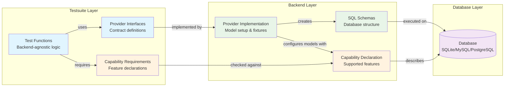
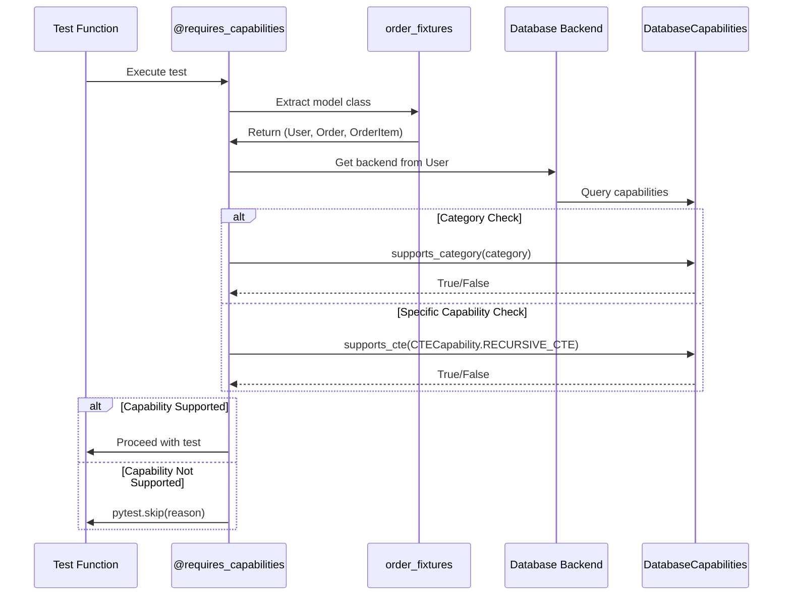

# Testing Architecture and Execution Guide

> **AI Assistant Note**: This document is optimized for AI code assistants (Claude Code, Gemini CLI, etc.). It uses imperative language and front-loads critical execution requirements.

## Architecture Overview

### Testsuite and Backend Relationship

```mermaid
graph TB
    subgraph "Backend Packages" 
        direction TB
        MYSQL[rhosocial-activerecord-mysql<br/>- Backend implementation<br/>- Schema definitions<br/>- Backend-specific tests]
        DEFAULT[rhosocial-activerecord<br/>- Default backend<br/>- Core functionality<br/>- Backend-specific tests]
    end

    subgraph "Testsuite Package" 
        direction TB
        TS[rhosocial-activerecord-testsuite<br/>- Standardized test contracts<br/>- Feature tests<br/>- Real-world scenarios<br/>- Performance benchmarks]
    end

    subgraph "Backend Developer Responsibilities" 
        direction TB
        PROVIDER[Implement test providers<br/>- Set up database schemas<br/>- Configure test models<br/>- Provide fixtures]
        SCHEMA[SQL Schema Creation<br/>- Create backend-specific<br/>  schema files<br/>- Match testsuite structure]
        REPORT[Generate compatibility reports<br/>- Run standardized tests<br/>- Track compatibility scores]
    end

    subgraph "Testsuite Author Responsibilities" 
        direction TB
        TESTDEF[Test Definition<br/>- Write backend-agnostic<br/>  test functions<br/>- Define test contracts<br/>- Provide test utilities]
        MARKER[Test Marking<br/>- Standard pytest markers<br/>- Categorization system<br/>- Feature identification]
        UTIL[Test Utilities<br/>- Schema generators<br/>- Helper functions<br/>- Provider interfaces]
    end

    %% Relationship arrows
    MYSQL -.->|uses| TS
    DEFAULT -.->|uses| TS
    PROVIDER -->|fulfills| TS
    SCHEMA -->|supports| TS
    REPORT -->|verifies| TS
    TESTDEF -->|provides| TS
    MARKER -->|organizes| TS
    UTIL -->|facilitates| TS

    style TS fill:#e1f5fe,stroke:#01579b,stroke-width:2px
    style MYSQL fill:#f3e5f5,stroke:#4a148c,stroke-width:2px
    style DEFAULT fill:#f3e5f5,stroke:#4a148c,stroke-width:2px
    style PROVIDER fill:#e8f5e8,stroke:#1b5e20,stroke-width:2px
    style SCHEMA fill:#e8f5e8,stroke:#1b5e20,stroke-width:2px
    style REPORT fill:#e8f5e8,stroke:#1b5e20,stroke-width:2px
    style TESTDEF fill:#fff3e0,stroke:#e65100,stroke-width:2px
    style MARKER fill:#fff3e0,stroke:#e65100,stroke-width:2px
    style UTIL fill:#fff3e0,stroke:#e65100,stroke-width:2px
```



### Testing Layer Architecture



## CRITICAL: PYTHONPATH Configuration

**MUST configure PYTHONPATH before running tests.** The test directories (`tests/`, `tests_original/`) are **NOT** on the Python path by default.

### Why PYTHONPATH is Required

```
project-root/
├── src/rhosocial/activerecord/    # ← Python can import this
├── tests/                          # ← NOT importable by default
└── tests_original/                 # ← NOT importable by default
```

Tests import from `rhosocial.activerecord`, but the test files themselves are not in the package structure. Without PYTHONPATH, pytest cannot find the source code.

### Platform-Specific Commands

**Linux/macOS (bash/zsh):**
```bash
# Single command execution
PYTHONPATH=src pytest tests/

# Persistent for session
export PYTHONPATH=src
pytest tests/
```

**Windows (PowerShell):**
```powershell
# Single command execution
$env:PYTHONPATH="src"; pytest tests/

# Persistent for session
$env:PYTHONPATH="src"
pytest tests/
```

**Windows (CMD):**
```cmd
REM Single command execution
set PYTHONPATH=src && pytest tests/

REM Persistent for session
set PYTHONPATH=src
pytest tests/
```

### Common Errors Without PYTHONPATH

```python
# Error you'll see:
ModuleNotFoundError: No module named 'rhosocial.activerecord'

# Solution:
# Set PYTHONPATH=src before running pytest
```

### IDE Configuration

**PyCharm:**
- Mark `src/` as "Sources Root"
- Test runner automatically adds it to PYTHONPATH

**VS Code:**
```json
// .vscode/settings.json
{
    "python.testing.pytestArgs": [
        "tests"
    ],
    "python.testing.pytestEnabled": true,
    "python.envFile": "${workspaceFolder}/.env"
}
```

```bash
# .env file
PYTHONPATH=src
```

## Responsibilities Division

### Testsuite Authors MUST:
- Write backend-agnostic test logic
- Define provider interfaces
- Create test fixtures and utilities
- NEVER assume backend-specific features
- NEVER write SQL directly in tests
- Document required capabilities using correct category+capability format

### Backend Developers MUST:
- Implement provider interfaces
- Create backend-specific schema files
- Handle database connection/cleanup
- Write backend-specific tests separately
- Generate compatibility reports
- Declare backend capabilities using add_* methods

### Division of Labor

| Component | Testsuite | Backend |
|-----------|-----------|---------|
| Test logic | ✅ Defines | Uses |
| SQL schemas | Provides templates | ✅ Implements |
| Database setup | Defines interface | ✅ Implements |
| Model configuration | Defines fixtures | ✅ Provides models |
| Cleanup/teardown | Defines hooks | ✅ Implements |
| Capability declaration | Defines requirements | ✅ Declares support |

## Capability-Based Test Selection

### Overview

The capability negotiation mechanism uses a two-level hierarchy:

1. **Capability Categories** (CapabilityCategory): Top-level groupings like CTE, WINDOW_FUNCTIONS
2. **Specific Capabilities**: Individual features within each category

### Capability Architecture

```python
# Capability hierarchy structure
CapabilityCategory.CTE                    # Category
    ├── CTECapability.BASIC_CTE          # Specific capability
    ├── CTECapability.RECURSIVE_CTE      # Specific capability
    └── CTECapability.MATERIALIZED_CTE   # Specific capability

CapabilityCategory.WINDOW_FUNCTIONS       # Category
    ├── WindowFunctionCapability.ROW_NUMBER
    ├── WindowFunctionCapability.RANK
    └── WindowFunctionCapability.LAG

# Pre-defined combinations
ALL_CTE_FEATURES = (
    CTECapability.BASIC_CTE |
    CTECapability.RECURSIVE_CTE |
    CTECapability.COMPOUND_RECURSIVE_CTE |
    CTECapability.CTE_IN_DML |
    CTECapability.MATERIALIZED_CTE
)
```

### Backend Capability Declaration

```python
# Backend declares its capabilities
# src/rhosocial/activerecord/backend/impl/sqlite/backend.py
from rhosocial.activerecord.backend.capabilities import (
    DatabaseCapabilities,
    CapabilityCategory,
    CTECapability,
    WindowFunctionCapability,
    ALL_CTE_FEATURES,
    ALL_WINDOW_FUNCTIONS
)

class SQLiteBackend(StorageBackend):
    def _initialize_capabilities(self):
        """Initialize and return the backend's capability descriptor."""
        capabilities = DatabaseCapabilities()
        version = self.get_server_version()

        # CTEs supported from 3.8.3+
        if version >= (3, 8, 3):
            # Add specific capabilities
            capabilities.add_cte([
                CTECapability.BASIC_CTE,
                CTECapability.RECURSIVE_CTE
            ])
            # This automatically adds CapabilityCategory.CTE

        # Window functions from 3.25.0+
        if version >= (3, 25, 0):
            # Use pre-defined combination
            capabilities.add_window_function(ALL_WINDOW_FUNCTIONS)

        return capabilities
```

### Declaring Test Requirements

Tests must specify BOTH category AND specific capability:

```python
# Correct format: (category, specific_capability)
from rhosocial.activerecord.backend.capabilities import (
    CapabilityCategory,
    CTECapability
)
from rhosocial.activerecord.testsuite.utils import requires_capabilities

# Single capability requirement
@requires_capabilities((CapabilityCategory.CTE, CTECapability.BASIC_CTE))
def test_basic_cte(order_fixtures):
    """Test requires basic CTE support."""
    pass

# Multiple capabilities from same category
@requires_capabilities((CapabilityCategory.CTE, [CTECapability.BASIC_CTE, CTECapability.RECURSIVE_CTE]))
def test_recursive_cte(tree_fixtures):
    """Test requires both basic and recursive CTE."""
    pass

# Multiple capabilities from different categories
@requires_capabilities(
    (CapabilityCategory.CTE, CTECapability.RECURSIVE_CTE),
    (CapabilityCategory.WINDOW_FUNCTIONS, WindowFunctionCapability.ROW_NUMBER)
)
def test_complex_query(order_fixtures):
    """Test requires recursive CTE and window functions."""
    pass

# Category-only check (any capability in category)
@requires_capabilities((CapabilityCategory.JSON_OPERATIONS, None))
def test_json_support(json_user_fixtures):
    """Test requires any JSON operation support."""
    pass
```

### Capability Checking Process



### Runtime vs Collection-Time Checking

**Collection-time checking** (in conftest.py):
- Faster - checks capabilities before test execution
- Requires access to backend during collection phase
- May need workaround if backend initialization is expensive
- Can cause issues if trying to access fixtures during setup

**Runtime checking** (in test or decorator):
- Slower - capabilities checked during test execution
- Always accurate - uses actual configured backend
- Recommended for dynamic capability scenarios
- Use `pytest_runtest_call` hook to access `item.funcargs` which contains already resolved fixtures

**Common Issue & Solution:**
If capability checks are performed in `pytest_runtest_setup` and attempt to access fixtures, it can cause issues like:
`AssertionError: (<Function test_func[memory]>, {})` - This happens when trying to access fixtures during test setup.
Move capability checks to `pytest_runtest_call` and access fixtures via `item.funcargs` instead of `request.getfixturevalue()`.

### Fixtures vs Raw Objects Access Patterns

**Composite Fixtures Return Pattern:**
When fixtures return tuples of models (like `order_fixtures` returns `(User, Order, OrderItem)`) but test expects a tuple:
- Test code may use: `Node = tree_fixtures[0]`
- But fixture returns raw object: `yield Node` instead of `yield (Node,)`
- This causes error: `TypeError: cannot be parametrized because it does not inherit from typing.Generic`
- Solution: Ensure fixture returns tuple if test code expects tuple indexing

**Correct Fixture Implementation:**
```python
# If test uses tree_fixtures[0], return a tuple
@pytest.fixture
def tree_fixtures(request):
    # Get Node model for the test via fixture group
    result = provider.setup_tree_fixtures(scenario)
    
    # Ensure we return a tuple for consistency with test expectation
    if isinstance(result, tuple):
        yield result
    else:
        # If only a single model is returned, wrap it in a tuple
        yield (result,)
```

## Provider Pattern Implementation

### Core Concept

The provider pattern enables test reuse across backends:

1. **Testsuite defines** test logic and provider interface
2. **Backend implements** provider to configure models/schemas
3. **Test execution** uses provider to run same tests on different backends
4. **Capability checking** determines which tests can run

### Provider Interface Example

```python
# Testsuite defines this
# src/rhosocial/activerecord/testsuite/feature/query/interfaces.py
from abc import ABC, abstractmethod
from typing import Type, List, Tuple
from rhosocial.activerecord import ActiveRecord


class IQueryProvider(ABC):
    """Provider interface for query feature tests."""
    
    @abstractmethod
    def get_test_scenarios(self) -> List[str]:
        """Return available test scenarios (e.g., 'local', 'docker')."""
        pass
    
    @abstractmethod
    def setup_order_fixtures(self, scenario_name: str) -> Tuple[Type[ActiveRecord], Type[ActiveRecord], Type[ActiveRecord]]:
        """
        Setup order-related models (User, Order, OrderItem).
        
        Returns:
            Tuple of (User, Order, OrderItem) model classes
        """
        pass
    
    @abstractmethod
    def setup_tree_fixtures(self, scenario_name: str) -> Tuple[Type[ActiveRecord]]:
        """
        Setup tree structure model (Node).
        
        Returns:
            Single-element tuple containing (Node,)
        """
        pass
    
    @abstractmethod
    def cleanup_after_test(self, scenario_name: str):
        """Cleanup after test execution."""
        pass
```

### Backend Provider Implementation

```python
# Backend implements this
# rhosocial-activerecord-mysql/tests/providers/mysql_query_provider.py
from rhosocial.activerecord.testsuite.feature.query.interfaces import IQueryProvider
from rhosocial.activerecord.backend.mysql import MySQLBackend

class MySQLQueryProvider(IQueryProvider):
    def get_test_scenarios(self):
        return ["local_mysql", "docker_mysql"]
    
    def setup_order_fixtures(self, scenario):
        """Setup and return User, Order, OrderItem models."""
        config = self._get_config(scenario)
        backend = MySQLBackend(config)
        
        # Configure models with backend
        User.configure(backend)
        Order.configure(backend)
        OrderItem.configure(backend)
        
        # Execute schema
        self._execute_schema_file("schemas/feature/query/order_models.sql", scenario)
        
        # MUST return tuple (even for single model)
        return (User, Order, OrderItem)
    
    def setup_tree_fixtures(self, scenario):
        """Setup and return Node model."""
        config = self._get_config(scenario)
        backend = MySQLBackend(config)
        
        Node.configure(backend)
        self._execute_schema_file("schemas/feature/query/tree_model.sql", scenario)
        
        # MUST return single-element tuple
        return (Node,)
    
    def cleanup(self, scenario):
        self._drop_all_tables(scenario)
```

### Composite Fixtures Usage Pattern

Tests receive fixtures as tuples and can unpack or index them:

```python
# Pattern 1: Unpacking multiple models
def test_basic_cte(order_fixtures):
    """Test with multiple models."""
    # Unpack the tuple returned by provider
    User, Order, OrderItem = order_fixtures
    
    user = User(username='test', email='test@example.com')
    order = Order(user_id=user.id, order_number='ORD-1')


# Pattern 2: Indexing single model from tuple
def test_recursive_cte_basics(tree_fixtures):
    """Test with single model in tuple."""
    # Extract the model from single-element tuple
    Node = tree_fixtures[0]
    
    root = Node(id=1, name="Root", parent_id=None)


# Pattern 3: Multiple models with indexing
def test_complex_scenario(order_fixtures):
    """Alternative access pattern."""
    User = order_fixtures[0]
    Order = order_fixtures[1]
    OrderItem = order_fixtures[2]
```

**Key Points:**
- Providers ALWAYS return tuples (even for single model: `(Model,)`)
- Tests can unpack: `Model1, Model2 = fixture`
- Tests can index: `Model = fixture[0]`
- Tuple unpacking is preferred for multiple models
- Indexing is acceptable for single-model tuples
- Tuples prevent accidental modification in tests

### Pytest Fixture Integration

```python
# Backend's conftest.py
import pytest
from .providers.mysql_query_provider import MySQLQueryProvider

# Register provider
_provider = MySQLQueryProvider()

@pytest.fixture
def order_fixtures(request):
    """Provide order-related models for tests."""
    scenario = request.config.getoption("--scenario", default="local_mysql")
    
    # Provider returns tuple
    fixtures = _provider.setup_order_fixtures(scenario)
    
    yield fixtures
    
    # Cleanup
    _provider.cleanup_after_test(scenario)


@pytest.fixture
def tree_fixtures(request):
    """Provide tree model for tests."""
    scenario = request.config.getoption("--scenario", default="local_mysql")
    
    # Provider returns single-element tuple
    fixtures = _provider.setup_tree_fixtures(scenario)
    
    yield fixtures
    
    _provider.cleanup_after_test(scenario)
```

## Directory Structure and Naming

### Testsuite Package Structure

```
python-activerecord-testsuite/
└── src/rhosocial/activerecord/testsuite/
    ├── feature/           # Core functionality tests
    │   ├── basic/         # CRUD operations
    │   ├── query/         # Query building
    │   │   ├── interfaces.py          # Provider interface
    │   │   ├── test_cte_basic.py      # Basic CTE tests
    │   │   └── test_cte_recursive.py  # Recursive CTE tests
    │   ├── relation/      # Relationships
    │   ├── events/        # Event hooks
    │   └── mixins/        # Mixin functionality
    ├── realworld/         # Business scenarios
    │   ├── ecommerce/
    │   ├── finance/
    │   └── social/
    ├── benchmark/         # Performance tests
    ├── core/              # Core testing infrastructure
    │   ├── registry.py    # Provider registry
    │   └── provider.py    # Base provider interface
    └── utils.py           # Testing utilities
```

### Backend Package Structure

```
rhosocial-activerecord-{backend}/
└── tests/
    ├── providers/              # Provider implementations
    │   └── {backend}_query_provider.py
    ├── schemas/                # SQL schema files
    │   └── feature/
    │       └── query/
    │           ├── order_models.sql
    │           └── tree_model.sql
    ├── conftest.py            # pytest configuration
    └── test_{backend}_*.py    # Backend-specific tests
```

### Naming Conventions

**Testsuite tests (backend-agnostic):**
- `feature/basic` → `python-activerecord-testsuite/.../feature/basic/`
- `feature/query` → `python-activerecord-testsuite/.../feature/query/`
- NO backend-specific naming

**Backend-specific tests:**
- `test_sqlite_*.py` → SQLite-specific tests
- `test_mysql_*.py` → MySQL-specific tests
- `test_pgsql_*.py` → PostgreSQL-specific tests
- MUST use prefix or subdirectory to distinguish from testsuite

## Test Execution Commands

### Quick Reference

```bash
# ALWAYS set PYTHONPATH first
export PYTHONPATH=src  # or equivalent for your platform

# Run local backend tests only (default)
pytest tests/

# Run testsuite validation tests
pytest tests/ --run-testsuite

# Run specific feature tests
pytest tests/ --run-testsuite -m "feature_crud"

# Run original comprehensive tests
pytest tests_original/

# Run with capability report
pytest tests/ --run-testsuite --show-skipped-capabilities
```

### Test Selection by Markers

```bash
# Feature tests
pytest -m "feature"
pytest -m "feature_crud"
pytest -m "feature_query"

# Real-world scenarios
pytest -m "realworld"
pytest -m "scenario_ecommerce"

# Benchmarks
pytest -m "benchmark"
pytest -m "benchmark_bulk"
```

## Writing Tests

### For Testsuite Authors

**Rules:**
- NEVER import backend-specific modules
- NEVER write SQL directly (use provider interface)
- NEVER assume database features without declaring capability requirements
- ALWAYS use fixtures provided by provider
- ALWAYS use pytest markers
- ALWAYS specify BOTH category AND specific capability in requirements

**Example:**

```python
# Good - backend-agnostic with capability declaration
from rhosocial.activerecord.backend.capabilities import (
    CapabilityCategory,
    CTECapability
)
from rhosocial.activerecord.testsuite.utils import requires_capabilities

@pytest.mark.feature
@pytest.mark.feature_query
@requires_capabilities((CapabilityCategory.CTE, CTECapability.BASIC_CTE))
def test_basic_cte(order_fixtures):
    """Test basic CTE functionality."""
    User, Order, OrderItem = order_fixtures
    
    user = User(username='test', email='test@example.com')
    assert user.save()

# Bad - missing category in capability requirement
@requires_capabilities(CTECapability.BASIC_CTE)  # WRONG - no category
def test_basic_cte(order_fixtures):
    pass

# Bad - backend-specific
def test_basic_cte():
    from rhosocial.activerecord.backend.mysql import MySQLBackend
    # DON'T DO THIS
```

### For Backend Developers

**Rules:**
- MUST implement all provider interface methods
- MUST create schema files matching testsuite structure
- MUST prefix backend-specific tests with `test_{backend}_`
- MUST handle database connection pooling
- MUST clean up test data
- MUST declare backend capabilities accurately using add_* methods
- MUST return tuples from provider methods (even for single model)

## Debugging Test Failures

### Common Issues

**Issue: ModuleNotFoundError**
```bash
# Cause: PYTHONPATH not set
# Fix: Set PYTHONPATH before running tests
export PYTHONPATH=src
pytest tests/
```

**Issue: Test skipped due to capabilities**
```bash
# Cause: Backend doesn't support required feature
# Fix: Check backend capability declaration
pytest tests/ --run-testsuite --show-skipped-capabilities
```

**Issue: Fixture returns wrong type**
```bash
# Cause: Provider not returning tuple
# Fix: Ensure provider returns tuple
return (Model,)  # Correct
return Model     # Wrong
```

**Issue: Cannot determine capability category**
```bash
# Cause: Only specific capability provided, no category
# Fix: Always provide (category, capability) tuple
@requires_capabilities((CapabilityCategory.CTE, CTECapability.BASIC_CTE))  # Correct
@requires_capabilities(CTECapability.BASIC_CTE)  # Wrong - no category
```

**Issue: Plugin registration conflicts**
```bash
# Error: RuntimeError: Plugin already registered under a different name
# Cause: Same plugin registered in multiple places (e.g., pytest_plugins and entry points)
# Fix: Remove duplicate registrations - choose one method (preferably entry points in pyproject.toml)
```

**Issue: Backend access method confusion**
```bash
# Old approach: model.get_backend() - does not exist
# Correct approach: model.backend() or model.__backend__
# In capability checking plugins, ensure using the IActiveRecord interface methods
```

**Issue: Fixtures accessed incorrectly in pytest hooks**
```bash
# Problem: Accessing fixtures in pytest_runtest_setup can cause:
# AssertionError: (<Function test_func[memory]>, {})
# Solution: Access fixtures in pytest_runtest_call via item.funcargs
# Or access them in auto-use fixtures using request.getfixturevalue()
```

**Issue: Tuple vs Object fixture mismatches**
```python
# Problem: Tests expect tuple indexing (fixture[0]) but fixture yields raw object
# Error: TypeError: cannot be parametrized because it does not inherit from typing.Generic
# Solution: Ensure fixture returns tuple if test code uses indexing
@pytest.fixture
def tree_fixtures(request):
    result = provider.setup_tree_fixtures(scenario)
    # Ensure we return a tuple for consistency 
    if isinstance(result, tuple):
        yield result
    else:
        yield (result,)  # Wrap single object in tuple
```

**Issue: Environment variable not set**
```bash
# Error: RuntimeError: The TESTSUITE_PROVIDER_REGISTRY environment variable is not set
# Cause: Missing environment variable that points to provider registry
# Fix: Set the environment variable, typically in testsuite conftest.py:
import os
os.environ.setdefault(
    'TESTSUITE_PROVIDER_REGISTRY',
    'providers.registry:provider_registry'
)
```

## Best Practices

### For AI Code Assistants

When executing tests:
1. **ALWAYS** set PYTHONPATH first
2. **ALWAYS** check platform (Linux/macOS/Windows)
3. **NEVER** assume tests will work without PYTHONPATH
4. **VERIFY** command syntax for user's shell environment
5. **PROVIDE** platform-specific commands
6. **CHECK** capability requirements use (category, capability) format

### For Developers

When writing tests:
1. **Backend-agnostic first**: Default to testsuite structure
2. **Provider pattern**: Use fixtures, not direct DB access
3. **Clear markers**: Tag all tests appropriately
4. **Declare capabilities correctly**: Always use (category, capability) format
5. **Return tuples**: Providers must return tuples for consistency
6. **Document requirements**: Comment on capability needs

### For Backend Implementers

When implementing backends:
1. **Accurate capability declaration**: Use add_* methods correctly
2. **Complete provider implementation**: Implement all interface methods
3. **Return tuples consistently**: Even single models should be in tuples
4. **Schema versioning**: Match schema structure to testsuite organization
5. **Cleanup thoroughly**: Don't leave test data between runs

### For Plugin Developers

When developing pytest plugins for capability checking:
1. **Use appropriate pytest hooks**: Use `pytest_runtest_call` to access resolved fixtures via `item.funcargs`, not `pytest_runtest_setup`
2. **Avoid multiple plugin registration**: Register plugins either via `pytest_plugins` or entry points, never both
3. **Proper backend access**: Access backend via `model.backend()` or `model.__backend__` following the IActiveRecord interface
4. **Error handling**: Add detailed logging to help debug capability check failures
5. **Environment setup**: Ensure necessary environment variables (like `TESTSUITE_PROVIDER_REGISTRY`) are set in conftest.py

### For Plugin Developers

When creating pytest plugins for capability checking:
1. **Use `pytest_runtest_call` hook** to access `item.funcargs` which contains resolved fixtures
2. **Avoid `pytest_runtest_setup`** when accessing fixtures that might cause initialization issues
3. **Handle exceptions gracefully** in plugin code to prevent test failures
4. **Use entry points registration** instead of pytest_plugins to avoid conflicts
5. **Access backend correctly** using IActiveRecord interface: `model.backend()` or `model.__backend__`
6. **Set required environment variables** in the testsuite conftest.py to ensure provider registry access
7. **Test plugin behavior** with different fixture types (single objects, tuples, etc.)

## Quick Command Reference

```bash
# Setup (REQUIRED)
export PYTHONPATH=src  # Linux/macOS
$env:PYTHONPATH="src"  # Windows PowerShell

# Basic execution
pytest tests/                              # Local tests only
pytest tests/ --run-testsuite              # Include testsuite
pytest tests_original/                     # Original comprehensive

# Filtered execution
pytest -m "feature"                        # All feature tests
pytest -m "feature_crud"                   # Specific feature
pytest -m "realworld and scenario_ecommerce"  # Specific scenario

# With capability reporting
pytest tests/ --run-testsuite --show-skipped-capabilities

# Debug mode
pytest -v tests/                           # Verbose
pytest --lf tests/                         # Last failed
pytest -k "test_create" tests/             # Name filter
pytest --collect-only tests/               # Show what would be collected
```

## Summary

**Critical constraints for AI assistants:**
- ✅ MUST set PYTHONPATH=src before pytest
- ✅ MUST provide platform-specific commands
- ✅ MUST understand testsuite vs backend division
- ✅ MUST understand provider pattern and composite fixtures
- ✅ MUST use (category, capability) format for requirements
- ✅ NEVER run pytest without PYTHONPATH
- ✅ NEVER assume test discovery will work
- ✅ Ensure plugin registration is not duplicated across multiple mechanisms
- ✅ Access fixtures in the right pytest hook (use `pytest_runtest_call` for `item.funcargs`)
- ✅ Use correct backend access methods (`model.backend()` or `model.__backend__`)

**Key concepts:**
- Two-layer architecture (testsuite + backend)
- Provider pattern for test reuse
- Composite fixtures (always return tuples)
- Two-level capability hierarchy (category + specific)
- Backend capability declaration using add_* methods
- Backend-agnostic test logic
- Backend-specific implementation details
- PYTHONPATH requirement for execution

**Key lessons learned during this session:**
1. Pytest plugins accessing fixtures during `pytest_runtest_setup` can cause assertion errors; use `pytest_runtest_call` and access fixtures via `item.funcargs`
2. Plugin registration conflicts occur when registering the same plugin via multiple methods (pytest_plugins and entry points)
3. Backend access methods must follow the IActiveRecord interface (`model.backend()` not `model.get_backend()`)
4. Fixture return values need to match test expectations (tuples vs raw objects)
5. Environment variables like `TESTSUITE_PROVIDER_REGISTRY` must be set for provider registry access
6. Detailed error logging in plugin code helps identify and resolve fixture access issues quickly