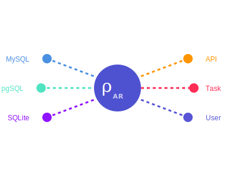

<!-- README.md -->
# rhosocial ActiveRecord

> **⚠️ Development Stage Notice:** This project is currently in the development stage. Features may be added or removed at any time, and there may be defects or inconsistencies with the actual implementation. Therefore, the documentation content may be subject to change at any time and is currently for reference only.

[](https://badge.fury.io/py/rhosocial-activerecord)
[](https://pypi.org/project/rhosocial-activerecord/)
[](https://github.com/rhosocial/python-activerecord/actions)
[](https://app.codecov.io/gh/rhosocial/python-activerecord/tree/main)
[](https://github.com/rhosocial/python-activerecord/blob/main/LICENSE)
[](https://github.com/vistart)

<div align="center">
    
    <p>A modern, Pythonic implementation of the ActiveRecord pattern, providing an elegant and intuitive interface for database operations with type safety and rich features.</p>
</div>

## Key Features

- 🎯 Pure Python implementation with no external ORM dependencies
- 🚀 Modern Python features with comprehensive type hints
- 🔒 Type-safe field definitions using Pydantic
- 💾 Built-in SQLite support for immediate use
- 🔄 Rich relationship support (BelongsTo, HasOne, HasMany)
- 🔍 Fluent query builder interface
- 📦 Advanced transaction support with savepoints
- 🎯 Event system for model lifecycle hooks
- 🛡️ Enterprise features: optimistic locking, soft delete, UUID support
- 🔌 Expandable to other databases through optional backend packages

## Requirements

- Python 3.8+
- Pydantic 2.10+
- SQLite 3.25+ (if using SQLite backend)

All dependencies are handled through the package manager with no external ORM requirements.

Note that the sqlite3 version must be greater than 3.25, otherwise it will not work.
You can run the following command to check the sqlite3 version:

```shell
python3 -c "import sqlite3; print(sqlite3.sqlite_version);"
```

### Python Version Support

**Python 3.8 Support**: Although Python 3.8 has reached end-of-life, we continue to support it in the current major version due to its widespread user base. However, the next major version will be the last to support Python 3.8, and future versions will not guarantee compatibility.

Specifically for Python 3.8:
- `pydantic==2.10.6` (latest compatible version)
- `pydantic-core==2.27.2` (matching pydantic requirements)

For Python 3.9+:
- `pydantic>=2.12.0` (minimum required version, no upper limit on minor versions as long as major version remains 2.x)
- `pydantic-core>=2.41.0` (minimum required version, no upper limit on minor versions as long as major version remains 2.x)

**Python 3.14 Compatibility**: Python 3.14 introduces significant changes that impact core dependencies. Specifically, `pydantic`, `pydantic-core`, and `PyO3` require major version updates to maintain compatibility. This is why we maintain separate dependency lists for Python 3.14 in our requirements specifications.

As of the release of this software, the latest version of pydantic is 2.12.x. This version supports Python 3.14 free-threaded mode (PEP 703).

Note that pydantic 2.11+ has dropped support for Python 3.8. If you need to use Python 3.8, please stick with pydantic 2.10.6.

Also note that according to Python's official development plan (https://peps.python.org/pep-0703/), the free-threaded mode will remain experimental for several years and is not recommended for production environments, even though both pydantic and this project support it.

## Free-Threading Python Support

This library provides compatibility with Free-Threading Python (available from Python 3.14+). Free-Threading Python removes the Global Interpreter Lock (GIL), allowing true parallel execution. The library uses `threading.local` and `threading.Lock` for thread-safe operations, which are compatible with Free-Threading Python.

### Installing Free-Threading Python on Windows

To install Free-Threading Python 3.14t on Windows (recommended: use PowerShell 7 instead of CMD):

1. Install the Python Installation Manager:
   ```
   winget install 9NQ7512CXL7T
   ```

2. Install Python 3.14t:
   ```
   py install 3.14t
   ```

3. Verify the installation:
   ```
   py -3.14t --version
   ```

## Installation

```bash
# Core package with SQLite support
pip install rhosocial-activerecord

# Optional database backends
pip install rhosocial-activerecord[mysql]     # MySQL support
pip install rhosocial-activerecord[mariadb]   # MariaDB support
pip install rhosocial-activerecord[pgsql]     # PostgreSQL support
pip install rhosocial-activerecord[oracle]    # Oracle support
pip install rhosocial-activerecord[mssql]     # SQL Server support

# All database backends
pip install rhosocial-activerecord[databases]

# Additional features
pip install rhosocial-activerecord[migration]  # Database migrations

# Everything
pip install rhosocial-activerecord[all]
```

## Quick Start

```python
from rhosocial.activerecord import ActiveRecord
from rhosocial.activerecord.backend.impl.sqlite.backend import SQLiteBackend
from rhosocial.activerecord.backend.typing import ConnectionConfig
from datetime import datetime
from typing import Optional

class User(ActiveRecord):
    __table_name__ = 'users'
    
    id: int
    name: str
    email: str
    created_at: datetime
    deleted_at: Optional[datetime] = None

# Configure with built-in SQLite backend
User.configure(
    ConnectionConfig(database='database.sqlite3'),
    backend_class=SQLiteBackend
)

# Create a new user
user = User(name='John Doe', email='john@example.com')
user.save()

# Query users
active_users = User.query()
    .where('deleted_at IS NULL')
    .order_by('created_at DESC')
    .all()

# Update user
user.name = 'Jane Doe'
user.save()

# Delete user
user.delete()
```

## Documentation

Complete documentation is available at [python-activerecord](https://docs.python-activerecord.dev.rho.social/)

- [Getting Started Guide](https://rhosocial-activerecord.readthedocs.io/en/latest/getting_started.html)
- [API Reference](https://rhosocial-activerecord.readthedocs.io/en/latest/api/)
- [Backend Implementation Guide](https://rhosocial-activerecord.readthedocs.io/en/latest/storage_backends/implementing.html)
- [Available Backends](https://rhosocial-activerecord.readthedocs.io/en/latest/storage_backends/available.html)

## Features in Detail
For detailed information about features, including built-in SQLite support, modular backend system, and type safety, please see our [Features Documentation](https://rhosocial-activerecord.readthedocs.io/en/latest/features/).

## Contributing
We welcome and value all forms of contributions! For details on how to contribute, please see our [Contributing Guide](CONTRIBUTING.md).

### Sponsor the Project

Support development through:
- GitHub Sponsors
- Open Collective
- One-time donations
- Commercial support

Your logo will appear here with a link to your website:

[](https://liberapay.com/vistart/donate)

## License

[](https://github.com/rhosocial/python-activerecord/blob/main/LICENSE)

Copyright © 2025 [vistart](https://github.com/vistart)
```