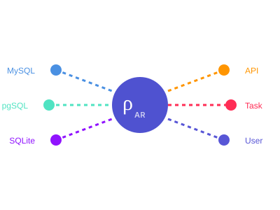

<!-- README.md -->
# rhosocial-activerecord ($\rho_{\mathbf{AR}}$)

[](https://badge.fury.io/py/rhosocial-activerecord)
[](https://pypi.org/project/rhosocial-activerecord/)
[](https://github.com/rhosocial/python-activerecord/actions)
[](https://app.codecov.io/gh/rhosocial/python-activerecord/tree/main)
[](https://github.com/rhosocial/python-activerecord/blob/main/LICENSE)
[](https://github.com/vistart)

<div align="center">
    
    <h3>A Modern, Standalone ActiveRecord Implementation for Python</h3>
    <p><b>Built on Pydantic Only · Full Type Safety · True Sync-Async Parity · AI-Native Design</b></p>
</div>

> **⚠️ Development Stage:** This project is under active development. APIs may change, and some features are not yet production-ready.

## Why This Project?

### 1. ActiveRecord Pattern Is Intuitive

The ActiveRecord pattern—where a class represents a table and an instance represents a row—maps directly to how developers think:

```python
user = User(name="Alice")  # Create
user.save()                # Persist
user.name = "Bob"          # Modify  
user.save()                # Update
```

Simple, consistent, and easy to reason about. **This is what Python's been missing.**

### 2. Python Lacks a Standalone ActiveRecord Ecosystem

| | rhosocial-activerecord | SQLAlchemy | Django ORM |
|---|---|---|---|
| **Pattern** | ActiveRecord | Data Mapper | ActiveRecord (coupled) |
| **Standalone** | ✅ Yes | ✅ Yes | ❌ Django only |
| **Dependencies** | Pydantic only | Self-contained | Django framework |
| **Async** | Native parity | 2.0 via greenlet | Django 4.1+ only |

* **SQLAlchemy** is excellent but follows the Data Mapper pattern—not ActiveRecord
* **Django ORM** is ActiveRecord but **tightly coupled** to Django; can't use it in FastAPI, Flask, or scripts without the entire Django stack
* **We fill the gap**: A **standalone, modern, feature-complete ActiveRecord** for all Python applications

### 3. Built From Scratch, Not a Wrapper

**Traditional ORM Architecture**: Your Code → ORM API → SQLAlchemy/Django → Database Driver → Database

**Our Architecture**: Your Code → rhosocial-activerecord → Database Driver → Database

We built this from the ground up with **Pydantic as the only dependency**. No SQLAlchemy underneath. No Django ORM wrapper. This means zero hidden complexity, complete SQL control, a smaller footprint, and a simpler mental model — one layer to understand, not three.

| | rhosocial-activerecord | SQLAlchemy | Django ORM |
|---|---|---|---|
| Core dependency | Pydantic only | Standalone | Django framework |
| Query style | Expression objects + `.to_sql()` | Expression language or ORM | QuerySet chaining |
| SQL transparency | Every query exposes `.to_sql()` | Via `compile()` | Limited via `.query` |
| Sync/Async | Native parity (same API surface) | 2.0 async via greenlet | Async views (Django 4.1+) |

## Architecture Highlights

**Expression-Dialect Separation** — Query structure and SQL generation are completely decoupled. Expressions define _what_ you want; Dialects handle backend-specific SQL (SQLite, MySQL, PostgreSQL). Call `.to_sql()` on any query to inspect the generated SQL before execution.

**True Sync-Async Parity** — Native implementations, not async wrappers around sync code. Same method names, same patterns, just add `await`.

**Type-First Design with Pydantic v2** — Every field is type-safe, validated, and IDE-friendly. Full autocomplete support, runtime validation, and no `Any` types in public APIs.

## Quick Start

### Installation

```bash
pip install rhosocial-activerecord
```

### End-to-End Example

```python
"""Save as demo.py and run with: python demo.py"""
from rhosocial.activerecord.model import ActiveRecord
from rhosocial.activerecord.backend.impl.sqlite.backend import SQLiteBackend
from rhosocial.activerecord.backend.impl.sqlite.config import SQLiteConnectionConfig
from rhosocial.activerecord.backend.expression import CreateTableExpression
from rhosocial.activerecord.backend.expression.statements import (
    ColumnConstraint, ColumnConstraintType, ColumnDefinition,
)
from rhosocial.activerecord.backend.expression.types import IntegerType, VarCharType
from rhosocial.activerecord.base import FieldProxy
from typing import ClassVar, Optional
from pydantic import Field


class User(ActiveRecord):
    __table_name__ = "users"
    id: Optional[int] = None # Primary key
    name: str = Field(max_length=100)
    email: str
    age: int = 0
    # Required: without it, `User.c.age` does not exist.
    c: ClassVar[FieldProxy] = FieldProxy()


# Configure backend (in-memory SQLite for demo)
config = SQLiteConnectionConfig(database=":memory:")
User.configure(config, SQLiteBackend)

# Create table using DDL expressions. Every node takes the dialect as its
# first argument, and column types are DataType instances rather than strings.
dialect = User.__backend__.dialect
create_table = CreateTableExpression(
    dialect=dialect,
    table="users",
    columns=[
        ColumnDefinition(dialect, "id", IntegerType(dialect),
            constraints=[ColumnConstraint(dialect, ColumnConstraintType.PRIMARY_KEY,
                is_auto_increment=True)]),
        ColumnDefinition(dialect, "name", VarCharType(dialect, 100),
            constraints=[ColumnConstraint(dialect, ColumnConstraintType.NOT_NULL)]),
        ColumnDefinition(dialect, "email", VarCharType(dialect, 255)),
        ColumnDefinition(dialect, "age", IntegerType(dialect)),
    ]
)
# execute() takes SQL text, not an expression node: render it first.
User.__backend__.execute(*create_table.to_sql())

# Insert
alice = User(name="Alice", email="alice@example.com", age=30)
alice.save()

# Query with type-safe expressions
adults = User.query().where(User.c.age >= 18).all()

# Inspect generated SQL without executing
sql, params = User.query().where(User.c.age >= 18).to_sql()
# SQL: SELECT * FROM "users" WHERE "users"."age" >= ?
# Params: (18,)
```

> **Note**: `ColumnDefinition` and `ColumnConstraint` take the dialect as their
> first positional argument. Older releases accepted `(name, "VARCHAR(100)")`
> with plain SQL type strings; that signature is gone. `execute()` also takes
> SQL text, not an expression node — render with `to_sql()` first.

### Relationships

```python
from rhosocial.activerecord.model import ActiveRecord
from rhosocial.activerecord.backend.impl.sqlite.backend import SQLiteBackend
from rhosocial.activerecord.backend.impl.sqlite.config import SQLiteConnectionConfig
from rhosocial.activerecord.backend.expression import CreateTableExpression
from rhosocial.activerecord.backend.expression.statements import (
    ColumnConstraint, ColumnConstraintType, ColumnDefinition,
    ForeignKeyConstraint, ReferentialAction,
)
from rhosocial.activerecord.backend.expression.types import IntegerType, TextType
from rhosocial.activerecord.base import FieldProxy
from rhosocial.activerecord.relation import HasMany, BelongsTo
from typing import ClassVar, Optional


class Author(ActiveRecord):
    __table_name__ = "authors"
    id: Optional[int] = None
    name: str
    c: ClassVar[FieldProxy] = FieldProxy()
    posts: ClassVar[HasMany["Post"]] = HasMany(foreign_key="author_id")


class Post(ActiveRecord):
    __table_name__ = "posts"
    id: Optional[int] = None
    title: str
    author_id: int
    c: ClassVar[FieldProxy] = FieldProxy()
    author: ClassVar[BelongsTo["Author"]] = BelongsTo(foreign_key="author_id")


# Configure backend
config = SQLiteConnectionConfig(database=":memory:")
Author.configure(config, SQLiteBackend)
Post.__backend__ = Author.__backend__

# Create tables using DDL expressions
dialect = Author.__backend__.dialect

Author.__backend__.execute(*CreateTableExpression(
    dialect=dialect,
    table="authors",
    columns=[
        ColumnDefinition(dialect, "id", IntegerType(dialect),
            constraints=[ColumnConstraint(dialect, ColumnConstraintType.PRIMARY_KEY,
                is_auto_increment=True)]),
        ColumnDefinition(dialect, "name", TextType(dialect)),
    ]
).to_sql())

Author.__backend__.execute(*CreateTableExpression(
    dialect=dialect,
    table="posts",
    columns=[
        ColumnDefinition(dialect, "id", IntegerType(dialect),
            constraints=[ColumnConstraint(dialect, ColumnConstraintType.PRIMARY_KEY,
                is_auto_increment=True)]),
        ColumnDefinition(dialect, "title", TextType(dialect)),
        ColumnDefinition(dialect, "author_id", IntegerType(dialect)),
    ],
    table_constraints=[
        # ForeignKeyConstraint is a TableConstraint subclass, so it goes
        # straight into the list.
        ForeignKeyConstraint(
            dialect,
            columns=["author_id"],
            foreign_key_table="authors",
            foreign_key_columns=["id"],
            on_delete=ReferentialAction.CASCADE,
        )
    ]
).to_sql())

# Eager loading — one query, no N+1
authors = Author.query().with_("posts").all()
for author in authors:
    print(f"{author.name}: {[p.title for p in author.posts()]}")
```

> **Async Parity:** All sync APIs have async counterparts. For async models, use `AsyncActiveRecord`, `AsyncHasMany`, and `AsyncBelongsTo` instead. The API surface is identical—just add `await`.
>
> ⚠️ **Note:** The built-in SQLite async backend is currently for testing only. For other backends (MySQL, PostgreSQL, etc.), async support depends on the specific implementation.

## Features

All features support both **sync** and **async** APIs with identical method names—just add `await`.

### DDL Expressions

Type-safe schema definition without raw SQL:

* **[CreateTableExpression](src/rhosocial/activerecord/backend/expression/statements/ddl_table.py)** — Create tables with columns and constraints
* **[DropTableExpression](src/rhosocial/activerecord/backend/expression/statements/ddl_table.py)** — Drop tables with IF EXISTS support
* **[AlterTableExpression](src/rhosocial/activerecord/backend/expression/statements/ddl_alter.py)** — Add/drop columns, rename tables
* **[CreateIndexExpression](src/rhosocial/activerecord/backend/expression/statements/ddl_index.py)** — Create indexes with IF NOT EXISTS
* **[CreateViewExpression](src/rhosocial/activerecord/backend/expression/statements/ddl_view.py)** — Create views from query expressions

### Query Builders

Three core query types, each with full sync/async parity:

* **[ActiveQuery](src/rhosocial/activerecord/query/active_query.py)** / **[AsyncActiveQuery](src/rhosocial/activerecord/query/active_query.py)** — Model-based queries with WHERE, JOIN, ORDER BY, LIMIT, aggregations, and [eager loading](src/rhosocial/activerecord/query/relational.py) via `.with_()`
* **[CTEQuery](src/rhosocial/activerecord/query/cte_query.py)** / **[AsyncCTEQuery](src/rhosocial/activerecord/query/cte_query.py)** — Common Table Expressions (WITH clauses) for recursive queries and complex multi-step operations
* **[SetOperationQuery](src/rhosocial/activerecord/query/set_operation.py)** / **[AsyncSetOperationQuery](src/rhosocial/activerecord/query/set_operation.py)** — UNION, INTERSECT, EXCEPT operations

### Relationships

Type-safe relationship descriptors with eager loading support:

* **[BelongsTo](src/rhosocial/activerecord/relation/__init__.py)** / **[AsyncBelongsTo](src/rhosocial/activerecord/relation/__init__.py)** — Child-to-parent associations
* **[HasOne](src/rhosocial/activerecord/relation/__init__.py)** / **[AsyncHasOne](src/rhosocial/activerecord/relation/__init__.py)** — One-to-one parent-to-child
* **[HasMany](src/rhosocial/activerecord/relation/__init__.py)** / **[AsyncHasMany](src/rhosocial/activerecord/relation/__init__.py)** — One-to-many parent-to-children

### Field Mixins

Reusable mixins for common model behaviors:

* **[OptimisticLockMixin](src/rhosocial/activerecord/field/version.py)** — Version-based concurrency control
* **[SoftDeleteMixin](src/rhosocial/activerecord/field/soft_delete.py)** — Logical deletion with `deleted_at` timestamp
* **[TimestampMixin](src/rhosocial/activerecord/field/timestamp.py)** — Auto-managed `created_at` and `updated_at`
* **[UUIDMixin](src/rhosocial/activerecord/field/uuid.py)** — UUID primary keys

### Model Events

Lifecycle hooks for custom business logic:

* **[Model Events](src/rhosocial/activerecord/interface/base.py)** — `before_insert`, `after_insert`, `before_update`, `after_update`, `before_delete`, `after_delete`

For details, see the [documentation](docs/en_US/).

## Backend Support

All backends are pre-1.0 (`1.0.0.devN`). `requires-python` is the lower bound
declared in each backend's `pyproject.toml`, and it is **not** uniform — the
core library supports 3.8+, but some backends require more.

| Backend | Package | Python | Sync | Async | PyPI |
|---|---|---|---|---|---|
| **SQLite** | built-in | `>=3.8` | ✅ | ✅ | — |
| **MySQL** | `rhosocial-activerecord-mysql` | `>=3.8` | ✅ | ✅ | [dev19](https://pypi.org/project/rhosocial-activerecord-mysql/) |
| **PostgreSQL** | `rhosocial-activerecord-postgres` | `>=3.8` | ✅ | ✅ | [dev16](https://pypi.org/project/rhosocial-activerecord-postgres/) |
| **MariaDB** | `rhosocial-activerecord-mariadb` | `>=3.8` | ✅ | ✅ | [dev2](https://pypi.org/project/rhosocial-activerecord-mariadb/) |
| **SQL Server** | `rhosocial-activerecord-sqlserver` | `>=3.9` | ✅ | ✅ | [dev2](https://pypi.org/project/rhosocial-activerecord-sqlserver/) |
| **Oracle** | `rhosocial-activerecord-oracle` | `>=3.8` | ✅ | ✅ | [dev2](https://pypi.org/project/rhosocial-activerecord-oracle/) |
| **Snowflake** | `rhosocial-activerecord-snowflake` | `>=3.8` | ✅ | ⚠️ thread-pool¹ | [dev1](https://pypi.org/project/rhosocial-activerecord-snowflake/) |
| **Firebird** | `rhosocial-activerecord-firebird` | `>=3.11` | ✅ | ✅ | [dev1](https://pypi.org/project/rhosocial-activerecord-firebird/) |
| **BigQuery** | `rhosocial-activerecord-bigquery` | `>=3.10` | ✅ | ✅ | _unpublished_ |
| **ClickHouse** | `rhosocial-activerecord-clickhouse` | `>=3.10,<3.15` | ✅ | ❌² | _unpublished_ |

¹ `snowflake-connector-python` has no native async driver, so
`AsyncSnowflakeBackend` runs sync calls through `asyncio.run_in_executor()`.
Same method names, but it is a wrapper, not a native implementation.

² `clickhouse-connect` is sync-only. `AsyncClickHouseBackend` exists as an
import placeholder and raises `NotImplementedError` on instantiation.

Source: [rhosocial/python-activerecord](https://github.com/rhosocial/python-activerecord)

## Requirements

* **Python**: 3.8+ for the core library and the SQLite backend. Individual
  backends raise this floor — see the Backend Support table above.
* **Core Dependency**: Pydantic 2.10+ (Python 3.8) or 2.12+ (Python 3.9+)
* **SQLite**: 3.25+ (for the built-in backend)

Free-threaded builds: the core library and the SQLite backend are tested on
3.13t/3.14t. Per-backend status differs — Snowflake is **not** supported on
3.13t (`cryptography` → `cffi` has no free-threaded 3.13 build), and
ClickHouse caps at `<3.15`.

## Get Started with AI Code Agents

This project ships with built-in configurations for AI code agents and editors. Clone the repo and launch your preferred tool — project-specific skills, commands, and context files are discovered automatically.

```bash
git clone https://github.com/rhosocial/python-activerecord.git
cd python-activerecord
```

### CLI Code Agents

| Tool | How to start | What's included |
|---|---|---|
| [Claude Code](https://docs.anthropic.com/en/docs/claude-code) | `claude` | `CLAUDE.md` project instructions + `.claude/skills/` (5 skills) + `.claude/commands/` |
| [OpenCode](https://github.com/opencode-ai/opencode) | `opencode` | `.opencode/commands/` (8 slash commands) + `.opencode/hints.yml` |
| [Codex](https://github.com/openai/codex) | `codex` | `AGENTS.md` project context |

### Editors

[Cursor](https://cursor.com) and [Windsurf](https://windsurf.com) users can open the project folder directly. Both editors benefit from the `CLAUDE.md` and `AGENTS.md` context files at the project root, as well as the `docs/LLM_CONTEXT.md` structured reference.

### For Any LLM

Feed [`docs/LLM_CONTEXT.md`](docs/LLM_CONTEXT.md) to your preferred LLM for a structured overview of the project's architecture, module map, and key concepts.

### What can AI agents do?

See the **[AI-Assisted Development Guide](docs/en_US/introduction/ai_assistance.md)** for concrete examples of what AI agents can help you accomplish with this project — from generating models and queries to implementing new backends and running tests.

## Documentation

* **[Getting Started Guide](docs/en_US/getting_started/)** — Installation and basic usage
* **[AI-Assisted Development](docs/en_US/introduction/ai_assistance.md)** — Using AI code agents with this project
* **[Modeling Guide](docs/en_US/modeling/)** — Defining models, fields, and relationships
* **[Querying Guide](docs/en_US/querying/)** — Complete query builder documentation
* **[Backend Development](docs/en_US/backend/)** — Creating custom database backends
* **[Architecture Overview](docs/en_US/introduction/architecture.md)** — Module structure and design decisions
* **[LLM Context](docs/LLM_CONTEXT.md)** — Structured context for AI assistants
* **[API Reference](https://docs.python-activerecord.dev.rho.social/api/)** — Full API documentation

## Contributing

We welcome contributions! Please see [CONTRIBUTING.md](CONTRIBUTING.md) for guidelines.

## License

[Apache License 2.0](LICENSE) — Copyright © 2026 [vistart](https://github.com/vistart)

---

<div align="center">
    <p><b>Built with ❤️ by the rhosocial team</b></p>
    <p><a href="https://github.com/rhosocial/python-activerecord">GitHub</a> · <a href="https://docs.python-activerecord.dev.rho.social/">Documentation</a> · <a href="https://pypi.org/project/rhosocial-activerecord/">PyPI</a></p>
</div>
