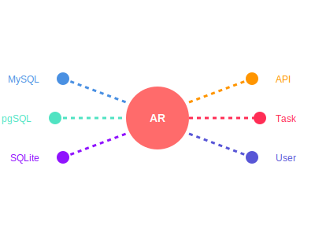

<!-- README.md -->
# rhosocial-activerecord ($\rho_{\mathbf{AR}}$)

[](https://badge.fury.io/py/rhosocial-activerecord)
[](https://pypi.org/project/rhosocial-activerecord/)
[](https://github.com/rhosocial/python-activerecord/actions)
[](https://app.codecov.io/gh/rhosocial/python-activerecord/tree/main)
[](https://github.com/rhosocial/python-activerecord/blob/main/LICENSE)
[](https://github.com/vistart)

<div align="center">
    
    <h3>A Modern, Standalone ActiveRecord Implementation for Python</h3>
    <p><b>Built on Pydantic Only · Full Type Safety · True Sync-Async Parity · AI-Native Design</b></p>
</div>

> **⚠️ Development Stage:** This project is under active development. APIs may change, and some features are not yet production-ready.

## Why This Project?

**Traditional ORM Architecture**: Your Code → ORM API → SQLAlchemy/Django → Database Driver → Database

**Our Architecture**: Your Code → rhosocial-activerecord → Database Driver → Database

We built this from the ground up with **Pydantic as the only dependency**. No SQLAlchemy underneath. No Django ORM wrapper. This means zero hidden complexity, complete SQL control, a smaller footprint, and a simpler mental model — one layer to understand, not three.

| | rhosocial-activerecord | SQLAlchemy | Django ORM |
|---|---|---|---|
| Core dependency | Pydantic only | Standalone | Django framework |
| Query style | Expression objects + `.to_sql()` | Expression language or ORM | QuerySet chaining |
| SQL transparency | Every query exposes `.to_sql()` | Via `compile()` | Limited via `.query` |
| Sync/Async | Native parity (same API surface) | 2.0 async via greenlet | Async views (Django 4.1+) |

## Architecture Highlights

**Expression-Dialect Separation** — Query structure and SQL generation are completely decoupled. Expressions define _what_ you want; Dialects handle backend-specific SQL (SQLite, MySQL, PostgreSQL). Call `.to_sql()` on any query to inspect the generated SQL before execution.

**True Sync-Async Parity** — Native implementations, not async wrappers around sync code. Same method names, same patterns, just add `await`.

**Type-First Design with Pydantic v2** — Every field is type-safe, validated, and IDE-friendly. Full autocomplete support, runtime validation, and no `Any` types in public APIs.

## Quick Start

### Installation

```bash
pip install rhosocial-activerecord
```

### End-to-End Example

```python
"""Save as demo.py and run with: python demo.py"""
from rhosocial.activerecord.model import ActiveRecord
from rhosocial.activerecord.backend.impl.sqlite import SQLiteBackend
from rhosocial.activerecord.backend.impl.sqlite.config import SQLiteConnectionConfig
from rhosocial.activerecord.backend.options import ExecutionOptions
from rhosocial.activerecord.backend.schema import StatementType
from rhosocial.activerecord.base import FieldProxy
from typing import ClassVar, Optional
from pydantic import Field


class User(ActiveRecord):
    __table_name__ = "users"
    id: Optional[int] = None  # Primary key
    name: str = Field(max_length=100)
    email: str
    age: int = 0
    c: ClassVar[FieldProxy] = FieldProxy()


# Configure backend (in-memory SQLite for demo)
config = SQLiteConnectionConfig(database=":memory:")
User.configure(config, SQLiteBackend)

# Create table
User.__backend__.execute(
    "CREATE TABLE users (id INTEGER PRIMARY KEY, name TEXT, email TEXT, age INTEGER)",
    options=ExecutionOptions(stmt_type=StatementType.DDL)
)

# Insert
alice = User(name="Alice", email="alice@example.com", age=30)
alice.save()

# Query with type-safe expressions
adults = User.query().where(User.c.age >= 18).all()

# Inspect generated SQL without executing
sql, params = User.query().where(User.c.age >= 18).to_sql()
# SQL: SELECT * FROM "users" WHERE "users"."age" >= ?
# Params: (18,)
```

### Relationships

```python
from rhosocial.activerecord.model import ActiveRecord
from rhosocial.activerecord.backend.impl.sqlite import SQLiteBackend
from rhosocial.activerecord.backend.impl.sqlite.config import SQLiteConnectionConfig
from rhosocial.activerecord.backend.options import ExecutionOptions
from rhosocial.activerecord.backend.schema import StatementType
from rhosocial.activerecord.base import FieldProxy
from rhosocial.activerecord.relation import HasMany, BelongsTo
from typing import ClassVar, Optional


class Author(ActiveRecord):
    __table_name__ = "authors"
    id: Optional[int] = None
    name: str
    c: ClassVar[FieldProxy] = FieldProxy()
    # Use ClassVar to prevent Pydantic from tracking these as model fields
    posts: ClassVar[HasMany["Post"]] = HasMany(foreign_key="author_id")


class Post(ActiveRecord):
    __table_name__ = "posts"
    id: Optional[int] = None
    title: str
    author_id: int
    c: ClassVar[FieldProxy] = FieldProxy()
    # Use ClassVar to prevent Pydantic from tracking these as model fields
    author: ClassVar[BelongsTo["Author"]] = BelongsTo(foreign_key="author_id")


# Configure backend
config = SQLiteConnectionConfig(database=":memory:")
Author.configure(config, SQLiteBackend)
Post.__backend__ = Author.__backend__  # Share the same backend

# Create tables
Author.__backend__.execute("""
    CREATE TABLE authors (id INTEGER PRIMARY KEY, name TEXT)
""", options=ExecutionOptions(stmt_type=StatementType.DDL))

Author.__backend__.execute("""
    CREATE TABLE posts (
        id INTEGER PRIMARY KEY,
        title TEXT,
        author_id INTEGER,
        FOREIGN KEY (author_id) REFERENCES authors(id)
    )
""", options=ExecutionOptions(stmt_type=StatementType.DDL))

# Eager loading — one query, no N+1
authors = Author.query().with_("posts").all()
for author in authors:
    print(f"{author.name}: {[p.title for p in author.posts()]}")
```

> **Async Parity:** All sync APIs have async counterparts. For async models, use `AsyncActiveRecord`, `AsyncHasMany`, and `AsyncBelongsTo` instead. The API surface is identical—just add `await`.
>
> ⚠️ **Note:** The built-in SQLite async backend is currently for testing only. For other backends (MySQL, PostgreSQL, etc.), async support depends on the specific implementation.

## Features

All features support both **sync** and **async** APIs with identical method names—just add `await`.

### Query Builders

Three core query types, each with full sync/async parity:

- **[ActiveQuery](src/rhosocial/activerecord/query/active_query.py)** / **[AsyncActiveQuery](src/rhosocial/activerecord/query/active_query.py)** — Model-based queries with WHERE, JOIN, ORDER BY, LIMIT, aggregations, and [eager loading](src/rhosocial/activerecord/query/relational.py) via `.with_()`
- **[CTEQuery](src/rhosocial/activerecord/query/cte_query.py)** / **[AsyncCTEQuery](src/rhosocial/activerecord/query/cte_query.py)** — Common Table Expressions (WITH clauses) for recursive queries and complex multi-step operations
- **[SetOperationQuery](src/rhosocial/activerecord/query/set_operation.py)** / **[AsyncSetOperationQuery](src/rhosocial/activerecord/query/set_operation.py)** — UNION, INTERSECT, EXCEPT operations

### Relationships

Type-safe relationship descriptors with eager loading support:

- **[BelongsTo](src/rhosocial/activerecord/relation/__init__.py)** / **[AsyncBelongsTo](src/rhosocial/activerecord/relation/__init__.py)** — Child-to-parent associations
- **[HasOne](src/rhosocial/activerecord/relation/__init__.py)** / **[AsyncHasOne](src/rhosocial/activerecord/relation/__init__.py)** — One-to-one parent-to-child
- **[HasMany](src/rhosocial/activerecord/relation/__init__.py)** / **[AsyncHasMany](src/rhosocial/activerecord/relation/__init__.py)** — One-to-many parent-to-children

### Field Mixins

Reusable mixins for common model behaviors:

- **[OptimisticLockMixin](src/rhosocial/activerecord/field/version.py)** — Version-based concurrency control
- **[SoftDeleteMixin](src/rhosocial/activerecord/field/soft_delete.py)** — Logical deletion with `deleted_at` timestamp
- **[TimestampMixin](src/rhosocial/activerecord/field/timestamp.py)** — Auto-managed `created_at` and `updated_at`
- **[UUIDMixin](src/rhosocial/activerecord/field/uuid.py)** — UUID primary keys

### Model Events

Lifecycle hooks for custom business logic:

- **[Model Events](src/rhosocial/activerecord/interface/model.py)** — `before_save`, `after_save`, `before_delete`, `after_delete`

For details, see the [documentation](docs/en_US/).

## Backend Support

| Backend | Package | Sync | Async |
|---|---|---|---|
| **SQLite** | Built-in | ✅ Stable | ⚠️ Testing only |
| **MySQL/MariaDB** | `rhosocial-activerecord-mysql` | 🔄 In progress | 🔄 In progress |
| **PostgreSQL** | `rhosocial-activerecord-postgres` | 🔄 In progress | 🔄 In progress |
| **Oracle** | `rhosocial-activerecord-oracle` | 📋 Planned | 📋 Planned |
| **SQL Server** | `rhosocial-activerecord-mssql` | 📋 Planned | 📋 Planned |

## Requirements

- **Python**: 3.8+ (including 3.13t/3.14t free-threaded builds)
- **Core Dependency**: Pydantic 2.10+ (Python 3.8) or 2.12+ (Python 3.9+)
- **SQLite**: 3.25+ (for the built-in backend)

See [Python Version Support](docs/en_US/introduction/python_version_support.md) for detailed compatibility.

## Get Started with AI Code Agents

This project ships with built-in configurations for AI code agents and editors. Clone the repo and launch your preferred tool — project-specific skills, commands, and context files are discovered automatically.

```bash
git clone https://github.com/rhosocial/python-activerecord.git
cd python-activerecord
```

### CLI Code Agents

| Tool | How to start | What's included |
|---|---|---|
| [Claude Code](https://docs.anthropic.com/en/docs/claude-code) | `claude` | `CLAUDE.md` project instructions + `.claude/skills/` (5 skills) + `.claude/commands/` |
| [OpenCode](https://github.com/opencode-ai/opencode) | `opencode` | `.opencode/commands/` (8 slash commands) + `.opencode/hints.yml` |
| [Codex](https://github.com/openai/codex) | `codex` | `AGENTS.md` project context |

### Editors

[Cursor](https://cursor.com) and [Windsurf](https://windsurf.com) users can open the project folder directly. Both editors benefit from the `CLAUDE.md` and `AGENTS.md` context files at the project root, as well as the `docs/LLM_CONTEXT.md` structured reference.

### For Any LLM

Feed [`docs/LLM_CONTEXT.md`](docs/LLM_CONTEXT.md) to your preferred LLM for a structured overview of the project's architecture, module map, and key concepts.

### What can AI agents do?

See the **[AI-Assisted Development Guide](docs/en_US/introduction/ai_assistance.md)** for concrete examples of what AI agents can help you accomplish with this project — from generating models and queries to implementing new backends and running tests.

## Documentation

- **[Getting Started Guide](docs/en_US/getting_started/)** — Installation and basic usage
- **[AI-Assisted Development](docs/en_US/introduction/ai_assistance.md)** — Using AI code agents with this project
- **[Modeling Guide](docs/en_US/modeling/)** — Defining models, fields, and relationships
- **[Querying Guide](docs/en_US/querying/)** — Complete query builder documentation
- **[Backend Development](docs/en_US/backend/)** — Creating custom database backends
- **[Architecture Overview](docs/ARCHITECTURE.md)** — Module structure and design decisions
- **[LLM Context](docs/LLM_CONTEXT.md)** — Structured context for AI assistants
- **[API Reference](https://docs.python-activerecord.dev.rho.social/api/)** — Full API documentation

## Contributing

We welcome contributions! Please see [CONTRIBUTING.md](CONTRIBUTING.md) for guidelines.

## License

[Apache License 2.0](LICENSE) — Copyright © 2026 [vistart](https://github.com/vistart)

---

<div align="center">
    <p><b>Built with ❤️ by the rhosocial team</b></p>
    <p><a href="https://github.com/rhosocial/python-activerecord">GitHub</a> · <a href="https://docs.python-activerecord.dev.rho.social/">Documentation</a> · <a href="https://pypi.org/project/rhosocial-activerecord/">PyPI</a></p>
</div>
