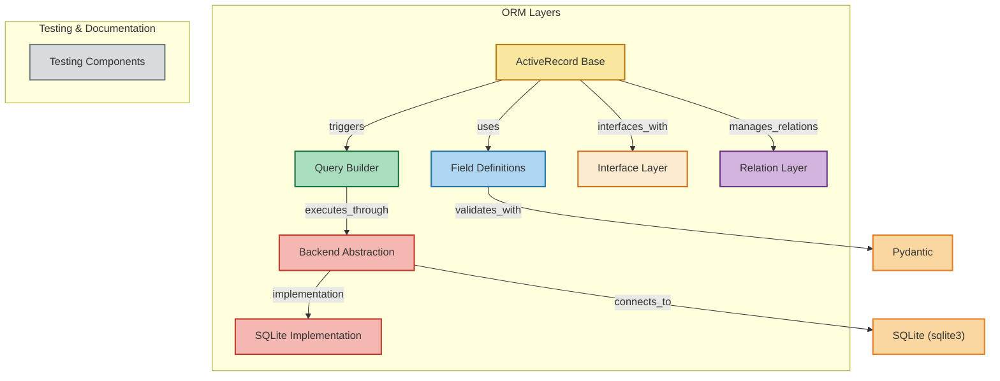

# rhosocial ActiveRecord

## Overview

rhosocial ActiveRecord is a robust object-relational mapping (ORM) library that provides an intuitive interface for database interactions in Python applications. Built on the ActiveRecord pattern popularized by Ruby on Rails, this library offers a clean, model-centric approach to database access that significantly reduces boilerplate code while maintaining flexibility and performance.

The library allows developers to represent database tables as Python classes and rows as objects, creating a natural mapping between object-oriented domain models and relational database structures. This approach emphasizes convention over configuration, making database operations more intuitive and less error-prone.

## Features

rhosocial ActiveRecord offers a comprehensive set of features designed to streamline database interactions:

- **Intuitive Model-Based API**: Define your database schema as Python classes with built-in validation
- **Comprehensive CRUD Operations**: Easily create, read, update, and delete records
- **Rich Query Interface**: Build complex queries with a fluent, chainable API
- **Relationship Management**: Define and work with various types of relationships (has-one, has-many, belongs-to)
- **Transaction Support**: Manage database transactions with proper isolation levels
- **Database Agnostic**: Support for multiple database backends (SQLite, MySQL, PostgreSQL, Oracle, SQL Server)
- **Type Safety**: Leverages Pydantic for robust type validation and conversion
- **Eager Loading**: Optimize performance by loading related objects efficiently
- **Event System**: Hook into model lifecycle events for custom behavior
- **Extensibility**: Easily extend with custom behaviors through mixins
- **Advanced Aggregation**: Powerful aggregation capabilities including window functions, CUBE, ROLLUP, and more
- **Asynchronous Support**: Dual synchronous and asynchronous APIs for flexible application design

## Structure



## Requirements

To use rhosocial ActiveRecord, you need:

- **Python**: Version 3.8 or higher
- **Pydantic**:
  - For Python 3.8: Pydantic 2.10 or higher
  - For Python 3.9+: Pydantic 2.11 or higher
  
  Note: These dependencies are automatically managed during installation based on your Python version.

- **Database-specific drivers**:
  - **SQLite**: Built into Python standard library
  - **PostgreSQL**: psycopg (other drivers currently not supported)
  - **MySQL**: mysql-connector-python (other drivers currently not supported)
  - **MariaDB**: mariadb (other drivers currently not supported)
  - **Oracle**: cx_Oracle or oracledb
  - **SQL Server**: pyodbc or pymssql

Additionally, for optimal development experience:

- **Type checking tools**: mypy, PyCharm, or VS Code with Python extension
- **Testing framework**: pytest

## Documentation

- [Introduction](docs/introduction.md)
- [Philosophy and Design Approach](docs/philosophy.md)
- [Feature Comparison](docs/features.md)
- [Pydantic Integration Advantages](docs/pydantic-integration.md)
- [Advanced Aggregation Capabilities](docs/aggregation.md)
- [Asynchronous Support](docs/async-support.md)
- [Code Comparison](docs/code-comparison.md)
- [Performance Benchmarks](docs/performance.md)
- [Learning Curve and Documentation](docs/learning-curve.md)
- [Community and Ecosystem](docs/community.md)
- [When to Choose Each ORM](docs/when-to-choose.md)
- [Relationship Management](docs/relationships.md)
- [Conclusion](docs/conclusion.md)

## Quick Start

```python
from rhosocial.activerecord import ActiveRecord
from typing import Optional
from datetime import datetime
from pydantic import EmailStr

class User(ActiveRecord):
    __table_name__ = 'users'
    
    id: Optional[int] = None
    name: str
    email: EmailStr
    is_active: bool = True
    created_at: datetime = None

# Create a user
user = User(name="John Doe", email="john@example.com")
user.save()

# Query users
active_users = User.query().where('is_active = ?', (True,)).all()
```

## Comparison with Other Python ORM Frameworks

Python offers several established ORM solutions, each with their own philosophy and design approach. Understanding these
differences can help you choose the right tool for your specific needs.

For a detailed analysis of how rhosocial ActiveRecord compares to these frameworks with specific code examples, performance
benchmarks, and use case recommendations, please see the [When to Choose Each ORM](docs/when-to-choose.md) guide.