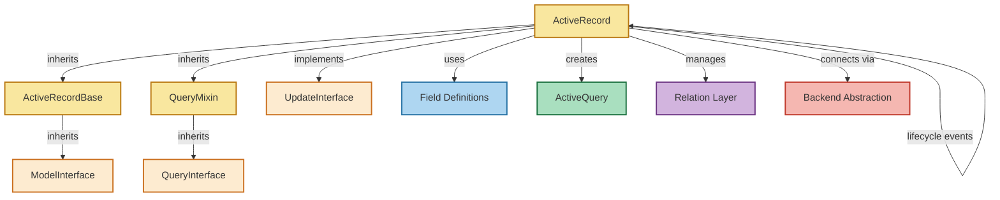
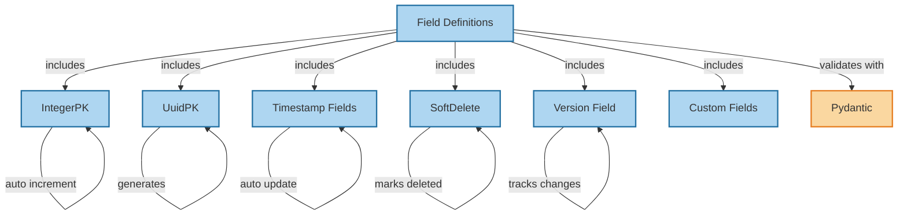
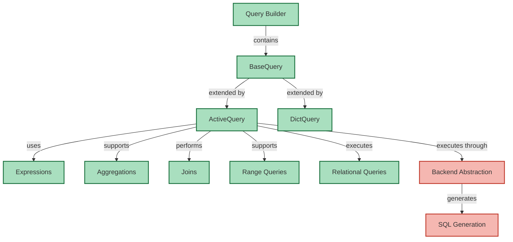
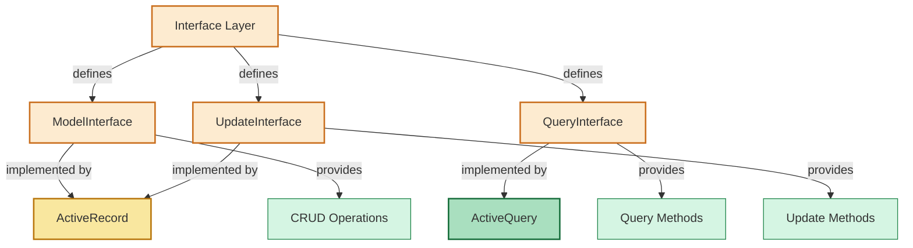
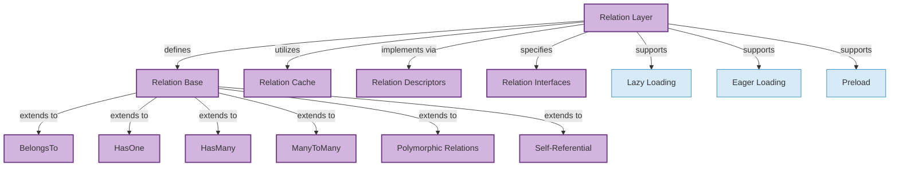

# Component Structure Diagrams

This document provides detailed structure diagrams for each core component of the rhosocial ActiveRecord framework. These diagrams illustrate the internal architecture, class relationships, and interactions within each component.

## ActiveRecord Base Structure

## Field Definitions Structure

## Query Builder Structure

## Interface Layer Structure

## Relation Layer Structure

These diagrams provide a visual representation of the internal structure and relationships within each core component of the rhosocial ActiveRecord framework. They illustrate how the different parts interact and work together to provide the complete ORM functionality.