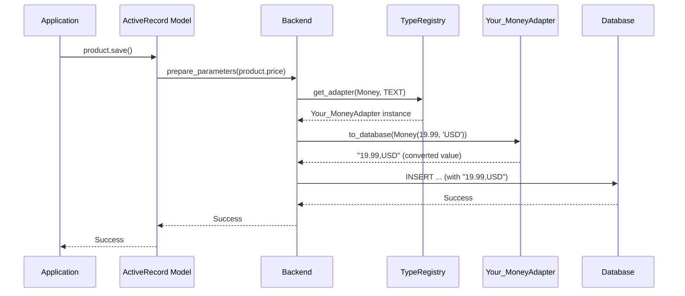
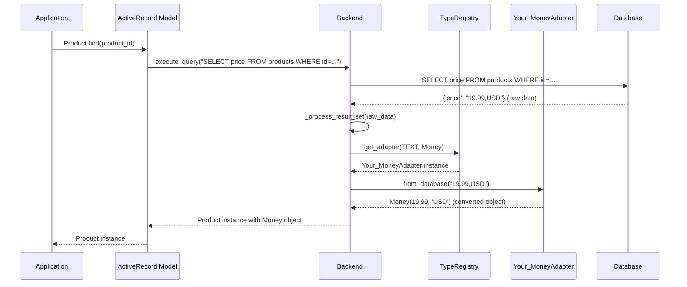

# Data Type Mapping

In `python-activerecord`, we have developed a sophisticated data type mapping system to ensure seamless data conversion between Python types and database-specific types. This system is built around the `SQLTypeAdapter` protocol, which provides a flexible and extensible way to handle type conversions for different database backends.

## SQLTypeAdapter Protocol

The `SQLTypeAdapter` protocol is at the core of our type mapping system. It defines a standard interface for converting data between Python and the database. Here is the definition of the protocol:

```python
class SQLTypeAdapter(Protocol):
    """
    Protocol for converting data to and from the database.
    """
    @property
    def supported_types(self) -> Dict[Type, List[Any]]:
        """
        Returns a dictionary of supported Python types and their corresponding database types.
        """
        ...

    def to_database(self, value: Any, target_type: Type, options: Optional[Dict[str, Any]] = None) -> Any:
        """
        Converts a value to its database representation.
        """
        ...

    def from_database(self, value: Any, target_type: Type, options: Optional[Dict[str, Any]] = None) -> Any:
        """
        Converts a value from its database representation to a Python object.
        """
        ...
```

- `supported_types`: This property returns a dictionary that maps Python types to a list of corresponding database types that the adapter can handle.
- `to_database`: This method is responsible for converting a Python object into a format that is understood by the database. The `target_type` parameter suggests the intended database type, and `options` can provide additional context for the conversion.
- `from_database`: This method handles the conversion from the database representation back to a Python object. The `target_type` parameter provides the target Python type for the conversion, allowing for more precise and context-aware data handling.

## Adapter Registry

The `TypeRegistry` is a central component that manages the type adapters. It allows for the registration of custom adapters and ensures that the correct adapter is used for each data type conversion.

You can register a new adapter using the `register` method of the `TypeRegistry`. This is particularly useful when you need to define custom type conversions for your application.

### Type Registry: Suggestive, Not Mandatory

It's crucial to understand that while `TypeRegistry` suggests adapters for common Python types, its role is **suggestive rather than mandatory**. The backend uses the registry to find suitable adapters, but you retain full control. You can always explicitly specify which `SQLTypeAdapter` to use for a particular field or scenario, overriding any default or suggested behavior.

For the SQLite backend, the following adapters are registered by default for handling common data types:

*   **`SQLiteBlobAdapter`**: Handles `bytes` to `bytes` (BLOB) conversion.
*   **`SQLiteJSONAdapter`**: Handles `dict` and `list` to `str` (JSON string) conversions. This adapter includes extended serialization for nested `datetime`, `uuid.UUID`, `Decimal`, and `set` objects within JSON.
*   **`SQLiteUUIDAdapter`**: Handles `uuid.UUID` to `str` or `bytes` conversions.

The default type adapter suggestions provided by the `SQLiteBackend` for top-level Python types are:

*   **`uuid.UUID`** to `str` (using `SQLiteUUIDAdapter`)
*   **`dict`** to `str` (using `SQLiteJSONAdapter`)
*   **`list`** to `str` (using `SQLiteJSONAdapter`)

This means that if you assign a `uuid.UUID` object to a model field, the SQLite backend will, by default, suggest converting it to a `str` for storage. However, you can always provide your own adapter if you need different behavior or more specialized conversion for any type.

## Data Flow

The data flow for type conversion can be summarized as follows:

1.  **From Application to Database**: When you save a model instance, `python-activerecord` iterates through the fields and uses the `to_database` method of the appropriate `SQLTypeAdapter` to convert the data into a database-friendly format. This is typically done via the `prepare_parameters` method of the backend.
2.  **From Database to Application**: When you query the database, the system retrieves the raw data and uses the `from_database` method of the corresponding adapter to convert it back into Python objects. This is handled within the `_process_result_set` method of the backend.

This system ensures that your data is always correctly typed and that you can work with Python objects without worrying about the underlying database specifics.

## Workflow Diagram

To better illustrate the process, here is a visual workflow of the type conversion system using sequence diagrams. For this example, we assume you have implemented a custom `MoneyAdapter` (similar to the example in the Model Testing guide) that handles a `Money` Python type and stores it as `TEXT` in the database.

### Write Path (Application to Database)



### Read Path (Database to Application)



## Customizing Type Mapping

If you need to customize the type mapping for a specific database, you can create your own implementation of the `SQLTypeAdapter` protocol and register it with the `TypeRegistry`. This allows you to override the default behavior and handle special data types that are not supported out of the box.

By understanding and leveraging the `SQLTypeAdapter` protocol and the `TypeRegistry`, you can achieve a high degree of control over how your data is handled, ensuring that your application remains robust and maintainable.
