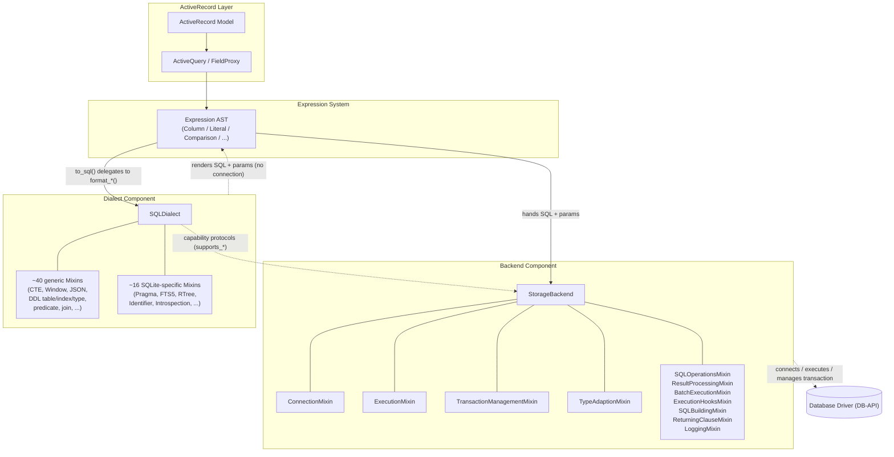
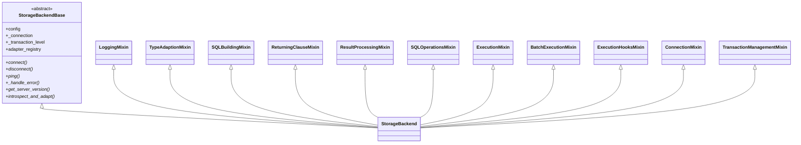
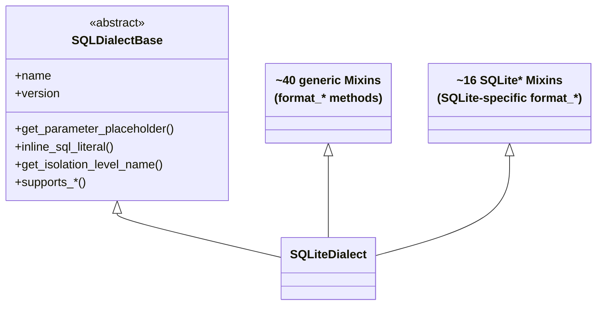
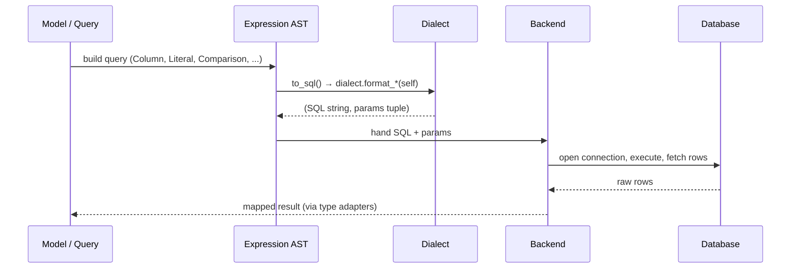

# Backend Architecture

The backend is the lowest layer of `rhosocial-activerecord`. It is the component that
actually talks to a database, and it is deliberately split into two independent parts:

- **`Backend`** — owns the connection, executes SQL, manages transactions and type
  adapters. It knows *how to run* SQL, but does **not** know *how to build* it.
- **`Dialect`** — owns the SQL grammar of a specific database, rendering expression
  objects into SQL strings and parameter tuples. It knows *how to build* SQL, but does
  **not** touch any connection.

The **Expression–Dialect** pair is the heart of the design: expressions only *describe*
structure and collect parameters; the dialect is the single place that turns that
description into concrete, database-specific SQL.

## The Two Halves of a Backend

## Responsibility Boundary

| Concern | `Backend` | `Dialect` | `Expression` |
|---------|-----------|-----------|--------------|
| Holds a connection / cursor | ✅ | ❌ | ❌ |
| Executes SQL, fetches rows | ✅ | ❌ | ❌ |
| Manages transactions (begin/commit/rollback/savepoint) | ✅ | ❌ | ❌ |
| Maps Python ↔ DBAPI types (adapters) | ✅ | ❌ | ❌ |
| Renders SQL + parameter placeholders | ❌ | ✅ | ❌ |
| Quotes identifiers, escapes literals | ❌ | ✅ | ❌ |
| Declares feature support (`supports_*`) | ✅ (backend protocols) | ✅ (dialect protocols) | ❌ |
| Describes query structure, collects parameters | ❌ | ❌ | ✅ |

The backends explicitly do **not** inherit the dialect, and the dialect does **not** hold
a backend reference. They cooperate only through the SQL string + parameter tuple that the
dialect produces and the backend consumes — which is why the same expression renders and
runs unchanged across every backend.

## Backend Composition (`StorageBackend`)

The synchronous backend is assembled purely by composing Mixins onto a minimal base:

`AsyncStorageBackend` mirrors this exactly, but swaps each Mixin for its async sibling
(e.g. `ExecutionMixin` → `AsyncExecutionMixin`), keeping full sync/async API parity.

## Dialect Composition (`SQLDialect`)

The dialect is the mirror image — assembled from a far larger set of formatting Mixins:

- **Generic Mixins** cover SQL-standard semantics once (CTE, window functions, JSON,
  locking, upsert, DDL for table/index/view/type/sequence, predicates, joins, set
  operations, grouping, ...). Every backend gets them for free.
- **Backend-specific Mixins** add capabilities that only that database understands, and are
  always prefixed with the backend name (`SQLitePragmaMixin`, `SQLiteFTS5Mixin`, ...), so
  different backends never collide.

## Data Flow: From Expression to Result

Two rules make this safe and predictable:

1. **Expressions never concatenate SQL strings.** They only describe structure and collect
   parameters; every value goes through a parameter placeholder (`?`), following DB-API 2.0
   (PEP 249) separation of SQL and parameters.
2. **The dialect is the single rendering exit.** Any expression can call `to_sql()` to
   inspect the exact SQL it would produce, because all rendering funnels through the
   dialect's `format_*` methods.

## Capability Negotiation

Neither backends nor dialects declare capability through inheritance depth. Instead, both
layers expose fine-grained protocols:

- `backend/protocols.py` — backend-level declarations (`ConcurrencyAware`, ...)
- `dialect/protocols.py` — dialect-level declarations (`WindowFunctionSupport`,
  `JSONSupport`, `DDLTypeSupport`, ...)

These are runtime-checkable (`runtime_checkable`), and the `supports_*` methods gate
behavior on the *actually connected* server version. Backends re-adapt their dialect via
`introspect_and_adapt()` after connecting, so capability is "negotiated with the server"
rather than statically declared.

## See Also

- **[Custom Backend](custom_backend.md)** — how to assemble your own backend from these
  same Mixins and protocols
- **[Expression System](expression/README.md)** — how the expression side works
- **[Architecture](../introduction/architecture.md)** — the higher-level ActiveRecord /
  query architecture that sits above the backend