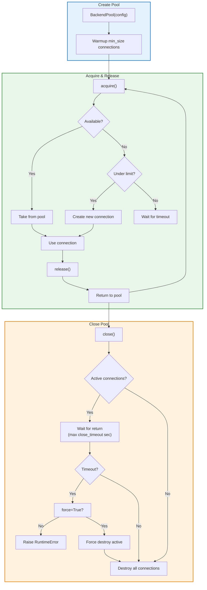
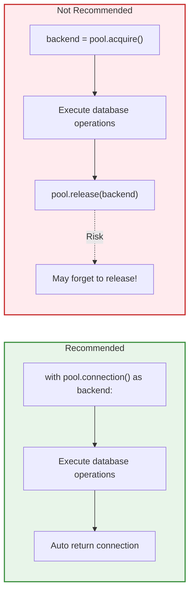
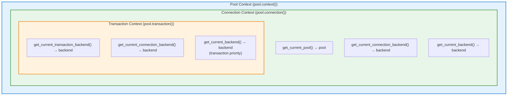

# Connection Pool

The connection pool module provides efficient management of database connections, enabling connection reuse, lifecycle management, and context-aware access patterns.

## Overview

Connection pooling improves application performance by:

- **Reusing connections**: Avoids the overhead of creating new connections for each operation
- **Managing lifecycle**: Automatic cleanup of idle or expired connections
- **Limiting resources**: Prevents database overload with connection limits
- **Context awareness**: Enables classes to sense current connection/transaction context

## Connection Pool Workflow

### Connection Lifecycle



### Recommended Usage: Context Managers



## Quick Start

### Sync and Async Parity

**IMPORTANT**: The connection pool module provides complete API parity between synchronous and asynchronous implementations. Both use identical method names, parameters, and behavior - the only difference is the `async`/`await` keywords.

| Operation | Synchronous | Asynchronous |
|-----------|-------------|--------------|
| Create pool (recommended) | `BackendPool.create(config)` | `await AsyncBackendPool.create(config)` |
| Create pool (lazy init) | `BackendPool(config)` | `AsyncBackendPool(config)` |
| Acquire connection | `pool.acquire()` | `await pool.acquire()` |
| Release connection | `pool.release(backend)` | `await pool.release(backend)` |
| Connection context | `with pool.connection() as backend:` | `async with pool.connection() as backend:` |
| Transaction context | `with pool.transaction() as backend:` | `async with pool.transaction() as backend:` |
| Pool context | `with pool.context() as ctx:` | `async with pool.context() as ctx:` |
| Close pool | `pool.close()` | `await pool.close()` |
| Health check | `pool.health_check()` | `await pool.health_check()` |
| Manual idle cleanup | `pool.cleanup_idle_connections()` | `await pool.cleanup_idle_connections()` |
| Enable/disable idle cleanup | `pool.idle_cleanup_enabled = True/False` | `await pool.set_idle_cleanup_enabled(True/False)` |

### Synchronous Usage

```python
from rhosocial.activerecord.connection.pool import PoolConfig, BackendPool
from rhosocial.activerecord.backend.impl.sqlite import SQLiteBackend

# Create connection pool
config = PoolConfig(
    min_size=2,      # Minimum connections to maintain
    max_size=10,     # Maximum connections allowed
    backend_factory=lambda: SQLiteBackend(database="app.db")
)

# Recommended: Create with factory method (immediate warmup)
pool = BackendPool.create(config)

# Alternative: Direct construction (lazy initialization)
# pool = BackendPool(config)

# Method 1: Manual acquire/release
backend = pool.acquire()
try:
    result = backend.execute("SELECT * FROM users WHERE id = ?", [1])
finally:
    pool.release(backend)

# Method 2: Connection context manager
with pool.connection() as backend:
    result = backend.execute("SELECT * FROM users WHERE id = ?", [1])
    # Connection automatically released

# Method 3: Transaction context manager
with pool.transaction() as backend:
    backend.execute("INSERT INTO users (name) VALUES (?)", ("Alice",))
    backend.execute("INSERT INTO orders (user_id) VALUES (?)", (1,))
    # Auto commit on success, rollback on exception

# Close pool when done
pool.close()
```

### Asynchronous Usage

```python
from rhosocial.activerecord.connection.pool import PoolConfig, AsyncBackendPool
from rhosocial.activerecord.backend.impl.sqlite.backend.async_backend import AsyncSQLiteBackend

# Create connection pool (same config structure)
config = PoolConfig(
    min_size=2,      # Minimum connections to maintain
    max_size=10,     # Maximum connections allowed
    backend_factory=lambda: AsyncSQLiteBackend(database="app.db")
)

# Recommended: Create with warmup (mirrors sync BackendPool behavior)
pool = await AsyncBackendPool.create(config)

# Alternative: Create without warmup (lazy initialization)
# pool = AsyncBackendPool(config)
# Connections are created on first acquire

# Method 1: Manual acquire/release (just add await)
backend = await pool.acquire()
try:
    result = await backend.execute("SELECT * FROM users WHERE id = ?", [1])
finally:
    await pool.release(backend)

# Method 2: Connection context manager (just add async/await)
async with pool.connection() as backend:
    result = await backend.execute("SELECT * FROM users WHERE id = ?", [1])
    # Connection automatically released

# Method 3: Transaction context manager (just add async/await)
async with pool.transaction() as backend:
    await backend.execute("INSERT INTO users (name) VALUES (?)", ("Alice",))
    await backend.execute("INSERT INTO orders (user_id) VALUES (?)", (1,))
    # Auto commit on success, rollback on exception

# Close pool (just add await)
await pool.close()
```

## Configuration

### PoolConfig Options

```python
from rhosocial.activerecord.connection.pool import PoolConfig

config = PoolConfig(
    # Connection limits
    min_size=1,              # Minimum connections (default: 1)
    max_size=10,             # Maximum connections (default: 10)

    # Timeout settings
    timeout=30.0,            # Acquire timeout in seconds (default: 30.0)
    idle_timeout=300.0,      # Idle connection timeout (default: 300.0)
    max_lifetime=3600.0,     # Maximum connection lifetime (default: 3600.0)
    close_timeout=5.0,       # Graceful close wait time (default: 5.0)

    # Validation settings
    validate_on_borrow=True, # Validate when acquiring (default: True)
    validate_on_return=False,# Validate when releasing (default: False)
    validation_query="SELECT 1",  # Query for validation (default: "SELECT 1")

    # Idle connection cleanup settings
    idle_cleanup_enabled=True,   # Enable background idle cleanup (default: True)
    idle_cleanup_interval=60.0,  # Cleanup scan interval in seconds (default: 60.0)

    # Backend creation
    backend_factory=None,    # Factory function to create backends
    backend_config=None,     # Or config dict for built-in backends
)
```

### Backend Configuration

You can configure backends in two ways:

**1. Using backend_factory (recommended for custom backends):**

```python
def create_backend():
    return SQLiteBackend(
        database="app.db",
        timeout=10.0
    )

config = PoolConfig(
    min_size=2,
    max_size=10,
    backend_factory=create_backend
)
```

**2. Using backend_config (for built-in SQLite):**

```python
config = PoolConfig(
    min_size=2,
    max_size=10,
    backend_config={
        'type': 'sqlite',
        'database': 'app.db'
    }
)
```

## Context Awareness

Context awareness is a powerful feature that allows classes inside a context to sense the current pool, connection, and transaction.

### Understanding Context Layers



### Context Functions

**Synchronous Context Functions:**

```python
from rhosocial.activerecord.connection.pool import (
    get_current_pool,
    get_current_transaction_backend,
    get_current_connection_backend,
    get_current_backend,
)
```

| Function | Description |
|----------|-------------|
| `get_current_pool()` | Get current synchronous pool |
| `get_current_transaction_backend()` | Get current synchronous transaction backend |
| `get_current_connection_backend()` | Get current synchronous connection backend |
| `get_current_backend()` | Get current synchronous backend (transaction first, then connection) |

**Asynchronous Context Functions:**

```python
from rhosocial.activerecord.connection.pool import (
    get_current_async_pool,
    get_current_async_transaction_backend,
    get_current_async_connection_backend,
    get_current_async_backend,
)
```

| Function | Description |
|----------|-------------|
| `get_current_async_pool()` | Get current asynchronous pool |
| `get_current_async_transaction_backend()` | Get current async transaction backend |
| `get_current_async_connection_backend()` | Get current async connection backend |
| `get_current_async_backend()` | Get current async backend (transaction first, then connection) |

### Pool Context

The pool context sets the pool in context, allowing ActiveRecord integration:

```python
with pool.context() as ctx:
    # Inside context, ActiveRecord can sense the pool
    # This enables ActiveRecord to use the pool's connections
    users = User.query().all()
```

### Connection Context

The connection context provides a connection that classes can sense:

```python
with pool.context():
    # No connection yet
    assert get_current_connection_backend() is None

    with pool.connection() as backend:
        # Classes inside can sense the connection
        current = get_current_connection_backend()
        assert current is backend

        # Service classes can use the connection
        process_user_data(backend)

    # Connection released
    assert get_current_connection_backend() is None
```

### Transaction Context

The transaction context sets both transaction and connection:

```python
with pool.context():
    with pool.transaction() as backend:
        # Both transaction and connection are set
        tx = get_current_transaction_backend()
        conn = get_current_connection_backend()
        assert tx is backend
        assert conn is backend

        # Execute operations
        backend.execute("INSERT INTO users (name) VALUES (?)", ("Alice",))
        backend.execute("INSERT INTO orders (user_id) VALUES (?)", (1,))
        # Auto commit on success
```

### Nested Contexts

Nested contexts automatically reuse the existing connection/transaction:

```python
with pool.connection() as outer_conn:
    # outer_conn is active

    with pool.connection() as inner_conn:
        # inner_conn is the same as outer_conn (reused)
        assert inner_conn is outer_conn

    # Still in outer connection context
    assert get_current_connection_backend() is outer_conn
```

This prevents connection leaks and ensures transaction consistency.

### Real-World Example: Service Layer

```python
from rhosocial.activerecord.connection.pool import (
    BackendPool, PoolConfig,
    get_current_connection_backend,
    get_current_transaction_backend,
)

class UserService:
    """Service that uses context-aware database operations."""

    def create_user_with_profile(self, name: str, bio: str):
        """Create user and profile in a single transaction."""
        # Uses existing transaction if in context, otherwise starts new one
        backend = get_current_transaction_backend()
        if backend is None:
            # Not in transaction context - this shouldn't happen
            # if called correctly
            raise RuntimeError("Must be called within transaction context")

        # Create user
        backend.execute(
            "INSERT INTO users (name) VALUES (?)",
            [name]
        )
        user_id = backend.last_insert_rowid()

        # Create profile
        backend.execute(
            "INSERT INTO profiles (user_id, bio) VALUES (?, ?)",
            [user_id, bio]
        )

        return user_id

# Usage
pool = BackendPool(config)

def setup_user(name: str, bio: str):
    with pool.context():
        with pool.transaction():
            service = UserService()
            user_id = service.create_user_with_profile(name, bio)
            # Auto commit
    return user_id
```

### ActiveRecord Integration

**Key Feature**: ActiveRecord models automatically sense the connection pool context. When inside a `pool.connection()` or `pool.transaction()` context, the model's `backend()` method returns the context-provided connection instead of the class-level backend.

#### How It Works

```python
from rhosocial.activerecord.model import ActiveRecord
from rhosocial.activerecord.field import IntegerPKMixin

class User(IntegerPKMixin, ActiveRecord):
    __table_name__ = "users"
    id: Optional[int] = None
    name: str
    email: str
```

**Priority Order for `backend()` method:**

1. **Context backend** (if in `pool.connection()` or `pool.transaction()`)
2. **Class-level backend** (`__backend__` configured via `Model.configure()`)

#### Sync Example

```python
# Configure model with a backend (fallback)
User.configure(SQLiteConnectionConfig(database="app.db"), SQLiteBackend)

# Without context - uses class backend
backend1 = User.backend()  # Returns __backend__

# With pool context - uses pool connection
config = PoolConfig(
    min_size=1,
    max_size=5,
    backend_factory=lambda: SQLiteBackend(database="app.db")
)
pool = BackendPool(config)

with pool.context():
    with pool.connection() as conn:
        backend2 = User.backend()  # Returns conn (not __backend__)
        assert backend2 is conn

        # Queries automatically use the connection
        users = User.query().where(User.c.name == "Alice").all()

    with pool.transaction() as tx:
        backend3 = User.backend()  # Returns tx
        assert backend3 is tx

        # All operations in the same transaction
        User(name="Bob", email="bob@example.com").save()
        User(name="Carol", email="carol@example.com").save()
        # Auto commit on success, rollback on error
```

#### Async Example

```python
from rhosocial.activerecord.model import AsyncActiveRecord

class AsyncUser(IntegerPKMixin, AsyncActiveRecord):
    __table_name__ = "users"
    id: Optional[int] = None
    name: str
    email: str

# Configure async model
await AsyncUser.configure(SQLiteConnectionConfig(database="app.db"), AsyncSQLiteBackend)

# With async pool context
async_pool = AsyncBackendPool(config)

async with async_pool.context():
    async with async_pool.transaction() as tx:
        backend = AsyncUser.backend()  # Returns tx
        assert backend is tx

        # All operations in the same transaction
        await AsyncUser(name="Dave", email="dave@example.com").save()
        # Auto commit
```

#### Query Classes

All query classes also support context awareness:

- **ActiveQuery**: `Model.query().backend()` returns context backend
- **CTEQuery**: `CTEQuery(backend).backend()` returns context backend if available
- **SetOperationQuery**: Union/Intersect/Except queries use context backend

```python
with pool.transaction() as tx:
    # ActiveQuery
    query = User.query()
    assert query.backend() is tx

    # CTEQuery
    from rhosocial.activerecord.query import CTEQuery
    cte = CTEQuery(some_backend)  # Constructor backend
    assert cte.backend() is tx    # But returns context backend

    # SetOperationQuery
    q1 = User.query()
    q2 = User.query()
    union_query = q1.union(q2)
    assert union_query.backend() is tx
```

#### Sync/Async Isolation

**Important**: Synchronous and asynchronous contexts are strictly isolated:

- Sync classes (`ActiveRecord`, `ActiveQuery`) only check `get_current_backend()`
- Async classes (`AsyncActiveRecord`, `AsyncActiveQuery`) only check `get_current_async_backend()`

```python
# Sync model in async context - returns class backend
with async_pool.connection() as conn:
    sync_backend = User.backend()  # Returns __backend__, NOT conn
    async_backend = AsyncUser.backend()  # Returns conn

# Async model in sync context - returns class backend
with sync_pool.connection() as conn:
    sync_backend = User.backend()  # Returns conn
    async_backend = AsyncUser.backend()  # Returns __backend__, NOT conn
```

## Statistics and Monitoring

### Pool Statistics

```python
stats = pool.get_stats()

print(f"Total created: {stats.total_created}")
print(f"Total acquired: {stats.total_acquired}")
print(f"Total released: {stats.total_released}")
print(f"Total idle cleaned: {stats.total_idle_cleaned}")  # New
print(f"Current available: {stats.current_available}")
print(f"Current in use: {stats.current_in_use}")
print(f"Utilization rate: {stats.utilization_rate:.2%}")
print(f"Uptime: {stats.uptime:.1f} seconds")
```

### Health Check

```python
health = pool.health_check()
# Returns:
# {
#     'healthy': True,
#     'closed': False,
#     'utilization': 0.4,
#     'stats': {
#         'available': 3,
#         'in_use': 2,
#         'total': 5,
#         'errors': 0
#     }
# }
```

## Idle Connection Cleanup

The connection pool supports automatic cleanup of idle connections that exceed the timeout, optimizing resource usage.

### How It Works

When a connection has been idle longer than `idle_timeout` (default 300 seconds), the background cleanup thread automatically destroys it, while always maintaining at least `min_size` connections.

```text
Connection count changes:
min_size --(warmup)--> min_size --(on-demand)--> max_size
                         ↑                          ↓
                         │                   (auto cleanup after idle timeout)
                         │
                    (maintain min_size connections)
```

### Configuration Example

```python
config = PoolConfig(
    min_size=1,
    max_size=10,
    idle_timeout=300.0,        # Can be cleaned after 5 minutes idle
    idle_cleanup_enabled=True, # Enable auto cleanup (default)
    idle_cleanup_interval=60.0,# Scan every minute (default)
    backend_factory=lambda: SQLiteBackend(database="app.db")
)
pool = BackendPool(config)
```

### Runtime Control

You can enable or disable automatic cleanup at runtime:

```python
# Disable automatic cleanup
pool.idle_cleanup_enabled = False

# Re-enable
pool.idle_cleanup_enabled = True

# Async version (recommended for async pools)
await pool.set_idle_cleanup_enabled(False)
```

### Manual Cleanup Trigger

You can manually trigger idle connection cleanup:

```python
# Synchronous
cleaned = pool.cleanup_idle_connections()
print(f"Cleaned {cleaned} idle connections")

# Asynchronous
cleaned = await pool.cleanup_idle_connections()
```

### Monitoring Cleanup Statistics

```python
stats = pool.get_stats()
print(f"Total idle connections cleaned: {stats.total_idle_cleaned}")

# Or via dictionary
stats_dict = stats.to_dict()
print(f"Total idle connections cleaned: {stats_dict['total_idle_cleaned']}")
```

### Use Cases

**Case 1: Applications with fluctuating traffic**

```python
# Peak hours: connections may reach max_size
# Off-peak: automatically reclaim idle connections
config = PoolConfig(
    min_size=2,           # Keep 2 resident connections
    max_size=20,          # Up to 20 at peak
    idle_timeout=60.0,    # Can be cleaned after 1 minute idle
    backend_factory=lambda: SQLiteBackend(database="app.db")
)
```

**Case 2: Scheduled task scenarios**

```python
# Use connections during task execution
# Idle connections are cleaned after task completes
with pool.connection() as backend:
    backend.execute("SELECT * FROM orders WHERE status = 'pending'")
    # Execute task...

# Connection returned, will be cleaned after idle timeout
```

**Case 3: When fine-grained control is needed**

```python
# Disable automatic cleanup, manual control
config = PoolConfig(
    min_size=1,
    max_size=10,
    idle_timeout=60.0,
    idle_cleanup_enabled=False,  # Disable auto cleanup
    backend_factory=lambda: SQLiteBackend(database="app.db")
)
pool = BackendPool(config)

# Manually cleanup at specific times
def on_batch_complete():
    cleaned = pool.cleanup_idle_connections()
    logger.info(f"Batch complete, cleaned {cleaned} idle connections")
```

## Best Practices

### 1. Resource Management Responsibility

**Core Principle: Who creates, who manages.**

```python
# ✓ Good: Close the backend you configured yourself
User.configure(SQLiteConnectionConfig(database="app.db"), SQLiteBackend)
# ... use it ...
User.__backend__.disconnect()  # Close on application shutdown

# ✓ Good: Let the pool manage connections from the pool
with pool.connection() as backend:
    # Do NOT call backend.disconnect()!
    # Connection is automatically returned to pool on context exit
    result = backend.execute("SELECT * FROM users")

# ✗ Bad: Manually closing a connection obtained from the pool
with pool.connection() as backend:
    result = backend.execute("SELECT * FROM users")
    backend.disconnect()  # Wrong! This corrupts pool state
```

**Important Notes**:

| Backend Source | Management Responsibility | How to Close |
| -------------- | ------------------------- | ------------ |
| `Model.configure()` | Application | Call `backend.disconnect()` |
| `pool.connection()` | Pool | Auto-return on context exit |
| `pool.transaction()` | Pool | Auto-return after commit/rollback |
| `pool.acquire()` | Application | Must call `pool.release()` |

### 2. Pool Lifecycle

```python
# Good: Create pool at application startup
pool = BackendPool(config)

try:
    # Application runs
    run_application(pool)
finally:
    # Clean shutdown
    pool.close()
```

### 3. Context Management

```python
# Good: Use context managers
with pool.connection() as backend:
    result = backend.execute("SELECT * FROM users")

# Bad: Manual acquire without proper cleanup
backend = pool.acquire()
result = backend.execute("SELECT * FROM users")
# Forgot to release - connection leak!
```

### 4. Transaction Scoping

```python
# Good: Minimal transaction scope
with pool.transaction() as backend:
    # Only database operations
    backend.execute("INSERT INTO users (name) VALUES (?)", ("Alice",))

# Bad: Long-running operations in transaction
with pool.transaction() as backend:
    backend.execute("INSERT INTO orders (...) VALUES (...)")
    # External API call in transaction - bad!
    external_api.create_invoice()  # Could timeout the transaction
```

### 5. Connection Pool Sizing

```python
# For web applications: pool_size ≈ (cpu_cores * 2) + disk_spindles
# For background workers: smaller pool, longer connections

# Development
config = PoolConfig(min_size=1, max_size=5, ...)

# Production (web)
config = PoolConfig(min_size=5, max_size=20, ...)

# Production (background worker)
config = PoolConfig(min_size=2, max_size=10, ...)
```

## Error Handling

### Timeout Errors

```python
from rhosocial.activerecord.connection.pool import BackendPool, PoolConfig

config = PoolConfig(
    max_size=2,
    timeout=5.0,  # 5 second timeout
    backend_factory=lambda: SQLiteBackend(database="app.db")
)
pool = BackendPool(config)

try:
    backend = pool.acquire(timeout=1.0)  # Override timeout
except TimeoutError as e:
    print(f"Could not acquire connection: {e}")
    stats = pool.get_stats()
    print(f"Pool status: {stats.current_in_use}/{stats.current_total} in use")
```

### Validation Failures

```python
config = PoolConfig(
    validate_on_borrow=True,
    validation_query="SELECT 1",
    backend_factory=lambda: SQLiteBackend(database="app.db")
)
pool = BackendPool(config)

stats = pool.get_stats()
if stats.total_validation_failures > 0:
    print(f"Warning: {stats.total_validation_failures} validation failures")
```

## Thread Safety

### Synchronous Pool

The synchronous `BackendPool` is thread-safe using `threading.RLock` and `threading.Condition`. Multiple threads can safely acquire and release connections concurrently.

```python
import threading

pool = BackendPool(config)

def worker(worker_id):
    with pool.connection() as backend:
        result = backend.execute("SELECT * FROM users WHERE id = ?", [worker_id])
        print(f"Worker {worker_id}: {result}")

threads = [threading.Thread(target=worker, args=(i,)) for i in range(10)]
for t in threads:
    t.start()
for t in threads:
    t.join()
```

### Async Pool

The `AsyncBackendPool` uses `asyncio.Lock` and `asyncio.Semaphore` for concurrency control. It's designed for use in async contexts.

```python
import asyncio

pool = AsyncBackendPool(config)

async def worker(worker_id):
    async with pool.connection() as backend:
        result = await backend.execute("SELECT * FROM users WHERE id = ?", [worker_id])
        print(f"Worker {worker_id}: {result}")

async def main():
    tasks = [worker(i) for i in range(10)]
    await asyncio.gather(*tasks)

asyncio.run(main())
```
