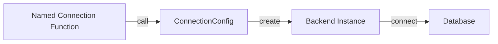
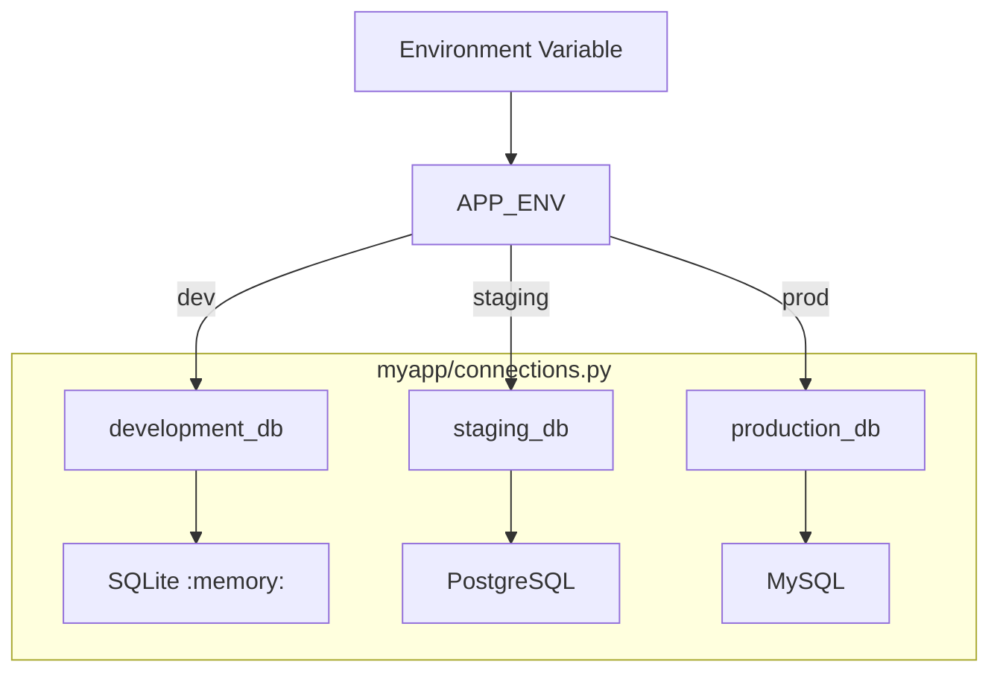
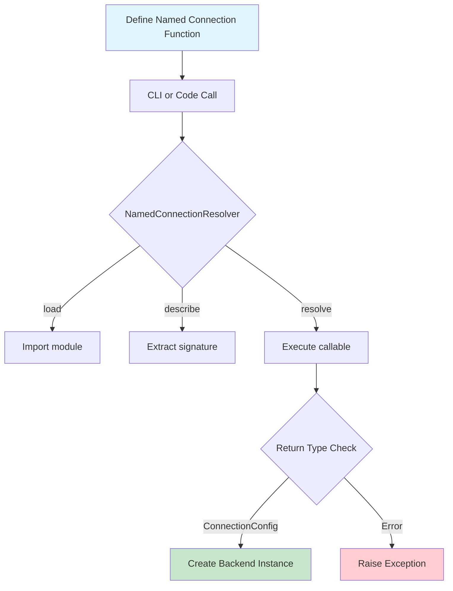
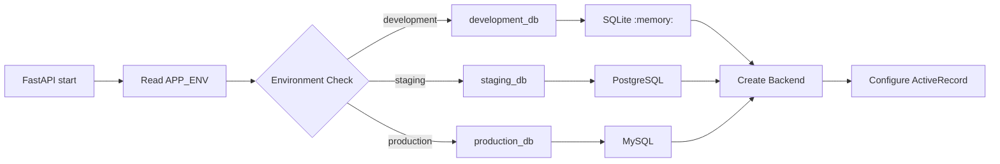

# Named Connection

> **Target Audience**: Application developers, focusing on "why use" and "how to use".
> **Prerequisite**: Read [Database Configuration](./getting_started/configuration.md) for basic configuration.

---

## Table of Contents

1. [Why Named Connection?](#1-why-named-connection)
2. [Core Concepts](#2-core-concepts)
3. [Quick Start](#3-quick-start)
4. [CLI Usage](#4-cli-usage)
5. [Code Usage](#5-code-usage)
6. [Environment Switching Best Practices](#6-environment-switching-best-practices)
7. [Complete Examples](#7-complete-examples)
8. [Mermaid Diagrams](#8-mermaid-diagrams)
9. [API Reference](#9-api-reference)

---

## 1. Why Named Connection?

### Pain Points of Traditional Approach

Before named connections, database configuration was scattered across the application:

```python
# ❌ Before: direct config in application code
def get_user(user_id):
    conn = pymysql.connect(
        host=os.getenv("DB_HOST", "localhost"),
        user=os.getenv("DB_USER", "root"),
        password=os.getenv("DB_PASSWORD"),
        database=os.getenv("DB_NAME"),
    )
```

**Problems with this approach:**

| Issue | Explanation |
|-------|-------------|
| **Scattered Config** | Hard-coded, .env files, k8s configmaps - hard to manage centrally |
| **No Version Control** | Hard to audit config changes |
| **No IDE Support** | No go-to-definition, no type hints |
| **Hard to Test** | Can't dry-run to see final config |
| **Environment Switch Difficult** | dev/staging/prod configs are very different |

### How Named Connection Solves This

Named connection encapsulates **database configuration as pure Python functions**, giving you complete development experience:

```python
# ✅ After: myapp/connections.py
def production_db():
    """Production database configuration"""
    return MySQLConnectionConfig(
        host="prod.example.com",
        database="myapp",
        user="app_user",
        password=os.getenv("DB_PASSWORD"),  # Sensitive info from env vars
    )

def development_db():
    """Development database configuration"""
    return MySQLConnectionConfig(
        host="localhost",
        database="myapp_dev",
        user="root",
    )
```

---

## 2. Core Concepts

### 2.1 What is a Named Connection?

A **named connection** is a callable (function or class instance) that:

1. **Is callable**: Function or class instance with `__call__`
2. **Returns config**: Must return a `ConnectionConfig` subclass
3. **Optional params**: Can accept optional named parameters

### 2.2 How It Works



### 2.3 Supported Connection Types

| Backend | Config Class | Notes |
|--------|---------------|-------|
| SQLite | `SQLiteConnectionConfig` | File-based / In-memory |
| MySQL | `MySQLConnectionConfig` | Requires mysql-connector-python |
| PostgreSQL | `PostgresConnectionConfig` | Requires psycopg |

---

## 3. Quick Start

### Step 1: Define Named Connection

```python
# myapp/connections.py
from rhosocial.activerecord.backend.impl.sqlite.config import SQLiteConnectionConfig
from rhosocial.activerecord.backend.impl.mysql.config import MySQLConnectionConfig
from rhosocial.activerecord.backend.impl.postgres.config import PostgresConnectionConfig


def development_db():
    """Development SQLite config (in-memory)"""
    return SQLiteConnectionConfig(
        database=":memory:",
    )


def production_db(pool_size: int = 10):
    """Production MySQL config
    
    Args:
        pool_size: Connection pool size
    """
    return MySQLConnectionConfig(
        host=os.getenv("MYSQL_HOST", "localhost"),
        port=int(os.getenv("MYSQL_PORT", "3306")),
        database=os.getenv("MYSQL_DATABASE"),
        user=os.getenv("MYSQL_USER"),
        password=os.getenv("MYSQL_PASSWORD"),
        pool_size=pool_size,
    )
```

### Step 2: CLI View Config

```bash
# List all named connections in a module
python -m rhosocial.activerecord.backend.impl.sqlite named-connection \
    --named-connection myapp.connections --list

# Show specific connection config
python -m rhosocial.activerecord.backend.impl.mysql named-connection \
    --named-connection myapp.connections.production_db --show

# Dry-run resolve connection config
python -m rhosocial.activerecord.backend.impl.mysql named-connection \
    --named-connection myapp.connections.production_db \
    --describe --conn-param pool_size=20
```

### Step 3: Use in Code

```python
from rhosocial.activerecord.backend.named_connection import resolve_named_connection
from rhosocial.activerecord.model import ActiveRecord

# Resolve named connection and configure backend
config = resolve_named_connection("myapp.connections.production_db")

# Option 1: Direct configure
ActiveRecord.configure(config, MySQLBackend)

# Option 2: Manual backend creation
backend = MySQLBackend(connection_config=config)
```

---

## 4. CLI Usage

### 4.1 List All Connections

```bash
# SQLite
python -m rhosocial.activerecord.backend.impl.sqlite named-connection \
    --named-connection myapp.connections --list

# MySQL
python -m rhosocial.activerecord.backend.impl.mysql named-connection \
    --named-connection myapp.connections --list

# PostgreSQL
python -m rhosocial.activerecord.backend.impl.postgres named-connection \
    --named-connection myapp.connections --list
```

**Output example:**

```
Module: myapp.connections
Name                           Parameters                               Brief                         
----------------------------------------------------------------------------------------------------
development_db               ()                                       Development SQLite config...
production_db                (pool_size: int = 10)                      Production MySQL config
staging_db                   (pool_size: int = 5)                      Staging config
```

### 4.2 Show Connection Details

```bash
# Show config info (sensitive fields filtered)
python -m rhosocial.activerecord.backend.impl.mysql named-connection \
    --named-connection myapp.connections.production_db --show
```

**Output:**

```
Connection: myapp.connections.production_db
Type: Function
Docstring: Production MySQL config
Signature: (pool_size: int = 10)
Parameters:
  pool_size default=10
Config Preview (non-sensitive fields):
  host: prod.example.com
  database: myapp
  pool_size: 10
  ...
```

### 4.3 Dry-run Resolve

```bash
# Resolve config and display final parameters (no actual connection)
python -m rhosocial.activerecord.backend.impl.mysql named-connection \
    --named-connection myapp.connections.production_db \
    --describe --conn-param pool_size=20
```

**Output:**

```
Resolved Configuration:
  host: prod.example.com
  port: 3306
  database: myapp
  pool_size: 20
  ...
```

### CLI Parameter Quick Reference

| Parameter | Description |
|-----------|-------------|
| `--named-connection QUALIFIED_NAME` | Fully qualified name of named connection |
| `--list` | List all connections in module |
| `--show QUALIFIED_NAME` | Show connection details |
| `--describe QUALIFIED_NAME` | Dry-run resolve config |
| `--conn-param KEY=VALUE` | Override connection parameters |

---

## 5. Code Usage

### 5.1 Basic Usage

```python
from rhosocial.activerecord.backend.named_connection import resolve_named_connection

# Option 1: One-step resolve
config = resolve_named_connection(
    "myapp.connections.production_db",
    user_params={"pool_size": 20}
)
```

### 5.2 Step-by-step Control

```python
from rhosocial.activerecord.backend.named_connection import NamedConnectionResolver

# 1. Create resolver
resolver = NamedConnectionResolver("myapp.connections.production_db")

# 2. Load callable
resolver.load()

# 3. Describe (don't actually call)
info = resolver.describe()
print(f"Parameters: {info['parameters']}")
print(f"Signature: {info['signature']}")

# 4. Resolve and get config (optional param override)
config = resolver.resolve(user_params={"pool_size": 20})
```

### 5.3 Combine with ActiveRecord

```python
from rhosocial.activerecord.model import ActiveRecord
from rhosocial.activerecord.backend.impl.mysql import MySQLBackend
from rhosocial.activerecord.backend.named_connection import resolve_named_connection

# Environment detection
env = os.getenv("APP_ENV", "development")

# Choose connection based on environment
connection_name = f"myapp.connections.{env}_db"
config = resolve_named_connection(connection_name)

# Configure ActiveRecord
ActiveRecord.configure(config, MySQLBackend)
```

---

## 6. Environment Switching Best Practices

### 6.1 Config File Structure



### 6.2 Complete Example

```python
# myapp/connections.py
"""
Database connection module

Auto-selects connection config based on APP_ENV:
- development: In-memory SQLite (fastest startup)
- staging: PostgreSQL (test environment)
- production: MySQL (production environment)
"""
import os
from functools import partial

from rhosocial.activerecord.backend.impl.sqlite.config import SQLiteConnectionConfig
from rhosocial.activerecord.backend.impl.mysql.config import MySQLConnectionConfig
from rhosocial.activerecord.backend.impl.postgres.config import PostgresConnectionConfig


def _make_sqlite_memory():
    """Development: in-memory SQLite"""
    return SQLiteConnectionConfig(
        database=":memory:",
        pragmas={"foreign_keys": "ON"},
    )


def _make_mysql(
    host: str = "localhost",
    port: int = 3306,
    database: str = "myapp",
    user: str = "root",
    pool_size: int = 10,
):
    """Generic MySQL config"""
    return MySQLConnectionConfig(
        host=host,
        port=port,
        database=database,
        user=user,
        password=os.getenv("MYSQL_PASSWORD"),
        pool_size=pool_size,
    )


def _make_postgres(
    host: str = "localhost",
    port: int = 5432,
    database: str = "myapp",
    user: str = "postgres",
    pool_size: int = 5,
):
    """Generic PostgreSQL config"""
    return PostgresConnectionConfig(
        host=host,
        port=port,
        database=database,
        user=user,
        password=os.getenv("POSTGRES_PASSWORD"),
        pool_size=pool_size,
    )


# === Environment-specific connections ===

def development_db():
    """Development environment config (in-memory SQLite)"""
    return _make_sqlite_memory()


def staging_db(pool_size: int = 5):
    """Staging environment config (PostgreSQL)"""
    return _make_postgres(
        host=os.getenv("STAGING_HOST", "staging.example.com"),
        database=os.getenv("STAGING_DATABASE", "myapp_staging"),
        pool_size=pool_size,
    )


def production_db(pool_size: int = 10):
    """Production environment config (MySQL)"""
    return _make_mysql(
        host=os.getenv("PROD_HOST", "prod.example.com"),
        database=os.getenv("PROD_DATABASE", "myapp_prod"),
        pool_size=pool_size,
    )


# === Convenient access ===

def get_current_db(**kwargs):
    """Returns current environment's database config based on APP_ENV
    
    Args:
        **kwargs: Parameters passed to specific connection function
        
    Returns:
        ConnectionConfig subclass instance
    """
    env = os.getenv("APP_ENV", "development")
    
    connections = {
        "development": development_db,
        "staging": staging_db,
        "production": production_db,
    }
    
    conn_fn = connections.get(env)
    if conn_fn is None:
        raise ValueError(f"Unknown environment: {env}")
    
    return conn_fn(**kwargs)
```

### 6.3 Environment Variables

```bash
# .env file

# Development (default)
APP_ENV=development

# Or use staging/production
APP_ENV=staging
APP_ENV=production

# MySQL production config
PROD_HOST=prod-db.example.com
PROD_DATABASE=myapp_prod
MYSQL_USER=app_user
MYSQL_PASSWORD=secret_password
```

---

## 7. Complete Examples

### 7.1 Multi-environment Switching Example

```python
# main.py
import os
from rhosocial.activerecord.model import ActiveRecord
from rhosocial.activerecord.backend.impl.mysql import MySQLBackend
from rhosocial.activerecord.backend.named_connection import resolve_named_connection


def main():
    env = os.getenv("APP_ENV", "development")
    
    # Use environment-specific connection
    config = resolve_named_connection(f"app.connections.{env}_db")
    
    backend = MySQLBackend(connection_config=config)
    
    # Configure ActiveRecord
    ActiveRecord.configure(config, MySQLBackend)
    
    # Now can use ActiveRecord
    users = User.all()
    print(f"Environment: {env}, User count: {len(users)}")


if __name__ == "__main__":
    main()
```

### 7.2 FastAPI Integration Example

```python
# app/main.py
from fastapi import FastAPI
from rhosocial.activerecord.backend.named_connection import resolve_named_connection
from rhosocial.activerecord.backend.impl.mysql import MySQLBackend

app = FastAPI()


@app.on_event("startup")
async def startup():
    env = os.getenv("APP_ENV", "development")
    config = resolve_named_connection(f"app.connections.{env}_db")
    backend = MySQLBackend(connection_config=config)
    app.state.backend = backend


@app.get("/users")
async def list_users():
    backend = app.state.backend
    cursor = backend.execute("SELECT * FROM users LIMIT 10")
    return {"users": cursor.fetchall()}
```

---

## 8. Mermaid Diagrams

### 8.1 Named Connection Lifecycle



### 8.2 Environment Selection Flow



---

## 9. API Reference

### Exceptions

- `NamedConnectionError` - Base exception
- `NamedConnectionModuleNotFoundError` - Module not found
- `NamedConnectionNotFoundError` - Connection not found
- `NamedConnectionNotCallableError` - Not callable
- `NamedConnectionInvalidReturnTypeError` - Invalid return type
- `NamedConnectionInvalidParameterError` - Invalid parameter
- `NamedConnectionMissingParameterError` - Missing required parameter

### Core API

| Class/Function | Description |
|---------------|------------|
| `NamedConnectionResolver` | Named connection resolver |
| `resolve_named_connection()` | One-step resolve convenience function |
| `list_named_connections_in_module()` | List connections in module |