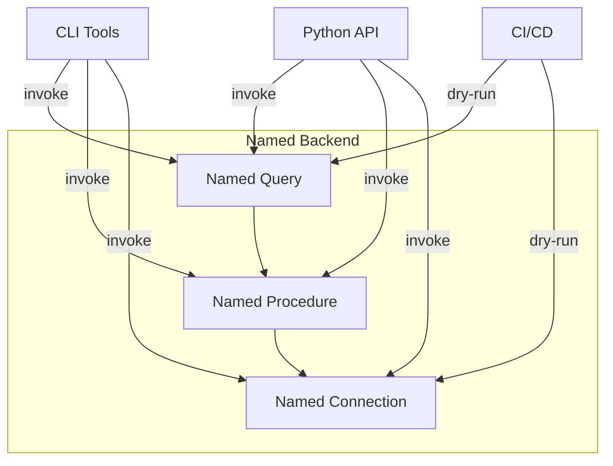

# Named Query & Named Procedure

> **Scope of this document**: A practical guide for application developers, focused on *why* and *how*.

---

## 1. Overview

Named backend includes three core features to help manage and execute database operations. These features are **backend-level capabilities** that work independently of the ActiveRecord pattern — they operate directly on database backends without requiring ActiveRecord models.



### Feature Comparison

| Feature | Use Case | Typical Scenario |
|---------|---------|---------------|
| **Named Query** | Encapsulate SQL queries as functions | Single SELECT/UPDATE/DELETE |
| **Named Procedure** | Multi-step business process orchestration | Batch archiving, cross-table operations |
| **Named Connection** | Externalize database configuration | Environment switching, multi-tenancy |

> **Important**: This is a **backend feature**, independent of ActiveRecord pattern and ActiveQuery.
>
> **Note**: All examples in this document use the **SQLite backend** as the demonstration database. The concepts apply to other backends (MySQL, PostgreSQL, etc.), but CLI commands may differ.

---

## 2. Table of Contents

1. [Named Query](#named-query)
   - [Why Named Query](#why-named-query)
   - [Invoking Named Queries](#invoking-named-queries)
2. [Named Procedure](#named-procedure)
   - [Why Named Procedure](#why-named-procedure)
   - [Writing a Named Procedure](#writing-a-named-procedure)
   - [ProcedureContext Methods](#procedurecontext-method-reference)
   - [Parallel Execution](#parallel-execution)
   - [Invoking Named Procedures](#invoking-named-procedures)
3. [Transaction Mode Selection Guide](#transaction-mode-selection-guide)
4. [Flowchart Visualization](#flowchart-visualization)
5. [API Reference](#api-reference)

---

## Named Query

### Why Named Query?

Before Named Query existed, the most common pattern for running database queries in Python projects was to embed raw SQL strings directly in business logic. This approach has several significant problems:

**Pain Points:**

1. **SQL Injection Risk**: Using f-strings or string formatting to embed parameters directly into SQL allows malicious input to alter the query logic.

2. **Poor Reusability**: SQL strings get copy-pasted across multiple files, making it difficult to maintain consistency when the query needs to change.

3. **Dialect Locked**: Hard-coded SQL syntax (e.g., SQLite-specific functions) makes it painful to migrate to a different database backend.

4. **Testing Difficulty**: Cannot test a query in isolation — the entire application must be running with database connectivity.

5. **No Dry-run Capability**: The actual SQL being executed is invisible until runtime, making debugging difficult.

**How Named Query Solves This:**

Named Query encapsulates query logic in a **pure Python function**. The key innovation is that the `dialect` parameter is automatically injected by the framework at execution time, allowing the same query code to work across different database backends.

```python
# Define once, use anywhere with any dialect
def active_users(dialect, limit: int = 100, status: str = "active"):
    """Get active users from the database."""
    return QueryExpression(
        dialect,
        select=[Column(dialect, "id"), Column(dialect, "name")],
        from_=TableExpression(dialect, "users"),
        where=Column(dialect, "status") == status,
        limit_offset=LimitOffsetClause(dialect, limit=limit),
    )

# When executed with SQLite dialect, generates SQLite SQL
# When executed with MySQL dialect, generates MySQL SQL
```

### Invoking Named Queries

There are three primary ways to invoke a named query:

#### 1. CLI (Command-Line Interface)

The CLI is ideal for quick testing, debugging, and CI/CD pipelines. It provides several useful flags:

**Execute a query:**
```bash
python -m rhosocial.activerecord.backend.impl.sqlite named-query \
    myapp.queries.users.active_users \
    --db-file mydb.sqlite \
    --param limit=10 \
    --param status=active
```
This executes the named query and returns results. The `--param` flag can be repeated to pass multiple parameters.

**Dry-run mode (preview SQL without execution):**
```bash
python -m rhosocial.activerecord.backend.impl.sqlite named-query \
    myapp.queries.users.active_users \
    --db-file mydb.sqlite --dry-run
```
Output example:
```
[DRY RUN] SELECT "id", "name" FROM "users" WHERE "status" = ? LIMIT ?
Params: ('active', 100)
```
This is useful for CI/CD validation or inspecting the generated SQL.

**Describe query (view signature without execution):**
```bash
python -m rhosocial.activerecord.backend.impl.sqlite named-query \
    myapp.queries.users.active_users --describe
```
Shows the function signature, parameter types, and docstring without connecting to a database.

**List all queries in a module:**
```bash
python -m rhosocial.activerecord.backend.impl.sqlite named-query \
    myapp.queries.users --list
```
Useful for discovering available named queries in a module.

**EXPLAIN plan:**
```bash
python -m rhosocial.activerecord.backend.impl.sqlite named-query \
    myapp.queries.users.active_users \
    --db-file mydb.sqlite \
    --explain \
    --param limit=10
```
Executes `EXPLAIN` to show the query execution plan, useful for performance analysis.

#### 2. Programmatic API (Python Code)

The programmatic API provides more control and integrates well with applications:

**One-shot method (quick):**
```python
from rhosocial.activerecord.backend.named_query import resolve_named_query
from rhosocial.activerecord.backend.impl.sqlite import SQLiteBackend

backend = SQLiteBackend(database="mydb.sqlite")
dialect = backend.dialect

# Resolve, generate SQL, and execute in one call
expr, sql, params = resolve_named_query(
    "myapp.queries.users.active_users",
    dialect,
    {"limit": 50, "status": "active"},
)
print("Generated SQL:", sql)
# Use with pandas, direct execute, etc.
```

**Step-by-step method (flexible):**
```python
from rhosocial.activerecord.backend.named_query import NamedQueryResolver

# Load the named query resolver
resolver = NamedQueryResolver("myapp.queries.users.active_users").load()

# Inspect without execution
info = resolver.describe()
print(f"Parameters: {info['parameters']}")
print(f"Returns: {info['return_type']}")

# Generate the expression and SQL when needed
expr = resolver.execute(dialect, {"limit": 50})
sql, params = expr.to_sql()
```

#### 3. CI/CD Integration

For automated testing and validation in CI pipelines:

```yaml
# .github/workflows/validate-queries.yml
name: Validate Named Queries
on: [push, pull_request]

jobs:
  validate:
    runs-on: ubuntu-latest
    steps:
      - uses: actions/checkout@v4
      - uses: actions/setup-python@v5
        with: { python-version: "3.12" }
      - run: pip install -e .
      - name: Static validation
        run: |
          python -m rhosocial.activerecord.backend.impl.sqlite named-query \
            myapp.queries.users.active_users \
            --db-file :memory: --dry-run \
            --param limit=100 --param status=active
```

The key tip here is using `--db-file :memory:` with `--dry-run` — this allows validation without requiring an actual database file or connection.

---

## Named Procedure

### Why Named Procedure?

Named Query solves the problem of managing individual SQL queries, but real-world business operations often require a **sequence of steps** with conditional logic. For example:

> "Count this month's orders → if zero, skip → archive completed orders → delete old archived records"

This is a multi-step process that:
- Has conditional branching (skip if no orders)
- Calls multiple queries in sequence
- May need transaction management
- Benefits from execution logging

Named Procedure addresses this by providing a Python class-based workflow that orchestrates multiple named queries.

### Writing a Named Procedure

A Named Procedure is defined by inheriting from `Procedure` (for synchronous execution) or `AsyncProcedure` (for async). The class defines parameters as class attributes, and implements the `run()` method:

```python
from rhosocial.activerecord.backend.named_query import Procedure, ProcedureContext

class MonthlyCleanupProcedure(Procedure):
    """Monthly order archival and cleanup procedure."""
    month: str = "2026-03"  # Default parameter

    def run(self, ctx: ProcedureContext) -> None:
        # Step 1: Count orders for this month
        # The 'bind' parameter stores the result under "order_count"
        ctx.execute(
            "myapp.queries.orders.count_monthly_orders",
            params={"month": self.month},
            bind="order_count",
        )

        # Step 2: Extract the count value and check if zero
        count = ctx.scalar("order_count", "cnt")
        if not count:
            # Log and abort if no orders
            ctx.log(f"No orders for {self.month}, skipping cleanup.", level="INFO")
            ctx.abort("MonthlyCleanupProcedure", f"No orders in {self.month}")

        # Step 3: Archive completed orders
        ctx.execute(
            "myapp.queries.orders.archive_completed_orders",
            params={"month": self.month},
            output=True,  # Keep result in outputs
        )

        # Step 4: Delete old archived records
        ctx.execute(
            "myapp.queries.orders.delete_archived_orders",
            params={"month": self.month},
            output=True,
        )

        # Log completion
        ctx.log("Cleanup complete.", level="INFO")
```

### ProcedureContext Method Reference

The `ctx` object provides methods to interact with the execution environment:

| Method | Signature | Description |
|--------|-----------|--------------|
| `execute` | `(qualified_name, params=None, bind=None, output=False)` | Execute a named query; `bind` stores result in context variable |
| `scalar` | `(var_name, column)` | Extract a single value from the first row of a bound variable |
| `rows` | `(var_name)` | Iterate all rows of a bound variable |
| `bind` | `(name, data)` | Manually bind arbitrary data to a context variable |
| `get` | `(name, default=None)` | Retrieve a context variable value |
| `log` | `(message, level="INFO")` | Append a log entry (DEBUG/INFO/WARNING/ERROR) |
| `abort` | `(procedure_name, reason)` | Terminate procedure and trigger rollback |
| `parallel` | `(*steps, max_concurrency=None)` | Execute multiple queries concurrently |

### Parallel Execution

For independent sub-tasks that can run concurrently, use `ctx.parallel()`:

```python
from rhosocial.activerecord.backend.named_query import Procedure, ProcedureContext, ParallelStep

class OrderProcessingProcedure(Procedure):
    order_id: int
    user_id: int

    def run(self, ctx: ProcedureContext) -> None:
        # Reserve inventory and send notification concurrently
        # max_concurrency=2 limits to 2 parallel executions
        ctx.parallel(
            ParallelStep(
                "myapp.queries.inventory.reserve",
                params={"order_id": self.order_id},
                bind="reserved",
            ),
            ParallelStep(
                "myapp.queries.notification.send",
                params={"user_id": self.user_id, "type": "order_started"},
            ),
            max_concurrency=2,
        )

        # Access parallel results just like sequential results
        reserved = ctx.scalar("reserved", "quantity")
```

#### Important Notes for Parallel Execution

1. **Transaction Considerations**: In `AUTO` transaction mode, if any parallel step fails, the entire transaction rolls back. Consider using `STEP` mode or `NONE` mode (if queries are idempotent) for parallel operations.

2. **max_concurrency**: Defaults to `None` (unlimited). Setting a positive integer limits concurrent executions, preventing resource exhaustion.

3. **Result Access**: Parallel results are accessed via `ctx.scalar()` and `ctx.rows()` using the `bind` name from each `ParallelStep`.

4. **Data Dependencies**: If steps have data dependencies (one needs output from another), do not use parallel — use sequential execution.

5. **Dry-run Behavior**: In dry-run mode, `ctx.parallel()` executes sequentially to generate a complete flowchart.

### Invoking Named Procedures

#### CLI Invocation

The CLI for named procedures provides similar options to named queries, plus transaction mode control:

**Execute a procedure:**
```bash
python -m rhosocial.activerecord.backend.impl.sqlite named-procedure \
    myapp.procedures.monthly_cleanup.MonthlyCleanupProcedure \
    --db-file mydb.sqlite \
    --param month=2026-03 \
    --transaction auto
```
The `--transaction` flag controls how the procedure handles transactions (see Transaction Mode section below).

**View procedure definition:**
```bash
python -m rhosocial.activerecord.backend.impl.sqlite named-procedure \
    myapp.procedures.monthly_cleanup.MonthlyCleanupProcedure \
    --db-file mydb.sqlite --describe
```

**Dry-run (preview all SQL steps):**
```bash
python -m rhosocial.activerecord.backend.impl.sqlite named-procedure \
    myapp.procedures.monthly_cleanup.MonthlyCleanupProcedure \
    --db-file mydb.sqlite --dry-run --param month=2026-03
```

**STEP transaction mode:**
```bash
python -m rhosocial.activerecord.backend.impl.sqlite named-procedure \
    myapp.procedures.monthly_cleanup.MonthlyCleanupProcedure \
    --db-file mydb.sqlite --param month=2026-03 --transaction step
```
In STEP mode, each step commits independently.

**List procedures in a module:**
```bash
python -m rhosocial.activerecord.backend.impl.sqlite named-procedure \
    myapp.procedures.monthly_cleanup --list
```

**Async execution (for AsyncProcedure subclasses):**
```bash
python -m rhosocial.activerecord.backend.impl.sqlite named-procedure \
    myapp.procedures.monthly_cleanup.MonthlyCleanupProcedure \
    --db-file mydb.sqlite --param month=2026-03 --async
```

#### Programmatic API

```python
from rhosocial.activerecord.backend.named_query import (
    ProcedureRunner, TransactionMode, ProcedureResult,
)
from rhosocial.activerecord.backend.impl.sqlite import SQLiteBackend

backend = SQLiteBackend(database="mydb.sqlite")
dialect = backend.dialect

# Load the procedure class
runner = ProcedureRunner(
    "myapp.procedures.monthly_cleanup.MonthlyCleanupProcedure"
).load()

# Execute with parameters
result: ProcedureResult = runner.run(
    dialect,
    user_params={"month": "2026-03"},
    transaction_mode=TransactionMode.AUTO,
    backend=backend,
    execute_query=backend.execute,
)

# Check result
if result.aborted:
    print(f"⚠️  Aborted: {result.abort_reason}")
else:
    print(f"✅  Done. Output steps: {len(result.outputs)}")

# Access logs
for entry in result.logs:
    print(f"[{entry.level}] {entry.message}")
```

#### Async Environments (FastAPI/aiohttp)

For async web frameworks, use `AsyncProcedure` and `AsyncProcedureRunner`:

```python
from rhosocial.activerecord.backend.named_query import AsyncProcedure, AsyncProcedureContext

class MonthlyCleanupAsyncProcedure(AsyncProcedure):
    month: str = "2026-03"

    async def run(self, ctx: AsyncProcedureContext) -> None:
        await ctx.execute(
            "myapp.queries.orders.count_monthly_orders",
            params={"month": self.month},
            bind="order_count",
        )

        count = await ctx.scalar("order_count", "cnt")
        if not count:
            await ctx.log(f"No orders for {self.month}, skipping.")
            await ctx.abort("MonthlyCleanupAsyncProcedure", f"No orders in {self.month}")

        await ctx.execute(
            "myapp.queries.orders.archive_completed_orders",
            params={"month": self.month},
            output=True,
        )
```

```python
# FastAPI endpoint
from fastapi import FastAPI
from rhosocial.activerecord.backend.named_query import AsyncProcedureRunner, TransactionMode
from rhosocial.activerecord.backend.impl.sqlite import AsyncSQLiteBackend

app = FastAPI()
async_backend = AsyncSQLiteBackend(database="mydb.sqlite")

@app.post("/admin/cleanup/{month}")
async def run_cleanup(month: str):
    runner = AsyncProcedureRunner(
        "myapp.procedures.monthly_cleanup_async.MonthlyCleanupAsyncProcedure"
    ).load()
    result = await runner.run(
        async_backend.dialect,
        user_params={"month": month},
        transaction_mode=TransactionMode.AUTO,
        backend=async_backend,
        execute_query=async_backend.execute,
    )
    return {
        "aborted": result.aborted,
        "abort_reason": result.abort_reason,
        "outputs": result.outputs,
    }
```

> **Important**: `AsyncProcedure` subclasses must be run by `AsyncProcedureRunner`; `Procedure` subclasses must be run by `ProcedureRunner`. Do not mix them.

---

## Transaction Mode Selection Guide

When executing a Named Procedure, the transaction mode determines how database commits are handled:

| Mode | Description | Best For | On Failure |
|------|-------------|----------|------------|
| `AUTO` (default) | Entire procedure wrapped in one transaction | Batch archival, data migration where atomicity is critical | Full rollback — all changes undone |
| `STEP` | Each step commits independently | Long-running workflows where partial completion is acceptable | Already-completed steps are preserved |
| `NONE` | No transaction wrapping | Read-only procedures or when external transaction management is used | No automatic rollback |

**Choosing a mode:**
- Use `AUTO` when you need all-or-nothing semantics
- Use `STEP` when the workflow can tolerate partial completion
- Use `NONE` for read-only operations or when you manage transactions externally

---

## Flowchart Visualization

Named procedures can generate **Mermaid** flowcharts to visualize the procedure structure. This is particularly useful for understanding complex workflows and debugging.

### Static Diagram (No Database Required)

Generate a flowchart without executing the procedure — useful for documentation and planning:

```python
from rhosocial.activerecord.backend.named_query import Procedure

# Flowchart format
print(MyProcedure.static_diagram("flowchart"))

# Sequence diagram format
print(MyProcedure.static_diagram("sequence"))
```

### Instance Diagram (After Real Execution)

After executing a procedure, generate a flowchart showing actual execution status and timing:

```python
from rhosocial.activerecord.backend.named_query import ProcedureRunner

runner = ProcedureRunner("myapp.procedures.OrderProcessing").load()
result = runner.run(dialect, backend=backend)

# Flowchart format with execution status
print(result.diagram("flowchart", procedure_name="OrderProcessing"))

# Sequence diagram format
print(result.diagram("sequence", procedure_name="OrderProcessing"))
```

### Feature Comparison

| Feature | Static Diagram | Instance Diagram |
|---------|---------------|------------------|
| Data source | dry-run | Real execution |
| Requires database | ❌ | ✅ |
| Shows execution status | ❌ | ✅ (green/red/gray) |
| Shows execution time | ❌ | ✅ (milliseconds) |
| Unexecuted nodes | Neutral color | Gray + [not executed] |
| Backend info | Dialect only | Backend class + ConcurrencyHint |

---

## API Reference

### Exceptions

- `NamedQueryError` - Base exception for all named query/procedure errors
- `NamedQueryNotFoundError` - Query function not found
- `NamedQueryModuleNotFoundError` - Module containing query not found
- `NamedQueryInvalidReturnTypeError` - Query doesn't return a valid expression
- `NamedQueryInvalidParameterError` - Invalid parameter provided
- `NamedQueryMissingParameterError` - Required parameter not provided
- `NamedQueryNotCallableError` - Named object is not callable
- `NamedQueryExplainNotAllowedError` - EXPLAIN not allowed for this query type

### Named Query API

- `NamedQueryResolver` - Main resolver class for loading and executing named queries
- `resolve_named_query()` - Convenience function for one-shot resolve and execute
- `list_named_queries_in_module()` - Discover all queries in a module

### Named Procedure API

- `Procedure` - Synchronous procedure base class
- `ProcedureContext` - Synchronous execution context (passed to `run()`)
- `ProcedureRunner` - Synchronous executor for running procedures
- `AsyncProcedure` - Asynchronous procedure base class
- `AsyncProcedureContext` - Asynchronous execution context
- `AsyncProcedureRunner` - Asynchronous executor
- `TransactionMode` - Enum: AUTO, STEP, NONE
- `ProcedureResult` - Execution result object containing outputs, logs, and status

---

## Complete Examples

### Python Examples

All examples use the **SQLite backend** as the demonstration database:

| Example | Description |
|---------|-------------|
| `named_queries/order_queries.py` | Order-related named query definitions with full Setup/Business Logic/Execution/Teardown structure |
| `named_procedures/order_workflow.py` | Order processing workflow demonstrating parallel execution |
| `named_procedures/diagram_demo.py` | Flowchart visualization demonstration |

### CLI Examples

| Example | Description |
|---------|-------------|
| `cli/named_query_demo.py` | Demonstrates all named query CLI operations (list, describe, dry-run, execute) |
| `cli/named_procedure_demo.py` | Demonstrates all named procedure CLI operations (list, describe, dry-run, execute, transaction modes) |
| `cli/named_connection_demo.py` | Demonstrates named connection CLI operations |

### Running Examples

```bash
# Python example: Run named query
cd src/rhosocial/activerecord/backend/impl/sqlite/examples
PYTHONPATH=../../../../..:. python3 named_queries/order_queries.py

# Python example: Generate flowchart
cd src/rhosocial/activerecord/backend/impl/sqlite/examples/named_procedures
PYTHONPATH=../../../../..:. python3 diagram_demo.py

# CLI example: Named Query CLI
cd src/rhosocial/activerecord/backend/impl/sqlite/examples
PYTHONPATH=../../../../..:. python3 cli/named_query_demo.py

# CLI example: Named Procedure CLI
PYTHONPATH=../../../../..:. python3 cli/named_procedure_demo.py

# CLI example: Named Connection CLI
PYTHONPATH=../../../../..:. python3 cli/named_connection_demo.py
```