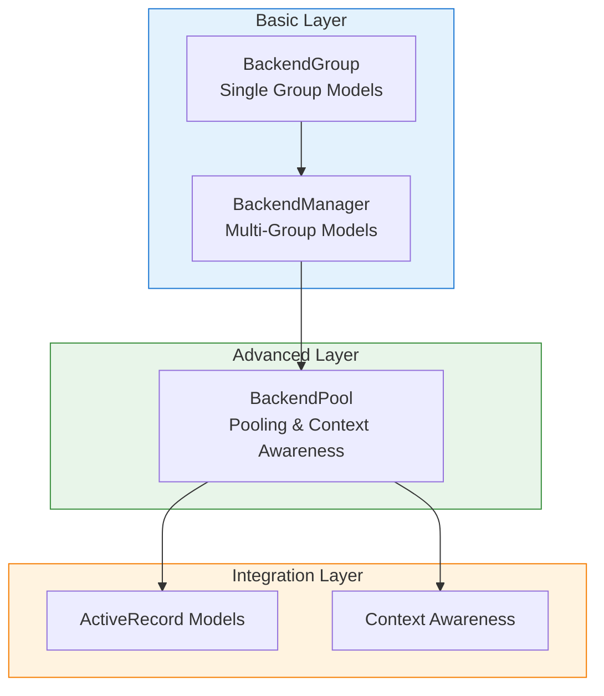

# Connection Management

This chapter covers how to manage database connections, from basic connection groups to advanced connection pooling.

## Table of Contents

* **[Connection Groups & Manager](connection_management.md)**: Using `BackendGroup` and `BackendManager` to manage multi-model, multi-database connections.
* **[Connection Pool](connection_pool.md)**: Efficient connection management with context-aware access patterns, connection reuse, lifecycle management, and ActiveRecord integration.

## Overview

### Connection Management Layers

### Feature Comparison

| Feature | BackendGroup | BackendManager | BackendPool |
|---------|-----------------|-------------------|-------------|
| Multi-model Connection | ✓ | ✓ | ✓ |
| Multi-database | ✗ | ✓ | ✓ |
| Connection Reuse | ✗ | ✗ | ✓ |
| Context Awareness | ✗ | ✗ | ✓ |
| Transaction Management | ✗ | ✗ | ✓ |
| ActiveRecord Integration | Basic | Basic | Deep |

## Example Code

Complete example code for this chapter can be found at `docs/examples/chapter_06_connection/`.
