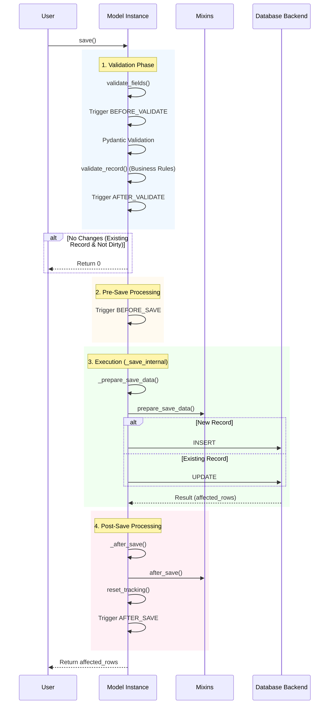

# Lifecycle Events

rhosocial-activerecord provides a complete lifecycle event system, allowing you to insert custom logic before and after model validation, saving, and deletion.

## Supported Events

Defined in the `rhosocial.activerecord.interface.base.ModelEvent` enum:

*   `BEFORE_VALIDATE`: Before validation
*   `AFTER_VALIDATE`: After validation
*   `BEFORE_SAVE`: Before save (create or update)
*   `AFTER_SAVE`: After save (create or update)
*   `BEFORE_DELETE`: Before delete
*   `AFTER_DELETE`: After delete

## save() Lifecycle

The following diagram illustrates the complete execution flow of the `save()` method and where events are triggered:



## Exception Handling and Transactions

Event handlers are executed synchronously as part of the `save()` process. Therefore:

1.  **Interruption on Exception**: If any event handler raises an exception, the entire `save()` process is immediately interrupted. Subsequent steps (including the actual database operation or subsequent events) will not be executed. The exception is propagated to the caller.
2.  **Transaction Rollback**: If the `save()` operation is wrapped in a database transaction (recommended), an exception raised by an event handler will cause the entire transaction to rollback. This ensures data consistency—for example, if an `AFTER_SAVE` hook fails, the database INSERT/UPDATE operation performed earlier in `save()` will also be rolled back.

## Registering Event Handlers

### 1. Using the `on` Method

You can register instance-level callbacks in `__init__` or elsewhere using the `on` method.

```python
from rhosocial.activerecord.model import ActiveRecord
from rhosocial.activerecord.interface.base import ModelEvent

class User(ActiveRecord):
    username: str

    def __init__(self, **data):
        super().__init__(**data)
        self.on(ModelEvent.BEFORE_SAVE, self.encrypt_password)

    def encrypt_password(self, instance, **kwargs):
        # Encryption logic
        pass
```

### 2. Using Mixins (Recommended)

Mixins are the best way to reuse event logic. For example, `TimestampMixin` is implemented by registering events.

```python
class TimestampMixin:
    def __init__(self, **data):
        super().__init__(**data)
        self.on(ModelEvent.BEFORE_SAVE, self._update_timestamps)

    def _update_timestamps(self, instance, is_new=False, **kwargs):
        now = datetime.utcnow()
        if is_new:
            self.created_at = now
        self.updated_at = now
```

## Callback Signature

Callbacks should accept `instance` and `**kwargs` arguments.

```python
def callback(instance: 'ActiveRecord', **kwargs):
    # instance: The model instance triggering the event
    # kwargs: Context arguments
    pass
```

### Specific Event Arguments

*   `BEFORE_SAVE`, `AFTER_SAVE`:
    *   `is_new` (bool): Whether it is a new record
*   `AFTER_SAVE`:
    *   `result` (QueryResult): Database operation result (containing `affected_rows`, `data`, etc.)

## Example: Auto-generating UUID

```python
import uuid
from rhosocial.activerecord.model import ActiveRecord
from rhosocial.activerecord.interface.base import ModelEvent

class UUIDMixin:
    def __init__(self, **data):
        super().__init__(**data)
        self.on(ModelEvent.BEFORE_SAVE, self._ensure_id)

    def _ensure_id(self, instance, is_new=False, **kwargs):
        if is_new and not self.id:
            self.id = str(uuid.uuid4())

class User(UUIDMixin, ActiveRecord):
    id: str
    username: str
```
