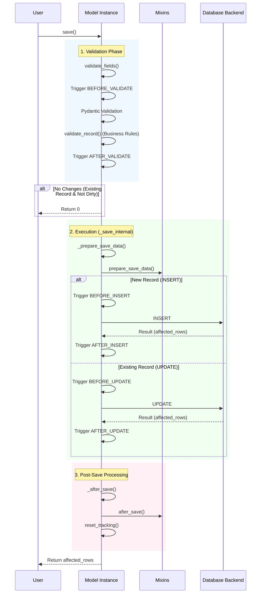

# Lifecycle Events

rhosocial-activerecord provides a complete lifecycle event system, allowing you to insert custom logic before and after model validation, insertion, update, and deletion.

## Supported Events

Defined in the `rhosocial.activerecord.interface.base.ModelEvent` enum:

### Validation Events
*   `BEFORE_VALIDATE`: Before validation
*   `AFTER_VALIDATE`: After validation

### Insert Events (for new records)
*   `BEFORE_INSERT`: Before INSERT operation
*   `AFTER_INSERT`: After INSERT operation

### Update Events (for existing records)
*   `BEFORE_UPDATE`: Before UPDATE operation
*   `AFTER_UPDATE`: After UPDATE operation

### Delete Events
*   `BEFORE_DELETE`: Before delete
*   `AFTER_DELETE`: After delete

### Hook Methods vs Event Enum

The event system provides two ways to hook into model lifecycle:

| Hook Method | Event Enum | Description |
|-------------|------------|-------------|
| `before_validate()` | `BEFORE_VALIDATE` | Before Pydantic validation |
| `after_validate()` | `AFTER_VALIDATE` | After Pydantic validation |
| - | `BEFORE_INSERT` | Before INSERT (new records) |
| - | `AFTER_INSERT` | After INSERT (new records) |
| - | `BEFORE_UPDATE` | Before UPDATE (existing records) |
| - | `AFTER_UPDATE` | After UPDATE (existing records) |
| `before_delete()` | `BEFORE_DELETE` | Before DELETE |
| `after_delete()` | `AFTER_DELETE` | After DELETE |

**Usage Differences**:

- **Hook Methods**: Override in your model class for simple logic
- **Event Enum**: Use with `on()` method for dynamic registration, especially in Mixins

> 💡 **AI Prompt Example**: "How do I use BEFORE_INSERT and BEFORE_UPDATE events to execute different logic for new vs existing records?"

## save() Lifecycle

The following diagram illustrates the complete execution flow of the `save()` method and where events are triggered:


```mermaid
sequenceDiagram
    participant User
    participant Model as Model Instance
    participant Mixins
    participant DB as Database Backend

    User->>Model: save()

    rect rgb(240, 248, 255)
        Note over Model: 1. Validation Phase
        Model->>Model: validate_fields()
        Model->>Model: Trigger BEFORE_VALIDATE
        Model->>Model: Pydantic Validation
        Model->>Model: validate_record() (Business Rules)
        Model->>Model: Trigger AFTER_VALIDATE
    end

    alt No Changes (Existing Record & Not Dirty)
        Model-->>User: Return 0
    end

    rect rgb(240, 255, 240)
        Note over Model: 2. Execution (_save_internal)
        Model->>Model: _prepare_save_data()
        Model->>Mixins: prepare_save_data()

        alt New Record (INSERT)
            Model->>Model: Trigger BEFORE_INSERT
            Model->>DB: INSERT
            DB-->>Model: Result (affected_rows)
            Model->>Model: Trigger AFTER_INSERT
        else Existing Record (UPDATE)
            Model->>Model: Trigger BEFORE_UPDATE
            Model->>DB: UPDATE
            DB-->>Model: Result (affected_rows)
            Model->>Model: Trigger AFTER_UPDATE
        end
    end

    rect rgb(255, 240, 245)
        Note over Model: 3. Post-Save Processing
        Model->>Model: _after_save()
        Model->>Mixins: after_save()
        Model->>Model: reset_tracking()
    end

    Model-->>User: Return affected_rows
```

## Exception Handling and Transactions

Event handlers are executed synchronously as part of the `save()` process. Therefore:

1.  **Interruption on Exception**: If any event handler raises an exception, the entire `save()` process is immediately interrupted. Subsequent steps (including the actual database operation or subsequent events) will not be executed. The exception is propagated to the caller.
2.  **Transaction Rollback**: If the `save()` operation is wrapped in a database transaction (recommended), an exception raised by an event handler will cause the entire transaction to rollback. This ensures data consistency—for example, if an `AFTER_UPDATE` hook fails, the database UPDATE operation performed earlier in `save()` will also be rolled back.

## Registering Event Handlers

### 1. Using the `on` Method

You can register instance-level callbacks in `__init__` or elsewhere using the `on` method.

```python
from rhosocial.activerecord.model import ActiveRecord
from rhosocial.activerecord.interface.base import ModelEvent
from typing import Dict, Any

class User(ActiveRecord):
    username: str

    def __init__(self, **data):
        super().__init__(**data)
        self.on(ModelEvent.BEFORE_INSERT, self.encrypt_password)

    def encrypt_password(
        self,
        instance: 'User',
        data: Dict[str, Any],
        **kwargs
    ) -> None:
        # Encryption logic for new records
        pass
```

### 2. Using Mixins (Recommended)

Mixins are the best way to reuse event logic. For example, `TimestampMixin` is implemented by registering separate events for INSERT and UPDATE.

```python
from typing import Union, Dict, Any
from datetime import datetime, timezone
from rhosocial.activerecord.interface.base import ModelEvent
from rhosocial.activerecord.interface.model import IActiveRecord, IAsyncActiveRecord

class TimestampMixin:
    def __init__(self, **data):
        super().__init__(**data)
        self.on(ModelEvent.BEFORE_INSERT, self._set_timestamps_on_insert)
        self.on(ModelEvent.BEFORE_UPDATE, self._set_updated_at)

    def _set_timestamps_on_insert(
        self,
        instance: Union['IActiveRecord', 'IAsyncActiveRecord'],
        data: Dict[str, Any],
        **kwargs
    ) -> None:
        now = datetime.now(timezone.utc)
        instance.created_at = now
        instance.updated_at = now
        data['created_at'] = now
        data['updated_at'] = now

    def _set_updated_at(
        self,
        instance: Union['IActiveRecord', 'IAsyncActiveRecord'],
        data: Dict[str, Any],
        **kwargs
    ) -> None:
        now = datetime.now(timezone.utc)
        instance.updated_at = now
        data['updated_at'] = now
```

## Callback Signature

Callbacks should accept `instance` and additional context arguments.

> **Note**: The `instance` parameter type depends on where the callback is defined:
> - **In a specific model class**: Use the concrete model type (e.g., `User`, `Product`)
> - **In a Mixin**: Use `Union['ActiveRecord', 'AsyncActiveRecord']` since Mixins work with both sync and async models

### Important Constraints

**1. Type Matching**: The callback's `instance` type must match the actual model type:
- In `User(ActiveRecord)` callbacks → `instance` is `User`/`ActiveRecord`
- In `AsyncUser(AsyncActiveRecord)` callbacks → `instance` is `AsyncUser`/`AsyncActiveRecord`
- **Do NOT mix types** unless the callback only accesses instance attributes (no I/O operations)

**2. Lightweight Operations**: Callback functions should be lightweight and non-blocking:
- Avoid heavy computations or long-running operations
- Avoid blocking I/O (network requests, file operations, etc.)
- The callback runs synchronously in the save/delete workflow and will block the main operation
- For async models, prefer async operations if I/O is necessary, but keep them fast

### In a Specific Model Class

```python
from rhosocial.activerecord.model import ActiveRecord
from rhosocial.activerecord.interface.base import ModelEvent
from typing import Dict, Any

class User(ActiveRecord):
    username: str

    def __init__(self, **data):
        super().__init__(**data)
        self.on(ModelEvent.BEFORE_INSERT, self.encrypt_password)

    def encrypt_password(
        self,
        instance: 'User',  # Concrete type - this is always User
        data: Dict[str, Any],
        **kwargs
    ) -> None:
        # instance is always User here
        instance.encrypted_password = hash(instance.username)
```

### In a Mixin (Generic for Both Sync and Async)

```python
from typing import Union, Dict, Any
from rhosocial.activerecord.interface.model import IActiveRecord, IAsyncActiveRecord

class TimestampMixin:
    def _set_timestamps_on_insert(
        self,
        instance: Union['IActiveRecord', 'IAsyncActiveRecord'],  # Could be either
        data: Dict[str, Any],
        **kwargs
    ) -> None:
        # Works with both ActiveRecord and AsyncActiveRecord
        instance.created_at = datetime.now(timezone.utc)
```

### Specific Event Arguments

| Event | Arguments |
|-------|-----------|
| `BEFORE_INSERT` | `data: Dict[str, Any]` - The data to be inserted (can be modified) |
| `AFTER_INSERT` | `data: Dict[str, Any]`, `result: QueryResult` - Database operation result |
| `BEFORE_UPDATE` | `data: Dict[str, Any]`, `dirty_fields: Set[str]` - Changed field names |
| `AFTER_UPDATE` | `data: Dict[str, Any]`, `dirty_fields: Set[str]`, `result: QueryResult` |

### Modifying Save Data

You can modify the `data` dictionary in `BEFORE_INSERT` and `BEFORE_UPDATE` callbacks to change what gets saved:

```python
import uuid
from typing import Dict, Any, Set
from rhosocial.activerecord.model import ActiveRecord

def before_insert_handler(
    instance: 'ActiveRecord',  # Or use specific model type like 'User'
    data: Dict[str, Any],
    **kwargs
) -> None:
    # Add computed fields before insert
    data['uuid'] = str(uuid.uuid4())
    data['status'] = 'pending'

def before_update_handler(
    instance: 'ActiveRecord',  # Or use specific model type like 'User'
    data: Dict[str, Any],
    dirty_fields: Set[str],
    **kwargs
) -> None:
    # Set status when specific fields change
    if 'email' in dirty_fields:
        data['email_verified'] = False
```

## Example: Auto-generating UUID

```python
import uuid
from typing import Union, Dict, Any
from rhosocial.activerecord.interface.base import ModelEvent
from rhosocial.activerecord.interface.model import IActiveRecord, IAsyncActiveRecord

class UUIDMixin:
    def __init__(self, **data):
        super().__init__(**data)
        self.on(ModelEvent.BEFORE_INSERT, self._ensure_id)

    def _ensure_id(
        self,
        instance: Union['IActiveRecord', 'IAsyncActiveRecord'],
        data: Dict[str, Any],
        **kwargs
    ) -> None:
        if not instance.id:
            instance.id = str(uuid.uuid4())
            data['id'] = instance.id

class User(UUIDMixin, ActiveRecord):
    id: str
    username: str
```

## Example: Optimistic Locking with AFTER_UPDATE

```python
from rhosocial.activerecord.field.version import OptimisticLockMixin
from rhosocial.activerecord.interface.base import ModelEvent
from rhosocial.activerecord.backend.errors import DatabaseError

class Product(OptimisticLockMixin, ActiveRecord):
    name: str
    price: float
    version: int

# The OptimisticLockMixin uses AFTER_UPDATE to verify the update:
# - Checks result.affected_rows > 0
# - Raises DatabaseError if record was updated by another process
```

## Migration Guide

### From BEFORE_SAVE/AFTER_SAVE

If you were using `BEFORE_SAVE` or `AFTER_SAVE` events, migrate as follows:

| Old Event | Condition | New Event |
|-----------|-----------|-----------|
| `BEFORE_SAVE` + `is_new=True` | → | `BEFORE_INSERT` |
| `BEFORE_SAVE` + `is_new=False` | → | `BEFORE_UPDATE` |
| `AFTER_SAVE` + `is_new=True` | → | `AFTER_INSERT` |
| `AFTER_SAVE` + `is_new=False` | → | `AFTER_UPDATE` |

**Old code:**
```python
def handler(instance, is_new=False, **kwargs):
    if is_new:
        # INSERT logic
        pass
    else:
        # UPDATE logic
        pass
```

**New code:**
```python
from typing import Dict, Any, Set
from rhosocial.activerecord.model import ActiveRecord

def insert_handler(
    instance: 'ActiveRecord',  # Or use your specific model type
    data: Dict[str, Any],
    **kwargs
) -> None:
    # INSERT logic only
    pass

def update_handler(
    instance: 'ActiveRecord',  # Or use your specific model type
    data: Dict[str, Any],
    dirty_fields: Set[str],
    **kwargs
) -> None:
    # UPDATE logic only
    pass

instance.on(ModelEvent.BEFORE_INSERT, insert_handler)
instance.on(ModelEvent.BEFORE_UPDATE, update_handler)
```