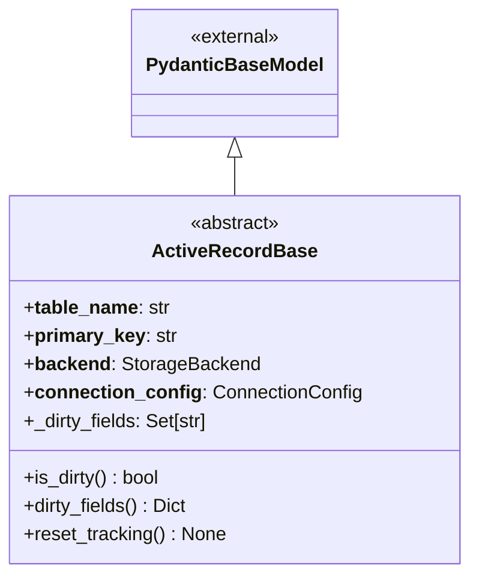
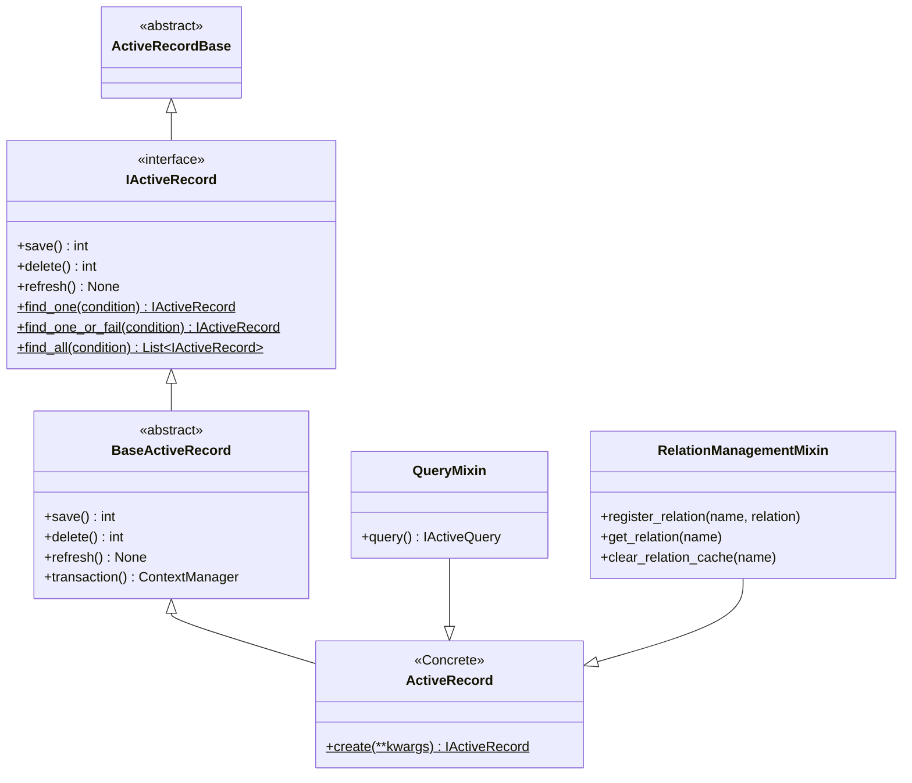
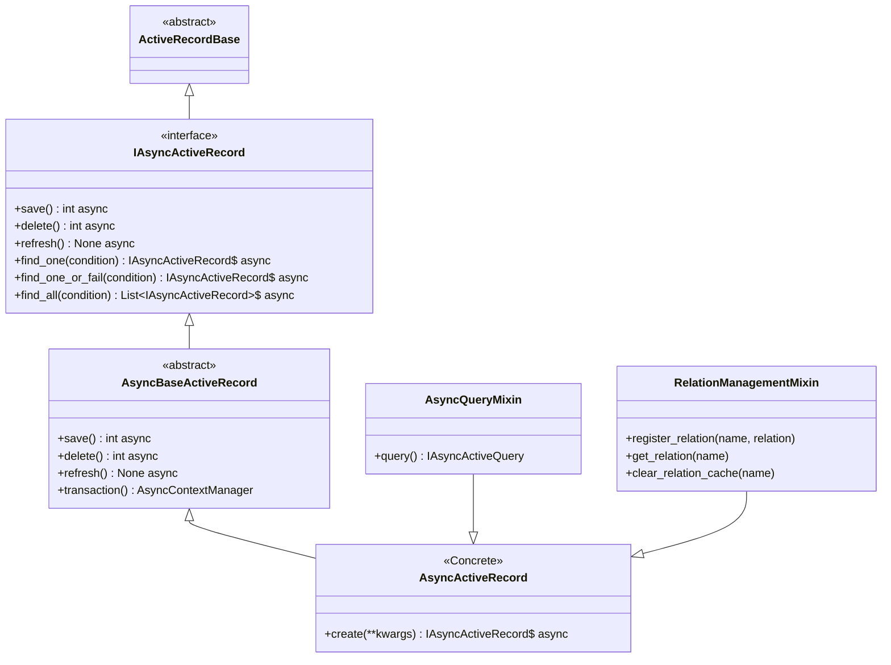
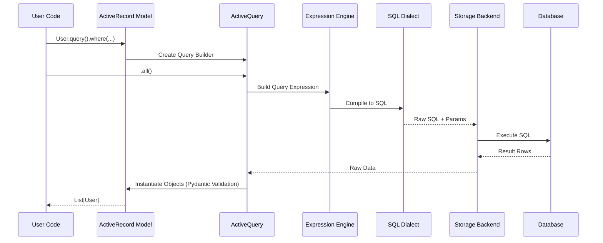

# Architecture

The library is built on a layered architecture to ensure maintainability, testability, and flexibility.

## Component Relationships

The architecture is divided into three main parts: the Core Foundation, the Synchronous Implementation, and the Asynchronous Implementation.

### 1. Core Foundation (`ActiveRecordBase`)

The `ActiveRecordBase` serves as the common ancestor for all models. It bridges the gap between Pydantic's data validation and the ActiveRecord pattern.

### 2. Synchronous Architecture (`ActiveRecord`)

This diagram shows the inheritance hierarchy for the synchronous implementation. It follows a path from the interface definition down to the user-facing concrete class.

### 3. Asynchronous Architecture (`AsyncActiveRecord`)

The asynchronous implementation mirrors the synchronous structure but uses async-compatible interfaces and mixins.

## The Life of a Query

