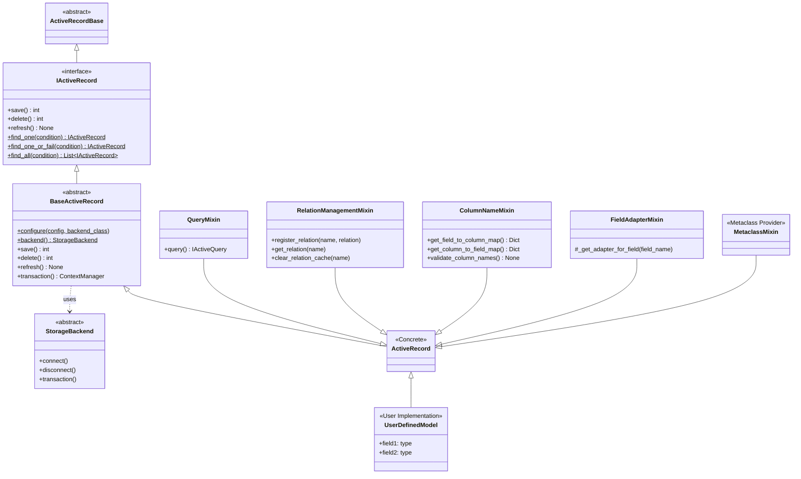

# Architecture

The library is built on a layered architecture to ensure maintainability, testability, and flexibility.

## Component Relationships

The architecture is divided into three main parts: the Core Foundation, the Synchronous Implementation, and the Asynchronous Implementation.

> **About SQLite Async Backend**: Please note that the SQLite asynchronous backend implementation included in this library is primarily for testing purposes (verifying the validity of the async abstraction and its equivalence with the synchronous implementation) and is not recommended for use as a high-performance asynchronous solution in production environments. For production asynchronous needs, please use dedicated backend packages such as `rhosocial-activerecord-mysql` or `rhosocial-activerecord-postgres`.

### 1. Core Foundation (`ActiveRecordBase`)

The `ActiveRecordBase` serves as the common ancestor for all models. It bridges the gap between Pydantic's data validation and the ActiveRecord pattern.


### 2. Synchronous Architecture (`ActiveRecord`)

This diagram shows the inheritance hierarchy for the synchronous implementation. It follows a path from the interface definition down to the user-facing concrete class.



### 3. Asynchronous Architecture (`AsyncActiveRecord`)

The asynchronous implementation mirrors the synchronous structure but uses async-compatible interfaces and mixins.


### 4. Query Architecture

The query system uses a composition pattern, reusing functionality through Mixins, and supports both synchronous and asynchronous operations. Notably, `IActiveQuery` and `IAsyncActiveQuery` provide the `aggregate()` method, which allows retrieving raw execution results (list of dictionaries) from the database when it is not suitable or desired to map to `ActiveRecord` instances.

#### Synchronous Query

```mermaid
classDiagram
    %% Interfaces
    class IQuery {
        <<interface>>
        +to_sql() Tuple
        +backend() StorageBackend
    }
    class IActiveQuery {
        <<interface>>
        +model_class: Type
        +all() List~IActiveRecord~
        +one() Optional~IActiveRecord~
        +aggregate() List~Dict~
    }
    class ICTEQuery {
        <<interface>>
        +with_cte(name, query)
        +recursive(enabled)
        +aggregate() List~Dict~
    }
    class ISetOperationQuery {
        <<interface>>
        +union(other)
        +intersect(other)
        +except_(other)
    }

    IActiveQuery --|> IQuery
    ICTEQuery --|> IQuery
    ISetOperationQuery --|> IQuery

    %% Mixins
    class BaseQueryMixin {
        +where(condition)
        +select(columns)
        +order_by(clauses)
        +limit(count)
        +offset(count)
        +group_by(columns)
        +having(condition)
    }
    class JoinQueryMixin {
        +join(target, on)
        +left_join(target, on)
    }
    class AggregateQueryMixin {
        +count()
        +sum(column)
        +avg(column)
        +min(column)
        +max(column)
        +aggregate() List~Dict~
    class RelationalQueryMixin {
        +preload(relation)
        +eager_load(relation)
    }
    class RangeQueryMixin {
        +chunk(size)
        +batch(size)
    }

    %% Implementations
    class ActiveQuery {
        +union(other)
        +intersect(other)
        +except_(other)
    }
    class CTEQuery
    class SetOperationQuery

    ActiveQuery ..|> IActiveQuery
    ActiveQuery --|> BaseQueryMixin
    ActiveQuery --|> JoinQueryMixin
    ActiveQuery --|> AggregateQueryMixin
    ActiveQuery --|> RelationalQueryMixin
    ActiveQuery --|> RangeQueryMixin

    CTEQuery ..|> ICTEQuery
    CTEQuery ..|> ISetOperationQuery
    CTEQuery --|> BaseQueryMixin
    CTEQuery --|> JoinQueryMixin
    CTEQuery --|> AggregateQueryMixin
    CTEQuery --|> RangeQueryMixin

    SetOperationQuery ..|> ISetOperationQuery
```

#### Asynchronous Query


## The Life of a Query


### Detailed Flow

1.  **Initiation**
    The user calls `User.query()`. The model instantiates an `ActiveQuery` builder and injects the current model's context. At this point, the query builder knows which model and corresponding database table it serves.

2.  **Condition Collection**
    The user chains methods like `.where()`, `.select()`, etc. This stage primarily involves collecting various conditions and parameters required for the query. Notably, SQL construction can occur at any time, not just at the final moment.

3.  **SQL Construction**
    When the user calls `.all()`, `.one()`, or `.aggregate()`, or needs to inspect the generated SQL, the query builder passes the collected conditions to the `Dialect` layer. The Dialect is responsible for translating abstract conditions into specific database SQL syntax (e.g., handling pagination syntax differences or parameter placeholder styles across different databases).

4.  **Execution**
    The constructed SQL and parameters are passed to the `StorageBackend`. The backend is responsible for retrieving a connection from the pool, executing the query, and handling the underlying database cursor. For asynchronous operations, `await` is used here to wait for the database response non-blockingly.

5.  **Mapping (ORM Mapping)**
    The database returns raw row data (usually tuples or dictionaries).
    *   **If `.all()` or `.one()` is called**: `ActiveRecord` receives this data and uses Pydantic's parsing capabilities to convert it into strongly-typed model instances. This step involves not just data population but also type conversion and validation, ensuring that the objects returned to the user are safe and reliable.
    *   **If `.aggregate()` is called**: The mapping step is skipped, and the raw list of dictionaries (`List[Dict]`) is returned directly. This is useful for aggregation queries or scenarios where model overhead is unnecessary.
