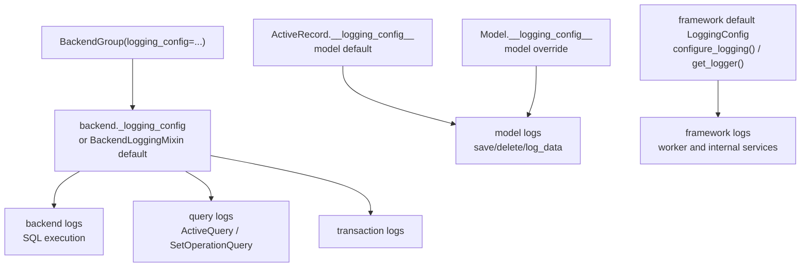

# Logging System

The logging system provides isolated loggers and configurable data summarization without mutating the application's root logger.

## Configuration Ownership

There is no logging manager singleton. Logging configuration belongs to one of these owners:

1. **ActiveRecord default**: `ActiveRecord.__logging_config__` controls model logging for models that do not override it.
2. **Model override**: `Model.__logging_config__` controls one concrete model class.
3. **Backend config**: a backend instance or `BackendGroup(..., logging_config=...)` controls backend, query, and transaction logs.
4. **Framework default**: `configure_logging()` and `get_logger(name)` are only for framework-level loggers that are not owned by a model or backend.



## Quick Start

```python
import logging
from typing import Optional

from rhosocial.activerecord.logging import LoggingConfig, LogDataMode
from rhosocial.activerecord.model import ActiveRecord

ActiveRecord.__logging_config__ = LoggingConfig(
    default_level=logging.INFO,
    log_data_mode=LogDataMode.SUMMARY,
)

class User(ActiveRecord):
    __table_name__ = "users"
    id: Optional[int] = None
    username: str
    password: str

class AuditUser(ActiveRecord):
    __table_name__ = "audit_users"
    __logging_config__ = LoggingConfig(log_data_mode=LogDataMode.KEYS_ONLY)
    id: Optional[int] = None
    username: str
    password: str
```

## Framework-Level Loggers

Use `configure_logging()` only for framework loggers outside model/backend ownership:

```python
import logging
from rhosocial.activerecord.logging import configure_logging, get_logger

configure_logging(level=logging.INFO, propagate=False)
logger = get_logger("rhosocial.activerecord.worker")
```

## Data Modes

`LoggingConfig.log_data_mode` accepts `LogDataMode` enum values:

| Mode | Behavior |
| ---- | -------- |
| `LogDataMode.HIDDEN` | Hide the entire payload as `"<hidden>"` |
| `LogDataMode.KEYS_ONLY` | Show keys and type hints, mask sensitive fields |
| `LogDataMode.SUMMARY` | Mask sensitive fields and truncate large values |
| `LogDataMode.FULL` | Show full payload; only use in controlled debugging |

## Logging in Web Applications

In web apps like FastAPI, beyond the framework's `LoggingConfig`, you typically want unified application log output. Following real-world practice (e.g. the webcrawler project), combine:

1. **`ActiveRecordFormatter`**: the framework's formatter providing a unified format (`module:line`) across ORM internal logs and application logs:

```python
from rhosocial.activerecord.logging import ActiveRecordFormatter

formatter = ActiveRecordFormatter()
# default format: %(asctime)s - %(levelname)s - [%(subpackage_module)s] - %(message)s
# example: 2024-01-15 10:30:45,123 - DEBUG - [rhosocial.activerecord.backend.base:42] - Executing query: ...
```

2. **File rotation + console dual output**: `TimedRotatingFileHandler` rotates by time (hour/day), plus a `StreamHandler` to stderr:

```python
import logging
import sys
from logging.handlers import TimedRotatingFileHandler
from pathlib import Path

from rhosocial.activerecord.logging import ActiveRecordFormatter

def setup_logging(log_dir="logs", log_filename="app", level="INFO", when="d", backup_count=7):
    Path(log_dir).mkdir(parents=True, exist_ok=True)
    formatter = ActiveRecordFormatter()

    file_handler = TimedRotatingFileHandler(
        filename=str(Path(log_dir) / f"{log_filename}.log"),
        when=when, backupCount=backup_count, encoding="utf-8",
    )
    file_handler.setFormatter(formatter)

    console_handler = logging.StreamHandler(sys.stderr)
    console_handler.setFormatter(formatter)

    root = logging.getLogger()
    root.setLevel(getattr(logging, level.upper(), logging.INFO))
    root.handlers.clear()
    root.addHandler(file_handler)
    root.addHandler(console_handler)

    # route uvicorn access/error logs to root for unified formatting
    for name in ("uvicorn", "uvicorn.access", "uvicorn.error"):
        uv = logging.getLogger(name)
        uv.handlers.clear()
        uv.propagate = True
```

3. **Wire into the FastAPI lifespan**: call once at startup; afterwards ORM internal logs (SQL execution, model ops), application logs, and uvicorn access logs share one format.

> **Relationship with framework `LoggingConfig`**: the framework's model/backend loggers are managed by their own `LoggingConfig`, defaulting to `propagate=False` (no root pollution). The setup above is the **application layer** attaching handlers to the root and explicitly routing uvicorn — the two do not conflict: framework logs are controlled by `LoggingConfig` (format + sensitive-data masking), application logs by the root logger.

A complete runnable example is in the [FastAPI Integration scenario](../scenarios/fastapi.md#7-logging-configuration) (`docs/examples/chapter_14_scenarios/fastapi_blog/app/logging_conf.py`).

## Example Code

Complete examples are in `docs/examples/chapter_09_logging/`:

| File | Description |
| ---- | ----------- |
| [01_basic_configuration.py](../../examples/chapter_09_logging/01_basic_configuration.py) | ActiveRecord defaults, model override, framework logger config |
| [02_data_summarization.py](../../examples/chapter_09_logging/02_data_summarization.py) | `LogDataMode` and `SummarizerConfig` |
| [03_per_logger_config.py](../../examples/chapter_09_logging/03_per_logger_config.py) | Per-logger rules inside owning `LoggingConfig` objects |
| [04_advanced_scenarios.py](../../examples/chapter_09_logging/04_advanced_scenarios.py) | Production/development presets and `BackendGroup` |

```bash
cd python-activerecord
source .venv3.8/bin/activate
python docs/examples/chapter_09_logging/01_basic_configuration.py
```

