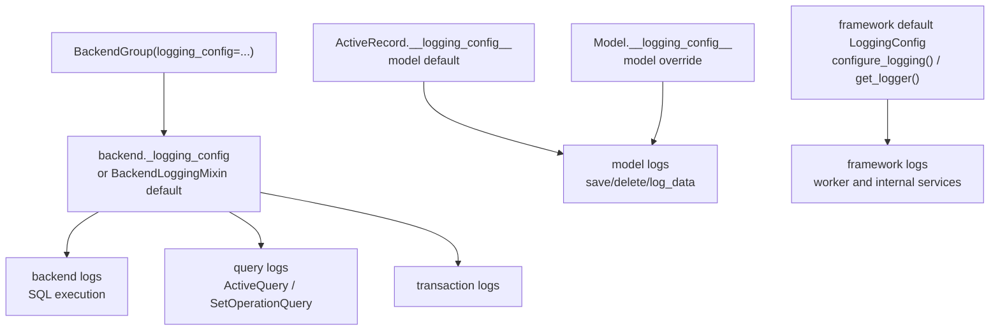

# Logging System

The logging system provides isolated loggers and configurable data summarization without mutating the application's root logger.

## Configuration Ownership

There is no logging manager singleton. Logging configuration belongs to one of these owners:

1. **ActiveRecord default**: `ActiveRecord.__logging_config__` controls model logging for models that do not override it.
2. **Model override**: `Model.__logging_config__` controls one concrete model class.
3. **Backend config**: a backend instance or `BackendGroup(..., logging_config=...)` controls backend, query, and transaction logs.
4. **Framework default**: `configure_logging()` and `get_logger(name)` are only for framework-level loggers that are not owned by a model or backend.



## Quick Start

```python
import logging
from typing import Optional

from rhosocial.activerecord.logging import LoggingConfig, LogDataMode
from rhosocial.activerecord.model import ActiveRecord

ActiveRecord.__logging_config__ = LoggingConfig(
    default_level=logging.INFO,
    log_data_mode=LogDataMode.SUMMARY,
)

class User(ActiveRecord):
    __table_name__ = "users"
    id: Optional[int] = None
    username: str
    password: str

class AuditUser(ActiveRecord):
    __table_name__ = "audit_users"
    __logging_config__ = LoggingConfig(log_data_mode=LogDataMode.KEYS_ONLY)
    id: Optional[int] = None
    username: str
    password: str
```

## Framework-Level Loggers

Use `configure_logging()` only for framework loggers outside model/backend ownership:

```python
import logging
from rhosocial.activerecord.logging import configure_logging, get_logger

configure_logging(level=logging.INFO, propagate=False)
logger = get_logger("rhosocial.activerecord.worker")
```

## Data Modes

`LoggingConfig.log_data_mode` accepts `LogDataMode` enum values:

| Mode | Behavior |
| ---- | -------- |
| `LogDataMode.HIDDEN` | Hide the entire payload as `"<hidden>"` |
| `LogDataMode.KEYS_ONLY` | Show keys and type hints, mask sensitive fields |
| `LogDataMode.SUMMARY` | Mask sensitive fields and truncate large values |
| `LogDataMode.FULL` | Show full payload; only use in controlled debugging |

## Example Code

Complete examples are in `docs/examples/chapter_09_logging/`:

| File | Description |
| ---- | ----------- |
| [01_basic_configuration.py](../../examples/chapter_09_logging/01_basic_configuration.py) | ActiveRecord defaults, model override, framework logger config |
| [02_data_summarization.py](../../examples/chapter_09_logging/02_data_summarization.py) | `LogDataMode` and `SummarizerConfig` |
| [03_per_logger_config.py](../../examples/chapter_09_logging/03_per_logger_config.py) | Per-logger rules inside owning `LoggingConfig` objects |
| [04_advanced_scenarios.py](../../examples/chapter_09_logging/04_advanced_scenarios.py) | Production/development presets and `BackendGroup` |

```bash
cd python-activerecord
source .venv3.8/bin/activate
python docs/examples/chapter_09_logging/01_basic_configuration.py
```

