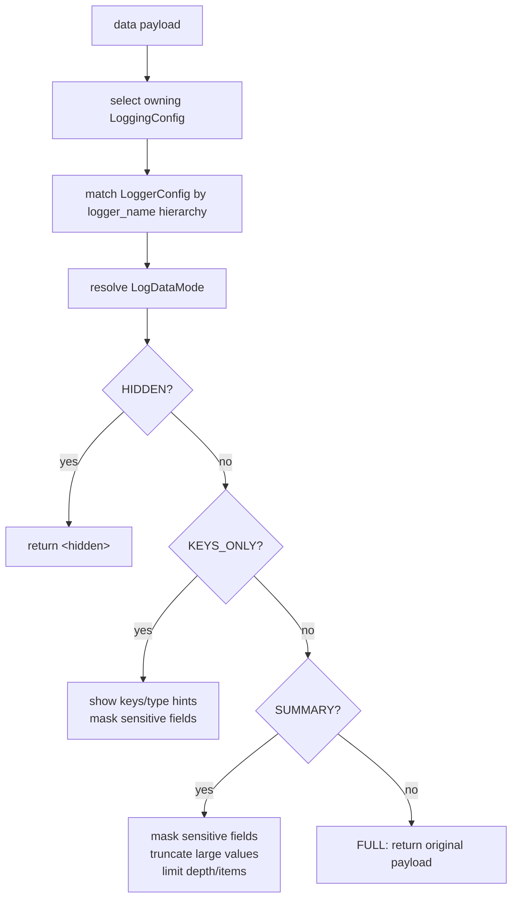

# Data Summarization

`LoggingConfig` is the only source of truth for how data payloads appear in logs. Logging call sites do not pass ad-hoc mode overrides.



## Sensitive Fields

`SummarizerConfig` masks sensitive field names case-insensitively. Defaults include passwords, tokens, secrets, API keys, credentials, and private keys.

```python
from rhosocial.activerecord.logging import LoggingConfig, LogDataMode, SummarizerConfig
from rhosocial.activerecord.model import ActiveRecord

ActiveRecord.__logging_config__ = LoggingConfig(
    log_data_mode=LogDataMode.SUMMARY,
    summarizer_config=SummarizerConfig(
        sensitive_fields={"password", "token", "api_key", "credit_card", "ssn"},
        mask_placeholder="[REDACTED]",
    ),
)
```

To add fields while preserving defaults:

```python
current = ActiveRecord.__logging_config__.summarizer_config.sensitive_fields
ActiveRecord.__logging_config__.summarizer_config = SummarizerConfig(
    sensitive_fields=current | {"credit_card", "ssn"},
)
```

## Data Modes

### Hidden

```python
from rhosocial.activerecord.logging import LogDataMode

ActiveRecord.__logging_config__.log_data_mode = LogDataMode.HIDDEN
# Result: "<hidden>"
```

### Keys Only

```python
ActiveRecord.__logging_config__.log_data_mode = LogDataMode.KEYS_ONLY
# Result: {'title': '<str>', 'content': '<str>', 'password': '***MASKED***'}
```

### Summary

```python
ActiveRecord.__logging_config__.log_data_mode = LogDataMode.SUMMARY
# Result: {'title': 'Short', 'content': 'Lorem ipsum...[truncated, 1000 chars total]', 'password': '***MASKED***'}
```

### Full

```python
ActiveRecord.__logging_config__.log_data_mode = LogDataMode.FULL
# Result includes complete values without masking or truncation.
```

`FULL` mode may expose secrets and should only be used in controlled debugging.

## Configuration Options

| Option | Default | Description |
| ------ | ------- | ----------- |
| `max_string_length` | 100 | Maximum string length before truncation |
| `max_bytes_length` | 64 | Maximum bytes length before truncation |
| `max_dict_items` | 10 | Maximum items to show in dicts/lists |
| `max_depth` | 5 | Maximum nesting depth for recursive data |
| `sensitive_fields` | Built-in sensitive field set | Field names to mask |
| `mask_placeholder` | `***MASKED***` | Placeholder for masked fields; string or callable |
| `field_maskers` | `{}` | Field-specific masker functions |
| `string_placeholder` | `...[truncated, {length} chars total]` | Placeholder for truncated strings |
| `show_type_hint` | `True` | Show type hints in truncation messages |

## Custom Maskers

```python
from rhosocial.activerecord.logging import SummarizerConfig

config = SummarizerConfig(
    sensitive_fields={"password", "email", "api_key"},
    mask_placeholder="[REDACTED]",
    field_maskers={
        "email": lambda value: str(value).split("@")[0][:1] + "***@" + str(value).split("@")[1]
        if "@" in str(value)
        else "***",
        "password": lambda value: "*" * min(len(str(value)), 8),
    },
)
ActiveRecord.__logging_config__.summarizer_config = config
```

Masking priority:

1. Field-specific `field_maskers`
2. Global `mask_placeholder`
3. Default `***MASKED***` if a masker raises an exception

## Model Usage

```python
import logging
from typing import Optional

from rhosocial.activerecord.logging import LoggingConfig, LogDataMode
from rhosocial.activerecord.model import ActiveRecord

class User(ActiveRecord):
    __table_name__ = "users"
    __logging_config__ = LoggingConfig(log_data_mode=LogDataMode.SUMMARY)
    id: Optional[int] = None
    username: str
    password: str

User.log_data(logging.INFO, "Creating user", {
    "username": "john",
    "password": "secret123",
    "bio": "A" * 1000,
})
```

## Backend Integration

Backend, query, and transaction logs use the backend's `LoggingConfig`, not `ActiveRecord.__logging_config__`:

```python
from rhosocial.activerecord.backend.impl.sqlite import SQLiteBackend, SQLiteConnectionConfig
from rhosocial.activerecord.logging import LoggingConfig, LogDataMode

backend_config = LoggingConfig(log_data_mode=LogDataMode.KEYS_ONLY)
User.configure(SQLiteConnectionConfig(database=":memory:"), SQLiteBackend, logging_config=backend_config)
```
