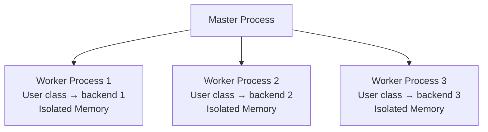
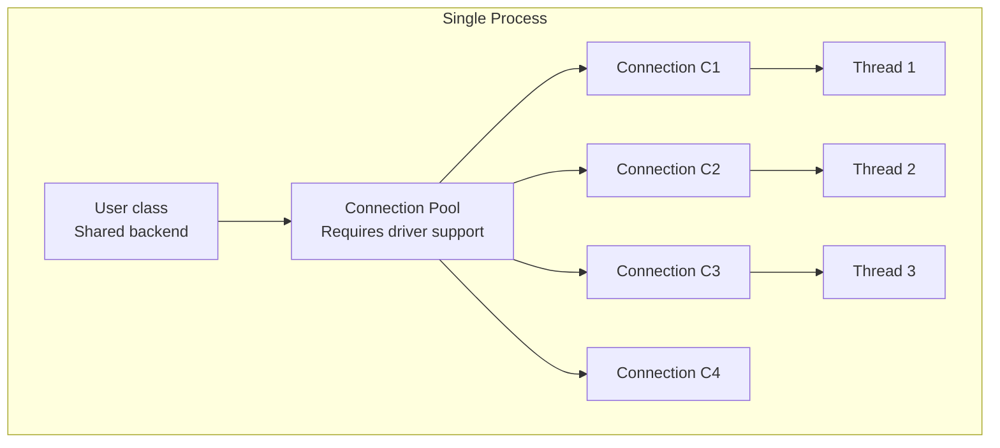

# Thread Safety and Concurrent Configuration

In multi-threaded environments -- web servers, background workers, async frameworks --
incorrect connection management is one of the most common sources of subtle data
corruption and hard-to-reproduce bugs.  This guide covers what you need to know to
configure models safely.

> 💡 **AI Prompt:** "My Flask/FastAPI app behaves strangely under load -- queries seem
> to return wrong results or fail intermittently.  Could this be a connection issue?"

---

## 1. Configure Once at Application Startup

`configure()` is a **class-level** operation.  It assigns a backend instance that is
shared by every instance of that model class.  Call it exactly once, before any request
or worker thread starts.

```python
# ✅ Correct: configure at application startup
# app.py / main.py
from rhosocial.activerecord.backend.impl.sqlite import SQLiteBackend, SQLiteConnectionConfig
from myapp.models import User, Order, Product

def create_app():
    config = SQLiteConnectionConfig(database="app.db")
    User.configure(config, SQLiteBackend)
    Order.configure(config, SQLiteBackend)   # shared backend -- same connection pool
    # ... other setup ...
    return app
```

```python
# ❌ Wrong: configure inside a request handler
@app.get("/users")
def list_users():
    User.configure(config, SQLiteBackend)   # called on every request!
    return User.query().all()
```

**Why it matters**: calling `configure()` inside a request handler replaces the shared
backend on every request.  Under concurrent load, one request may overwrite another's
backend mid-query, causing data to be read from or written to the wrong database.

---

## 2. SQLite and Thread Safety

SQLite's default connection mode (`check_same_thread=True`) allows only one thread to
use a connection.  The built-in `SQLiteBackend` handles this, but there are important
constraints to keep in mind.

### Single-threaded servers (development)

A single in-process `SQLiteBackend` is safe for single-threaded servers such as Flask's
built-in dev server:

```python
# Single-threaded development server -- one connection, one thread
config = SQLiteConnectionConfig(database="dev.db")
User.configure(config, SQLiteBackend)
```

### Multi-threaded servers (production)

For multi-threaded WSGI servers (Gunicorn with sync workers, uWSGI), each thread must
have its own connection.  The simplest approach is to configure per-process in a
post-fork hook:

```python
# gunicorn.conf.py
def post_fork(server, worker):
    """Called in each worker process after forking."""
    from rhosocial.activerecord.backend.impl.sqlite import SQLiteBackend, SQLiteConnectionConfig
    from myapp.models import Base  # your base model or all model classes

    config = SQLiteConnectionConfig(database="app.db")
    Base.configure(config, SQLiteBackend)
```

> ⚠️ **Do NOT configure before forking**: if you call `configure()` in the master
> process and then fork, all workers share the same connection object.  This is
> unsafe and will cause `check_same_thread` errors or silent data corruption.

### Async servers (ASGI)

For ASGI servers (Uvicorn, Hypercorn) running coroutines, the event loop runs in a
single thread, so a single backend is generally safe:

```python
# FastAPI startup event
from contextlib import asynccontextmanager
from fastapi import FastAPI

@asynccontextmanager
async def lifespan(app: FastAPI):
    # Configure on startup
    config = SQLiteConnectionConfig(database="app.db")
    User.configure(config, SQLiteBackend)
    yield
    # Cleanup on shutdown (if needed)

app = FastAPI(lifespan=lifespan)
```

---

## 3. MySQL / PostgreSQL Backends

For server-based databases, the backend uses a connection pool.  Key parameters:

```python
from rhosocial.activerecord.backend.impl.mysql import MySQLBackend, MySQLConnectionConfig

config = MySQLConnectionConfig(
    host="db.example.com",
    port=3306,
    database="myapp",
    user="app",
    password="...",
    pool_size=5,          # connections per worker process
    pool_timeout=30,      # seconds to wait for a free connection
    pool_recycle=3600,    # recycle connections after 1 hour
)
User.configure(config, MySQLBackend)
```

**Pool sizing rule of thumb**:

```text
pool_size = (CPU cores per worker) × 2  +  1
```

For a 4-core machine running 4 Gunicorn workers, start with `pool_size=9` per worker.
Adjust based on observed wait times.

### Connection Keep-Alive

Server-based databases (MySQL, PostgreSQL) typically disconnect idle connections after
a timeout period. For example:

- MySQL default `wait_timeout=28800` (8 hours)
- PostgreSQL default `tcp_keepalives_idle` and related parameters

If a connection in the pool is closed by the server, the next use will fail.
**Solutions**:

**Method 1: Periodic Connection Recycling (Recommended)**

Use the `pool_recycle` parameter to automatically recycle connections after idle time:

```python
# MySQL example
config = MySQLConnectionConfig(
    pool_recycle=3600,  # Recycle after 1 hour, less than database wait_timeout
)

# PostgreSQL example
from rhosocial.activerecord.backend.impl.postgresql import PostgreSQLConnectionConfig
config = PostgreSQLConnectionConfig(
    pool_recycle=3600,
)
```

**Method 2: TCP Keep-Alive**

Enable TCP keep-alive in the connection configuration to have the OS send keep-alive packets:

```python
# MySQL example
config = MySQLConnectionConfig(
    # ... other parameters ...
    # Enable TCP keep-alive (mysql-connector-python support)
    # Note: Parameter names vary by driver
)

# PostgreSQL example
config = PostgreSQLConnectionConfig(
    # psycopg v3 enables TCP keepalive by default
    # Adjust via environment variables or driver parameters
)
```

**Method 3: Active Ping Keep-Alive**

All backends provide a `ping()` method to actively check connection status and auto-reconnect.
Useful for scenarios requiring precise control over connection lifecycle:

```python
# Synchronous version
def ensure_connection():
    """Ensure connection is available, reconnect if necessary."""
    if not User.__backend__.ping(reconnect=True):
        raise RuntimeError("Cannot connect to database")

# Asynchronous version
async def ensure_connection_async():
    """Async ensure connection is available."""
    if not await User.__backend__.ping(reconnect=True):
        raise RuntimeError("Cannot connect to database")
```

**Typical use cases**:

```python
# Case 1: Check before long-running task
def process_batch(batch_id: int):
    ensure_connection()  # Ensure connection is available
    # ... batch processing logic ...

# Case 2: Periodic health check (for background workers)
import schedule

def health_check():
    if not User.__backend__.ping():
        logger.warning("Database connection lost, attempting reconnect...")
        User.__backend__.ping(reconnect=True)

schedule.every(5).minutes.do(health_check)

# Case 3: Validate before borrowing from connection pool
class ConnectionGuard:
    def __enter__(self):
        User.__backend__.ping(reconnect=True)
        return self

    def __exit__(self, *args):
        pass

# Usage
with ConnectionGuard():
    User.query().all()
```

> 💡 **Best practices**:
>
> - Prefer `pool_recycle` — it's more reliable and doesn't depend on network configuration
> - Set recycle time to 50%~70% of the database timeout
> - For critical tasks, call `ping()` beforehand for double assurance

---

## 4. Choosing a Multi-Worker Pattern

When you need concurrent request or task processing, there are two main worker patterns.
Your choice affects how models are configured and what database driver requirements apply.

### 4.1 Multi-Process Workers (Recommended)

**Use mature multi-process frameworks** such as Gunicorn, uWSGI, Celery, or Uvicorn.



**Advantages**:

- **Process isolation**: Each worker has its own memory space. The same `User` class
  can be configured with different backends in different processes without interference.
- **Unified semantics**: The configuration pattern is identical regardless of which
  database backend you use (SQLite, MySQL, PostgreSQL).
- **No driver concerns**: Connection pooling and thread safety are handled automatically
  by the framework and backend.

**Configuration**: Call `configure()` independently when each worker process starts:

```python
# Gunicorn configuration example
# gunicorn.conf.py
def post_fork(server, worker):
    """Called in each worker process after forking."""
    from rhosocial.activerecord.backend.impl.mysql import MySQLBackend, MySQLConnectionConfig
    from myapp.models import User, Order

    config = MySQLConnectionConfig(
        host="db.example.com",
        database="myapp",
        pool_size=5,
    )
    User.configure(config, MySQLBackend)
    Order.configure(config, MySQLBackend)
```

```python
# Celery configuration example
# celeryconfig.py or tasks.py
from celery import Celery

app = Celery('myapp')

@app.on_after_configure.connect
def setup_models(sender, **kwargs):
    """Configure models when worker starts."""
    from rhosocial.activerecord.backend.impl.mysql import MySQLBackend, MySQLConnectionConfig
    from myapp.models import User

    config = MySQLConnectionConfig(...)
    User.configure(config, MySQLBackend)
```

```python
# Uvicorn + FastAPI configuration example
from contextlib import asynccontextmanager
from fastapi import FastAPI

@asynccontextmanager
async def lifespan(app: FastAPI):
    # Configure when each worker process starts
    from rhosocial.activerecord.backend.impl.mysql import MySQLBackend, MySQLConnectionConfig
    from myapp.models import User

    config = MySQLConnectionConfig(...)
    User.configure(config, MySQLBackend)
    yield

app = FastAPI(lifespan=lifespan)

# Start command: uvicorn app:app --workers 4
```

> 💡 **Key point**: With multi-process mode, you **don't need to create different model
> classes for each worker**. The same `User` class is configured independently in each
> process; memory isolation between processes ensures safety.

### 4.2 Multi-Threaded Workers (Mind Driver Differences)

If you must use multi-threaded workers (e.g., custom thread pools), you need to rely
on the database driver's connection pooling functionality.



**Prerequisite**: The database driver must support connection pooling and be thread-safe.

**Connection pool support by driver**:

| Backend | Sync Driver | Pool Support | Async Driver | Pool Support |
|---------|-------------|--------------|--------------|--------------|
| **MySQL** | `mysql-connector-python` | ✅ Built-in | `aiomysql` | ❌ None |
| **PostgreSQL** | `psycopg` (v3) | ✅ Built-in | `asyncpg` | ✅ Built-in |
| **SQLite** | `sqlite3` (stdlib) | ❌ Single conn | `aiosqlite` | ❌ Single conn |

> ⚠️ **Important**: If your driver doesn't support connection pooling, you'll encounter
> connection contention issues in multi-threaded environments. Use multi-process workers
> instead in such cases.

**Multi-threaded configuration example** (only for drivers with pool support):

```python
import threading
from concurrent.futures import ThreadPoolExecutor
from rhosocial.activerecord.backend.impl.mysql import MySQLBackend, MySQLConnectionConfig
from myapp.models import User

# Configure once in main thread (pool handles multi-thread access automatically)
config = MySQLConnectionConfig(
    host="db.example.com",
    database="myapp",
    pool_size=10,        # Pool size ≥ thread count
    pool_timeout=30,
)
User.configure(config, MySQLBackend)

def worker_task(user_id: int):
    """Task running in thread pool."""
    user = User.find(id=user_id)
    # ... processing logic ...

# Use thread pool
with ThreadPoolExecutor(max_workers=10) as executor:
    executor.map(worker_task, range(100))
```

### 4.3 Pattern Selection Guidelines

| Scenario | Recommended Pattern | Reason |
|----------|---------------------|--------|
| Web services (production) | Multi-process (Gunicorn/Uvicorn) | Process isolation, high stability |
| Background task queues | Multi-process (Celery) | Task isolation, failure containment |
| CPU-intensive + database | Multi-process | Avoid GIL blocking |
| I/O-intensive (async drivers) | Single-process, multi-coroutine (Uvicorn) | Low coroutine switching overhead |
| Must share memory | Multi-thread + connection pool | Only with pool-capable drivers |

> 💡 **Best practice**: Unless you have an explicit shared memory requirement, prefer
> multi-process mode. This avoids database driver differences and provides more unified
> configuration semantics.

---

## 5. Detecting Misconfigured Models at Startup

Add an explicit check after all `configure()` calls to catch missing configurations
before any request is served:

```python
REQUIRED_MODELS = [User, Order, Product, UserMetric]

def assert_all_configured():
    unconfigured = [
        cls.__name__
        for cls in REQUIRED_MODELS
        if "__backend__" not in cls.__dict__ or cls.__dict__["__backend__"] is None
    ]
    if unconfigured:
        raise RuntimeError(
            f"Models not configured: {', '.join(unconfigured)}.  "
            "Call configure() for each model before starting the server."
        )

# Call in application factory, before returning the app
assert_all_configured()
```

---

## 6. Thread Safety Checklist

- [ ] `configure()` called once at application startup, not inside request handlers
- [ ] For forking servers (Gunicorn sync workers): configure in `post_fork` hook, not before fork
- [ ] For async servers (Uvicorn): configure in `lifespan` startup event
- [ ] SQLite: one backend per process/thread -- avoid sharing connections across threads
- [ ] MySQL/PostgreSQL: `pool_size` tuned to match worker concurrency
- [ ] Startup assertion verifies all required models are configured
- [ ] **Prefer multi-process mode for multi-worker scenarios** to avoid database driver differences
- [ ] Before using multi-threaded mode, confirm the database driver supports connection pooling

---

## Runnable Example

See [`docs/examples/chapter_03_modeling/concurrency.py`](../../../examples/chapter_03_modeling/concurrency.py)
for a self-contained script that demonstrates all four patterns above.

---

## See Also

- [Multiple Independent Connections](best_practices.md#8-multiple-independent-connections) — patterns for models sharing field definitions but using different databases
- [Configuration Management](configuration_management.md) — environment-based config (dev / test / prod)
- [Concurrency & Optimistic Locking](../performance/concurrency.md) — handling concurrent writes with `OptimisticLockMixin`
