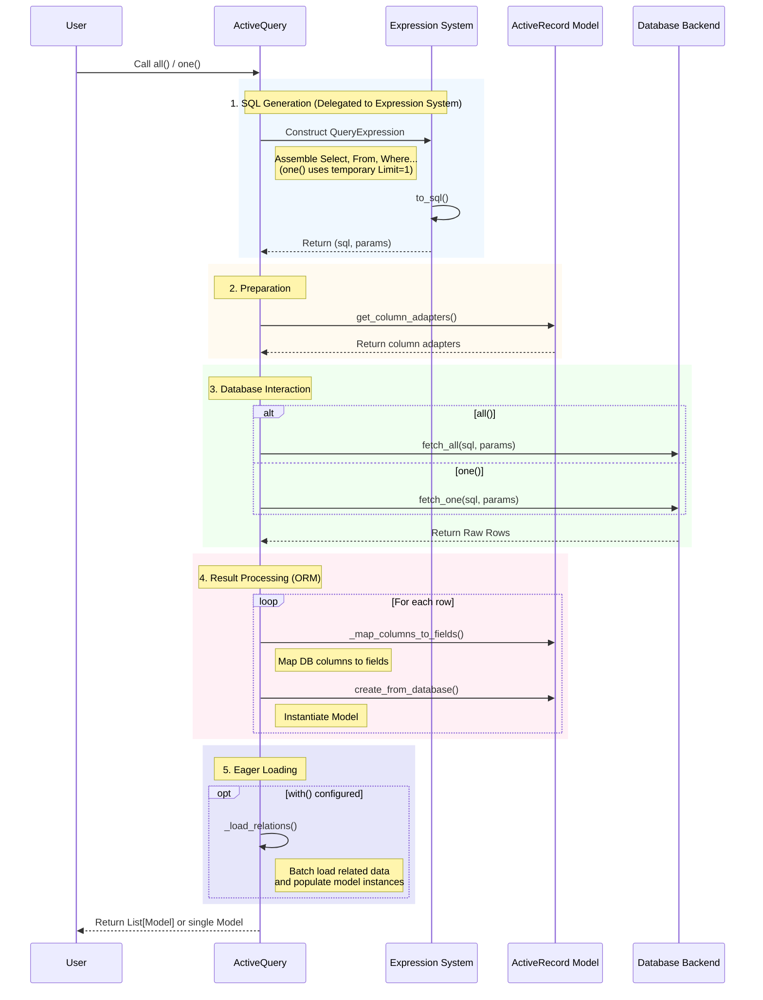
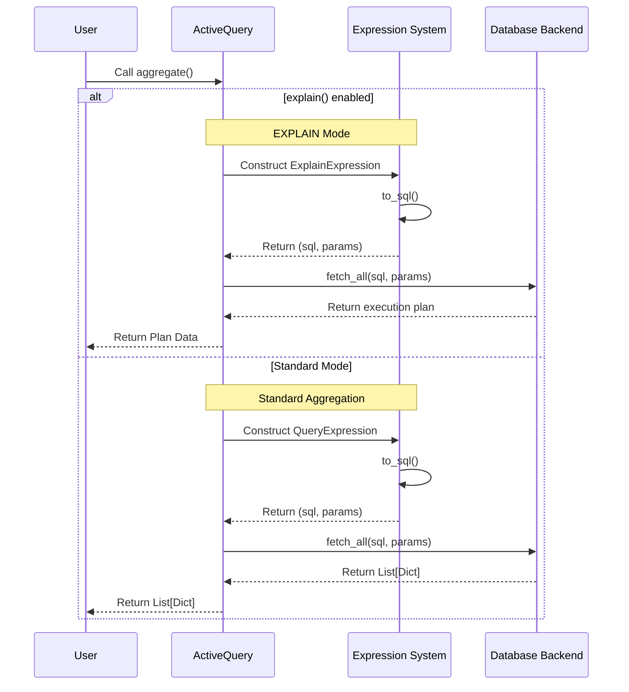
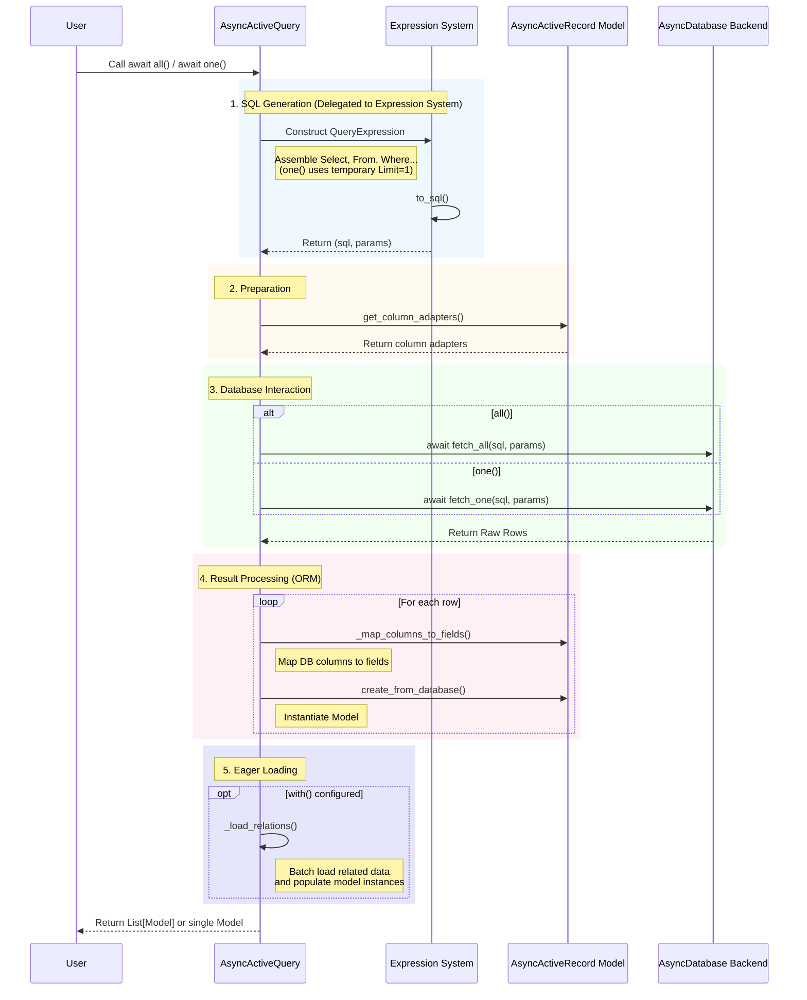

# ActiveQuery (Model Query)

`ActiveQuery` is the most commonly used query object in `rhosocial-activerecord`, designed for querying and manipulating `ActiveRecord` models. It provides rich query capabilities by mixing in several functionality modules.

By default, `ActiveQuery` returns model instances.

This chapter also introduces the **Sync-Async Parity** principle, where `ActiveQuery` has a direct asynchronous counterpart `AsyncActiveQuery` with equivalent functionality and consistent APIs.

## Simple and Predictable Design

Our query system emphasizes simplicity and predictability:

- **Simple Loading Strategies**: Only necessary and clear loading strategies, avoiding strategy explosion problems
- **No Complex Event Systems**: Unlike systems with dozens of event types, we provide only essential lifecycle hooks
- **Explicit Control**: Users have complete control over when and how queries are executed
- **No Hidden Behaviors**: No automatic flushing or hidden database operations that users cannot control

## BaseQueryMixin (Basic Building Blocks)

Provides the basic building blocks for SQL queries.

### `select(*columns)`

Specify columns to select. If not specified, selects all columns (`SELECT *`).

*   **Usage Examples**:

```python
# Select all columns
users = User.query().all()

# Select specific columns
users = User.query().select(User.c.id, User.c.name).all()

# Use alias (as_)
users = User.query().select(User.c.name.as_("username"), User.c.email).all()
```

*   **Notes**:
    *   If only a subset of columns is selected, unselected fields in the returned model instances will be default values or `None` (depending on model definition).
    *   In strict mode, if subsequent logic relies on unselected fields, errors may occur.

### `where(condition)`

Add filtering conditions (AND logic).

*   **Usage Examples**:

```python
# Simple condition
User.query().where(User.c.id == 1)

# Combined conditions (AND)
User.query().where((User.c.age >= 18) & (User.c.is_active == True))

# Combined conditions (OR) - Note: Must use | operator
User.query().where((User.c.role == 'admin') | (User.c.role == 'moderator'))

# Dictionary arguments (Automatically treated as AND)
User.query().where({"name": "Alice", "age": 25})
```

*   **Notes**:
    *   **Precedence Issue**: When using `&` (AND) and `|` (OR), **always use parentheses** around each sub-condition, as bitwise operators have higher precedence in Python.
    *   **None Handling**: If dictionary arguments contain `None`, it is automatically converted to `IS NULL` check.

### `order_by(*columns)`

Specify sort order.

*   **Usage Examples**:

```python
# Single column ascending
User.query().order_by(User.c.created_at)

# Multiple columns (First by role ascending, then by age descending)
User.query().order_by(User.c.role, (User.c.age, "DESC"))
```

### `limit(limit, offset=None)` / `offset(offset)`

Pagination query.

*   **Usage Examples**:

```python
# Get first 10 records
User.query().limit(10)

# Skip first 20, take 10 (i.e., Page 3)
User.query().limit(10, offset=20)
# Or
User.query().offset(20).limit(10)
```

### `group_by(*columns)` / `having(condition)`

Group statistics.

*   **Usage Examples**:

```python
# Count users per role
# SELECT role, COUNT(*) FROM users GROUP BY role HAVING COUNT(*) > 5
User.query() \
    .select(User.c.role, func.count().as_("count")) \
    .group_by(User.c.role) \
    .having(func.count() > 5) \
    .aggregate()
```

### `distinct(enable=True)`

Remove duplicate rows.

```python
# Get all distinct roles
User.query().select(User.c.role).distinct().all()
```

### `explain()`

Get query execution plan for performance analysis.

```python
plan = User.query().where(User.c.id == 1).explain()
print(plan)
```

### Window Functions

The `select` method supports Window Functions.

```python
from rhosocial.activerecord.backend.expression.window import Window, Rank

# Rank posts by views within each category
window = Window.partition_by(Post.c.category_id).order_by((Post.c.views, "DESC"))
rank_col = Rank().over(window).as_('rank')

results = Post.query().select(Post.c.title, rank_col).aggregate()
```

## JoinQueryMixin (Join Query)

Provides multi-table join capabilities.

*   `join(target, on=None, alias=None)`: Inner join (INNER JOIN).
*   `left_join(target, on=None, alias=None)`: Left outer join (LEFT JOIN).
*   `right_join(target, on=None, alias=None)`: Right outer join (RIGHT JOIN).
*   `full_join(target, on=None, alias=None)`: Full outer join (FULL JOIN).
*   `cross_join(target, alias=None)`: Cross join (CROSS JOIN).

*   **Usage Examples**:

```python
# Inner Join: Find users who have published posts
User.query().join(Post, on=(User.c.id == Post.c.user_id))

# Left Join: Find all users and their posts (if any)
User.query().left_join(Post, on=(User.c.id == Post.c.user_id))

# Aliased Join (Self Join)
# Find employees and their managers
Manager = User.c.with_table_alias("manager")
User.query().join(User, on=(User.c.manager_id == Manager.id), alias="manager")
```

*   **Notes**:
    *   When referencing columns in join queries, it is recommended to explicitly specify the table name (e.g., `User.c.id`) to avoid ambiguity.
    *   When using aliases, ensure `on` conditions reference columns from the aliased object.

## AggregateQueryMixin (Aggregation)

Provides data statistics and aggregation capabilities.

### Simple Aggregation
Returns scalar values directly.

*   `count(column=None)`: Count rows.
*   `sum_(column)`: Calculate sum (note the underscore to avoid conflict with Python's built-in `sum`).
*   `avg(column)`: Calculate average.
*   `min(column)`: Find minimum value.
*   `max(column)`: Find maximum value.

### Complex Aggregation
*   `aggregate(**kwargs)`: Execute complex aggregation queries, returning a dictionary.

*   **Usage Examples**:

```python
from rhosocial.activerecord.backend.expression import sum_, avg

# Simple stats
total_users = User.query().count()
max_age = User.query().max_(User.c.age)

# Complex aggregation: Calculate total score and average score simultaneously
stats = User.query().aggregate(
    total_score=sum_(User.c.score),
    avg_score=avg(User.c.score)
)
# Returns: {'total_score': 1000, 'avg_score': 85.5}
```

## RangeQueryMixin (Range & Convenience Filtering)

Provides common convenience filtering methods, which are internally converted to `where` conditions.

*   `in_list(column, values)`: `IN` query.
*   `not_in(column, values)`: `NOT IN` query.
*   `between(column, start, end)`: `BETWEEN` query.
*   `not_between(column, start, end)`: `NOT BETWEEN` query.
*   `like(column, pattern)` / `not_like(...)`: Case-sensitive pattern matching.
*   `ilike(column, pattern)` / `not_ilike(...)`: Case-insensitive pattern matching.
*   `is_null(column)` / `is_not_null(column)`: NULL check.

*   **Usage Examples**:

```python
# ID in list
User.query().in_list(User.c.id, [1, 2, 3])

# Name starts with "A"
User.query().like(User.c.name, "A%")

# Age between 20 and 30
User.query().between(User.c.age, 20, 30)
```

*   **Notes**:
    *   `like` and `ilike` require manually including wildcards `%` or `_` in the pattern.
    *   `in_list` with an empty list may generate a `FALSE` condition (depending on dialect).

## RelationalQueryMixin (Eager Loading)

Provides relationship eager loading capabilities to solve the N+1 query problem.
For detailed explanation of caching mechanism and N+1 problem, please refer to [Caching Mechanism](../performance/caching.md).

*   `with_(*relations)`: Eager load relationships.
*   `includes(*relations)`: Alias for `with_`.

The `with_()` method supports three main usages:

### 1. Simple Eager Loading

Use relation name strings to load direct relationships.

```python
# Eager load user's posts
users = User.query().with_("posts").all()

# Load multiple relations simultaneously
users = User.query().with_("posts", "profile").all()
```

### 2. Nested Eager Loading

Use dot-separated (`.`) path strings to load deep relationships.

```python
# Load user's posts, and comments for each post
users = User.query().with_("posts.comments").all()

# Load deeper levels: User's posts -> Comments -> Author
users = User.query().with_("posts.comments.author").all()
```

### 3. Eager Loading with Modifiers

Use a tuple `(relation_name, modifier_func)` to customize the related query (e.g., filtering, sorting).
The `modifier_func` receives a query object and should return the modified query object.

```python
# Eager load user's posts, but only load those with status 'published'
users = User.query().with_(
    ("posts", lambda q: q.where(Post.c.status == 'published'))
).all()

# Eager load comments for posts, ordered by creation time descending
posts = Post.query().with_(
    ("comments", lambda q: q.order_by((Comment.c.created_at, "DESC")))
).all()

# Mixed usage: Nested loading + Modifiers
# Note: The modifier applies only to the relation specified in the tuple
users = User.query().with_(
    "posts",
    ("posts.comments", lambda q: q.order_by((Comment.c.created_at, "DESC")))
).all()
```

*   **Notes**:
    *   Relation names must match `HasOne`, `HasMany`, `BelongsTo` field names defined in the model.
    *   The modifier function must return the query object.

## Set Operation Initiation

`ActiveQuery` can serve as the left operand for set operations. In addition to method calls, it also supports using Python operator overloading to initiate set operations.

*   `union(other)` or `+`: Initiate a UNION operation.
*   `intersect(other)` or `&`: Initiate an INTERSECT operation.
*   `except_(other)` or `-`: Initiate an EXCEPT operation.

The returned object is a `SetOperationQuery` instance, which can be further chained (e.g., `order_by`, `limit`, etc.) or executed directly (e.g., `all`, `to_sql`).

*   **Usage Examples**:

```python
q1 = User.query().where(User.c.age > 20)
q2 = User.query().where(User.c.age < 30)

# Using method calls
union_q = q1.union(q2)

# Using operator overloading
intersect_q = q1 & q2  # INTERSECT
except_q = q1 - q2     # EXCEPT
union_q_op = q1 + q2   # UNION

# Inspect SQL
sql, params = intersect_q.to_sql()
print(sql)
# SELECT * FROM users WHERE age > ? INTERSECT SELECT * FROM users WHERE age < ?
```

## Predefined Query Scopes

To improve code reusability and readability, it is recommended to define class methods in the Model class to encapsulate common query conditions. This is similar to the Scope concept in other frameworks.

Since `Model.query()` returns a new query object, you can chain methods on top of it and return the configured query object.

### Example

Suppose we have a blog system with `Post` and `Comment` models. We often want to query "published posts with the most comments".

```python
class Post(Model):
    # ... field definitions ...

    @classmethod
    def query_published(cls):
        """Predefined query: Only published posts"""
        return cls.query().where(cls.c.status == "published")

    @classmethod
    def query_with_most_comments(cls):
        """Predefined query: Ordered by comment count descending"""
        # Assuming Comment table has post_id field
        return cls.query_published() \
            .select(cls.c.title, func.count(Comment.c.id).as_("comment_count")) \
            .left_join(Comment, on=(cls.c.id == Comment.c.post_id)) \
            .group_by(cls.c.id) \
            .order_by(("comment_count", "DESC"))

# Usage
# Get top 5 published posts with most comments
top_posts = Post.query_with_most_comments().limit(5).all()
```

Benefits of this pattern:
1.  **Encapsulation**: The caller doesn't need to know the underlying Join and Where conditions.
2.  **Chainability**: Returns an `ActiveQuery` object, so you can continue to call `limit()`, `offset()`, `all()`, etc.
3.  **Reusability**: `query_with_most_comments` reuses `query_published` internally.

## Sync-Async Parity in Query Operations

The **Sync-Async Parity** principle ensures that `ActiveQuery` and `AsyncActiveQuery` provide equivalent functionality with consistent APIs. The same query building methods are available in both implementations:

```python
# Synchronous query
users_sync = User.query().where(User.c.active == True).all()

# Asynchronous query - same API, just with await
async def get_users_async():
    users_async = await AsyncUser.query().where(AsyncUser.c.active == True).all()
    return users_async
```

## Execution Methods

These methods trigger database queries and return results.

*   `all() -> List[Model]` / `all() -> List[Model] async`: Return a list of all matching model instances.
    *   **Note**: Calling `explain()` before this method has **no effect**. To get execution plans, use `aggregate()`.
*   `one() -> Optional[Model]` / `one() -> Optional[Model] async`: Return the first matching record, or None if none found.
    *   **Note**: Calling `explain()` before this method has **no effect**.
*   `exists() -> bool` / `exists() -> bool async`: Check if matching records exist.
    *   Provided by `AggregateQueryMixin`.
    *   **Note**: Calling `explain()` before this method has **no effect**.
*   `to_sql() -> Tuple[str, List[Any]]`: Return the generated SQL statement and parameters (does not execute query).

*   **Debugging Tips**:
    *   Call `to_sql()` before `all()` or `one()` to inspect the generated SQL, which is very helpful for troubleshooting.

```python
sql, params = User.query().where(User.c.id == 1).to_sql()
print(sql, params)
# SELECT * FROM users WHERE id = ? [1]
```

## Query Lifecycle and Execution Flow

To better understand how `ActiveQuery` works, the following diagrams illustrate the execution lifecycles of the `all()`, `one()`, and `aggregate()` methods.

**Important Note**: `ActiveQuery` itself is not responsible for concatenating SQL strings. It simply calls the underlying **Expression System** to construct queries. All SQL generation work is delegated to the expression system, ensuring SQL safety and compatibility with different database dialects.

### 1. Lifecycle of `all()` and `one()`

These methods are primarily used to retrieve model instances. The process includes expression construction, SQL generation, database execution, data mapping, and model instantiation.



### 2. Lifecycle of `aggregate()`

The `aggregate()` method returns raw dictionary data, typically used for statistical analysis or scenarios where model instantiation is not required. It also relies on the expression system for SQL generation.



### 3. Async Query Lifecycle

The asynchronous version follows the same flow but uses `await` for database operations:



The **Sync-Async Parity** ensures that both synchronous and asynchronous implementations follow the same architectural patterns and provide equivalent functionality, with the only difference being the use of `await` for asynchronous operations.

**Important Note**: `ActiveQuery` itself is not responsible for concatenating SQL strings. It simply calls the underlying **Expression System** to construct queries. All SQL generation work is delegated to the expression system, ensuring SQL safety and compatibility with different database dialects.

### 1. Lifecycle of `all()` and `one()`

These methods are primarily used to retrieve model instances. The process includes expression construction, SQL generation, database execution, data mapping, and model instantiation.


### 2. Lifecycle of `aggregate()`

The `aggregate()` method returns raw dictionary data, typically used for statistical analysis or scenarios where model instantiation is not required. It also relies on the expression system for SQL generation.


### 3. Async Query Lifecycle

The asynchronous version follows the same flow but uses `await` for database operations:


The **Sync-Async Parity** ensures that both synchronous and asynchronous implementations follow the same architectural patterns and provide equivalent functionality, with the only difference being the use of `await` for asynchronous operations.

