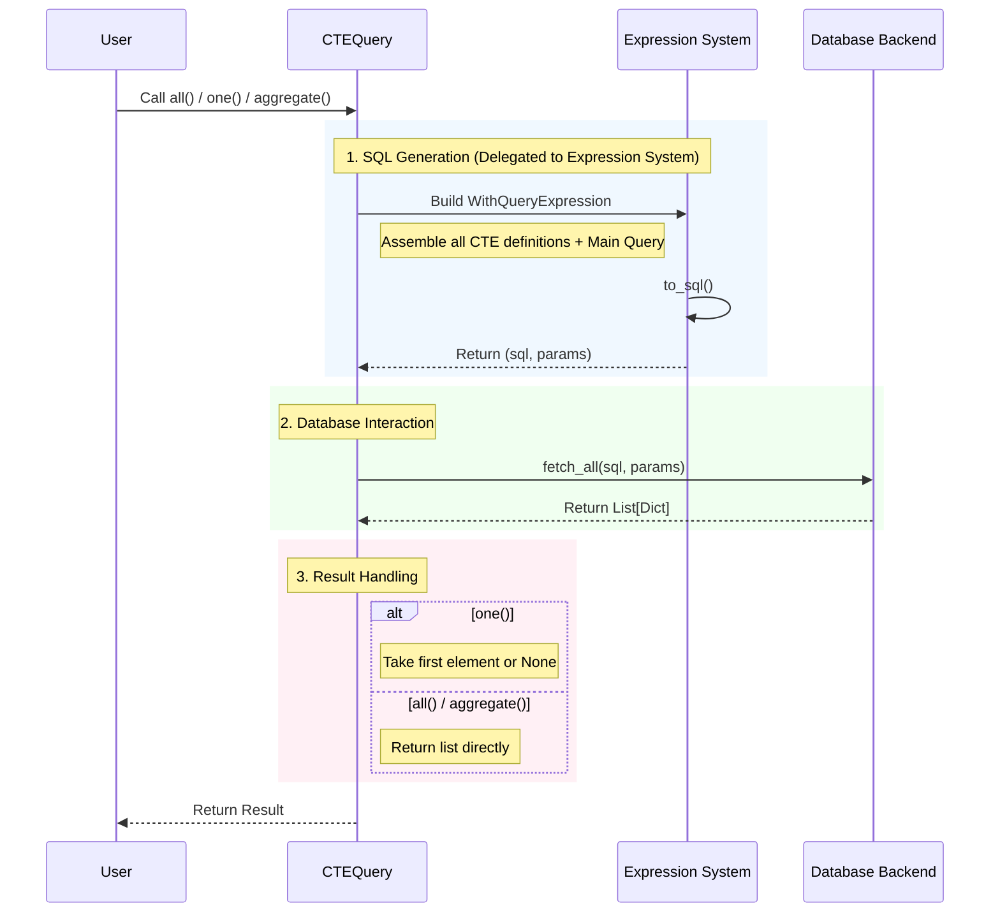

# CTEQuery (Common Table Expression Query)

`CTEQuery` is used to build Common Table Expressions (CTEs), which are particularly useful for recursive queries or complex analytical queries.

Unlike `ActiveQuery`, `CTEQuery` **is not bound to a specific Model**, and query results are typically returned as **dictionaries**.

## Inherited Capabilities

`CTEQuery` supports most query building Mixins from `ActiveQuery`, and the usage is consistent:

*   **[BaseQueryMixin](active_query.md#basequerymixin-basic-building-blocks)**: `select`, `where`, `order_by`, `limit`, etc.
*   **[JoinQueryMixin](active_query.md#joinquerymixin-joins)**: `join`, etc.
*   **[AggregateQueryMixin](active_query.md#aggregatequerymixin-aggregation)**: `count`, `sum`, etc.
*   **[RangeQueryMixin](active_query.md#rangequerymixin-range-and-convenience-filters)**: `in_list`, `like`, etc.

## Unique Methods

### `with_cte(name, query, columns=None, materialized=None)`

Defines a CTE.

*   `name`: The name of the CTE.
*   `query`: The query object defining the CTE.
*   `columns`: Optional, specifies column names for the CTE.
*   `materialized`: Optional, controls the `MATERIALIZED` option for PostgreSQL.

### `recursive(enabled=True)`

Enables recursive mode (`WITH RECURSIVE`).

### `query(main_query)`

Specifies the main query. If not specified, it defaults to querying the last defined CTE.

## Encapsulating as Predefined Query

Similar to `ActiveQuery`, the construction logic of `CTEQuery` can be complex. It is recommended to encapsulate it in Model class methods for reuse.

```python
class Category(Model):
    # ...
    
    @classmethod
    def query_hierarchy(cls, root_id):
        """Returns the entire category tree under the specified root node"""
        base_query = cls.query().where(cls.c.id == root_id)
        
        recursive_part = cls.query() \
            .join('category_tree', on='categories.parent_id = category_tree.id')
            
        union_query = base_query.union(recursive_part)
        
        return CTEQuery(cls.backend()) \
            .recursive(True) \
            .with_cte('category_tree', union_query) \
            .query(None) # Default query CTE

# Usage
tree_data = Category.query_hierarchy(1).all()
```

## Execution Methods

These methods trigger database queries and return results.

*   `all() -> List[Dict[str, Any]]`: Executes the query and returns all results (list of dictionaries).
    *   **Essence**: In `CTEQuery`, this method is an alias for `aggregate()`.
    *   **Note**: Unlike `ActiveQuery`, results from `CTEQuery` are always **dictionaries**, not model instances.
*   `one() -> Optional[Dict[str, Any]]`: Executes the query and returns the first result (dictionary), or `None` if no result is found.
    *   **Note**: This method currently fetches all results and takes the first one. If a large result set is expected, it is recommended to use `limit(1)` to improve performance.
*   `aggregate() -> List[Dict[str, Any]]`: Executes the query and returns results.
    *   Supports `explain()`: If `explain()` is called before this method, it returns the query execution plan.
*   `to_sql() -> Tuple[str, List[Any]]`: Returns the generated SQL statement and parameters.
    *   The generated SQL usually starts with `WITH ...`.

## Query Lifecycle and Execution Flow

The execution flow of `CTEQuery` is simpler than `ActiveQuery` because it does not involve model mapping or association loading.



## Usage Examples

### 1. Basic CTE (Simplifying Complex Logic)

Suppose we want to find "high-value users" (total order amount > 1000) and query their details.

```python
from rhosocial.activerecord.query import CTEQuery
from rhosocial.activerecord.backend.expression import sum_

# 1. Define CTE: Calculate total order amount for each user
# SELECT user_id, SUM(amount) as total_amount FROM orders GROUP BY user_id
user_totals_cte = Order.query() \
    .select(Order.c.user_id, sum_(Order.c.amount).as_("total_amount")) \
    .group_by(Order.c.user_id)

# 2. Build CTE Query
query = CTEQuery(User.backend()) \
    .with_cte("user_totals", user_totals_cte) \
    .query(
        # Main query: Join CTE and Users table
        User.query().join("user_totals", on="users.id = user_totals.user_id") \
            .where("user_totals.total_amount > 1000")
    )

results = query.all() # Returns list of dictionaries
```

### 2. Recursive CTE (Hierarchical Traversal)

Query a category and all its subcategories (assuming `Category` table has `id` and `parent_id`).

```python
# 1. Anchor Member: Top-level category
base_query = Category.query().where(Category.c.id == 1)

# 2. Recursive Member: Join with previous level results
# Note: Reference the CTE name itself in the recursive part
recursive_part = Category.query() \
    .join('category_tree', on='categories.parent_id = category_tree.id')

# 3. Combine (UNION)
union_query = base_query.union(recursive_part)

# 4. Execute Recursive Query
cte_query = CTEQuery(Category.backend()) \
    .recursive(True) \
    .with_cte('category_tree', union_query) \
    .query(
        # Defaults to querying the last CTE ('category_tree')
        None 
    )

results = cte_query.all()
```

## Notes

1.  **Return Type**: `CTEQuery` results are always **lists of dictionaries** (`List[Dict[str, Any]]`) and are not automatically converted to Model instances.
2.  **Backend Compatibility**: CTEs require database support (MySQL 8.0+, PostgreSQL, SQLite 3.8+).
3.  **Recursion Limits**: Ensure recursive queries have a termination condition to avoid infinite loops or stack overflows.
