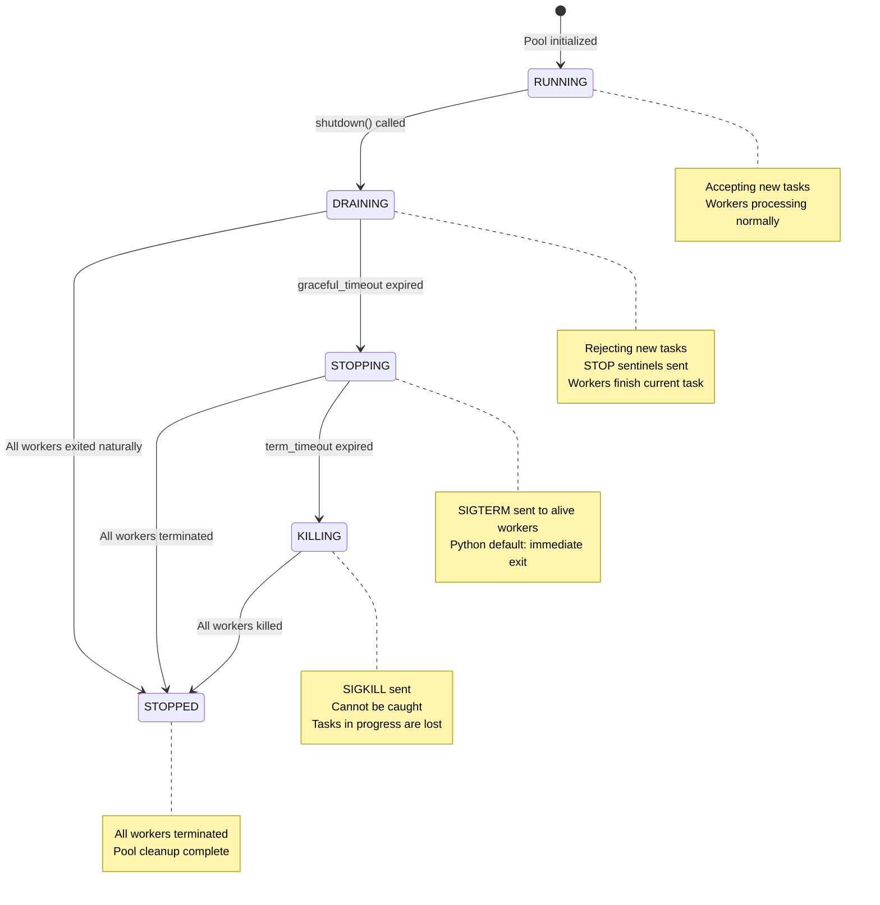

# Worker Pool Module

The `WorkerPool` module provides a simple, lightweight resident worker pool for parallel task execution. It is designed to work with `spawn` mode multiprocessing, ensuring cross-platform consistency.

## Table of Contents

1. [Overview](#1-overview)
2. [Design Principles](#2-design-principles)
3. [Quick Start](#3-quick-start)
4. [Lifecycle Hooks](#4-lifecycle-hooks)
5. [Management & Statistics](#5-management--statistics)
6. [API Reference](#6-api-reference)
7. [Task Writing Guide](#7-task-writing-guide)
8. [Best Practices](#8-best-practices)
9. [Common Pitfalls](#9-common-pitfalls)

---

## 1. Overview

### What is WorkerPool?

`WorkerPool` is a resident worker pool that manages a fixed number of worker processes. Unlike `multiprocessing.Pool`, workers in `WorkerPool` stay alive after completing tasks, waiting for new work via a queue.

### Key Features

| Feature | Description |
|---------|-------------|
| **Spawn Mode** | Uses `spawn` context for cross-platform consistency |
| **Resident Workers** | Workers persist, avoiding repeated process startup overhead |
| **Crash Recovery** | Dead workers are automatically restarted |
| **Task Attribution** | Failed tasks are tracked even if the worker crashes |
| **Future Pattern** | Async result handling with timeout support |
| **Graceful Shutdown** | Three-phase shutdown: DRAINING → STOPPING → KILLING → STOPPED |
| **Lifecycle Hooks** | Worker-level and task-level hook functions |
| **Resource Monitoring** | Task duration, memory delta, and other resource statistics |
| **Management & Statistics** | Runtime status query, statistics collection, health check |

### Pool State Machine

The pool state transitions during the shutdown process:



### When to Use WorkerPool

- **Batch processing**: Process many independent items in parallel
- **CPU-bound work**: Distribute CPU-intensive operations across processes
- **I/O-bound work**: Parallel database queries or API calls
- **External queue consumers**: As a worker pool for Celery, RQ, or other task queues

### When NOT to Use WorkerPool

WorkerPool is **NOT** a complete task queue system. The following features require specialized libraries (e.g., Celery, RQ, Dramatiq):

| Feature | WorkerPool | Professional Task Queues |
|---------|------------|--------------------------|
| Task Priority | ❌ FIFO only | ✅ Supported |
| Task Persistence | ❌ In-memory queue | ✅ Redis/DB |
| Delayed Tasks | ❌ Not supported | ✅ Supported |
| Automatic Retry | ❌ Not supported | ✅ Supported |
| Task Deduplication | ❌ Not supported | ✅ Supported |
| Task Dependencies | ❌ Not supported | ✅ Supported |
| Distributed | ❌ Single process | ✅ Multi-node |

If you need these features, you can use WorkerPool as a consumer for external task queues, or use a professional task queue library directly.

---

## 2. Design Principles

### WorkerPool Only Handles Infrastructure

The core design philosophy: **WorkerPool manages task dispatch, result collection, and crash recovery — nothing else.**

| WorkerPool Responsibilities | User Responsibilities |
|----------------------------|----------------------|
| Process lifecycle | Define task functions |
| Task queue management | Import necessary ORM models |
| Result collection | Configure database connections |
| Worker health monitoring | Handle transactions |
| Crash recovery | Manage connection lifecycle |

### Why This Design?

The minimal design philosophy is intentional. Alternative approaches that attempt to abstract more functionality face fundamental challenges:

1. **Handler registration cannot cross processes**: Global state doesn't survive `spawn`, making callback-based patterns unreliable
2. **Dynamic imports are fragile**: Module paths often cannot be resolved consistently in worker processes
3. **Model serialization is complex**: ActiveRecord instances contain database connections and cannot be pickled directly

By keeping `WorkerPool` minimal, users have full control and transparency over their data operations.

---

## 3. Quick Start

### Basic Usage

```python
from rhosocial.activerecord.worker import WorkerPool

# Define a task function (must be module-level)
def double(n: int) -> int:
    return n * 2

# Use WorkerPool
if __name__ == '__main__':
    with WorkerPool(n_workers=4) as pool:
        # Submit a single task
        future = pool.submit(double, 5)
        result = future.result(timeout=10)
        print(result)  # Output: 10

        # Submit multiple tasks
        futures = [pool.submit(double, i) for i in range(10)]
        results = [f.result(timeout=10) for f in futures]
        print(results)  # Output: [0, 2, 4, 6, 8, 10, 12, 14, 16, 18]
```

### With Database Operations

```python
# task_functions.py - A separate module for task definitions
from typing import Optional

def submit_comment_task(params: dict) -> int:
    """
    Submit a comment task.

    Args:
        params: Dictionary containing:
            - db_path: Database path
            - post_id: Post ID
            - user_id: User ID
            - content: Comment content

    Returns:
        int: ID of the newly created comment
    """
    db_path = params['db_path']
    post_id = params['post_id']
    user_id = params['user_id']
    content = params['content']

    # 1. Configure database connection (inside worker process)
    from rhosocial.activerecord.backend.impl.sqlite import SQLiteBackend
    from rhosocial.activerecord.backend.impl.sqlite.config import SQLiteConnectionConfig
    from myapp.models import User, Post, Comment

    config = SQLiteConnectionConfig(database=db_path)
    User.configure(config, SQLiteBackend)
    Post.__backend__ = User.backend()
    Comment.__backend__ = User.backend()

    comment_id: Optional[int] = None

    try:
        # 2. Execute business logic in transaction
        with Post.transaction():
            post = Post.find_one(post_id)
            if post is None:
                raise ValueError(f"Post {post_id} not found")

            user = User.find_one(user_id)
            if user is None:
                raise ValueError(f"User {user_id} not found")
            if not user.is_active:
                raise ValueError(f"User {user_id} is not active")

            if post.status != 'published':
                raise ValueError(f"Post {post_id} is not published")

            comment = Comment(
                post_id=post.id,
                user_id=user_id,
                content=content
            )
            comment.save()
            comment_id = comment.id

        # 3. Return result
        return comment_id

    finally:
        # 4. Cleanup connection
        User.backend().disconnect()
```

```python
# main.py - Main application
from rhosocial.activerecord.worker import WorkerPool
from task_functions import submit_comment_task

if __name__ == '__main__':
    with WorkerPool(n_workers=4) as pool:
        # Submit comment task
        future = pool.submit(submit_comment_task, {
            'db_path': '/path/to/app.db',
            'post_id': 123,
            'user_id': 456,
            'content': 'Great article!'
        })

        try:
            comment_id = future.result(timeout=30)
            print(f"Comment created with ID: {comment_id}")
        except Exception as e:
            print(f"Failed to create comment: {e}")
            if future.traceback:
                print(f"Traceback:\n{future.traceback}")
```

---

## 4. Lifecycle Hooks

WorkerPool supports custom hook functions at key lifecycle points for both workers and tasks.

### Hook Types

| Event | When Triggered | Typical Use |
|-------|----------------|-------------|
| `WORKER_START` | Worker process starts | Initialize database connections, load config |
| `WORKER_STOP` | Worker process exits | Close connection pools, release resources |
| `TASK_START` | Before task execution | Log start, establish task-level connection |
| `TASK_END` | After task execution | Log execution, cleanup, statistics monitoring |

### Hook Usage Example

```python
from rhosocial.activerecord.worker import WorkerPool, WorkerContext, TaskContext

def init_worker(ctx: WorkerContext):
    """Initialize database connection when worker starts"""
    from myapp.db import Database
    Database.connect()
    print(f"Worker-{ctx.worker_id} (pid={ctx.pid}) initialized")

def cleanup_worker(ctx: WorkerContext):
    """Cleanup resources when worker exits"""
    from myapp.db import Database
    Database.disconnect()
    print(f"Worker-{ctx.worker_id} processed {ctx.task_count} tasks")

def log_task(ctx: TaskContext):
    """Log after task completes"""
    import logging
    logger = logging.getLogger(__name__)
    status = "SUCCESS" if ctx.success else "FAILED"
    logger.info(
        f"Task {ctx.task_id[:8]}: {ctx.fn_name} - "
        f"{status}, duration={ctx.duration:.3f}s, "
        f"memory_delta={ctx.memory_delta_mb:.3f}MB"
    )

with WorkerPool(
    n_workers=4,
    on_worker_start=init_worker,
    on_worker_stop=cleanup_worker,
    on_task_end=log_task,
) as pool:
    futures = [pool.submit(process_data, i) for i in range(100)]
    for f in futures:
        f.result(timeout=30)
```

### Connection Management Strategies

**Design Principle**: The framework doesn't make choices for users - let them decide when to manage connections based on their business scenarios.

| Strategy | Hook Location | Use Case | Characteristics |
|----------|---------------|----------|-----------------|
| **Worker-level connection** | WORKER_START/STOP | High-frequency short operations | Connection reuse, reduced overhead |
| **Task-level connection** | TASK_START/END | Low-frequency long operations | On-demand connection, timely release |

```python
# Scenario 1: High-frequency short operations → Worker-level connection
def worker_connect(ctx: WorkerContext):
    from myapp.db import Database
    Database.connect()

def worker_disconnect(ctx: WorkerContext):
    from myapp.db import Database
    Database.disconnect()

pool = WorkerPool(
    n_workers=4,
    on_worker_start=worker_connect,
    on_worker_stop=worker_disconnect,
)
# Result: 4 workers, 4 connections, all tasks reuse them

# Scenario 2: Low-frequency long operations → Task-level connection
def task_connect(ctx: TaskContext):
    from myapp.db import Database
    Database.connect()

def task_disconnect(ctx: TaskContext):
    from myapp.db import Database
    Database.disconnect()

pool = WorkerPool(
    n_workers=4,
    on_task_start=task_connect,
    on_task_end=task_disconnect,
)
# Result: On-demand connections, released after task completion
```

### Context Objects

#### WorkerContext

```python
@dataclass
class WorkerContext:
    worker_id: int        # Worker index (0, 1, 2, ...)
    pid: int              # Process ID
    pool_id: str          # Pool instance unique identifier
    start_time: float     # Worker start timestamp
    task_count: int       # Number of tasks executed
```

#### TaskContext

```python
@dataclass
class TaskContext:
    task_id: str                    # Task ID
    worker_ctx: WorkerContext       # Worker context
    fn_name: str                    # Task function name
    args: Tuple                     # Positional arguments
    kwargs: Dict[str, Any]          # Keyword arguments
    start_time: float               # Task start time
    end_time: float                 # Task end time
    success: bool                   # Whether succeeded
    result: Any                     # Task result (on success)
    error: Optional[Exception]      # Task exception (on failure)
    memory_start: int               # Memory at task start (bytes)
    memory_end: int                 # Memory at task end (bytes)

    @property
    def duration(self) -> float:
        """Task duration in seconds"""

    @property
    def memory_delta(self) -> int:
        """Memory delta in bytes"""

    @property
    def memory_delta_mb(self) -> float:
        """Memory delta in MB"""

    def log_summary(self, logger, level=logging.INFO) -> None:
        """Log task execution summary"""
```

### Dynamic Hook Registration

```python
from rhosocial.activerecord.worker import WorkerEvent

pool = WorkerPool(n_workers=4)

# Dynamic registration
name = pool.register_hook(WorkerEvent.TASK_END, log_task, "task_logger")

# Unregister hook
pool.unregister_hook(WorkerEvent.TASK_END, name)
```

### String Path Hooks

Hooks can be specified as string paths for configuration-driven setups:

```python
with WorkerPool(
    n_workers=4,
    on_worker_start="myapp.hooks.init_worker",
    on_worker_stop="myapp.hooks.cleanup_worker",
    on_task_end="myapp.hooks.log_task",
) as pool:
    pool.submit(process_data, data)
```

---

## 5. Management & Statistics

WorkerPool provides rich runtime status query and statistics capabilities for monitoring and debugging.

### Status Properties

```python
with WorkerPool(n_workers=4) as pool:
    # Basic status
    print(f"State: {pool.state.name}")           # RUNNING
    print(f"Pool ID: {pool.pool_id}")            # Unique identifier
    print(f"Workers: {pool.alive_workers}/{pool.n_workers}")

    # Task status
    print(f"Pending tasks: {pool.pending_tasks}")      # Waiting in queue
    print(f"In-flight tasks: {pool.in_flight_tasks}")  # Currently executing
    print(f"Queued futures: {pool.queued_futures}")    # Waiting for result
```

| Property | Description |
|----------|-------------|
| `state` | Pool state (RUNNING/DRAINING/STOPPING/KILLING/STOPPED) |
| `pool_id` | Pool unique identifier |
| `n_workers` | Configured number of workers |
| `alive_workers` | Number of alive workers |
| `pending_tasks` | Tasks waiting in queue (approximate) |
| `in_flight_tasks` | Tasks currently executing |
| `queued_futures` | Futures waiting for result |

### Statistics

```python
stats = pool.get_stats()

print(f"Tasks: {stats.tasks_submitted} submitted, "
      f"{stats.tasks_completed} completed, "
      f"{stats.tasks_failed} failed")

print(f"Workers: {stats.worker_crashes} crashes, "
      f"{stats.worker_restarts} restarts")

print(f"Avg duration: {stats.avg_task_duration:.3f}s")
print(f"Avg memory: {stats.avg_memory_delta_mb:.3f}MB")
print(f"Uptime: {stats.uptime:.1f}s")
```

#### PoolStats Fields

| Field | Description |
|-------|-------------|
| `total_workers` | Configured number of workers |
| `alive_workers` | Number of alive workers |
| `worker_restarts` | Worker restart count |
| `worker_crashes` | Worker crash count |
| `tasks_submitted` | Total tasks submitted |
| `tasks_completed` | Successfully completed tasks |
| `tasks_failed` | Failed tasks |
| `tasks_orphaned` | Orphaned tasks (lost due to worker crash) |
| `tasks_pending` | Tasks waiting |
| `tasks_in_flight` | Tasks executing |
| `uptime` | Pool uptime in seconds |
| `total_task_duration` | Sum of all task durations |
| `avg_task_duration` | Average task duration |
| `total_memory_delta` | Total memory delta in bytes |
| `avg_memory_delta_mb` | Average memory delta in MB |

### Health Check

```python
health = pool.health_check()

if not health["healthy"]:
    print(f"Pool unhealthy: {health['state']}")
    for warning in health["warnings"]:
        print(f"  - {warning}")
else:
    print(f"Pool healthy: {health['alive_workers']} workers active")
```

Return fields:

| Field | Description |
|-------|-------------|
| `healthy` | Whether healthy |
| `state` | Current state |
| `alive_workers` | Alive worker count |
| `dead_workers` | Dead worker count |
| `pending_tasks` | Pending task count |
| `in_flight_tasks` | In-flight task count |
| `warnings` | Warning messages list |

**Warning conditions**:

- High failure rate (>10% tasks failing)
- Worker crashes detected
- Queue backlog (>100 tasks waiting)
- Pool not in running state

### Wait for Completion

```python
# Submit all tasks
futures = [pool.submit(process, i) for i in range(1000)]

# Wait for all tasks to complete, max 60 seconds
if pool.drain(timeout=60):
    print("All tasks completed")
else:
    print(f"Timeout, {pool.queued_futures} tasks still pending")
```

### Future Execution Metadata

After task completion, the `Future` object contains detailed execution metadata:

```python
future = pool.submit(process_data, data)
result = future.result(timeout=30)

# Execution metadata
print(f"Worker: {future.worker_id}")
print(f"Duration: {future.duration:.3f}s")
print(f"Memory delta: {future.memory_delta_mb:.3f}MB")
print(f"Start time: {future.start_time}")
print(f"End time: {future.end_time}")
```

| Property | Description |
|----------|-------------|
| `worker_id` | Worker ID that executed the task |
| `start_time` | Task start timestamp |
| `end_time` | Task end timestamp |
| `duration` | Task duration in seconds |
| `memory_start` | Memory at start in bytes |
| `memory_end` | Memory at end in bytes |
| `memory_delta` | Memory delta in bytes |
| `memory_delta_mb` | Memory delta in MB |

---

## 6. API Reference

### WorkerPool

```python
class WorkerPool:
    """
    Spawn-mode Resident Worker Pool with Graceful Shutdown.

    Worker processes start once and stay resident.
    Tasks dispatched via Queue, results captured via Future.
    Worker crash triggers automatic restart.
    Three-phase shutdown: DRAINING → STOPPING → KILLING → STOPPED.
    Supports lifecycle hooks and resource monitoring.
    """

    def __init__(
        self,
        n_workers: int = 4,
        check_interval: float = 0.5,
        orphan_timeout: Optional[float] = None,
        on_worker_start: Optional[AnyWorkerHook] = None,
        on_worker_stop: Optional[AnyWorkerHook] = None,
        on_task_start: Optional[AnyTaskHook] = None,
        on_task_end: Optional[AnyTaskHook] = None,
    ):
        """
        Initialize WorkerPool.

        Args:
            n_workers: Number of worker processes
            check_interval: Interval for supervisor to check worker health
            orphan_timeout: Orphan task detection timeout
            on_worker_start: Worker startup hook
            on_worker_stop: Worker exit hook
            on_task_start: Task start hook
            on_task_end: Task end hook
        """

    def submit(self, fn: Callable, *args, **kwargs) -> Future:
        """Submit a task, immediately return Future."""

    def map(self, fn: Callable, iterable, timeout: Optional[float] = None) -> list:
        """Batch submit, collect results in order."""

    def shutdown(
        self,
        graceful_timeout: float = 10.0,
        term_timeout: float = 3.0,
    ) -> ShutdownReport:
        """Three-phase graceful shutdown."""

    def register_hook(
        self,
        event: WorkerEvent,
        hook: Union[AnyWorkerHook, AnyTaskHook],
        name: Optional[str] = None,
    ) -> str:
        """Register lifecycle hook, returns hook name."""

    def unregister_hook(self, event: WorkerEvent, name: str) -> bool:
        """Unregister hook, returns whether successful."""

    def get_hooks(self, event: WorkerEvent) -> List[Tuple[str, Union[AnyWorkerHook, AnyTaskHook]]]:
        """Get all hooks for specified event."""

    def get_stats(self) -> PoolStats:
        """Get current statistics snapshot."""

    def health_check(self) -> Dict[str, Any]:
        """Perform health check, returns status dict."""

    def drain(self, timeout: Optional[float] = None) -> bool:
        """Wait for all tasks to complete."""

    # Status properties
    @property
    def state(self) -> PoolState:
        """Current Pool state"""

    @property
    def pool_id(self) -> str:
        """Pool unique identifier"""

    @property
    def n_workers(self) -> int:
        """Configured number of workers"""

    @property
    def alive_workers(self) -> int:
        """Number of alive workers"""

    @property
    def pending_tasks(self) -> int:
        """Tasks waiting in queue"""

    @property
    def in_flight_tasks(self) -> int:
        """Tasks currently executing"""

    @property
    def queued_futures(self) -> int:
        """Futures waiting for result"""
```

### PoolState

```python
class PoolState(Enum):
    """Pool state machine (shutdown flow)."""
    RUNNING = auto()   # Normal operation, accepting tasks
    DRAINING = auto()  # Rejecting new tasks, waiting for in-flight
    STOPPING = auto()  # SIGTERM sent
    KILLING = auto()   # SIGKILL being sent
    STOPPED = auto()   # All processes terminated
```

### WorkerEvent

```python
class WorkerEvent(Enum):
    """Worker lifecycle events."""
    WORKER_START = auto()  # Worker process starts
    WORKER_STOP = auto()   # Worker process exits
    TASK_START = auto()    # Before task execution
    TASK_END = auto()      # After task execution
```

### PoolStats

```python
@dataclass
class PoolStats:
    """Pool execution statistics snapshot."""
    # Worker statistics
    total_workers: int = 0
    alive_workers: int = 0
    worker_restarts: int = 0
    worker_crashes: int = 0

    # Task statistics
    tasks_submitted: int = 0
    tasks_completed: int = 0
    tasks_failed: int = 0
    tasks_orphaned: int = 0

    # Queue statistics
    tasks_pending: int = 0
    tasks_in_flight: int = 0

    # Time statistics
    uptime: float = 0.0
    total_task_duration: float = 0.0
    avg_task_duration: float = 0.0

    # Memory statistics
    total_memory_delta: int = 0
    avg_memory_delta_mb: float = 0.0
```

### WorkerContext

```python
@dataclass
class WorkerContext:
    """Context passed to worker-level hooks."""
    worker_id: int        # Worker index
    pid: int              # Process ID
    pool_id: str          # Pool instance identifier
    start_time: float     # Worker start time
    task_count: int       # Tasks executed
```

### TaskContext

```python
@dataclass
class TaskContext:
    """Context passed to task-level hooks."""
    task_id: str
    worker_ctx: WorkerContext
    fn_name: str
    args: Tuple
    kwargs: Dict[str, Any]
    start_time: float
    end_time: float
    success: bool
    result: Any
    error: Optional[Exception]
    memory_start: int
    memory_end: int

    @property
    def duration(self) -> float:
        """Task duration in seconds"""

    @property
    def memory_delta(self) -> int:
        """Memory delta in bytes"""

    @property
    def memory_delta_mb(self) -> float:
        """Memory delta in MB"""

    def log_summary(self, logger, level=logging.INFO) -> None:
        """Log task execution summary"""
```

### ShutdownReport

```python
@dataclass
class ShutdownReport:
    """Return value of shutdown(), describes shutdown process."""
    duration: float          # Total shutdown time in seconds
    final_phase: str         # Phase where shutdown completed
    tasks_in_flight: int     # Tasks in progress when shutdown started
    tasks_killed: int        # Workers with tasks when SIGKILL sent
    workers_killed: int      # Workers killed by SIGKILL
```

### Exceptions

```python
class PoolDrainingError(RuntimeError):
    """Pool is in shutdown flow, no new tasks accepted."""

class TaskTimeoutError(TimeoutError):
    """Task execution timed out."""

class WorkerCrashedError(RuntimeError):
    """Worker process crashed, task could not complete."""
```

### Future

```python
class Future:
    """Async result handle with execution metadata."""

    def result(self, timeout: Optional[float] = None) -> Any:
        """Block and wait for result."""

    @property
    def done(self) -> bool:
        """Whether task has completed"""

    @property
    def succeeded(self) -> bool:
        """Whether task succeeded"""

    @property
    def failed(self) -> bool:
        """Whether task failed"""

    @property
    def traceback(self) -> Optional[str]:
        """Traceback string when task failed"""

    # Execution metadata
    @property
    def worker_id(self) -> Optional[int]:
        """Worker ID that executed the task"""

    @property
    def start_time(self) -> Optional[float]:
        """Task start timestamp"""

    @property
    def end_time(self) -> Optional[float]:
        """Task end timestamp"""

    @property
    def duration(self) -> float:
        """Task duration in seconds"""

    @property
    def memory_start(self) -> int:
        """Memory at task start in bytes"""

    @property
    def memory_end(self) -> int:
        """Memory at task end in bytes"""

    @property
    def memory_delta(self) -> int:
        """Memory delta in bytes"""

    @property
    def memory_delta_mb(self) -> float:
        """Memory delta in MB"""
```

---

## 7. Task Writing Guide

### Rules for Task Functions

1. **Must be module-level functions**: Nested/local functions cannot be pickled
2. **Must be importable**: Workers need to import the function by name
3. **Arguments must be pickle-able**: Basic types, dicts, lists work well
4. **Return pickle-able results**: Same constraint as arguments
5. **Support for async functions**: `async def` functions are automatically detected and executed with `asyncio.run()`

### Async Task Functions

WorkerPool natively supports async task functions. You can directly pass `async def` coroutine functions:

```python
# tasks.py
async def async_query_task(params: dict) -> dict:
    """Async task using AsyncActiveRecord"""
    from rhosocial.activerecord.backend.impl.sqlite import SQLiteBackend
    from rhosocial.activerecord.backend.impl.sqlite.config import SQLiteConnectionConfig
    from myapp.models import User

    config = SQLiteConnectionConfig(database=params['db_path'])
    await User.async_configure(config, SQLiteBackend)

    try:
        async with User.async_transaction():
            user = await User.find_one_async(params['user_id'])
            # ... async operations
            return {'status': 'success', 'user_id': user.id}
    finally:
        await User.async_backend().disconnect()

# main.py
with WorkerPool(n_workers=4) as pool:
    # Submit async function directly, no manual wrapping needed
    future = pool.submit(async_query_task, {'db_path': 'app.db', 'user_id': 123})
    result = future.result(timeout=30)
```

**Important Notes**:

- Async functions are executed via `asyncio.run()` in the worker process, with a separate event loop for each task
- `Future.result()` is still synchronous blocking (this is a design decision, as inter-process communication is inherently synchronous)
- Async and sync tasks can be mixed in the same WorkerPool

### Task Function Template

```python
# tasks.py - Dedicated module for task functions

def my_task(params: dict) -> dict:
    """
    Task function template.

    Args:
        params: Task parameters (serializable dict)

    Returns:
        Result dictionary (serializable)
    """
    # 1. Extract parameters
    db_path = params['db_path']
    # ... other parameters

    # 2. Configure connection (inside worker)
    from rhosocial.activerecord.backend.impl.sqlite import SQLiteBackend
    from rhosocial.activerecord.backend.impl.sqlite.config import SQLiteConnectionConfig
    from myapp.models import MyModel

    config = SQLiteConnectionConfig(database=db_path)
    MyModel.configure(config, SQLiteBackend)

    try:
        # 3. Execute business logic
        with MyModel.transaction():
            # ... do work
            result = {'status': 'success', 'data': some_value}
            return result

    finally:
        # 4. Always cleanup connection
        MyModel.backend().disconnect()
```

### Handling Errors

```python
def safe_task(params: dict) -> dict:
    """Task with proper error handling"""
    try:
        # ... do work
        return {'success': True, 'data': result}
    except ValueError as e:
        # Business logic error - return as part of result
        return {'success': False, 'error': str(e)}
    except Exception as e:
        # Unexpected error - let it propagate
        raise RuntimeError(f"Task failed: {e}")
```

---

## 8. Best Practices

### Connection Lifecycle

Always follow this pattern in task functions:

```python
def task(params):
    # 1. Configure at the start
    Model.configure(config, Backend)

    try:
        # 2. Do work
        return result
    finally:
        # 3. Always disconnect
        Model.backend().disconnect()
```

### Transaction Management

Keep transactions short and focused:

```python
# Good: Single, focused transaction
with Model.transaction():
    record = Model.find_one(id)
    record.status = 'processed'
    record.save()

# Bad: Multiple transactions, unclear boundaries
with Model.transaction():
    record = Model.find_one(id)
# Transaction ended, but you're still working...
record.status = 'processed'  # Not in transaction!
record.save()
```

### Batch Processing

Use `map()` for simple batch operations:

```python
def process_item(item_id: int) -> dict:
    # Process single item
    return {'id': item_id, 'status': 'done'}

with WorkerPool(n_workers=4) as pool:
    results = pool.map(process_item, range(100))
```

For complex batch operations with shared setup:

```python
def batch_task(params: dict) -> list:
    """Process multiple items in one task"""
    db_path = params['db_path']
    item_ids = params['item_ids']

    # Configure once for entire batch
    Model.configure(config, Backend)

    try:
        results = []
        with Model.transaction():
            for item_id in item_ids:
                item = Model.find_one(item_id)
                # ... process
                results.append(item.id)
        return results
    finally:
        Model.backend().disconnect()

# Submit batches
batch_size = 10
with WorkerPool(n_workers=4) as pool:
    futures = []
    for i in range(0, 100, batch_size):
        batch = list(range(i, i + batch_size))
        futures.append(pool.submit(batch_task, {
            'db_path': 'app.db',
            'item_ids': batch
        }))
    results = [f.result() for f in futures]
```

### Worker Count Selection

| Scenario | Recommendation |
|----------|---------------|
| CPU-bound tasks | `n_workers = cpu_count()` |
| I/O-bound tasks | `n_workers = 2 * cpu_count()` |
| Database-heavy | `n_workers ≤ max_db_connections - 5` (reserve for admin) |
| Mixed workload | Start with `n_workers = cpu_count()`, tune based on monitoring |

### Graceful Shutdown Best Practices

The three-phase shutdown ensures tasks complete gracefully while preventing indefinite hangs:

```python
# Recommended: Let context manager handle shutdown
with WorkerPool(n_workers=4) as pool:
    futures = [pool.submit(task, i) for i in range(100)]
    results = [f.result() for f in futures]
# Context exit triggers shutdown with default timeouts

# Manual shutdown with custom timeouts
pool = WorkerPool(n_workers=4)
# ... submit tasks ...
report = pool.shutdown(graceful_timeout=30.0, term_timeout=5.0)
print(f"Shutdown took {report.duration:.2f}s via {report.final_phase}")
```

**Understanding the phases:**

| Phase | Signal | Behavior | Use Case |
|-------|--------|----------|----------|
| DRAINING | STOP sentinel | Workers complete current task, then exit | Normal shutdown |
| STOPPING | SIGTERM | Immediate termination (Python default) | Graceful timeout expired |
| KILLING | SIGKILL | Cannot be caught, process dies instantly | TERM timeout expired |

**Key difference between STOP sentinel and SIGTERM:**

- **STOP sentinel**: Queue-level polite request. Worker finishes current task, then reads sentinel and exits voluntarily.
- **SIGTERM**: OS-level signal. Python's default handler exits immediately, interrupting the current task.

```python
# Check if shutdown was clean
report = pool.shutdown()
if report.final_phase != "graceful":
    print(f"Warning: {report.tasks_killed} tasks were forcefully terminated")
```

---

## 9. Common Pitfalls

### Pitfall 1: Local Function Definition

```python
# WRONG: Nested function cannot be pickled
def main():
    def my_task(n):
        return n * 2

    with WorkerPool() as pool:
        pool.submit(my_task, 5)  # PicklingError!

# CORRECT: Module-level function
def my_task(n):
    return n * 2

def main():
    with WorkerPool() as pool:
        pool.submit(my_task, 5)  # OK
```

### Pitfall 2: Passing Model Instances

```python
# WRONG: Model instances may not serialize correctly
user = User.find_one(1)
pool.submit(process_user, user)  # May fail

# CORRECT: Pass IDs and let task fetch the record
pool.submit(process_user, user.id)

def process_user(user_id: int):
    User.configure(config, Backend)
    try:
        user = User.find_one(user_id)
        # ... process
    finally:
        User.backend().disconnect()
```

### Pitfall 3: Forgetting to Disconnect

```python
# WRONG: Connection leak
def my_task(params):
    Model.configure(config, Backend)
    return Model.find_one(params['id'])
    # Connection never closed!

# CORRECT: Always use try/finally
def my_task(params):
    Model.configure(config, Backend)
    try:
        return Model.find_one(params['id'])
    finally:
        Model.backend().disconnect()
```

### Pitfall 4: Configuring Outside Task

```python
# WRONG: Configure in main process, not in worker
Model.configure(config, Backend)

def my_task(params):
    # Worker doesn't have this configuration!
    return Model.find_one(params['id'])

# CORRECT: Configure inside task
def my_task(params):
    Model.configure(config, Backend)
    try:
        return Model.find_one(params['id'])
    finally:
        Model.backend().disconnect()
```

### Pitfall 5: Ignoring Worker Crashes

```python
# WRONG: Not handling crash
future = pool.submit(risky_task, params)
result = future.result()  # May raise RuntimeError if worker crashed

# CORRECT: Handle crash gracefully
future = pool.submit(risky_task, params)
try:
    result = future.result(timeout=30)
except RuntimeError as e:
    if "crashed" in str(e):
        print(f"Worker crashed: {e}")
        # Retry or handle appropriately
    else:
        raise
```

---

## Summary

The `WorkerPool` module provides a simple, reliable foundation for parallel task execution. By following these guidelines:

1. Write independent, module-level task functions
2. Manage connections inside each task
3. Use transactions appropriately
4. Always clean up connections in `finally`
5. Pass serializable data (IDs, not model instances)

You can build robust parallel processing workflows that integrate seamlessly with `rhosocial-activerecord`.
