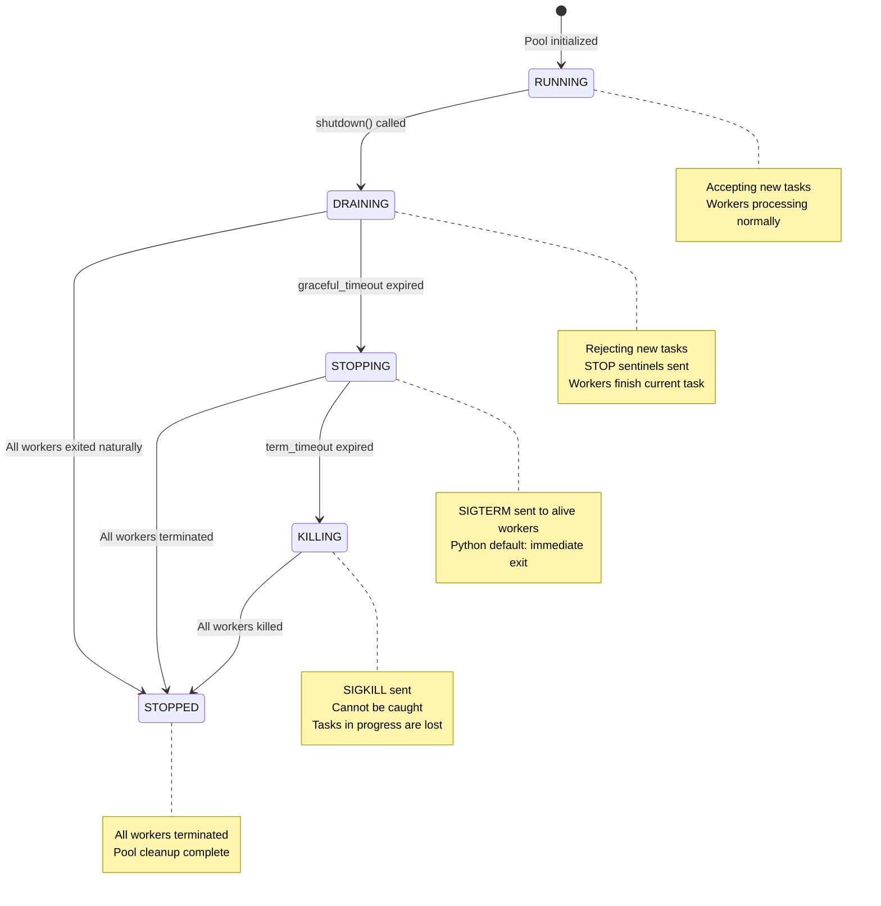

# Worker Pool Module

The `WorkerPool` module provides a simple, lightweight resident worker pool for parallel task execution. It is designed to work with `spawn` mode multiprocessing, ensuring cross-platform consistency.

## Table of Contents

1. [Overview](#1-overview)
2. [Design Principles](#2-design-principles)
3. [Quick Start](#3-quick-start)
4. [API Reference](#4-api-reference)
5. [Task Writing Guide](#5-task-writing-guide)
6. [Best Practices](#6-best-practices)
7. [Common Pitfalls](#7-common-pitfalls)

---

## 1. Overview

### What is WorkerPool?

`WorkerPool` is a resident worker pool that manages a fixed number of worker processes. Unlike `multiprocessing.Pool`, workers in `WorkerPool` stay alive after completing tasks, waiting for new work via a queue.

### Key Features

| Feature | Description |
|---------|-------------|
| **Spawn Mode** | Uses `spawn` context for cross-platform consistency |
| **Resident Workers** | Workers persist, avoiding repeated process startup overhead |
| **Crash Recovery** | Dead workers are automatically restarted |
| **Task Attribution** | Failed tasks are tracked even if the worker crashes |
| **Future Pattern** | Async result handling with timeout support |
| **Graceful Shutdown** | Three-phase shutdown: DRAINING → STOPPING → KILLING → STOPPED |

### Pool State Machine

The pool state transitions during the shutdown process:



### When to Use WorkerPool

- **Batch processing**: Process many independent items in parallel
- **CPU-bound work**: Distribute CPU-intensive operations across processes
- **I/O-bound work**: Parallel database queries or API calls
- **External queue consumers**: As a worker pool for Celery, RQ, or other task queues

### When NOT to Use WorkerPool

WorkerPool is **NOT** a complete task queue system. The following features require specialized libraries (e.g., Celery, RQ, Dramatiq):

| Feature | WorkerPool | Professional Task Queues |
|---------|------------|--------------------------|
| Task Priority | ❌ FIFO only | ✅ Supported |
| Task Persistence | ❌ In-memory queue | ✅ Redis/DB |
| Delayed Tasks | ❌ Not supported | ✅ Supported |
| Automatic Retry | ❌ Not supported | ✅ Supported |
| Task Deduplication | ❌ Not supported | ✅ Supported |
| Task Dependencies | ❌ Not supported | ✅ Supported |
| Distributed | ❌ Single process | ✅ Multi-node |

If you need these features, you can use WorkerPool as a consumer for external task queues, or use a professional task queue library directly.

---

## 2. Design Principles

### WorkerPool Only Handles Infrastructure

The core design philosophy: **WorkerPool manages task dispatch, result collection, and crash recovery — nothing else.**

| WorkerPool Responsibilities | User Responsibilities |
|----------------------------|----------------------|
| Process lifecycle | Define task functions |
| Task queue management | Import necessary ORM models |
| Result collection | Configure database connections |
| Worker health monitoring | Handle transactions |
| Crash recovery | Manage connection lifecycle |

### Why This Design?

The minimal design philosophy is intentional. Alternative approaches that attempt to abstract more functionality face fundamental challenges:

1. **Handler registration cannot cross processes**: Global state doesn't survive `spawn`, making callback-based patterns unreliable
2. **Dynamic imports are fragile**: Module paths often cannot be resolved consistently in worker processes
3. **Model serialization is complex**: ActiveRecord instances contain database connections and cannot be pickled directly

By keeping `WorkerPool` minimal, users have full control and transparency over their data operations.

---

## 3. Quick Start

### Basic Usage

```python
from rhosocial.activerecord.worker import WorkerPool

# Define a task function (must be module-level)
def double(n: int) -> int:
    return n * 2

# Use WorkerPool
if __name__ == '__main__':
    with WorkerPool(n_workers=4) as pool:
        # Submit a single task
        future = pool.submit(double, 5)
        result = future.result(timeout=10)
        print(result)  # Output: 10

        # Submit multiple tasks
        futures = [pool.submit(double, i) for i in range(10)]
        results = [f.result(timeout=10) for f in futures]
        print(results)  # Output: [0, 2, 4, 6, 8, 10, 12, 14, 16, 18]
```

### With Database Operations

```python
# task_functions.py - A separate module for task definitions
from typing import Optional

def submit_comment_task(params: dict) -> int:
    """
    Submit a comment task.

    Args:
        params: Dictionary containing:
            - db_path: Database path
            - post_id: Post ID
            - user_id: User ID
            - content: Comment content

    Returns:
        int: ID of the newly created comment
    """
    db_path = params['db_path']
    post_id = params['post_id']
    user_id = params['user_id']
    content = params['content']

    # 1. Configure database connection (inside worker process)
    from rhosocial.activerecord.backend.impl.sqlite import SQLiteBackend
    from rhosocial.activerecord.backend.impl.sqlite.config import SQLiteConnectionConfig
    from myapp.models import User, Post, Comment

    config = SQLiteConnectionConfig(database=db_path)
    User.configure(config, SQLiteBackend)
    Post.__backend__ = User.backend()
    Comment.__backend__ = User.backend()

    comment_id: Optional[int] = None

    try:
        # 2. Execute business logic in transaction
        with Post.transaction():
            post = Post.find_one(post_id)
            if post is None:
                raise ValueError(f"Post {post_id} not found")

            user = User.find_one(user_id)
            if user is None:
                raise ValueError(f"User {user_id} not found")
            if not user.is_active:
                raise ValueError(f"User {user_id} is not active")

            if post.status != 'published':
                raise ValueError(f"Post {post_id} is not published")

            comment = Comment(
                post_id=post.id,
                user_id=user_id,
                content=content
            )
            comment.save()
            comment_id = comment.id

        # 3. Return result
        return comment_id

    finally:
        # 4. Cleanup connection
        User.backend().disconnect()
```

```python
# main.py - Main application
from rhosocial.activerecord.worker import WorkerPool
from task_functions import submit_comment_task

if __name__ == '__main__':
    with WorkerPool(n_workers=4) as pool:
        # Submit comment task
        future = pool.submit(submit_comment_task, {
            'db_path': '/path/to/app.db',
            'post_id': 123,
            'user_id': 456,
            'content': 'Great article!'
        })

        try:
            comment_id = future.result(timeout=30)
            print(f"Comment created with ID: {comment_id}")
        except Exception as e:
            print(f"Failed to create comment: {e}")
            if future.traceback:
                print(f"Traceback:\n{future.traceback}")
```

---

## 4. API Reference

### WorkerPool

```python
class WorkerPool:
    """
    Spawn-mode Resident Worker Pool with Graceful Shutdown.

    Worker processes start once and stay resident.
    Tasks dispatched via Queue, results captured via Future.
    Worker crash triggers automatic restart.
    Three-phase shutdown: DRAINING → STOPPING → KILLING → STOPPED.
    """

    def __init__(self, n_workers: int = 4, check_interval: float = 0.5):
        """
        Initialize WorkerPool.

        Args:
            n_workers: Number of worker processes
            check_interval: Interval in seconds for supervisor to check worker health
        """

    def submit(self, fn: Callable, *args, **kwargs) -> Future:
        """
        Submit a task, immediately return Future.

        Args:
            fn: Task function (must be module-level function)
            *args: Positional arguments
            **kwargs: Keyword arguments

        Returns:
            Future: Async result handle

        Raises:
            PoolDrainingError: Pool is in shutdown flow

        Note:
            fn and all arguments must be pickle-able (spawn limitation).
        """

    def map(self, fn: Callable, iterable, timeout: Optional[float] = None) -> list:
        """
        Batch submit, collect results in order.

        Args:
            fn: Task function
            iterable: Argument iterator
            timeout: Timeout in seconds for each task

        Returns:
            list: Result list (same order as input)

        Raises:
            Exception: Raised if any task fails
        """

    def shutdown(
        self,
        graceful_timeout: float = 10.0,
        term_timeout: float = 3.0,
    ) -> ShutdownReport:
        """
        Three-phase graceful shutdown.

        Phase 1 · DRAINING (STOP sentinel, wait for natural exit)
        - Immediately reject new submit() (PoolDrainingError)
        - Inject STOP sentinels into queue
        - Workers exit voluntarily after completing current task
        - Wait for graceful_timeout seconds

        Phase 2 · STOPPING (SIGTERM)
        - graceful_timeout expired but workers still alive
        - Send SIGTERM to all alive workers
        - Wait for term_timeout seconds

        Phase 3 · KILLING (SIGKILL)
        - term_timeout expired but workers still alive
        - Send SIGKILL (cannot be caught)
        - Tasks being executed are lost

        Args:
            graceful_timeout: Phase 1 wait time (default 10s)
            term_timeout: Phase 2 wait time (default 3s)

        Returns:
            ShutdownReport: Contains shutdown duration, completion phase, task loss info
        """

    @property
    def n_workers(self) -> int:
        """Number of worker processes"""

    @property
    def active_workers(self) -> int:
        """Number of alive worker processes"""

    @property
    def state(self) -> PoolState:
        """Current pool state"""
```

### PoolState

```python
class PoolState(Enum):
    """Pool state machine for shutdown flow."""
    RUNNING = auto()   # Normal operation, accepting tasks
    DRAINING = auto()  # Rejecting new tasks, waiting for in-flight tasks
    STOPPING = auto()  # SIGTERM sent
    KILLING = auto()   # Sending SIGKILL
    STOPPED = auto()   # All workers terminated
```

### ShutdownReport

```python
@dataclass
class ShutdownReport:
    """Return value of shutdown(), describing the shutdown process."""
    duration: float          # Total shutdown time (seconds)
    final_phase: str         # Phase where shutdown completed: "graceful" / "terminate" / "kill"
    tasks_in_flight: int     # Tasks executing when shutdown started
    tasks_killed: int        # Workers still holding tasks after SIGKILL
    workers_killed: int      # Workers with exitcode == -9 (SIGKILL'd)
```

### Exceptions

```python
class PoolDrainingError(RuntimeError):
    """Pool is in shutdown flow, no longer accepting new tasks."""

class TaskTimeoutError(TimeoutError):
    """Task execution timeout."""

class WorkerCrashedError(RuntimeError):
    """Worker process crashed, task could not complete."""
```

### Future

```python
class Future:
    """
    Asynchronous result handle.

    Thread-safe, used to retrieve task execution results.
    """

    def result(self, timeout: Optional[float] = None) -> Any:
        """
        Block and wait for result.

        Args:
            timeout: Timeout in seconds, None means infinite wait

        Returns:
            Task return value

        Raises:
            TimeoutError: Timeout exceeded
            Exception: Original exception raised by task
        """

    @property
    def done(self) -> bool:
        """Whether task has completed (success or failure)"""

    @property
    def succeeded(self) -> bool:
        """Whether task succeeded"""

    @property
    def failed(self) -> bool:
        """Whether task failed"""

    @property
    def traceback(self) -> Optional[str]:
        """Return full traceback string when task failed"""
```

---

## 5. Task Writing Guide

### Rules for Task Functions

1. **Must be module-level functions**: Nested/local functions cannot be pickled
2. **Must be importable**: Workers need to import the function by name
3. **Arguments must be pickle-able**: Basic types, dicts, lists work well
4. **Return pickle-able results**: Same constraint as arguments
5. **Support for async functions**: `async def` functions are automatically detected and executed with `asyncio.run()`

### Async Task Functions

WorkerPool natively supports async task functions. You can directly pass `async def` coroutine functions:

```python
# tasks.py
async def async_query_task(params: dict) -> dict:
    """Async task using AsyncActiveRecord"""
    from rhosocial.activerecord.backend.impl.sqlite import SQLiteBackend
    from rhosocial.activerecord.backend.impl.sqlite.config import SQLiteConnectionConfig
    from myapp.models import User

    config = SQLiteConnectionConfig(database=params['db_path'])
    await User.async_configure(config, SQLiteBackend)

    try:
        async with User.async_transaction():
            user = await User.find_one_async(params['user_id'])
            # ... async operations
            return {'status': 'success', 'user_id': user.id}
    finally:
        await User.async_backend().disconnect()

# main.py
with WorkerPool(n_workers=4) as pool:
    # Submit async function directly, no manual wrapping needed
    future = pool.submit(async_query_task, {'db_path': 'app.db', 'user_id': 123})
    result = future.result(timeout=30)
```

**Important Notes**:

- Async functions are executed via `asyncio.run()` in the worker process, with a separate event loop for each task
- `Future.result()` is still synchronous blocking (this is a design decision, as inter-process communication is inherently synchronous)
- Async and sync tasks can be mixed in the same WorkerPool

### Task Function Template

```python
# tasks.py - Dedicated module for task functions

def my_task(params: dict) -> dict:
    """
    Task function template.

    Args:
        params: Task parameters (serializable dict)

    Returns:
        Result dictionary (serializable)
    """
    # 1. Extract parameters
    db_path = params['db_path']
    # ... other parameters

    # 2. Configure connection (inside worker)
    from rhosocial.activerecord.backend.impl.sqlite import SQLiteBackend
    from rhosocial.activerecord.backend.impl.sqlite.config import SQLiteConnectionConfig
    from myapp.models import MyModel

    config = SQLiteConnectionConfig(database=db_path)
    MyModel.configure(config, SQLiteBackend)

    try:
        # 3. Execute business logic
        with MyModel.transaction():
            # ... do work
            result = {'status': 'success', 'data': some_value}
            return result

    finally:
        # 4. Always cleanup connection
        MyModel.backend().disconnect()
```

### Handling Errors

```python
def safe_task(params: dict) -> dict:
    """Task with proper error handling"""
    try:
        # ... do work
        return {'success': True, 'data': result}
    except ValueError as e:
        # Business logic error - return as part of result
        return {'success': False, 'error': str(e)}
    except Exception as e:
        # Unexpected error - let it propagate
        raise RuntimeError(f"Task failed: {e}")
```

---

## 6. Best Practices

### Connection Lifecycle

Always follow this pattern in task functions:

```python
def task(params):
    # 1. Configure at the start
    Model.configure(config, Backend)

    try:
        # 2. Do work
        return result
    finally:
        # 3. Always disconnect
        Model.backend().disconnect()
```

### Transaction Management

Keep transactions short and focused:

```python
# Good: Single, focused transaction
with Model.transaction():
    record = Model.find_one(id)
    record.status = 'processed'
    record.save()

# Bad: Multiple transactions, unclear boundaries
with Model.transaction():
    record = Model.find_one(id)
# Transaction ended, but you're still working...
record.status = 'processed'  # Not in transaction!
record.save()
```

### Batch Processing

Use `map()` for simple batch operations:

```python
def process_item(item_id: int) -> dict:
    # Process single item
    return {'id': item_id, 'status': 'done'}

with WorkerPool(n_workers=4) as pool:
    results = pool.map(process_item, range(100))
```

For complex batch operations with shared setup:

```python
def batch_task(params: dict) -> list:
    """Process multiple items in one task"""
    db_path = params['db_path']
    item_ids = params['item_ids']

    # Configure once for entire batch
    Model.configure(config, Backend)

    try:
        results = []
        with Model.transaction():
            for item_id in item_ids:
                item = Model.find_one(item_id)
                # ... process
                results.append(item.id)
        return results
    finally:
        Model.backend().disconnect()

# Submit batches
batch_size = 10
with WorkerPool(n_workers=4) as pool:
    futures = []
    for i in range(0, 100, batch_size):
        batch = list(range(i, i + batch_size))
        futures.append(pool.submit(batch_task, {
            'db_path': 'app.db',
            'item_ids': batch
        }))
    results = [f.result() for f in futures]
```

### Worker Count Selection

| Scenario | Recommendation |
|----------|---------------|
| CPU-bound tasks | `n_workers = cpu_count()` |
| I/O-bound tasks | `n_workers = 2 * cpu_count()` |
| Database-heavy | `n_workers ≤ max_db_connections - 5` (reserve for admin) |
| Mixed workload | Start with `n_workers = cpu_count()`, tune based on monitoring |

### Graceful Shutdown Best Practices

The three-phase shutdown ensures tasks complete gracefully while preventing indefinite hangs:

```python
# Recommended: Let context manager handle shutdown
with WorkerPool(n_workers=4) as pool:
    futures = [pool.submit(task, i) for i in range(100)]
    results = [f.result() for f in futures]
# Context exit triggers shutdown with default timeouts

# Manual shutdown with custom timeouts
pool = WorkerPool(n_workers=4)
# ... submit tasks ...
report = pool.shutdown(graceful_timeout=30.0, term_timeout=5.0)
print(f"Shutdown took {report.duration:.2f}s via {report.final_phase}")
```

**Understanding the phases:**

| Phase | Signal | Behavior | Use Case |
|-------|--------|----------|----------|
| DRAINING | STOP sentinel | Workers complete current task, then exit | Normal shutdown |
| STOPPING | SIGTERM | Immediate termination (Python default) | Graceful timeout expired |
| KILLING | SIGKILL | Cannot be caught, process dies instantly | TERM timeout expired |

**Key difference between STOP sentinel and SIGTERM:**

- **STOP sentinel**: Queue-level polite request. Worker finishes current task, then reads sentinel and exits voluntarily.
- **SIGTERM**: OS-level signal. Python's default handler exits immediately, interrupting the current task.

```python
# Check if shutdown was clean
report = pool.shutdown()
if report.final_phase != "graceful":
    print(f"Warning: {report.tasks_killed} tasks were forcefully terminated")
```

---

## 7. Common Pitfalls

### Pitfall 1: Local Function Definition

```python
# WRONG: Nested function cannot be pickled
def main():
    def my_task(n):
        return n * 2

    with WorkerPool() as pool:
        pool.submit(my_task, 5)  # PicklingError!

# CORRECT: Module-level function
def my_task(n):
    return n * 2

def main():
    with WorkerPool() as pool:
        pool.submit(my_task, 5)  # OK
```

### Pitfall 2: Passing Model Instances

```python
# WRONG: Model instances may not serialize correctly
user = User.find_one(1)
pool.submit(process_user, user)  # May fail

# CORRECT: Pass IDs and let task fetch the record
pool.submit(process_user, user.id)

def process_user(user_id: int):
    User.configure(config, Backend)
    try:
        user = User.find_one(user_id)
        # ... process
    finally:
        User.backend().disconnect()
```

### Pitfall 3: Forgetting to Disconnect

```python
# WRONG: Connection leak
def my_task(params):
    Model.configure(config, Backend)
    return Model.find_one(params['id'])
    # Connection never closed!

# CORRECT: Always use try/finally
def my_task(params):
    Model.configure(config, Backend)
    try:
        return Model.find_one(params['id'])
    finally:
        Model.backend().disconnect()
```

### Pitfall 4: Configuring Outside Task

```python
# WRONG: Configure in main process, not in worker
Model.configure(config, Backend)

def my_task(params):
    # Worker doesn't have this configuration!
    return Model.find_one(params['id'])

# CORRECT: Configure inside task
def my_task(params):
    Model.configure(config, Backend)
    try:
        return Model.find_one(params['id'])
    finally:
        Model.backend().disconnect()
```

### Pitfall 5: Ignoring Worker Crashes

```python
# WRONG: Not handling crash
future = pool.submit(risky_task, params)
result = future.result()  # May raise RuntimeError if worker crashed

# CORRECT: Handle crash gracefully
future = pool.submit(risky_task, params)
try:
    result = future.result(timeout=30)
except RuntimeError as e:
    if "crashed" in str(e):
        print(f"Worker crashed: {e}")
        # Retry or handle appropriately
    else:
        raise
```

---

## Summary

The `WorkerPool` module provides a simple, reliable foundation for parallel task execution. By following these guidelines:

1. Write independent, module-level task functions
2. Manage connections inside each task
3. Use transactions appropriately
4. Always clean up connections in `finally`
5. Pass serializable data (IDs, not model instances)

You can build robust parallel processing workflows that integrate seamlessly with `rhosocial-activerecord`.
