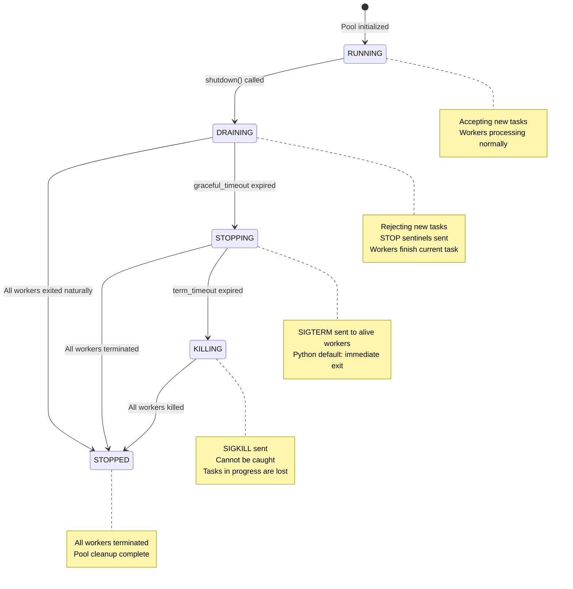

# Worker Pool Module

The `WorkerPool` module provides a simple, lightweight resident worker pool for parallel task execution. It is designed to work with `spawn` mode multiprocessing, ensuring cross-platform consistency.

## Table of Contents

* [Lifecycle Hooks](lifecycle_hooks.md): Worker-level and task-level hook functions.
* [Management & Statistics](management_statistics.md): Runtime status query, statistics collection, health check.
* [API Reference](api_reference.md): Complete class, enum, data class, and exception definitions.
* [Task Writing Guide](task_guide.md): Task function rules, templates, and error handling.
* [Best Practices](best_practices.md): Best practices and common pitfalls with solutions.

---

## 1. Overview

### What is WorkerPool?

`WorkerPool` is a resident worker pool that manages a fixed number of worker processes. Unlike `multiprocessing.Pool`, workers in `WorkerPool` stay alive after completing tasks, waiting for new work via a queue.

### Key Features

| Feature | Description |
|---------|-------------|
| **Spawn Mode** | Uses `spawn` context for cross-platform consistency |
| **Resident Workers** | Workers persist, avoiding repeated process startup overhead |
| **Crash Recovery** | Dead workers are automatically restarted |
| **Task Attribution** | Failed tasks are tracked even if the worker crashes |
| **Future Pattern** | Async result handling with timeout support |
| **Graceful Shutdown** | Three-phase shutdown: DRAINING → STOPPING → KILLING → STOPPED |
| **Lifecycle Hooks** | Worker-level and task-level hook functions |
| **Resource Monitoring** | Task duration, memory delta, and other resource statistics |
| **Management & Statistics** | Runtime status query, statistics collection, health check |

### Pool State Machine

The pool state transitions during the shutdown process:



### When to Use WorkerPool

- **Batch processing**: Process many independent items in parallel
- **CPU-bound work**: Distribute CPU-intensive operations across processes
- **I/O-bound work**: Parallel database queries or API calls
- **External queue consumers**: As a worker pool for Celery, RQ, or other task queues

---

## 2. WorkerPool vs Connection Pool: How to Choose?

When dealing with database operations in concurrent scenarios, WorkerPool and Connection Pool (`BackendPool`) are two different solutions with different use cases:

| Scenario | WorkerPool | Connection Pool |
|----------|------------|-----------------|
| **Connection Isolation** | ✓ Each worker has independent connection | ✗ Connections are reused, not isolated |
| **Complex Long-running Tasks** | ✓ Process isolation, crashes don't affect others | ✗ Long transactions may timeout |
| **Crash Isolation** | ✓ Worker crashes auto-restart | ✗ Affects shared connections |
| **Simple Concurrent Queries** | ✗ Process creation overhead | ✓ Lightweight and efficient |
| **Shared Transaction Context** | ✗ Cannot share across processes | ✓ Context awareness |
| **Context Awareness** | ✗ None | ✓ ActiveRecord integration |

### Process-Level Overhead and Limitations

**Important Reminder**: WorkerPool is a **process-level** concurrency solution with significant overhead compared to connection pools (thread/coroutine level):

#### Management Overhead

| Overhead Type | WorkerPool (Process) | Connection Pool (Thread/Coroutine) |
|---------------|---------------------|-----------------------------------|
| **Creation Overhead** | High (process fork, memory allocation) | Low (connection object creation) |
| **Memory Usage** | High (independent memory space per process) | Low (shared memory space) |
| **Communication Overhead** | High (IPC serialization/deserialization) | Low (direct memory access) |
| **Context Switching** | High (process switching) | Low (thread/coroutine switching) |
| **Startup Latency** | Milliseconds | Microseconds |

### When NOT to Use WorkerPool

| Scenario | Reason | Recommended Alternative |
|----------|--------|------------------------|
| **Frequent Small Tasks** | Process startup and communication overhead exceeds task itself | Connection pool + thread/coroutine |
| **Low Latency Requirements** | IPC serialization adds latency | Connection pool |
| **Memory-Constrained Environment** | Each process has independent memory space | Connection pool |
| **Large Shared Data** | Cross-process data transfer requires serialization | Thread + connection pool |
| **Simple Concurrent Queries** | Process overhead is unnecessary | Connection pool |
| **Shared Transactions Needed** | Cannot share transaction state across processes | Connection pool's `transaction()` |
| **High-Concurrency Web** | Process count limited, cannot handle high concurrency | Async + connection pool |

### When to Use WorkerPool (Recommended Scenarios)

1. **Strict connection isolation required**: Each worker process has its own database connection, avoiding connection state pollution
2. **Complex database tasks**: Long-running tasks requiring process-level isolation
3. **Task crashes shouldn't affect others**: Workers auto-restart on crash, failed tasks are traceable
4. **CPU-intensive + database operations**: True parallelism, bypassing GIL

### When NOT to Use WorkerPool (Feature Limitations)

WorkerPool is **NOT** a complete task queue system. The following features require specialized libraries (e.g., Celery, RQ, Dramatiq):

| Feature | WorkerPool | Professional Task Queues |
|---------|------------|--------------------------|
| Task Priority | ❌ FIFO only | ✅ Supported |
| Task Persistence | ❌ In-memory queue | ✅ Redis/DB |
| Delayed Tasks | ❌ Not supported | ✅ Supported |
| Automatic Retry | ❌ Not supported | ✅ Supported |
| Task Deduplication | ❌ Not supported | ✅ Supported |
| Task Dependencies | ❌ Not supported | ✅ Supported |
| Distributed | ❌ Single process | ✅ Multi-node |

If you need these features, you can use WorkerPool as a consumer for external task queues, or use a professional task queue library directly.

---

## 3. Design Principles

### WorkerPool Only Handles Infrastructure

The core design philosophy: **WorkerPool manages task dispatch, result collection, and crash recovery — nothing else.**

| WorkerPool Responsibilities | User Responsibilities |
|----------------------------|----------------------|
| Process lifecycle | Define task functions |
| Task queue management | Import necessary ORM models |
| Result collection | Configure database connections |
| Worker health monitoring | Handle transactions |
| Crash recovery | Manage connection lifecycle |

### Why This Design?

The minimal design philosophy is intentional. Alternative approaches that attempt to abstract more functionality face fundamental challenges:

1. **Handler registration cannot cross processes**: Global state doesn't survive `spawn`, making callback-based patterns unreliable
2. **Dynamic imports are fragile**: Module paths often cannot be resolved consistently in worker processes
3. **Model serialization is complex**: ActiveRecord instances contain database connections and cannot be pickled directly

By keeping `WorkerPool` minimal, users have full control and transparency over their data operations.

---

## 4. Quick Start

> **Runnable examples** are available in [`docs/examples/chapter_07_worker_pool/`](../../examples/chapter_07_worker_pool/).

### Basic Usage

```python
from rhosocial.activerecord.worker import WorkerPool, TaskContext

# Task function MUST accept ctx as the first argument
def double(ctx: TaskContext, n: int) -> int:
    return n * 2

# Use WorkerPool
if __name__ == '__main__':
    with WorkerPool(n_workers=4) as pool:
        # Submit a single task (ctx is injected automatically)
        future = pool.submit(double, 5)
        result = future.result(timeout=10)
        print(result)  # Output: 10

        # Submit multiple tasks
        futures = [pool.submit(double, i) for i in range(10)]
        results = [f.result(timeout=10) for f in futures]
        print(results)  # Output: [0, 2, 4, 6, 8, 10, 12, 14, 16, 18]
```

### With Database Operations

```python
# task_functions.py - A separate module for task definitions
from typing import Optional
from rhosocial.activerecord.worker import TaskContext

def submit_comment_task(ctx: TaskContext, params: dict) -> int:
    """
    Submit a comment task.

    Args:
        ctx: Task context (injected automatically)
        params: Dictionary containing:
            - db_path: Database path
            - post_id: Post ID
            - user_id: User ID
            - content: Comment content

    Returns:
        int: ID of the newly created comment
    """
    db_path = params['db_path']
    post_id = params['post_id']
    user_id = params['user_id']
    content = params['content']

    # 1. Configure database connection (inside worker process)
    from rhosocial.activerecord.backend.impl.sqlite import SQLiteBackend
    from rhosocial.activerecord.backend.impl.sqlite.config import SQLiteConnectionConfig
    from myapp.models import User, Post, Comment

    config = SQLiteConnectionConfig(database=db_path)
    User.configure(config, SQLiteBackend)
    Post.__backend__ = User.backend()
    Comment.__backend__ = User.backend()

    comment_id: Optional[int] = None

    try:
        # 2. Execute business logic in transaction
        with Post.transaction():
            post = Post.find_one(post_id)
            if post is None:
                raise ValueError(f"Post {post_id} not found")

            user = User.find_one(user_id)
            if user is None:
                raise ValueError(f"User {user_id} not found")
            if not user.is_active:
                raise ValueError(f"User {user_id} is not active")

            if post.status != 'published':
                raise ValueError(f"Post {post_id} is not published")

            comment = Comment(
                post_id=post.id,
                user_id=user_id,
                content=content
            )
            comment.save()
            comment_id = comment.id

        # 3. Return result
        return comment_id

    finally:
        # 4. Cleanup connection
        User.backend().disconnect()
```

```python
# main.py - Main application
from rhosocial.activerecord.worker import WorkerPool
from task_functions import submit_comment_task

if __name__ == '__main__':
    with WorkerPool(n_workers=4) as pool:
        # Submit comment task
        future = pool.submit(submit_comment_task, {
            'db_path': '/path/to/app.db',
            'post_id': 123,
            'user_id': 456,
            'content': 'Great article!'
        })

        try:
            comment_id = future.result(timeout=30)
            print(f"Comment created with ID: {comment_id}")
        except Exception as e:
            print(f"Failed to create comment: {e}")
            if future.traceback:
                print(f"Traceback:\n{future.traceback}")
```

---

## Example Code

Complete example code for this chapter is located in the `docs/examples/chapter_07_worker_pool/` directory.

| File | Description |
|------|-------------|
| [basic_usage.py](../../examples/chapter_07_worker_pool/basic_usage.py) | Basic usage: create pool, submit tasks, get results |
| [async_mode.py](../../examples/chapter_07_worker_pool/async_mode.py) | Async mode: using async API for task management |
| [connection_management.py](../../examples/chapter_07_worker_pool/connection_management.py) | Connection management: managing database connections in workers |
| [hooks_usage.py](../../examples/chapter_07_worker_pool/hooks_usage.py) | Hooks usage: complete lifecycle hooks example |
