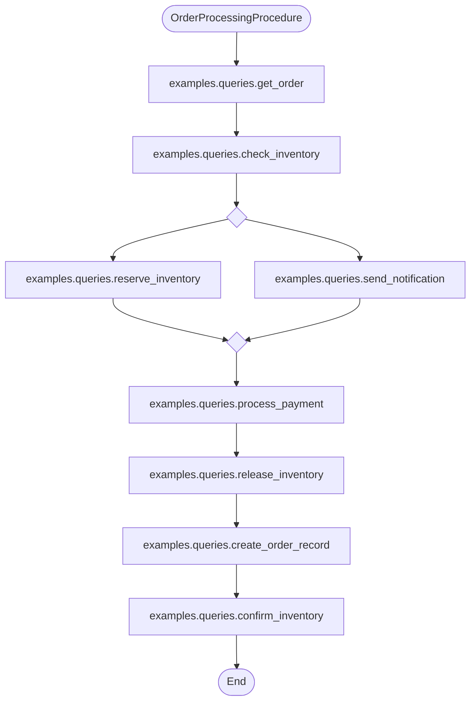
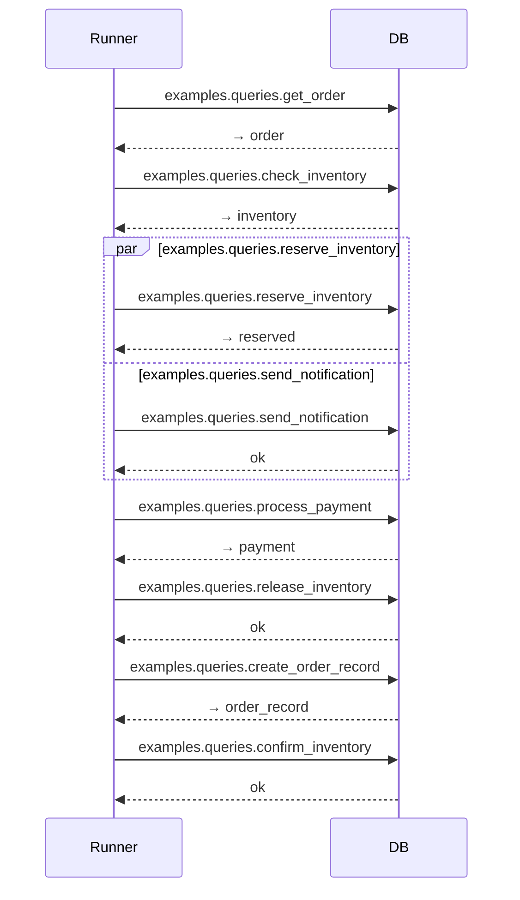

# Chapter 12: Named Procedure and Flowchart Visualization

> This chapter demonstrates how to use the flowchart visualization feature of Named Procedures.

## Example Files

| File | Description |
|---|---|
| `order_workflow.py` | Complex order processing workflow example |
| `queries/order_queries.py` | Related named query definitions |
| `diagram_demo.py` | Flowchart generation demo script |
| `README.md` | This file |

## Run Demo

```bash
cd docs/examples/chapter_12_named_procedure
PYTHONPATH=../../../src:. python3 diagram_demo.py
```

## Flowchart Features

Named procedures support two types of flowcharts:

1. **Static Diagram**: Generated via dry-run, no database connection required
2. **Instance Diagram**: Generated from real execution results, shows timing and status

### Generate Static Diagram

```python
from rhosocial.activerecord.backend.named_query import Procedure

# Flowchart format
print(MyProcedure.static_diagram("flowchart"))

# Sequence format
print(MyProcedure.static_diagram("sequence"))
```

### Generate Instance Diagram

```python
from rhosocial.activerecord.backend.named_query import ProcedureRunner

runner = ProcedureRunner("myapp.procedures.OrderProcessing").load()
result = runner.run(dialect, backend=backend)

# Flowchart format (with execution status and timing)
print(result.diagram("flowchart", procedure_name="OrderProcessing"))

# Sequence format
print(result.diagram("sequence", procedure_name="OrderProcessing"))
```

## Flowchart Features Comparison

| Feature | Static Diagram | Instance Diagram |
|---|---|---|
| Data source | dry-run | Real execution |
| Requires database | ❌ | ✅ |
| Shows execution status | ❌ | ✅ (green/red/gray) |
| Shows execution time | ❌ | ✅ (milliseconds) |
| Unexecuted nodes | Neutral color | Gray + [not executed] |
| Backend info | Dialect only | Backend class + ConcurrencyHint |

## Example Output

### Flowchart Static Diagram

```
%% [Static diagram — generated by dry-run. Conditional branches may be incomplete.]
flowchart TD
    START(["OrderProcessingProcedure"])
    n0["examples.queries.get_order"]
    n1["examples.queries.check_inventory"]
    fork2{ }
    join2{ }
    n2_0["examples.queries.reserve_inventory"]
    n2_1["examples.queries.send_notification"]
    n3["examples.queries.process_payment"]
    n4["examples.queries.release_inventory"]
    n5["examples.queries.create_order_record"]
    n6["examples.queries.confirm_inventory"]
    END(["End"])

    START --> n0
    n0 --> n1
    n1 --> fork2
    fork2 --> n2_0 & n2_1
    n2_0 & n2_1 --> join2
    join2 --> n3
    n3 --> n4
    n4 --> n5
    n5 --> n6
    n6 --> END

    style n0 fill:#ddeeff,stroke:#7799cc
    style n1 fill:#ddeeff,stroke:#7799cc
    ...
```

### Sequence Static Diagram

```
%% [Static diagram — generated by dry-run. Conditional branches may be incomplete.]
sequenceDiagram
    participant Runner
    participant DB

    Runner->>DB: examples.queries.get_order
    DB-->>Runner: → order

    Runner->>DB: examples.queries.check_inventory
    DB-->>Runner: → inventory

    par examples.queries.reserve_inventory  %% max_concurrency=2
        Runner->>DB: examples.queries.reserve_inventory
        DB-->>Runner: → reserved
    and examples.queries.send_notification
        Runner->>DB: examples.queries.send_notification
        DB-->>Runner: ok
    end

    Runner->>DB: examples.queries.process_payment
    DB-->>Runner: → payment

    Runner->>DB: examples.queries.release_inventory
    DB-->>Runner: ok

    Runner->>DB: examples.queries.create_order_record
    DB-->>Runner: → order_record

    Runner->>DB: examples.queries.confirm_inventory
    DB-->>Runner: ok
```

## Mermaid Rendering

You can copy the output above to [Mermaid Live Editor](https://mermaid.live/) to view the rendered diagrams.

### Flowchart Rendering



### Sequence Rendering



## Known Limitations

1. **Incomplete conditional branches**: During dry-run, `ctx["key"]` returns `None`, only the false branch is recorded
2. **Mermaid version**: Parallel syntax requires a newer version of Mermaid supporting `&` syntax (flowchart) or `par/and/end` blocks (sequence)