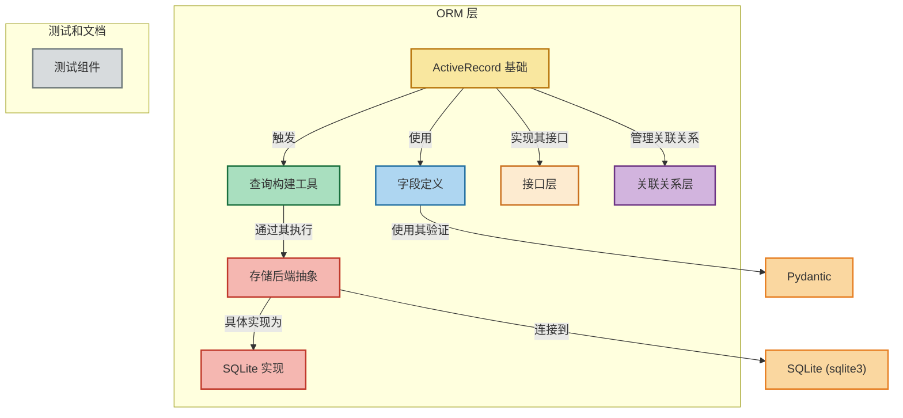

# rhosocial ActiveRecord

## 概述

rhosocial ActiveRecord 是一个强大的对象关系映射(ORM)库，为 Python 应用程序中的数据库交互提供了直观的接口。
基于 Ruby on Rails 流行的 ActiveRecord 模式构建，该库提供了一种干净、以模型为中心的数据库访问方法，显著减少了样板代码，同时保持了灵活性和性能。

该库允许开发者将数据库表表示为 Python 类，将行表示为对象，在面向对象的领域模型和关系数据库结构之间创建自然映射。
这种方法强调约定优于配置，使数据库操作更加直观，更不容易出错。

## 特性

rhosocial ActiveRecord 提供了一系列全面的功能，旨在简化数据库交互：

- **直观的基于模型的 API**：使用内置验证定义数据库模式
- **全面的 CRUD 操作**：轻松创建、读取、更新和删除记录
- **丰富的查询接口**：通过流畅、可链接的 API 构建复杂查询
- **关系管理**：定义和使用各种类型的关系（一对一、一对多、多对一）
- **事务支持**：使用适当的隔离级别管理数据库事务
- **数据库无关性**：支持多种数据库后端（SQLite、MySQL、PostgreSQL、Oracle、SQL Server）
- **类型安全**：利用 Pydantic 进行强大的类型验证和转换
- **预加载**：通过高效加载相关对象优化性能
- **事件系统**：挂钩到模型生命周期事件以实现自定义行为
- **可扩展性**：通过混合类轻松扩展自定义行为
- **高级聚合**：强大的聚合功能，包括窗口函数、CUBE、ROLLUP 等
- **异步支持**：双同步和异步 API，实现灵活的应用程序设计

## 结构



## 要求

要使用 rhosocial ActiveRecord，您需要：

- **Python**：版本 3.8 或更高
- **Pydantic**：
  - 对于 Python 3.8：Pydantic 2.10 或更高
  - 对于 Python 3.9+：Pydantic 2.11 或更高
  
  注意：这些依赖项在安装过程中会根据您的 Python 版本自动管理。

- **特定数据库驱动**：
  - **SQLite**：内置于 Python 标准库
  - **PostgreSQL**：psycopg（当前不支持其他驱动）
  - **MySQL**：mysql-connector-python（当前不支持其他驱动）
  - **MariaDB**：mariadb（当前不支持其他驱动）
  - **Oracle**：cx_Oracle 或 oracledb
  - **SQL Server**：pyodbc 或 pymssql

此外，为获得最佳开发体验：

- **类型检查工具**：mypy、PyCharm 或带有 Python 扩展的 VS Code
- **测试框架**：pytest

## 文档

- [介绍](docs/introduction.md)
- [哲学和设计方法](docs/philosophy.md)
- [特性比较](docs/features.md)
- [Pydantic 集成优势](docs/pydantic-integration.md)
- [高级聚合功能](docs/aggregation.md)
- [异步支持](docs/async-support.md)
- [代码比较](docs/code-comparison.md)
- [性能基准](docs/performance.md)
- [学习曲线和文档](docs/learning-curve.md)
- [社区和生态系统](docs/community.md)
- [何时选择各种 ORM](docs/when-to-choose.md)
- [关系管理](docs/relationships.md)
- [结论](docs/conclusion.md)

## 快速开始

```python
from rhosocial.activerecord import ActiveRecord
from typing import Optional
from datetime import datetime
from pydantic import EmailStr

class User(ActiveRecord):
    __table_name__ = 'users'
    
    id: Optional[int] = None
    name: str
    email: EmailStr
    is_active: bool = True
    created_at: datetime = None

# 创建用户
user = User(name="John Doe", email="john@example.com")
user.save()

# 查询用户
active_users = User.query().where('is_active = ?', (True,)).all()
```

## 与其他 Python ORM 框架的比较

Python 提供了多种成熟的 ORM 解决方案，每种都有自己的哲学和设计方法。了解这些差异可以帮助您为特定需求选择正确的工具。

有关 rhosocial ActiveRecord 与这些框架的详细分析、具体代码示例、性能基准和用例建议，请参阅 [何时选择各种 ORM](docs/when-to-choose.md) 指南。