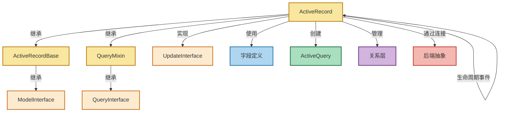
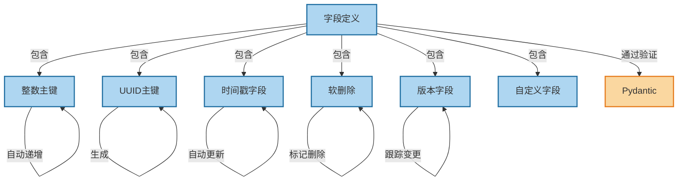
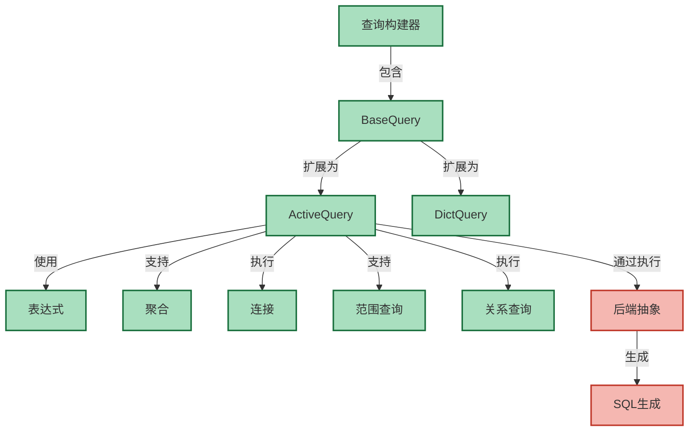
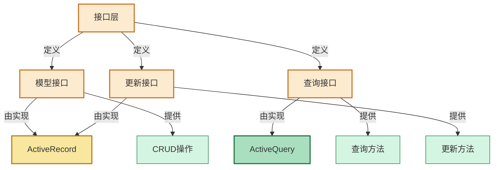
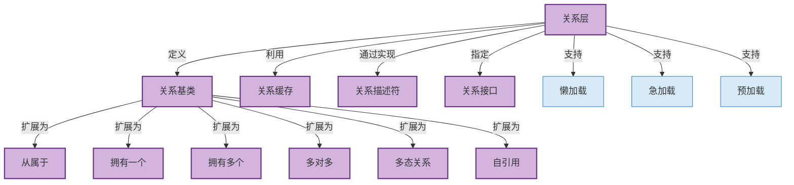

# 组件结构图

本文档提供了 rhosocial ActiveRecord 框架各核心组件的详细结构图。这些图表展示了每个组件的内部架构、类关系和交互方式。

## ActiveRecord Base 结构

## 字段定义结构

## 查询构建器结构

## 接口层结构

## 关系层结构

这些图表提供了 rhosocial ActiveRecord 框架各核心组件内部结构和关系的可视化表示。它们展示了不同部分如何交互并协同工作，以提供完整的 ORM 功能。