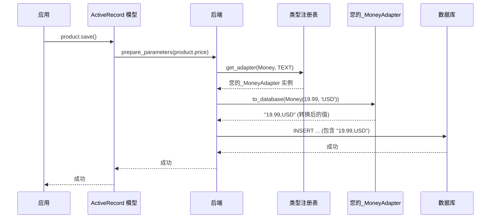
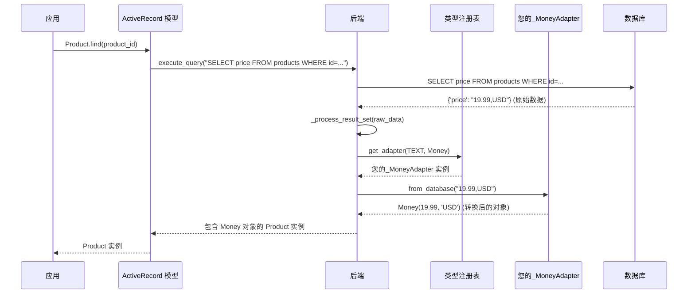

# 数据类型映射

在 `python-activerecord` 中，我们开发了一个复杂的数据类型映射系统，以确保 Python 类型和特定数据库类型之间的无缝数据转换。该系统围绕 `SQLTypeAdapter` 协议构建，为不同数据库后端处理类型转换提供了灵活且可扩展的方式。

## SQLTypeAdapter 协议

`SQLTypeAdapter` 协议是我们类型映射系统的核心。它定义了在 Python 和数据库之间转换数据的标准接口。以下是该协议的定义：

```python
class SQLTypeAdapter(Protocol):
    """
    用于在数据库和 Python 对象之间转换数据的协议。
    """
    @property
    def supported_types(self) -> Dict[Type, List[Any]]:
        """
        返回支持的 Python 类型及其相应数据库类型的字典。
        """
        ...

    def to_database(self, value: Any, target_type: Type, options: Optional[Dict[str, Any]] = None) -> Any:
        """
        将值转换为其数据库表示形式。
        """
        ...

    def from_database(self, value: Any, target_type: Type, options: Optional[Dict[str, Any]] = None) -> Any:
        """
        将值从其数据库表示形式转换为 Python 对象。
        """
        ...
```

- `supported_types`: 此属性返回一个字典，该字典将 Python 类型映射到适配器可以处理的相应数据库类型列表。
- `to_database`: 此方法负责将 Python 对象转换为数据库可以理解的格式。`target_type` 参数建议了预期的数据库类型，`options` 可以为转换提供额外的上下文。
- `from_database`: 此方法处理从数据库表示形式转换回 Python 对象的逻辑。`target_type` 参数提供了转换的目标 Python 类型，从而实现更精确和上下文感知的数据处理。

## 适配器注册表

`TypeRegistry` 是一个中央组件，用于管理类型适配器。它允许注册自定义适配器，并确保为每次数据类型转换使用正确的适配器。

您可以使用 `TypeRegistry` 的 `register` 方法注册新的适配器。当您需要为应用程序定义自定义类型转换时，这尤其有用。

### 类型注册表：建议性，非强制性

重要的是要理解，尽管 `TypeRegistry` 建议了常见的 Python 类型的适配器，但其作用是**建议性的，而非强制性的**。后端使用注册表来查找合适的适配器，但您仍然完全掌控。您可以随时明确指定为特定字段或场景使用哪个 `SQLTypeAdapter`，从而覆盖任何默认或建议的行为。

对于 SQLite 后端，以下适配器默认注册用于处理常见数据类型：

*   **`SQLiteBlobAdapter`**: 处理 `bytes` 到 `bytes` (BLOB) 转换。
*   **`SQLiteJSONAdapter`**: 处理 `dict` 和 `list` 到 `str` (JSON 字符串) 转换。此适配器包含对 JSON 中嵌套的 `datetime`、`uuid.UUID`、`Decimal` 和 `set` 对象的扩展序列化。
*   **`SQLiteUUIDAdapter`**: 处理 `uuid.UUID` 到 `str` 或 `bytes` 转换。

`SQLiteBackend` 为顶级 Python 类型提供的默认类型适配器建议是：

*   **`uuid.UUID`** 到 `str` (使用 `SQLiteUUIDAdapter`)
*   **`dict`** 到 `str` (使用 `SQLiteJSONAdapter`)
*   **`list`** 到 `str` (使用 `SQLiteJSONAdapter`)

这意味着，如果您将 `uuid.UUID` 对象赋给模型字段，SQLite 后端将默认建议将其转换为 `str` 进行存储。但是，如果您需要不同的行为或任何类型的更专业的转换，您始终可以提供自己的适配器。

## 数据流

类型转换的数据流可以总结如下：

1.  **从应用程序到数据库**：当您保存模型实例时，`python-activerecord` 会遍历字段，并使用相应 `SQLTypeAdapter` 的 `to_database` 方法将数据转换为数据库友好的格式。这通常通过后端的 `prepare_parameters` 方法完成。
2.  **从数据库到应用程序**：当您查询数据库时，系统会检索原始数据，并使用相应适配器的 `from_database` 方法将其转换回 Python 对象。这在后端的 `_process_result_set` 方法中处理。

该系统确保您的数据始终具有正确的类型，并且您可以在不担心底层数据库细节的情况下使用 Python 对象。

## 工作流程图

为了更好地说明这个过程，下面是类型转换系统的可视化工作流程，使用序列图。在此示例中，我们假设您已经实现了一个自定义的 `MoneyAdapter`（类似于模型测试指南中的示例），它处理 `Money` Python 类型并将其存储为数据库中的 `TEXT`。

### 写入路径（应用程序到数据库）



### 读取路径（数据库到应用程序）



## 自定义类型映射
