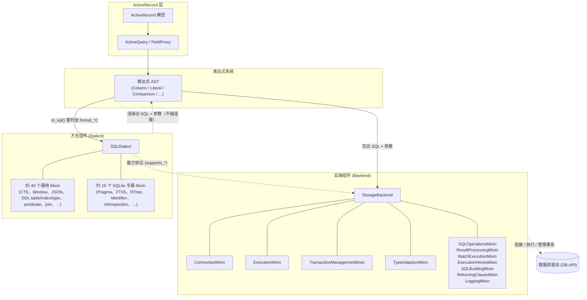
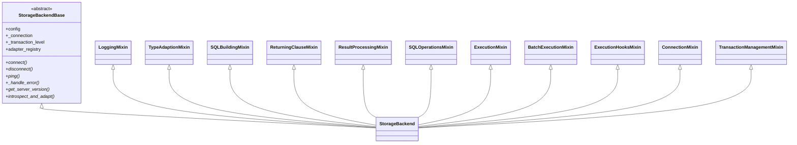
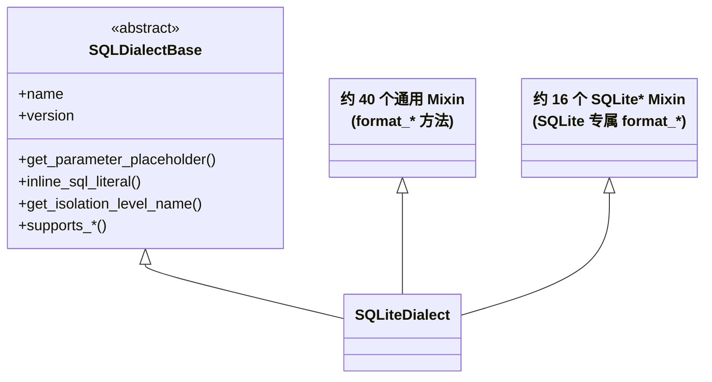
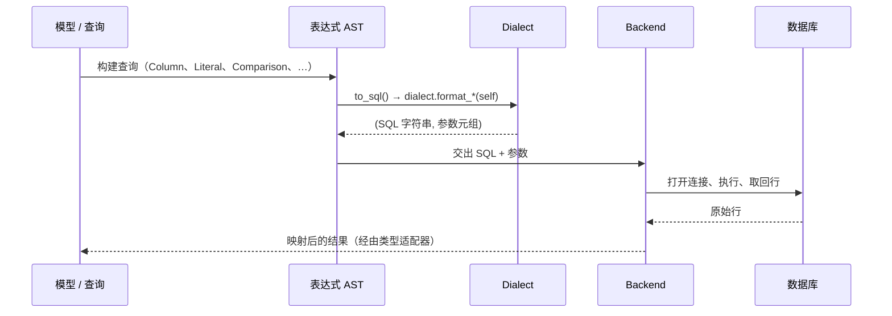

# 后端架构

后端是 `rhosocial-activerecord` 的最底层，是与数据库真正打交道的组件。它被刻意拆分为两个相互独立的部分：

- **`Backend`（后端）**——持有连接、执行 SQL、管理事务与类型适配器。它只知道「**如何运行**」SQL，却不知道「**如何构建**」SQL。
- **`Dialect`（方言）**——持有某个具体数据库的 SQL 语法，负责把表达式对象渲染成 SQL 字符串与参数元组。它只知道「**如何构建**」SQL，却不触碰任何连接。

**表达式—方言**这一对是整个设计的精髓：表达式只*描述*结构并收集参数；方言是把这份描述翻译成具体数据库 SQL 的**唯一**出口。

## 后端的两个半边

## 职责边界

| 关注点 | `Backend` | `Dialect` | `Expression` |
|--------|-----------|-----------|--------------|
| 持有连接 / 游标 | ✅ | ❌ | ❌ |
| 执行 SQL、取回行 | ✅ | ❌ | ❌ |
| 管理事务（begin/commit/rollback/savepoint） | ✅ | ❌ | ❌ |
| Python ↔ DBAPI 类型映射（适配器） | ✅ | ❌ | ❌ |
| 渲染 SQL 与参数占位符 | ❌ | ✅ | ❌ |
| 标识符引用、字面量转义 | ❌ | ✅ | ❌ |
| 声明能力支持（`supports_*`） | ✅（后端协议） | ✅（方言协议） | ❌ |
| 描述查询结构、收集参数 | ❌ | ❌ | ✅ |

后端明确地**不**继承方言，方言也**不**持有后端引用。二者只通过「方言产出、后端消费」的
`SQL 字符串 + 参数元组`协作——因此同一份表达式可在所有后端上原样渲染并执行。

## 后端组成（`StorageBackend`）

同步后端纯粹通过把多个 Mixin 组合到一个最小基类上而组装：

`AsyncStorageBackend` 完全镜像这一结构，只是把每个 Mixin 换成对应的异步版本
（如 `ExecutionMixin` → `AsyncExecutionMixin`），从而保持完整的同步 / 异步 API 对等。

## 方言组成（`SQLDialect`）

方言是另一面镜子——由数量多得多的「格式化 Mixin」组装而成：

- **通用 Mixin** 一次性覆盖 SQL 标准语义（CTE、窗口函数、JSON、锁、upsert、用于
  table/index/view/type/sequence 的 DDL、谓词、联结、集合运算、分组……），所有后端开箱即得。
- **后端专属 Mixin** 增加只有该数据库才理解的能力，且一律以前端名字命名
  （`SQLitePragmaMixin`、`SQLiteFTS5Mixin`……），因此不同后端之间永不相撞。

## 数据流：从表达式到结果

两条规则让这一切既安全又可预测：

1. **表达式绝不自行拼接 SQL 字符串。** 它只描述结构并收集参数；每个值都经由参数占位符
   （`?`）绑定，遵循 DB-API 2.0（PEP 249）要求的「SQL 与参数分离」。
2. **方言是唯一的渲染出口。** 任何表达式都可调用 `to_sql()` 检视它将要产出的确切 SQL，
   因为所有渲染都汇聚到方言的 `format_*` 方法。

## 能力协商

后端与方言都不靠继承深度来声明能力，而是在两个层面暴露细粒度的协议：

- `backend/protocols.py` —— 后端级声明（`ConcurrencyAware`……）
- `dialect/protocols.py` —— 方言级声明（`WindowFunctionSupport`、`JSONSupport`、
  `DDLTypeSupport`……）

这些协议都是运行时可检测的（`runtime_checkable`），`supports_*` 方法按**实际连接到的服务器版本**
门控行为。后端在连接后会通过 `introspect_and_adapt()` 重新适配方言，因此能力是「与服务器
协商的」，而非静态声明。

## 参见

- **[自定义后端](custom_backend.md)** —— 如何用同样这些 Mixin 与协议组装你自己的后端
- **[表达式系统](expression/README.md)** —— 表达式一侧的实现细节
- **[架构设计](../introduction/architecture.md)** —— 位于后端之上的 ActiveRecord / 查询总体架构