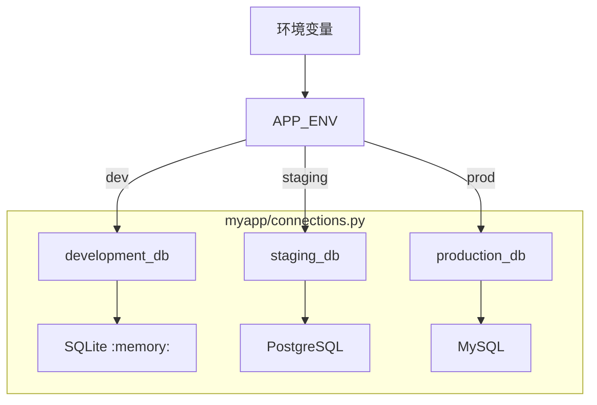
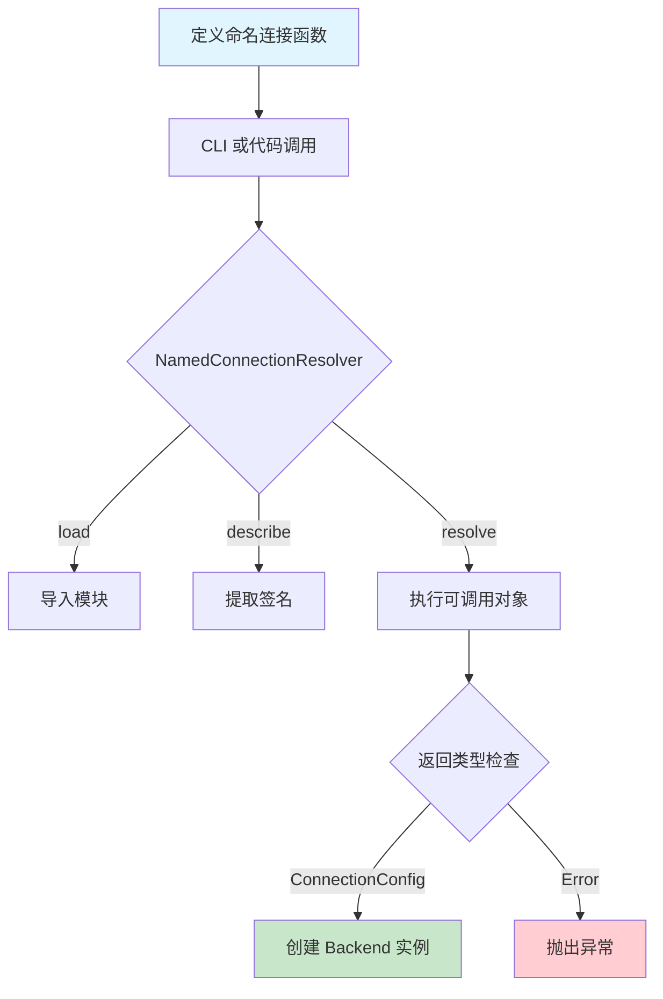
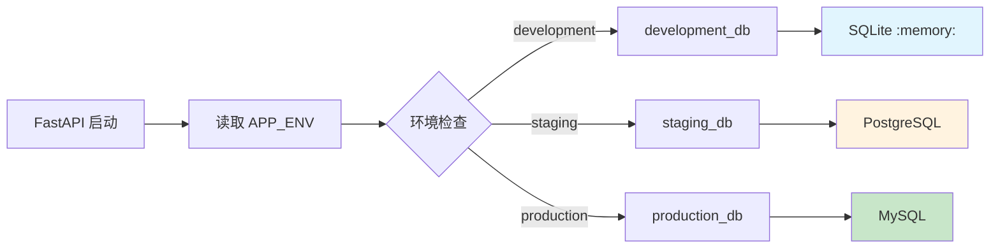

# 命名连接

> **本文档定位**: 面向应用开发者的实践指南，侧重「为什么用」和「怎么用」。
> **前置阅读**: 请先阅读 [数据库配置](./getting_started/configuration.md) 了解基础配置。

---

## 目录

1. [为什么需要命名连接?](#1-为什么需要命名连接)
2. [核心概念](#2-核心概念)
3. [快速开始](#3-快速开始)
4. [CLI 使用](#4-cli-使用)
5. [代码使用](#5-代码使用)
6. [环境切换最佳实践](#6-环境切换最佳实践)
7. [与 AWS Secrets Manager 集成](#7-与-aws-secrets-manager-集成)
8. [完整示例](#8-完整示例)
9. [Mermaid 图表](#9-mermaid-图表)
10. [API 参考](#10-api-参考)

---

## 1. 为什么需要命名连接?

### 传统方式的痛点

在命名连接出现之前，数据库配置分散在应用的各个位置：

```python
# ❌ 之前：直接在应用代码中配置
def get_user(user_id):
    conn = pymysql.connect(
        host=os.getenv("DB_HOST", "localhost"),
        user=os.getenv("DB_USER", "root"),
        password=os.getenv("DB_PASSWORD"),
        database=os.getenv("DB_NAME"),
    )
```

**这种方式的 问题：**

| 问题 | 说明 |
|------|------|
| **配置分散** | 硬编码、.env、k8s configmap，难以统一管理 |
| **无法版本控制** | 配置改动的审计记录困难 |
| **无 IDE 支持** | 无法跳转、类型提示 |
| **难以测试** | 无法 dry-run 查看最终配置 |
| **环境切换困难** | dev/staging/prod 配置差异大 |

### 命名连接如何解决这些问题

命名连接将**数据库配置封装为纯 Python 函数**，享受完整开发体验：

```python
# ✅ 之后：myapp/connections.py
def production_db():
    """生产环境数据库配置"""
    return MySQLConnectionConfig(
        host="prod.example.com",
        database="myapp",
        user="app_user",
        password=os.getenv("DB_PASSWORD"),  # 敏感信息从环境变量获取
    )

def development_db():
    """开发环境数据库配置"""
    return MySQLConnectionConfig(
        host="localhost",
        database="myapp_dev",
        user="root",
    )
```

---

## 2. 核心概念

### 2.1 什么是命名连接？

**命名连接**是一个可调用对象（函数或类实例），必须满足：

1. **可调用**: 函数或带有 `__call__` 方法的类实例
2. **返回配置**: 必须返回 `ConnectionConfig` 子类
3. **可选参数**: 可接受任意命名参数（用于参数化配置）

### 2.2 工作原理


### 2.3 支持的连接类型

| 后端 | 配置类 | 说明 |
|------|-------|------|
| SQLite | `SQLiteConnectionConfig` | 文件型/内存型 |
| MySQL | `MySQLConnectionConfig` | 需要 mysql-connector-python |
| PostgreSQL | `PostgresConnectionConfig` | 需要 psycopg |

---

## 3. 快速开始

```python
# myapp/connections.py
from rhosocial.activerecord.backend.impl.sqlite.config import SQLiteConnectionConfig
from rhosocial.activerecord.backend.impl.mysql.config import MySQLConnectionConfig


def development_db():
    """开发环境使用内存 SQLite"""
    return SQLiteConnectionConfig(
        database=":memory:",
        pragmas={"foreign_keys": "ON"},
    )


def production_db(pool_size: int = 10):
    """生产环境使用 MySQL"""
    return MySQLConnectionConfig(
        host="prod.example.com",
        database="myapp",
        user="app_user",
        password=os.getenv("DB_PASSWORD"),
        pool_size=pool_size,
    )


def file_db(database: str = "mydb.sqlite", timeout: int = 5):
    """文件型 SQLite 数据库"""
    return SQLiteConnectionConfig(
        database=database,
        timeout=timeout,
    )
```

---

## 4. CLI 使用

### 4.1 列出所有连接

```bash
# 列出模块中所有命名连接
python -m rhosocial.activerecord.backend.impl.sqlite named-connection \
    --named-connection myapp.connections --list
```

### 4.2 查看连接详情

```bash
# 查看具体连接配置
python -m rhosocial.activerecord.backend.impl.mysql named-connection \
    --named-connection myapp.connections.production_db --show
```

### 4.3 Dry-run 解析

```bash
# Dry-run 解析连接配置
python -m rhosocial.activerecord.backend.impl.mysql named-connection \
    --named-connection myapp.connections.production_db \
    --describe --conn-param pool_size=20

# 解析带参数覆盖的连接
python -m rhosocial.activerecord.backend.impl.sqlite named-connection \
    --named-connection myapp.connections.file_db \
    --describe \
    --conn-param database=custom.db \
    --conn-param timeout=10
```

### 4.4 在 query 中使用命名连接

```bash
# 使用命名连接替代 --db-file
python -m rhosocial.activerecord.backend.impl.sqlite query \
    --named-connection myapp.connections.production_db \
    "SELECT * FROM users LIMIT 10"

# 命名连接 + conn-param 覆盖
python -m rhosocial.activerecord.backend.impl.sqlite query \
    --named-connection myapp.connections.production_db \
    --conn-param database=override.db \
    "SELECT 1"
```

---

## 5. 代码使用

### 5.1 基本使用

```python
from rhosocial.activerecord.backend.named_connection import resolve_named_connection
from rhosocial.activerecord.backend.impl.mysql import MySQLBackend

# 一步解析
config = resolve_named_connection(
    "myapp.connections.production_db",
    user_params={"pool_size": 20}
)

# 创建后端
backend = MySQLBackend(connection_config=config)
```

```python
# 直接传入 callable
# configure() 接受任何返回 ConnectionConfig 的 callable，
# 因此可以直接导入命名连接函数并传入：
from myapp.connections import production_db
from rhosocial.activerecord.backend.impl.mysql import MySQLBackend

User.configure(production_db, MySQLBackend)

# 需要传参时，使用 functools.partial 或 lambda：
from functools import partial
User.configure(partial(production_db, pool_size=20), MySQLBackend)
```

### 5.2 分步控制

```python
from rhosocial.activerecord.backend.named_connection import NamedConnectionResolver

# 1. 创建解析器
resolver = NamedConnectionResolver("myapp.connections.production_db")

# 2. 加载可调用对象
resolver.load()

# 3. 查看描述(不实际调用)
info = resolver.describe()
print(f"参数: {info['parameters']}")
print(f"签名: {info['signature']}")

# 4. 解析并获取配置(可选传参覆盖)
config = resolver.resolve(user_params={"pool_size": 20})
```

### 5.3 与 ActiveRecord 结合

```python
from rhosocial.activerecord.model import ActiveRecord
from rhosocial.activerecord.backend.impl.mysql import MySQLBackend
from rhosocial.activerecord.backend.named_connection import resolve_named_connection

# 方式 1: 字符串解析（适合动态选择）
env = os.getenv("APP_ENV", "development")
connection_name = f"myapp.connections.{env}_db"
config = resolve_named_connection(connection_name)
ActiveRecord.configure(config, MySQLBackend)

# 方式 2: 直接传入 callable（适合静态导入）
from myapp.connections import production_db
ActiveRecord.configure(production_db, MySQLBackend)

# 需要传参时使用 partial 或 lambda:
from functools import partial
ActiveRecord.configure(partial(production_db, pool_size=20), MySQLBackend)
```

`configure()`、`BackendGroup` 和 `BackendManager.create_group()` 的 `config` 参数均支持传入 callable（函数、lambda、`functools.partial`），callable 会被自动调用以获取 `ConnectionConfig` 实例。

---

## 6. 环境切换最佳实践

### 6.1 配置文件结构



### 6.2 完整示例

```python
# myapp/connections.py
"""
数据库连接模块

根据 APP_ENV 自动选择连接配置：
- development: 内存 SQLite（最快启动）
- staging: PostgreSQL（测试环境）
- production: MySQL（生产环境）
"""
import os
from functools import partial

from rhosocial.activerecord.backend.impl.sqlite.config import SQLiteConnectionConfig
from rhosocial.activerecord.backend.impl.mysql.config import MySQLConnectionConfig
from rhosocial.activerecord.backend.impl.postgres.config import PostgresConnectionConfig


def _make_sqlite_memory():
    """开发环境：内存 SQLite"""
    return SQLiteConnectionConfig(
        database=":memory:",
        pragmas={"foreign_keys": "ON"},
    )


def _make_mysql(
    host: str = "localhost",
    port: int = 3306,
    database: str = "myapp",
    user: str = "root",
    pool_size: int = 10,
):
    """通用 MySQL 配置"""
    return MySQLConnectionConfig(
        host=host,
        port=port,
        database=database,
        user=user,
        password=os.getenv("MYSQL_PASSWORD"),
        pool_size=pool_size,
    )


def _make_postgres(
    host: str = "localhost",
    port: int = 5432,
    database: str = "myapp",
    user: str = "postgres",
    pool_size: int = 5,
):
    """通用 PostgreSQL 配置"""
    return PostgresConnectionConfig(
        host=host,
        port=port,
        database=database,
        user=user,
        password=os.getenv("POSTGRES_PASSWORD"),
        pool_size=pool_size,
    )


# === 环境特定的连接 ===

def development_db():
    """开发环境配置（内存 SQLite）"""
    return _make_sqlite_memory()


def staging_db(pool_size: int = 5):
    """预发布环境配置（PostgreSQL）"""
    return _make_postgres(
        host=os.getenv("STAGING_HOST", "staging.example.com"),
        database=os.getenv("STAGING_DATABASE", "myapp_staging"),
        pool_size=pool_size,
    )


def production_db(pool_size: int = 10):
    """生产环境配置（MySQL）"""
    return _make_mysql(
        host=os.getenv("PROD_HOST", "prod.example.com"),
        database=os.getenv("PROD_DATABASE", "myapp_prod"),
        pool_size=pool_size,
    )


# === 便捷访问 ===

def get_current_db(**kwargs):
    """根据 APP_ENV 返回当前环境的数据库配置
    
    参数:
        **kwargs: 传递给特定连接函数的参数
        
    返回:
        ConnectionConfig 子类实例
    """
    env = os.getenv("APP_ENV", "development")
    
    connections = {
        "development": development_db,
        "staging": staging_db,
        "production": production_db,
    }
    
    conn_fn = connections.get(env)
    if conn_fn is None:
        raise ValueError(f"未知的环境: {env}")
    
    return conn_fn(**kwargs)
```

### 6.3 环境变量

```bash
# .env 文件

# 开发环境（默认）
APP_ENV=development

# 或使用 staging/production
APP_ENV=staging
APP_ENV=production

# MySQL 生产配置
PROD_HOST=prod-db.example.com
PROD_DATABASE=myapp_prod
MYSQL_USER=app_user
MYSQL_PASSWORD=secret_password
```

---

## 7. 与 AWS Secrets Manager 集成

命名连接支持从 AWS Secrets Manager 获取数据库凭证，实现**基于身份的凭证分发**：

```python
# myapp/connections.py
import json
import os
from functools import lru_cache

import boto3

from rhosocial.activerecord.backend.impl.postgres.config import PostgresConnectionConfig
from rhosocial.activerecord.backend.impl.mysql.config import MySQLConnectionConfig


@lru_cache()
def get_secret(secret_name: str) -> dict:
    """从 AWS Secrets Manager 获取密钥"""
    client = boto3.client("secretsmanager")
    response = client.get_secret_value(SecretId=secret_name)
    return json.loads(response["SecretString"])


def production_db():
    """生产环境数据库配置（从 Secrets Manager 获取凭证）"""
    secret = get_secret(os.getenv("DB_SECRET_NAME", "prod/myapp/database"))
    return PostgresConnectionConfig(
        host=secret["host"],
        port=int(secret.get("port", 5432)),
        database=secret["dbname"],
        user=secret["username"],
        password=secret["password"],
    )


def staging_db():
    """预发布环境数据库配置"""
    secret = get_secret("staging/myapp/database")
    return MySQLConnectionConfig(
        host=secret["host"],
        port=secret["port"],
        database=secret["dbname"],
        user=secret["username"],
        password=secret["password"],
    )
```

**优势：**

| 特性 | 说明 |
|------|------|
| **基于身份** | 通过 IAM 角色/用户访问，无需硬编码凭证 |
| **自动轮换** | 配合 Secrets Manager 自动轮换功能 |
| **集中管理** | 所有环境凭证统一存储在 Secrets Manager |
| **审计追踪** | CloudTrail 记录所有访问日志 |

**AWS 密钥结构约定：**

```json
{
  "host": "prod.example.com",
  "port": 5432,
  "dbname": "myapp_prod",
  "username": "app_user",
  "password": "secret_password"
}
```

**注意事项：**

- 确保运行环境中已配置 AWS 凭证（IAM 角色、环境变量、或 `~/.aws/credentials`）
- 生产环境建议添加重试逻辑和超时控制
- 敏感环境可结合 `functools.lru_cache` 减少 API 调用

---

## 8. 完整示例

### 8.1 多环境切换示例

```python
# main.py
import os
from rhosocial.activerecord.model import ActiveRecord
from rhosocial.activerecord.backend.impl.mysql import MySQLBackend
from rhosocial.activerecord.backend.named_connection import resolve_named_connection


def main():
    env = os.getenv("APP_ENV", "development")
    connection_name = f"myapp.connections.{env}_db"
    
    config = resolve_named_connection(connection_name)
    ActiveRecord.configure(config, MySQLBackend)
    
    print(f"Connected to: {config}")


if __name__ == "__main__":
    main()
```

### 8.2 FastAPI 集成示例

```python
# main.py
from contextlib import asynccontextmanager
from fastapi import FastAPI
import os

from rhosocial.activerecord.model import ActiveRecord
from rhosocial.activerecord.backend.impl.mysql import MySQLBackend
from rhosocial.activerecord.backend.named_connection import resolve_named_connection


@asynccontextmanager
async def lifespan(app: FastAPI):
    env = os.getenv("APP_ENV", "development")
    connection_name = f"myapp.connections.{env}_db"
    
    config = resolve_named_connection(connection_name)
    ActiveRecord.configure(config, MySQLBackend)
    
    yield


app = FastAPI(lifespan=lifespan)


@app.get("/health")
def health_check():
    return {"status": "ok"}
```

---

## 9. Mermaid 图表

### 9.1 命名连接生命周期



### 9.2 环境选择流程



---

## 10. API 参考

### 异常类

- `NamedConnectionError` - 基础异常
- `NamedConnectionModuleNotFoundError` - 找不到模块
- `NamedConnectionNotFoundError` - 找不到连接
- `NamedConnectionNotCallableError` - 不可调用
- `NamedConnectionInvalidReturnTypeError` - 无效返回类型
- `NamedConnectionInvalidParameterError` - 无效参数
- `NamedConnectionMissingParameterError` - 缺少参数

### 核心 API

| 函数/类 | 说明 |
|--------|------|
| `resolve_named_connection(name, user_params=None)` | 一步完成命名连接的解析和调用 |
| `NamedConnectionResolver(name)` | 命名连接解析器类，提供细粒度控制 |
| `list_named_connections_in_module(module_name)` | 列出模块中定义的所有命名连接 |

### NamedConnectionResolver 方法

| 方法 | 说明 |
|------|------|
| `load()` | 加载并验证 callable 对象 |
| `describe()` | 获取函数签名和参数信息（不实际调用） |
| `resolve(user_params=None)` | 执行 callable 并返回配置 |
| `get_callable()` | 获取加载的 callable 对象 |