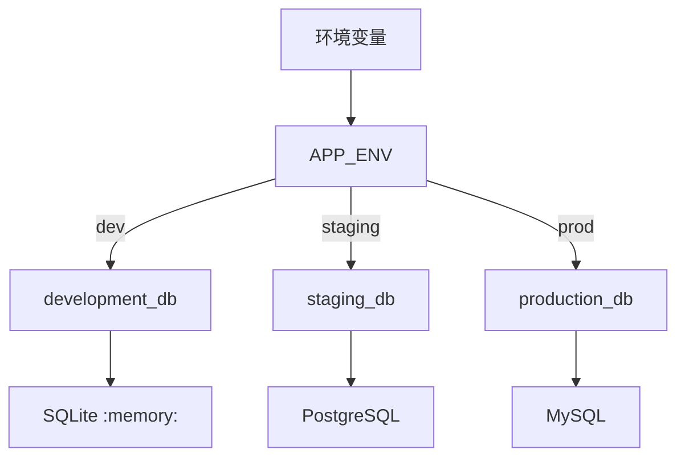
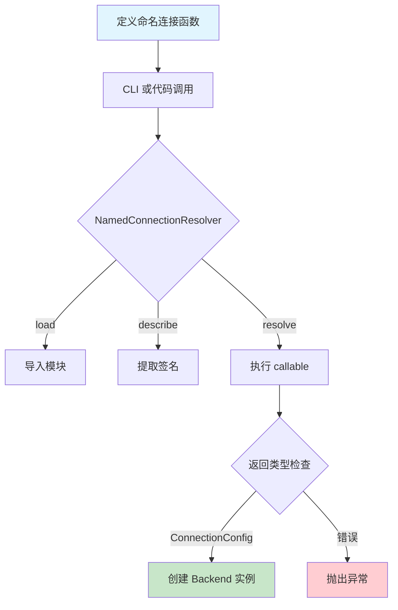
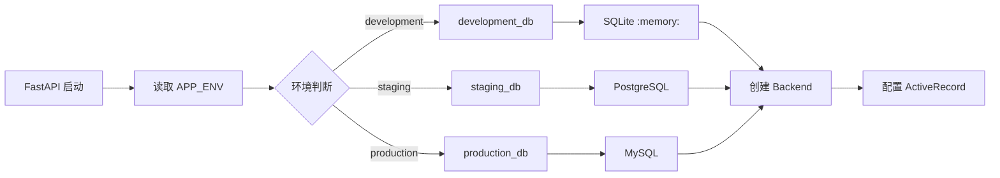

# 命名连接

> **本文档定位**: 面向应用开发者的实践指南,侧重「为什么用」和「怎么用」。
> **前置知识**: 建议先阅读 [数据库配置](./getting_started/configuration.md) 了解基础配置方式。

---

## 目录

1. [为什么需要命名连接?](#1-为什么需要命名连接)
2. [核心概念](#2-核心概念)
3. [快速上手](#3-快速上手)
4. [在 CLI 中使用](#4-在-cli-中使用)
5. [在代码中使用](#5-在代码中使用)
6. [环境切换最佳实践](#6-环境切换最佳实践)
7. [完整示例](#7-完整示例)
8. [Mermaid 流程图](#8-mermaid-流程图)
9. [API 参考](#9-api-参考)

---

## 1. 为什么需要命名连接?

### 传统做法的痛点

在没有命名连接之前,数据库配置通常散落在应用各处:

```python
# ❌ 使用前: 应用代码直接拼接配置
def get_user(user_id):
    # 配置散落: 硬编码、env 文件、环境变量...
    conn = pymysql.connect(
        host=os.getenv("DB_HOST", "localhost"),
        user=os.getenv("DB_USER", "root"),
        password=os.getenv("DB_PASSWORD"),
        database=os.getenv("DB_NAME"),
    )
```

**这种方式存在的问题:**

| 问题 | 说明 |
|------|------|
| **配置分散** | 硬编码、.env、k8s configmap,难以统一管理 |
| **无法版本控制** | 配置改动的审计记录困难 |
| **无 IDE 支持** | 无法跳转、类型提示 |
| **难以测试** | 无法 dry-run 查看最终配置 |
| **环境切换困难** | dev/staging/prod 配置差异大 |

### 命名连接如何解决这些问题

命名连接将**数据库配置封装为纯 Python 函数**,享受完整开发体验:

```python
# ✅ 使用后: myapp/connections.py
def production_db():
    """生产环境数据库配置"""
    return MySQLConnectionConfig(
        host="prod.example.com",
        database="myapp",
        user="app_user",
        password=os.getenv("DB_PASSWORD"),  # 敏感信息从环境变量读取
    )

def development_db():
    """开发环境数据库配置"""
    return MySQLConnectionConfig(
        host="localhost",
        database="myapp_dev",
        user="root",
    )
```

---

## 2. 核心概念

### 2.1 什么是命名连接?

**命名连接**是一个可调用对象(函数或类),必须满足:

1. **可调用**: 函数或带有 `__call__` 方法的类实例
2. **返回配置**: 必须返回 `ConnectionConfig` 子类(如 `SQLiteConnectionConfig`、`MySQLConnectionConfig`)
3. **可选参数**: 可接受任意命名参数(用于参数化配置)

### 2.2 命名连接的工作原理


### 2.3 支持的连接类型

| 后端 | 配置类 | 说明 |
|------|-------|------|
| SQLite | `SQLiteConnectionConfig` | 文件型/内存型 |
| MySQL | `MySQLConnectionConfig` | 需要 mysql-connector-python |
| PostgreSQL | `PostgresConnectionConfig` | 需要 psycopg |

---

## 3. 快速上手

### 第一步: 定义命名连接

```python
# myapp/connections.py
from rhosocial.activerecord.backend.impl.sqlite.config import SQLiteConnectionConfig
from rhosocial.activerecord.backend.impl.mysql.config import MySQLConnectionConfig
from rhosocial.activerecord.backend.impl.postgres.config import PostgresConnectionConfig


def development_db():
    """开发环境 SQLite 配置(内存型)"""
    return SQLiteConnectionConfig(
        database=":memory:",
    )


def production_db(pool_size: int = 10):
    """生产环境 MySQL 配置
    
    Args:
        pool_size: 连接池大小
    """
    return MySQLConnectionConfig(
        host=os.getenv("MYSQL_HOST", "localhost"),
        port=int(os.getenv("MYSQL_PORT", "3306")),
        database=os.getenv("MYSQL_DATABASE"),
        user=os.getenv("MYSQL_USER"),
        password=os.getenv("MYSQL_PASSWORD"),
        pool_size=pool_size,
    )
```

### 第二步: CLI 查看配置

```bash
# 列出模块中所有命名连接
python -m rhosocial.activerecord.backend.impl.sqlite named-connection \
    --named-connection myapp.connections --list

# 查看具体连接配置
python -m rhosocial.activerecord.backend.impl.mysql named-connection \
    --named-connection myapp.connections.production_db --show

# Dry-run 解析连接配置
python -m rhosocial.activerecord.backend.impl.mysql named-connection \
    --named-connection myapp.connections.production_db \
    --describe --conn-param pool_size=20
```

### 第三步: 在代码中使用

```python
from rhosocial.activerecord.backend.named_connection import resolve_named_connection
from rhosocial.activerecord.model import ActiveRecord

# 解析命名连接并配置后端
config = resolve_named_connection("myapp.connections.production_db")

# 方式一: 直接配置
ActiveRecord.configure(config, MySQLBackend)

# 方式二: 手动创建后端
backend = MySQLBackend(connection_config=config)
```

---

## 4. 在 CLI 中使用

### 4.1 列出所有连接

```bash
# SQLite
python -m rhosocial.activerecord.backend.impl.sqlite named-connection \
    --named-connection myapp.connections --list

# MySQL
python -m rhosocial.activerecord.backend.impl.mysql named-connection \
    --named-connection myapp.connections --list

# PostgreSQL
python -m rhosocial.activerecord.backend.impl.postgres named-connection \
    --named-connection myapp.connections --list
```

**输出示例:**

```
Module: myapp.connections
Name                           Parameters                               Brief                         
----------------------------------------------------------------------------------------------------
development_db               ()                                       开发环境 SQLite 配置...
production_db                (pool_size: int = 10)                      生产环境 MySQL 配置
staging_db                   (pool_size: int = 5)                      预发布环境配置
```

### 4.2 查看连接详情

```bash
# 查看配置信息(敏感字段会被过滤)
python -m rhosocial.activerecord.backend.impl.mysql named-connection \
    --named-connection myapp.connections.production_db --show
```

**输出:**

```
Connection: myapp.connections.production_db
Type: Function
Docstring: 生产环境 MySQL 配置
Signature: (pool_size: int = 10)
Parameters:
  pool_size default=10
Config Preview (non-sensitive fields):
  host: prod.example.com
  database: myapp
  pool_size: 10
  ...
```

### 4.3 Dry-run 解析

```bash
# 解析配置并查看最终参数(不实际连接)
python -m rhosocial.activerecord.backend.impl.mysql named-connection \
    --named-connection myapp.connections.production_db \
    --describe --conn-param pool_size=20
```

**输出:**

```
Resolved Configuration:
  host: prod.example.com
  port: 3306
  database: myapp
  pool_size: 20
  ...
```

### CLI 参数速查

| 参数 | 说明 |
|------|------|
| `--named-connection QUALIFIED_NAME` | 命名连接完全限定名 |
| `--list` | 列出模块中所有连接 |
| `--show QUALIFIED_NAME` | 显示连接详情 |
| `--describe QUALIFIED_NAME` | Dry-run 解析配置 |
| `--conn-param KEY=VALUE` | 覆盖连接参数 |

---

## 5. 在代码中使用

### 5.1 基本用法

```python
from rhosocial.activerecord.backend.named_connection import resolve_named_connection

# 方式一: 一步解析
config = resolve_named_connection(
    "myapp.connections.production_db",
    user_params={"pool_size": 20}
)
```

### 5.2 分步控制

```python
from rhosocial.activerecord.backend.named_connection import NamedConnectionResolver

# 1. 创建解析器
resolver = NamedConnectionResolver("myapp.connections.production_db")

# 2. 加载可调用对象
resolver.load()

# 3. 查看描述(不实际调用)
info = resolver.describe()
print(f"参数: {info['parameters']}")
print(f"签名: {info['signature']}")

# 4. 解析并获取配置(可选传参覆盖)
config = resolver.resolve(user_params={"pool_size": 20})
```

### 5.3 结合 ActiveRecord

```python
from rhosocial.activerecord.model import ActiveRecord
from rhosocial.activerecord.backend.impl.mysql import MySQLBackend
from rhosocial.activerecord.backend.named_connection import resolve_named_connection

# 环境判断
env = os.getenv("APP_ENV", "development")

# 根据环境选择连接
connection_name = f"myapp.connections.{env}_db"
config = resolve_named_connection(connection_name)

# 配置 ActiveRecord
ActiveRecord.configure(config, MySQLBackend)
```

---

## 6. 环境切换最佳实践

### 6.1 配置文件结构



### 6.2 完整示例

```python
# myapp/connections.py
"""
数据库连接配置模块

根据 APP_ENV 环境变量自动选择连接配置:
- development: 内存 SQLite (最快启动)
- staging: PostgreSQL (测试环境)
- production: MySQL (生产环境)
"""
import os
from functools import partial

from rhosocial.activerecord.backend.impl.sqlite.config import SQLiteConnectionConfig
from rhosocial.activerecord.backend.impl.mysql.config import MySQLConnectionConfig
from rhosocial.activerecord.backend.impl.postgres.config import PostgresConnectionConfig


def _make_sqlite_memory():
    """开发环境: 内存 SQLite"""
    return SQLiteConnectionConfig(
        database=":memory:",
        pragmas={"foreign_keys": "ON"},
    )


def _make_mysql(
    host: str = "localhost",
    port: int = 3306,
    database: str = "myapp",
    user: str = "root",
    pool_size: int = 10,
):
    """通用的 MySQL 配置"""
    return MySQLConnectionConfig(
        host=host,
        port=port,
        database=database,
        user=user,
        password=os.getenv("MYSQL_PASSWORD"),
        pool_size=pool_size,
    )


def _make_postgres(
    host: str = "localhost",
    port: int = 5432,
    database: str = "myapp",
    user: str = "postgres",
    pool_size: int = 5,
):
    """通用的 PostgreSQL 配置"""
    return PostgresConnectionConfig(
        host=host,
        port=port,
        database=database,
        user=user,
        password=os.getenv("POSTGRES_PASSWORD"),
        pool_size=pool_size,
    )


# === 环境特定的连接 ===

def development_db():
    """开发环境数据库配置(内存 SQLite)"""
    return _make_sqlite_memory()


def staging_db(pool_size: int = 5):
    """预发布环境数据库配置(PostgreSQL)"""
    return _make_postgres(
        host=os.getenv("STAGING_HOST", "staging.example.com"),
        database=os.getenv("STAGING_DATABASE", "myapp_staging"),
        pool_size=pool_size,
    )


def production_db(pool_size: int = 10):
    """生产环境数据库配置(MySQL)"""
    return _make_mysql(
        host=os.getenv("PROD_HOST", "prod.example.com"),
        database=os.getenv("PROD_DATABASE", "myapp_prod"),
        pool_size=pool_size,
    )


# === 便捷访问 ===

def get_current_db(**kwargs):
    """根据环境变量返回当前环境的数据库配置
    
    Args:
        **kwargs: 传递给具体连接函数的参数
        
    Returns:
        ConnectionConfig 子类实例
    """
    env = os.getenv("APP_ENV", "development")
    
    connections = {
        "development": development_db,
        "staging": staging_db,
        "production": production_db,
    }
    
    conn_fn = connections.get(env)
    if conn_fn is None:
        raise ValueError(f"Unknown environment: {env}")
    
    return conn_fn(**kwargs)
```

### 6.3 环境变量配置

```bash
# .env 文件

# 开发环境(默认)
APP_ENV=development

# 或者使用 staging/production
APP_ENV=staging
APP_ENV=production

# MySQL 生产配置
PROD_HOST=prod-db.example.com
PROD_DATABASE=myapp_prod
MYSQL_USER=app_user
MYSQL_PASSWORD=secret_password
```

---

## 7. 完整示例

### 7.1 多环境切换示例

```python
# main.py
import os
from rhosocial.activerecord.model import ActiveRecord
from rhosocial.activerecord.backend.impl.mysql import MySQLBackend
from rhosocial.activerecord.backend.named_connection import resolve_named_connection


def main():
    env = os.getenv("APP_ENV", "development")
    
    # 使用环境特定的连接
    config = resolve_named_connection(f"app.connections.{env}_db")
    
    backend = MySQLBackend(connection_config=config)
    
    # 配置 ActiveRecord
    ActiveRecord.configure(config, MySQLBackend)
    
    # 现在可以使用 ActiveRecord 了
    users = User.all()
    print(f"当前环境: {env}, 用户数: {len(users)}")


if __name__ == "__main__":
    main()
```

### 7.2 FastAPI 集成示例

```python
# app/main.py
from fastapi import FastAPI
from rhosocial.activerecord.backend.named_connection import resolve_named_connection
from rhosocial.activerecord.backend.impl.mysql import MySQLBackend

app = FastAPI()


@app.on_event("startup")
async def startup():
    env = os.getenv("APP_ENV", "development")
    config = resolve_named_connection(f"app.connections.{env}_db")
    backend = MySQLBackend(connection_config=config)
    app.state.backend = backend


@app.get("/users")
async def list_users():
    backend = app.state.backend
    cursor = backend.execute("SELECT * FROM users LIMIT 10")
    return {"users": cursor.fetchall()}
```

---

## 8. Mermaid 流程图

### 8.1 命名连接生命周期



### 8.2 环境选择流程



---

## 9. API 参考

### 异常

- `NamedConnectionError` - 基础异常
- `NamedConnectionModuleNotFoundError` - 找不到模块
- `NamedConnectionNotFoundError` - 找不到连接
- `NamedConnectionNotCallableError` - 不可调用
- `NamedConnectionInvalidReturnTypeError` - 无效返回类型
- `NamedConnectionInvalidParameterError` - 无效参数
- `NamedConnectionMissingParameterError` - 缺少参数

### 核心 API

| 类/函数 | 说明 |
|--------|------|
| `NamedConnectionResolver` | 命名连接解析器 |
| `resolve_named_connection()` | 一步解析便捷函数 |
| `list_named_connections_in_module()` | 列出模块中的连接 |
