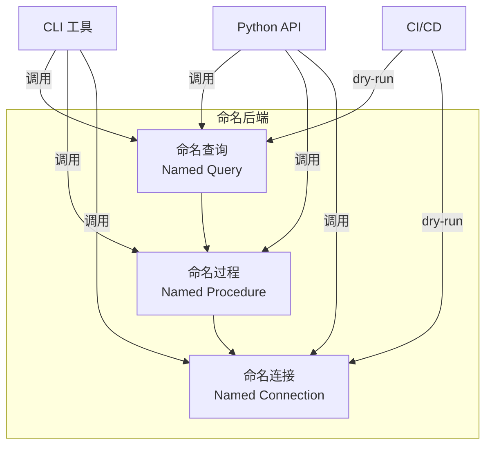

# 命名查询与命名过程

> **本文档定位**: 面向应用开发者的实践指南,侧重「为什么用」和「怎么用」。

---

## 1. 概述

命名后端功能包含三个核心特性，帮助您更好地管理和执行数据库操作。这些功能是**后端级别的能力**，独立于 ActiveRecord 模式运行——它们直接操作数据库后端，无需 ActiveRecord 模型。



| 特性 | 用途 | 典型场景 |
|------|------|---------|
| **命名查询** | 将 SQL 查询封装为函数 | 单条 SELECT/UPDATE/DELETE |
| **命名过程** | 多步骤业务流程编排 | 批量归档、跨表操作 |
| **命名连接** | 数据库配置外部化 | 环境切换、多租户 |

> **重要**: 这些都是**后端功能**，与 ActiveRecord 模型和 ActiveQuery 无关。
>
> **注意**: 本文档中的示例均以 **SQLite 后端** 作为演示数据库。概念适用于其他后端（MySQL、PostgreSQL 等），但 CLI 命令可能有所不同。

---

## 2. 目录

1. [命名查询](#命名查询)
   - [为什么需要命名查询](#为什么需要命名查询)
   - [调用方式](#命名查询的调用方式)
2. [命名过程](#命名过程)
   - [为什么需要命名过程](#为什么需要命名过程)
   - [编写命名过程](#编写命名过程)
   - [ProcedureContext 方法](#procedurecontext-方法速查)
   - [并行执行](#并行执行)
   - [调用方式](#命名过程的调用方式)
3. [事务模式选择指南](#事务模式选择指南)
4. [流程图可视化](#流程图可视化)
5. [API 参考](#api-参考)

---

## 命名查询

### 为什么需要命名查询?

在命名查询出现之前，Python 项目中最常见的数据库查询方式是将原始 SQL 字符串直接嵌入业务逻辑。这种方式存在几个严重问题：

**痛点：**

1. **SQL 注入风险**：使用 f-string 或字符串格式化将参数直接嵌入 SQL，允许恶意输入篡改查询逻辑。

2. **复用性差**：SQL 字符串在多个文件中被复制粘贴，当查询需要修改时，难以保持一致性。

3. **方言锁定**：硬编码的 SQL 语法（如 SQLite 特定函数）使得迁移到其他数据库后端变得困难。

4. **测试困难**：无法单独测试查询——必须启动整个应用程序并建立数据库连接。

5. **无法 dry-run**：实际执行的 SQL 在运行时才能看到，难以调试。

**命名查询如何解决这些问题：**

命名查询将查询逻辑封装为**纯 Python 函数**。关键创新在于 `dialect` 参数由框架在执行时自动注入，允许同一查询代码在不同数据库后端上工作。

```python
# 定义一次，可在任何方言下使用
def active_users(dialect, limit: int = 100, status: str = "active"):
    """从数据库获取活跃用户。"""
    return QueryExpression(
        dialect,
        select=[Column(dialect, "id"), Column(dialect, "name")],
        from_=TableExpression(dialect, "users"),
        where=Column(dialect, "status") == status,
        limit_offset=LimitOffsetClause(dialect, limit=limit),
    )

# 使用 SQLite 方言执行时，生成 SQLite SQL
# 使用 MySQL 方言执行时，生成 MySQL SQL
```

### 命名查询的调用方式

有三种主要方式调用命名查询：

#### 1. CLI（命令行界面）

CLI 适合快速测试、调试和 CI/CD 管道。它提供了几个有用的标志：

**执行查询：**
```bash
python -m rhosocial.activerecord.backend.impl.sqlite named-query \
    myapp.queries.users.active_users \
    --db-file mydb.sqlite \
    --param limit=10 \
    --param status=active
```
这将执行命名查询并返回结果。`--param` 标志可以重复使用以传递多个参数。

**Dry-run 模式（预览 SQL 但不执行）：**
```bash
python -m rhosocial.activerecord.backend.impl.sqlite named-query \
    myapp.queries.users.active_users \
    --db-file mydb.sqlite --dry-run
```
输出示例：
```
[DRY RUN] SELECT "id", "name" FROM "users" WHERE "status" = ? LIMIT ?
Params: ('active', 100)
```
这对于 CI/CD 验证或检查生成的 SQL 非常有用。

**描述查询（查看签名但不执行）：**
```bash
python -m rhosocial.activerecord.backend.impl.sqlite named-query \
    myapp.queries.users.active_users --describe
```
显示函数签名、参数类型和文档字符串，无需连接数据库。

**列出模块中的所有查询：**
```bash
python -m rhosocial.activerecord.backend.impl.sqlite named-query \
    myapp.queries.users --list
```
可用于发现模块中可用的命名查询。

**执行 EXPLAIN 计划：**
```bash
python -m rhosocial.activerecord.backend.impl.sqlite named-query \
    myapp.queries.users.active_users \
    --db-file mydb.sqlite \
    --explain \
    --param limit=10
```
执行 `EXPLAIN` 以显示查询执行计划，用于性能分析。

#### 2. 程序化 API（Python 代码）

程序化 API 提供更多控制，与应用程序集成良好：

**一步式方法（快速）：**
```python
from rhosocial.activerecord.backend.named_query import resolve_named_query
from rhosocial.activerecord.backend.impl.sqlite import SQLiteBackend

backend = SQLiteBackend(database="mydb.sqlite")
dialect = backend.dialect

# 一步完成解析、生成 SQL 和执行
expr, sql, params = resolve_named_query(
    "myapp.queries.users.active_users",
    dialect,
    {"limit": 50, "status": "active"},
)
print("生成的 SQL:", sql)
# 可与 pandas、直接执行等配合使用
```

**分步方法（灵活）：**
```python
from rhosocial.activerecord.backend.named_query import NamedQueryResolver

# 加载命名查询解析器
resolver = NamedQueryResolver("myapp.queries.users.active_users").load()

# 检查而不执行
info = resolver.describe()
print(f"参数: {info['parameters']}")
print(f"返回类型: {info['return_type']}")

# 在需要时生成表达式和 SQL
expr = resolver.execute(dialect, {"limit": 50})
sql, params = expr.to_sql()
```

#### 3. CI/CD 集成

用于 CI 管道中的自动化测试和验证：

```yaml
# .github/workflows/validate-queries.yml
name: Validate Named Queries
on: [push, pull_request]

jobs:
  validate:
    runs-on: ubuntu-latest
    steps:
      - uses: actions/checkout@v4
      - uses: actions/setup-python@v5
        with: { python-version: "3.12" }
      - run: pip install -e .
      - name: 静态验证
        run: |
          python -m rhosocial.activerecord.backend.impl.sqlite named-query \
            myapp.queries.users.active_users \
            --db-file :memory: --dry-run \
            --param limit=100 --param status=active
```

这里的技巧是使用 `--db-file :memory:` 配合 `--dry-run`——这允许验证而无需实际的数据库文件或连接。

---

## 命名过程

### 为什么需要命名过程?

命名查询解决了管理单个 SQL 查询的问题，但实际业务操作通常需要一个**步骤序列**和条件逻辑。例如：

> "统计本月订单数 → 如果为零则跳过 → 归档已完成的订单 → 删除旧的归档记录"

这是一个多步骤流程，具有：
- 条件分支（如果无订单则跳过）
- 顺序调用多个查询
- 可能需要事务管理
- 受益于执行日志

命名过程通过提供基于 Python 类的工作流来编排多个命名查询来解决这个问题。

### 编写命名过程

命名过程通过继承 `Procedure`（同步）或 `AsyncProcedure`（异步）来定义。类将参数定义为类属性，并实现 `run()` 方法：

```python
from rhosocial.activerecord.backend.named_query import Procedure, ProcedureContext

class MonthlyCleanupProcedure(Procedure):
    """月度订单归档清理过程。"""
    month: str = "2026-03"  # 默认参数

    def run(self, ctx: ProcedureContext) -> None:
        # 步骤 1: 统计本月订单数
        # 'bind' 参数将结果存储在 "order_count" 下
        ctx.execute(
            "myapp.queries.orders.count_monthly_orders",
            params={"month": self.month},
            bind="order_count",
        )

        # 步骤 2: 提取计数值并检查是否为零
        count = ctx.scalar("order_count", "cnt")
        if not count:
            # 记录并中止如果没有订单
            ctx.log(f"月份 {self.month} 无订单,跳过清理。", level="INFO")
            ctx.abort("MonthlyCleanupProcedure", f"No orders in {self.month}")

        # 步骤 3: 归档已完成的订单
        ctx.execute(
            "myapp.queries.orders.archive_completed_orders",
            params={"month": self.month},
            output=True,  # 将结果保留在 outputs 中
        )

        # 步骤 4: 删除旧的归档记录
        ctx.execute(
            "myapp.queries.orders.delete_archived_orders",
            params={"month": self.month},
            output=True,
        )

        # 记录完成
        ctx.log("归档清理完成。", level="INFO")
```

### ProcedureContext 方法速查

`ctx` 对象提供与执行环境交互的方法：

| 方法 | 签名 | 说明 |
|---|---|---|
| `execute` | `(qualified_name, params=None, bind=None, output=False)` | 执行命名查询；`bind` 将结果存入上下文变量 |
| `scalar` | `(var_name, column)` | 从绑定变量的第一行提取单列值 |
| `rows` | `(var_name)` | 迭代绑定变量的所有行 |
| `bind` | `(name, data)` | 手动将任意数据绑定到上下文变量 |
| `get` | `(name, default=None)` | 获取上下文变量值 |
| `log` | `(message, level="INFO")` | 追加日志条目（DEBUG/INFO/WARNING/ERROR） |
| `abort` | `(procedure_name, reason)` | 终止过程，触发回滚 |
| `parallel` | `(*steps, max_concurrency=None)` | 并发执行多个查询 |

### 并行执行

对于可以并发运行的独立子任务，使用 `ctx.parallel()`：

```python
from rhosocial.activerecord.backend.named_query import Procedure, ProcedureContext, ParallelStep

class OrderProcessingProcedure(Procedure):
    order_id: int
    user_id: int

    def run(self, ctx: ProcedureContext) -> None:
        # 并发执行：预留库存 + 发送通知
        # max_concurrency=2 限制为 2 个并发执行
        ctx.parallel(
            ParallelStep(
                "myapp.queries.inventory.reserve",
                params={"order_id": self.order_id},
                bind="reserved",
            ),
            ParallelStep(
                "myapp.queries.notification.send",
                params={"user_id": self.user_id, "type": "order_started"},
            ),
            max_concurrency=2,
        )

        # 访问并行结果与顺序结果一样
        reserved = ctx.scalar("reserved", "quantity")
```

#### 注意事项

1. **事务考虑**：在 `AUTO` 事务模式下，如果任何并行步骤失败，整个事务会回滚。对于并行操作，考虑使用 `STEP` 模式或 `NONE` 模式（如果查询是幂等的）。

2. **max_concurrency**：默认为 `None`（无限制）。设置正整数限制并发执行，防止资源耗尽。

3. **结果访问**：并行结果通过 `ctx.scalar()` 和 `ctx.rows()` 使用每个 `ParallelStep` 的 `bind` 名称访问。

4. **数据依赖**：如果步骤之间有数据依赖（一个需要另一个的输出），不应使用并行，应使用顺序执行。

5. **Dry-run 行为**：在 dry-run 模式下，`ctx.parallel()` 顺序执行以生成完整的流程图。

### 命名过程的调用方式

#### CLI 调用

命名过程的 CLI 与命名查询类似，但增加了事务模式控制：

**执行过程：**
```bash
python -m rhosocial.activerecord.backend.impl.sqlite named-procedure \
    myapp.procedures.monthly_cleanup.MonthlyCleanupProcedure \
    --db-file mydb.sqlite \
    --param month=2026-03 \
    --transaction auto
```
`--transaction` 标志控制过程如何处理事务（见下文事务模式部分）。

**查看过程定义：**
```bash
python -m rhosocial.activerecord.backend.impl.sqlite named-procedure \
    myapp.procedures.monthly_cleanup.MonthlyCleanupProcedure \
    --db-file mydb.sqlite --describe
```

**Dry-run（预览所有 SQL 步骤）：**
```bash
python -m rhosocial.activerecord.backend.impl.sqlite named-procedure \
    myapp.procedures.monthly_cleanup.MonthlyCleanupProcedure \
    --db-file mydb.sqlite --dry-run --param month=2026-03
```

**STEP 事务模式：**
```bash
python -m rhosocial.activerecord.backend.impl.sqlite named-procedure \
    myapp.procedures.monthly_cleanup.MonthlyCleanupProcedure \
    --db-file mydb.sqlite --param month=2026-03 --transaction step
```
在 STEP 模式下，每一步独立提交。

**列出模块中的过程：**
```bash
python -m rhosocial.activerecord.backend.impl.sqlite named-procedure \
    myapp.procedures.monthly_cleanup --list
```

**异步执行（用于 AsyncProcedure 子类）：**
```bash
python -m rhosocial.activerecord.backend.impl.sqlite named-procedure \
    myapp.procedures.monthly_cleanup.MonthlyCleanupProcedure \
    --db-file mydb.sqlite --param month=2026-03 --async
```

#### 程序化 API

```python
from rhosocial.activerecord.backend.named_query import (
    ProcedureRunner, TransactionMode, ProcedureResult,
)
from rhosocial.activerecord.backend.impl.sqlite import SQLiteBackend

backend = SQLiteBackend(database="mydb.sqlite")
dialect = backend.dialect

# 加载过程类
runner = ProcedureRunner(
    "myapp.procedures.monthly_cleanup.MonthlyCleanupProcedure"
).load()

# 使用参数执行
result: ProcedureResult = runner.run(
    dialect,
    user_params={"month": "2026-03"},
    transaction_mode=TransactionMode.AUTO,
    backend=backend,
    execute_query=backend.execute,
)

# 检查结果
if result.aborted:
    print(f"⚠️  已终止: {result.abort_reason}")
else:
    print(f"✅ 完成，输出步骤数: {len(result.outputs)}")

# 访问日志
for entry in result.logs:
    print(f"[{entry.level}] {entry.message}")
```

#### 异步环境（FastAPI/aiohttp）

对于异步 Web 框架，使用 `AsyncProcedure` 和 `AsyncProcedureRunner`：

```python
from rhosocial.activerecord.backend.named_query import AsyncProcedure, AsyncProcedureContext

class MonthlyCleanupAsyncProcedure(AsyncProcedure):
    month: str = "2026-03"

    async def run(self, ctx: AsyncProcedureContext) -> None:
        await ctx.execute(
            "myapp.queries.orders.count_monthly_orders",
            params={"month": self.month},
            bind="order_count",
        )

        count = await ctx.scalar("order_count", "cnt")
        if not count:
            await ctx.log(f"月份 {self.month} 无订单，跳过。")
            await ctx.abort("MonthlyCleanupAsyncProcedure", f"No orders in {self.month}")

        await ctx.execute(
            "myapp.queries.orders.archive_completed_orders",
            params={"month": self.month},
            output=True,
        )
```

```python
# FastAPI endpoint
from fastapi import FastAPI
from rhosocial.activerecord.backend.named_query import AsyncProcedureRunner, TransactionMode
from rhosocial.activerecord.backend.impl.sqlite import AsyncSQLiteBackend

app = FastAPI()
async_backend = AsyncSQLiteBackend(database="mydb.sqlite")

@app.post("/admin/cleanup/{month}")
async def run_cleanup(month: str):
    runner = AsyncProcedureRunner(
        "myapp.procedures.monthly_cleanup_async.MonthlyCleanupAsyncProcedure"
    ).load()
    result = await runner.run(
        async_backend.dialect,
        user_params={"month": month},
        transaction_mode=TransactionMode.AUTO,
        backend=async_backend,
        execute_query=async_backend.execute,
    )
    return {
        "aborted": result.aborted,
        "abort_reason": result.abort_reason,
        "outputs": result.outputs,
    }
```

> **注意**：
> - `AsyncProcedure` 子类只能交给 `AsyncProcedureRunner`；`Procedure` 子类只能交给 `ProcedureRunner`。两者不可混用。
> - `ProcedureRunner` 需要**同步**后端（如 `SQLiteBackend`、`MySQLBackend`）；`AsyncProcedureRunner` 需要**异步**后端（如 `AsyncSQLiteBackend`、`AsyncMySQLBackend`）。传入错误类型的后端将在运行时抛出 `NamedQueryError`。

---

## 事务模式选择指南

执行命名过程时，事务模式决定如何处理数据库提交：

| 模式 | 说明 | 适用场景 | 失败时行为 |
|---|---|---|---|
| `AUTO`（默认） | 整个过程包裹在单个事务中 | 批量归档、数据迁移（需要原子性） | 整体回滚——所有更改撤销 |
| `STEP` | 每一步独立提交 | 长流程，允许部分完成 | 已完成步骤保留 |
| `NONE` | 无事务包装 | 只读过程或外部事务管理 | 无自动回滚 |

**选择模式：**
- 当需要全有或全无的语义时使用 `AUTO`
- 当工作流可以容忍部分完成时使用 `STEP`
- 对于只读操作或您管理外部事务时使用 `NONE`

---

## 流程图可视化

命名过程可以生成 **Mermaid** 流程图来可视化过程结构。这对于理解复杂工作流和调试特别有用。

### 静态图（无需数据库）

生成流程图而不执行过程——用于文档和规划：

```python
from rhosocial.activerecord.backend.named_query import Procedure

# 流程图格式
print(MyProcedure.static_diagram("flowchart"))

# 时序图格式
print(MyProcedure.static_diagram("sequence"))
```

### 实例图（真实执行后）

执行过程后，生成显示实际执行状态和时间的流程图：

```python
from rhosocial.activerecord.backend.named_query import ProcedureRunner

runner = ProcedureRunner("myapp.procedures.OrderProcessing").load()
result = runner.run(backend)

# 带执行状态的流程图格式
print(result.diagram("flowchart", procedure_name="OrderProcessing"))

# 时序图格式
print(result.diagram("sequence", procedure_name="OrderProcessing"))
```

### 特性对比

| 特性 | 静态图 | 实例图 |
|---|---|---|
| 数据来源 | dry-run | 真实执行 |
| 需要数据库 | ❌ | ✅ |
| 显示执行状态 | ❌ | ✅（绿/红/灰） |
| 显示执行时间 | ❌ | ✅（毫秒） |
| 未执行节点 | 中性色 | 灰色 + [未执行] |
| 后端信息 | 仅方言 | Backend 类 + 并发提示 |

---

## API 参考

### 异常

- `NamedQueryError` - 所有命名查询/过程错误的基础异常
- `NamedQueryNotFoundError` - 找不到查询函数
- `NamedQueryModuleNotFoundError` - 找不到包含查询的模块
- `NamedQueryInvalidReturnTypeError` - 查询未返回有效表达式
- `NamedQueryInvalidParameterError` - 提供了无效参数
- `NamedQueryMissingParameterError` - 未提供必需参数
- `NamedQueryNotCallableError` - 命名对象不可调用
- `NamedQueryExplainNotAllowedError` - 不允许对此查询类型执行 EXPLAIN

### 命名查询 API

- `NamedQueryResolver` - 用于加载和执行命名查询的主解析器类
- `resolve_named_query()` - 一步式解析和执行的便捷函数
- `list_named_queries_in_module()` - 发现模块中的所有查询

### 命名过程 API

- `Procedure` - 同步过程基类
- `ProcedureContext` - 同步执行上下文（传递给 `run()`）
- `ProcedureRunner` - 运行过程的同步执行器
- `AsyncProcedure` - 异步过程基类
- `AsyncProcedureContext` - 异步执行上下文
- `AsyncProcedureRunner` - 异步执行器
- `TransactionMode` - 枚举：AUTO、STEP、NONE
- `ProcedureResult` - 包含 outputs、logs 和状态的结果对象

---

## 完整示例

### Python 示例

所有示例均以 **SQLite 后端** 作为演示数据库：

| 示例 | 说明 |
|------|------|
| `named_queries/order_queries.py` | 订单相关的命名查询定义，包含完整的 Setup/Business Logic/Execution/Teardown 结构 |
| `named_procedures/order_workflow.py` | 订单处理工作流，演示并行执行 |
| `named_procedures/diagram_demo.py` | 流程图可视化演示 |

### CLI 示例

| 示例 | 说明 |
|------|------|
| `cli/named_query_demo.py` | 演示所有命名查询 CLI 操作（列出、描述、dry-run、执行） |
| `cli/named_procedure_demo.py` | 演示所有命名过程 CLI 操作（列出、描述、dry-run、执行、事务模式） |
| `cli/named_connection_demo.py` | 演示命名连接 CLI 操作 |

### 运行示例

```bash
# Python 示例：运行命名查询
cd src/rhosocial/activerecord/backend/impl/sqlite/examples
PYTHONPATH=../../../../..:. python3 named_queries/order_queries.py

# Python 示例：生成流程图
cd src/rhosocial/activerecord/backend/impl/sqlite/examples/named_procedures
PYTHONPATH=../../../../..:. python3 diagram_demo.py

# CLI 示例：命名查询 CLI
cd src/rhosocial/activerecord/backend/impl/sqlite/examples
PYTHONPATH=../../../../..:. python3 cli/named_query_demo.py

# CLI 示例：命名过程 CLI
PYTHONPATH=../../../../..:. python3 cli/named_procedure_demo.py

# CLI 示例：命名连接 CLI
PYTHONPATH=../../../../..:. python3 cli/named_connection_demo.py
```