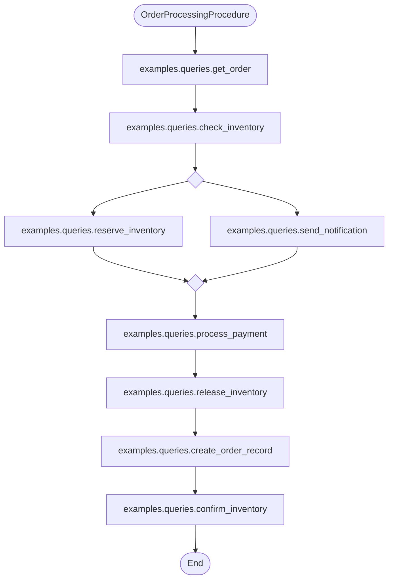

# 命名查询与命名过程

> **本文档定位**: 面向应用开发者的实践指南,侧重「为什么用」和「怎么用」。

---

## 目录

1. [为什么需要命名查询?](#1-为什么需要命名查询)
2. [快速上手: 你的第一个命名查询](#2-快速上手你的第一个命名查询)
3. [三种调用方式](#3-三种调用方式)
   - [3.1 命令行 (CLI)](#31-命令行cli)
   - [3.2 Jupyter Notebook / Programmatic API](#32-jupyter-notebook--programmatic-api)
   - [3.3 CI/CD 静态验证](#33-cicd-静态验证)
4. [为什么需要命名过程?](#4-为什么需要命名过程)
5. [编写命名过程](#5-编写命名过程)
6. [命名过程的调用方式](#6-命名过程的调用方式)
   - [6.1 命令行调用](#61-命令行调用)
   - [6.2 Notebook / API 调用](#62-notebook--api-调用)
   - [6.3 异步环境 (FastAPI)](#63-异步环境fastapi-aiohttp)
7. [事务模式选择指南](#7-事务模式选择指南)
8. [功能对比总结](#8-功能对比总结)

> **重要**: 这是**后端功能**,与 ActiveRecord 模式和 ActiveQuery 无关。

---

## 表达式构造速查

在定义命名查询时,所有表达式类均以 `dialect` 作为第一个构造参数。比较运算使用 Python 运算符(返回 `ComparisonPredicate`),谓词组合使用位运算符:

| SQL 意图 | Python 写法 |
|---|---|
| `col = val` | `Column(dialect, "col") == val` |
| `col >= val` | `Column(dialect, "col") >= val` |
| `col LIKE 'x%'` | `Column(dialect, "col").like("x%")` |
| `col IS NULL` | `Column(dialect, "col").is_null()` |
| `col IN (1,2,3)` | `Column(dialect, "col").in_([1, 2, 3])` |
| `p1 AND p2` | `p1 & p2` |
| `p1 OR p2` | `p1 \| p2` |
| `NOT p` | `~p` |
| `FROM table` | `TableExpression(dialect, "table")` |
| `SELECT *` | `WildcardExpression(dialect)` |

---

## 1. 为什么需要命名查询?

### 传统做法的痛点

在没有命名查询之前,Python 项目中执行数据库查询最常见的方式是**在业务代码里直接拼接 SQL 字符串**:

```python
# ❌ 使用前: routes/orders.py
import sqlite3

def get_high_value_orders(db_path, threshold=1000, days=30):
    conn = sqlite3.connect(db_path)
    sql = f"""
        SELECT id, amount, created_at FROM orders
        WHERE status = 'pending'
          AND amount >= {threshold}
          AND created_at >= DATE('now', '-{days} days')
    """
    return conn.cursor().execute(sql).fetchall()
```

**这种方式存在以下问题:**

| 问题 | 说明 |
|---|---|
| **SQL 注入风险** | `f-string` 直接拼接参数,恶意输入可篡改查询 |
| **难以复用** | SQL 字符串散落各处,同一查询在多处复制粘贴 |
| **方言绑定** | 写死 SQLite 语法,迁移到 PostgreSQL 需全局替换 |
| **无法独立测试** | 必须启动完整应用才能执行某条查询 |
| **无法 dry-run** | 看不到最终 SQL,只能运行后排查问题 |

### 命名查询如何解决这些问题

命名查询将查询逻辑封装为**纯 Python 函数**,以 `dialect` 作为第一个参数(由框架在调用时自动注入),返回类型安全的表达式对象:

```python
# ✅ 使用后: myapp/queries/orders.py
from rhosocial.activerecord.backend.expression import (
    Column, Literal, TableExpression, QueryExpression,
)
from rhosocial.activerecord.backend.impl.sqlite.functions import date_func


def high_value_pending(dialect, threshold: int = 1000, days: int = 30):
    """查询高价值待处理订单。"""
    import datetime

    past_date = datetime.date.today() - datetime.timedelta(days=days)
    return QueryExpression(
        dialect,
        select=[
            Column(dialect, "id"),
            Column(dialect, "amount"),
            Column(dialect, "created_at"),
        ],
        from_=TableExpression(dialect, "orders"),
        where=(
            (Column(dialect, "status") == "pending")
            & (Column(dialect, "amount") >= threshold)
            & (Column(dialect, "created_at") >= Literal(dialect, past_date))
        ),
    )
```

---

## 2. 快速上手: 你的第一个命名查询

### 第一步: 定义查询

```python
# myapp/queries/users.py
from rhosocial.activerecord.backend.expression import (
    Column, TableExpression, QueryExpression, LimitOffsetClause,
)

def active_users(dialect, limit: int = 100, status: str = "active"):
    """获取活跃用户列表。"""
    return QueryExpression(
        dialect,
        select=[
            Column(dialect, "id"),
            Column(dialect, "name"),
            Column(dialect, "email"),
        ],
        from_=TableExpression(dialect, "users"),
        where=Column(dialect, "status") == status,
        limit_offset=LimitOffsetClause(dialect, limit=limit),
    )
```

### 第二步: 确保模块可导入

```bash
export PYTHONPATH=/path/to/your/project:$PYTHONPATH
python -c "import myapp.queries.users; print('OK')"
```

### 第三步: 通过 CLI 执行

```bash
python -m rhosocial.activerecord.backend.impl.sqlite named-query \
    myapp.queries.users.active_users \
    --db-file mydb.sqlite \
    --param limit=10
```

---

## 3. 三种调用方式

### 3.1 命令行 (CLI)

```bash
# ① 执行查询
python -m rhosocial.activerecord.backend.impl.sqlite named-query \
    myapp.queries.users.active_users \
    --db-file mydb.sqlite \
    --param limit=10 \
    --param status=active

# ② 仅渲染 SQL,不执行(dry-run)
python -m rhosocial.activerecord.backend.impl.sqlite named-query \
    myapp.queries.users.active_users \
    --db-file mydb.sqlite --dry-run

# 输出示例:
# [DRY RUN] SELECT "id", "name", "email" FROM "users" WHERE "status" = ? LIMIT ?
# Params: ('active', 100)

# ③ 查看参数说明(不执行)
python -m rhosocial.activerecord.backend.impl.sqlite named-query \
    myapp.queries.users.active_users --describe

# ④ 列出模块中所有命名查询
python -m rhosocial.activerecord.backend.impl.sqlite named-query \
    myapp.queries.users --list

# ⑤ 异步执行(需要 aiosqlite)
python -m rhosocial.activerecord.backend.impl.sqlite named-query \
    myapp.queries.users.active_users \
    --db-file mydb.sqlite --async
```

#### CLI 完整参数

| 参数 | 说明 |
|---|---|
| `qualified_name` | 完全限定名(位置参数,如 `myapp.queries.users.active_users`) |
| `--param KEY=VALUE` | 传递参数(可重复多次) |
| `--list` | 列出模块中所有命名查询 |
| `--describe` | 打印参数签名,不执行 |
| `--dry-run` | 渲染 SQL 和参数,不执行 |
| `--async` | 异步执行 |
| `--force` | 允许执行非 SELECT 语句(DML/DDL) |
| `--explain` | 执行 EXPLAIN 计划 |

---

### 3.2 Jupyter Notebook / Programmatic API

```python
# ✅ 使用后:通过命名查询 API
from rhosocial.activerecord.backend.named_query import (
    NamedQueryResolver, resolve_named_query,
)
from rhosocial.activerecord.backend.impl.sqlite import SQLiteBackend
import pandas as pd

backend = SQLiteBackend(database="mydb.sqlite")
dialect = backend.dialect

# 方式一:一步调用(快捷)
# resolve_named_query 返回 (expression, sql_string, params_tuple)
expr, sql, params = resolve_named_query(
    "myapp.queries.users.active_users",
    dialect,
    {"limit": 50, "status": "active"},
)
print("SQL:", sql)

# 使用 pandas 执行
df = pd.read_sql(sql, backend.connection, params=list(params))

# 方式二:分步控制(灵活)
resolver = NamedQueryResolver("myapp.queries.users.active_users").load()
info = resolver.describe()
print(info["parameters"])

# 构造表达式并生成 SQL
expr = resolver.execute(dialect, {"limit": 50})
sql, params = expr.to_sql()
```

---

### 3.3 CI/CD 静态验证

```yaml
# .github/workflows/validate-queries.yml
name: Validate Named Queries
on: [push, pull_request]

jobs:
  validate:
    runs-on: ubuntu-latest
    steps:
      - uses: actions/checkout@v4
      - uses: actions/setup-python@v5
        with: { python-version: "3.12" }
      - run: pip install -e .
      - name: 静态验证命名查询
        run: |
          python -m rhosocial.activerecord.backend.impl.sqlite named-query \
            myapp.queries.users.active_users \
            --db-file :memory: --dry-run \
            --param limit=100 --param status=active
```

> **技巧**: 使用 `--db-file :memory:` 配合 `--dry-run`,不依赖持久化数据库文件,CI 环境零配置即可运行。

---

## 4. 为什么需要命名过程?

命名查询解决了**单条查询**的管理和复用问题,但真实的运维场景往往需要**多步骤、有条件分支**的操作序列。例如:

> "统计本月订单数 → 若无数据则跳过 → 归档已完成订单 → 删除已归档记录"

---

## 5. 编写命名过程

继承 `Procedure`(同步)或 `AsyncProcedure`(异步),在 `run()` 中用 `ctx` 编排各步骤:

```python
# myapp/procedures/monthly_cleanup.py
from rhosocial.activerecord.backend.named_query import Procedure, ProcedureContext

class MonthlyCleanupProcedure(Procedure):
    """月度订单归档清理过程。"""
    month: str = "2026-03"

    def run(self, ctx: ProcedureContext) -> None:
        # 步骤 1:统计订单数,绑定到上下文变量
        ctx.execute(
            "myapp.queries.orders.count_monthly_orders",
            params={"month": self.month},
            bind="order_count",
        )

        # 步骤 2:提取标量值,进行条件判断
        count = ctx.scalar("order_count", "cnt")
        if not count:
            ctx.log(f"月份 {self.month} 无订单,跳过清理。", level="INFO")
            ctx.abort("MonthlyCleanupProcedure", f"No orders in {self.month}")

        # 步骤 3:归档已完成订单
        ctx.execute(
            "myapp.queries.orders.archive_completed_orders",
            params={"month": self.month},
            output=True,
        )

        # 步骤 4:删除已归档的订单
        ctx.execute(
            "myapp.queries.orders.delete_archived_orders",
            params={"month": self.month},
            output=True,
        )

        ctx.log("归档清理完成。", level="INFO")
```

#### ProcedureContext 方法速查

| 方法 | 签名 | 说明 |
|---|---|---|
| `execute` | `(qualified_name, params=None, bind=None, output=False)` | 执行命名查询;`bind` 将结果存入上下文变量 |
| `scalar` | `(var_name, column)` | 从绑定变量的第一行提取单列值 |
| `rows` | `(var_name)` | 迭代绑定变量的所有行 |
| `bind` | `(name, data)` | 手动将任意数据绑定到上下文变量 |
| `log` | `(message, level="INFO")` | 记录执行日志 |
| `abort` | `(procedure_name, reason)` | 终止过程,触发回滚 |

---

## 6. 命名过程的调用方式

### 6.1 命令行调用

```bash
# ① 执行过程(AUTO 事务模式)
python -m rhosocial.activerecord.backend.impl.sqlite named-procedure \
    myapp.procedures.monthly_cleanup.MonthlyCleanupProcedure \
    --db-file mydb.sqlite \
    --param month=2026-03 \
    --transaction auto

# ② 查看过程定义(不执行)
python -m rhosocial.activerecord.backend.impl.sqlite named-procedure \
    myapp.procedures.monthly_cleanup.MonthlyCleanupProcedure \
    --db-file mydb.sqlite --describe

# ③ Dry-run:渲染每一步的 SQL,不执行
python -m rhosocial.activerecord.backend.impl.sqlite named-procedure \
    myapp.procedures.monthly_cleanup.MonthlyCleanupProcedure \
    --db-file mydb.sqlite --dry-run --param month=2026-03

# ④ STEP 事务模式(每步独立提交)
python -m rhosocial.activerecord.backend.impl.sqlite named-procedure \
    myapp.procedures.monthly_cleanup.MonthlyCleanupProcedure \
    --db-file mydb.sqlite --param month=2026-03 --transaction step

# ⑤ 列出模块中所有命名过程
python -m rhosocial.activerecord.backend.impl.sqlite named-procedure \
    myapp.procedures.monthly_cleanup --list
```

#### named-procedure CLI 参数

| 参数 | 说明 |
|---|---|
| `qualified_name` | 完全限定类名 |
| `--param KEY=VALUE` | 过程参数(可重复) |
| `--transaction {auto,step,none}` | 事务模式(默认 `auto`) |
| `--describe` | 打印过程参数定义,不执行 |
| `--dry-run` | 渲染每步 SQL,不执行 |
| `--list` | 列出模块中所有命名过程 |
| `--async` | 异步执行(需要 `AsyncProcedure` 子类) |

---

### 6.2 Notebook / API 调用

```python
from rhosocial.activerecord.backend.named_query import (
    ProcedureRunner, TransactionMode, ProcedureResult,
)
from rhosocial.activerecord.backend.impl.sqlite import SQLiteBackend

backend = SQLiteBackend(database="mydb.sqlite")
dialect = backend.dialect

runner = ProcedureRunner(
    "myapp.procedures.monthly_cleanup.MonthlyCleanupProcedure"
).load()

result: ProcedureResult = runner.run(
    dialect,
    user_params={"month": "2026-03"},
    transaction_mode=TransactionMode.AUTO,
    backend=backend,
    execute_query=backend.execute,
)

if result.aborted:
    print(f"⚠️ 已终止: {result.abort_reason}")
else:
    print(f"✅ 完成,输出步骤数: {len(result.outputs)}")

for entry in result.logs:
    print(f"[{entry.level}] {entry.message}")
```

---

### 6.3 异步环境 (FastAPI/aiohttp)

```python
# myapp/procedures/monthly_cleanup_async.py
from rhosocial.activerecord.backend.named_query import AsyncProcedure, AsyncProcedureContext

class MonthlyCleanupAsyncProcedure(AsyncProcedure):
    """月度清理(异步版)。"""
    month: str = "2026-03"

    async def run(self, ctx: AsyncProcedureContext) -> None:
        await ctx.execute(
            "myapp.queries.orders.count_monthly_orders",
            params={"month": self.month},
            bind="order_count",
        )

        count = await ctx.scalar("order_count", "cnt")
        if not count:
            await ctx.log(f"月份 {self.month} 无订单,跳过。")
            await ctx.abort("MonthlyCleanupAsyncProcedure", f"No orders in {self.month}")

        await ctx.execute(
            "myapp.queries.orders.archive_completed_orders",
            params={"month": self.month},
            output=True,
        )
```

```python
# FastAPI endpoint
from fastapi import FastAPI
from rhosocial.activerecord.backend.named_query import AsyncProcedureRunner, TransactionMode
from rhosocial.activerecord.backend.impl.sqlite import AsyncSQLiteBackend

app = FastAPI()
async_backend = AsyncSQLiteBackend(database="mydb.sqlite")

@app.post("/admin/cleanup/{month}")
async def run_cleanup(month: str):
    runner = AsyncProcedureRunner(
        "myapp.procedures.monthly_cleanup_async.MonthlyCleanupAsyncProcedure"
    ).load()
    result = await runner.run(
        async_backend.dialect,
        user_params={"month": month},
        transaction_mode=TransactionMode.AUTO,
        backend=async_backend,
        execute_query=async_backend.execute,
    )
    return {
        "aborted": result.aborted,
        "abort_reason": result.abort_reason,
        "outputs": result.outputs,
    }
```

> **注意**:`AsyncProcedure` 子类只能交给 `AsyncProcedureRunner`;`Procedure` 子类只能交给 `ProcedureRunner`。两者不可混用。

---

## 7. 事务模式选择指南

| 模式 | 说明 | 适用场景 | 失败时行为 |
|---|---|---|---|
| `AUTO`(默认) | 整个过程包裹在单个事务中 | 批量归档、数据迁移(要求原子性) | 整体回滚 |
| `STEP` | 每一步独立提交 | 长流程、允许部分完成的操作 | 已完成步骤保留 |
| `NONE` | 不使用事务 | 只读过程、外部已管理事务 | 无保护 |

---

## 8. 功能对比总结

| 维度 | 传统方式 | 命名查询 | 命名过程 |
|---|---|---|---|
| **SQL 安全** | ❌ 可能注入 | ✅ 强制 expression | ✅ 强制 expression |
| **可复用性** | ❌ 散落各处 | ✅ 按完全限定名调用 | ✅ 组合多个查询 |
| **CLI 可调用** | ❌ 需额外脚本 | ✅ 内置 | ✅ 内置 |
| **事务管理** | ❌ 手动 | — | ✅ AUTO / STEP / NONE |
| **Notebook 友好** | △ 可用但繁琐 | ✅ 简洁 API | ✅ 简洁 API |
| **CI/CD dry-run** | ❌ 需要数据库连接 | ✅ 无 DB dry-run | ✅ 无 DB dry-run |
| **异步支持** | △ 手动 | ✅ `--async` | ✅ `AsyncProcedure` |
| **跨方言** | ❌ 绑定 | ✅ `dialect` 参数 | ✅ `ctx.dialect` |
| **执行日志** | ❌ 无 | — | ✅ `ctx.log()` |
| **多步骤编排** | ❌ 手写脚本 | ❌ 单步 | ✅ 顺序 + 分支 + 循环 |

---

## 9. 流程图可视化

命名过程支持生成 **Mermaid** 流程图,帮助开发者直观理解过程结构:

### 9.1 静态图 (无需数据库)

```python
from rhosocial.activerecord.backend.named_query import Procedure

# Flowchart 格式
print(MyProcedure.static_diagram("flowchart"))

# Sequence 格式
print(MyProcedure.static_diagram("sequence"))
```

### 9.2 实例图 (真实执行后)

```python
from rhosocial.activerecord.backend.named_query import ProcedureRunner

runner = ProcedureRunner("myapp.procedures.OrderProcessing").load()
result = runner.run(dialect, backend=backend)

# Flowchart 格式(带执行状态和耗时)
print(result.diagram("flowchart", procedure_name="OrderProcessing"))

# Sequence 格式
print(result.diagram("sequence", procedure_name="OrderProcessing"))
```

### 9.3 特性对比

| 特性 | 静态图 | 实例图 |
|---|---|---|
| 数据来源 | dry-run | 真实执行 |
| 需要数据库 | ❌ | ✅ |
| 显示执行状态 | ❌ | ✅ (绿/红/灰) |
| 显示执行耗时 | ❌ | ✅ (毫秒) |
| 未执行节点 | 中性色 | 深灰 + [not executed] |
| 后端信息 | 仅方言 | Backend 类名 + ConcurrencyHint |

### 9.4 完整示例

参考 `docs/examples/chapter_12_named_procedure/` 目录下的完整示例。

```bash
cd docs/examples/chapter_12_named_procedure
PYTHONPATH=../../../src:. python3 diagram_demo.py
```

输出示例(Flowchart):



### 9.5 已知限制

- **条件分支不完整**: dry-run 时 `ctx["key"]` 返回 `None`,只记录假值分支
- **并行语法**: 需要 Mermaid 版本支持 `&` 语法 (flowchart) 或 `par/and/end` 块 (sequence)

---

## API 参考

### 异常

- `NamedQueryError` - 基础异常
- `NamedQueryNotFoundError` - 找不到查询
- `NamedQueryModuleNotFoundError` - 找不到模块
- `NamedQueryInvalidReturnTypeError` - 无效的返回类型
- `NamedQueryInvalidParameterError` - 无效的参数
- `NamedQueryMissingParameterError` - 缺少必需参数
- `NamedQueryNotCallableError` - 不可调用
- `NamedQueryExplainNotAllowedError` - 不允许 EXPLAIN

### 命名查询 API

- `NamedQueryResolver` - 主解析器类
- `resolve_named_query()` - 一步解析和执行
- `list_named_queries_in_module()` - 列出模块中的查询
- `validate_expression()` - 验证表达式类型

### 命名过程 API

- `Procedure` - 同步过程基类
- `ProcedureContext` - 同步执行上下文
- `ProcedureRunner` - 同步执行器
- `AsyncProcedure` - 异步过程基类
- `AsyncProcedureContext` - 异步执行上下文
- `AsyncProcedureRunner` - 异步执行器
- `TransactionMode` - 事务模式枚举
- `ProcedureResult` - 执行结果
