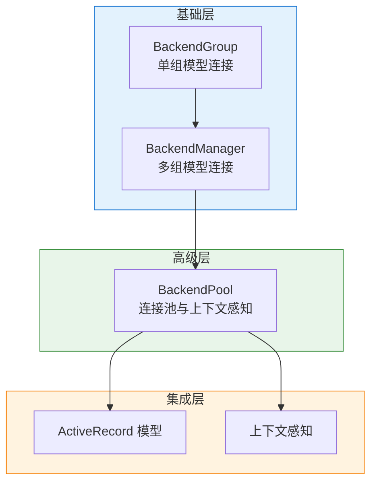

# 连接管理 (Connection Management)

本章介绍如何管理数据库连接，从基础的连接组管理到高级的连接池功能。

## 目录

* **[连接组与连接管理器](connection_management.md)**: 使用 `BackendGroup` 和 `BackendManager` 管理多模型、多数据库连接。
* **[连接池 (Connection Pool)](connection_pool.md)**: 高效连接管理与上下文感知访问模式，支持连接复用、生命周期管理和 ActiveRecord 集成。

## 概述

### 连接管理层级

### 功能对比

| 功能 | BackendGroup | BackendManager | BackendPool |
|------|-----------------|-------------------|-------------|
| 多模型连接 | ✓ | ✓ | ✓ |
| 多数据库 | ✗ | ✓ | ✓ |
| 连接复用 | ✗ | ✗ | ✓ |
| 上下文感知 | ✗ | ✗ | ✓ |
| 事务管理 | ✗ | ✗ | ✓ |
| ActiveRecord 集成 | 基础 | 基础 | 深度 |

## 示例代码

本章的完整示例代码位于 `docs/examples/chapter_06_connection/`。
