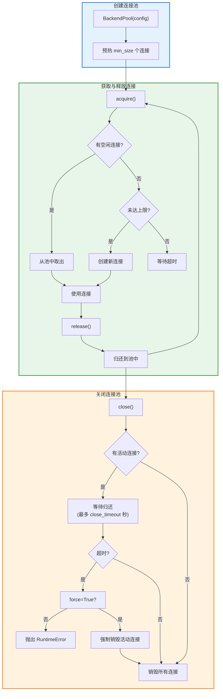
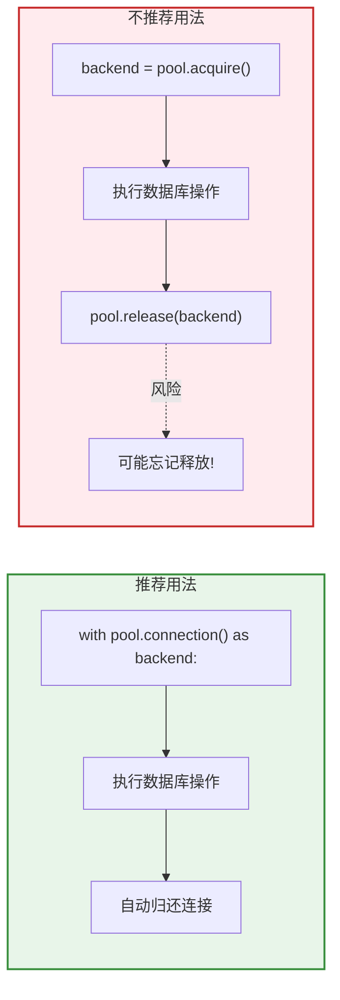
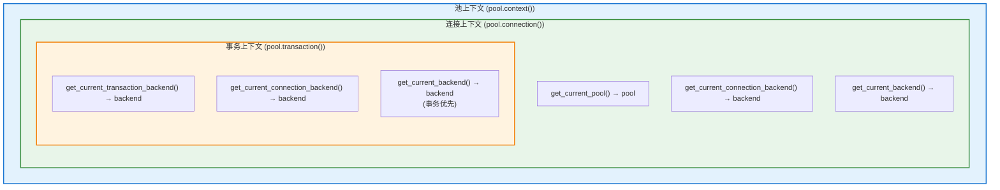

# 连接池 (Connection Pool)

连接池模块提供高效的数据库连接管理，实现连接复用、生命周期管理和上下文感知访问模式。

## 概述

连接池通过以下方式提升应用性能：

- **连接复用**：避免每次操作都创建新连接的开销
- **生命周期管理**：自动清理空闲或过期连接
- **资源限制**：通过连接数限制防止数据库过载
- **上下文感知**：使类能够感知当前连接/事务上下文

## 连接池工作流程

### 连接生命周期



### 推荐用法：上下文管理器



## 快速入门

### 同步与异步对等

**重要**：连接池模块在同步和异步实现之间提供完全的 API 对等性。两者使用相同的方法名、参数和行为——唯一的区别是 `async`/`await` 关键字。

| 操作 | 同步 | 异步 |
| --- | --- | --- |
| 创建连接池（推荐） | `BackendPool.create(config)` | `await AsyncBackendPool.create(config)` |
| 创建连接池（延迟初始化） | `BackendPool(config)` | `AsyncBackendPool(config)` |
| 获取连接 | `pool.acquire()` | `await pool.acquire()` |
| 释放连接 | `pool.release(backend)` | `await pool.release(backend)` |
| 连接上下文 | `with pool.connection() as backend:` | `async with pool.connection() as backend:` |
| 事务上下文 | `with pool.transaction() as backend:` | `async with pool.transaction() as backend:` |
| 池上下文 | `with pool.context() as ctx:` | `async with pool.context() as ctx:` |
| 关闭连接池 | `pool.close()` | `await pool.close()` |
| 健康检查 | `pool.health_check()` | `await pool.health_check()` |
| 手动清理空闲连接 | `pool.cleanup_idle_connections()` | `await pool.cleanup_idle_connections()` |
| 启用/禁用空闲清理 | `pool.idle_cleanup_enabled = True/False` | `await pool.set_idle_cleanup_enabled(True/False)` |

### 同步用法

```python
from rhosocial.activerecord.connection.pool import PoolConfig, BackendPool
from rhosocial.activerecord.backend.impl.sqlite import SQLiteBackend

# 创建连接池
config = PoolConfig(
    min_size=2,      # 最小连接数
    max_size=10,     # 最大连接数
    backend_factory=lambda: SQLiteBackend(database="app.db")
)

# 推荐方式：使用工厂方法创建（立即预热）
pool = BackendPool.create(config)

# 替代方式：直接构造（延迟初始化，首次获取时才创建连接）
# pool = BackendPool(config)

# 方式 1：手动获取/释放
backend = pool.acquire()
try:
    result = backend.execute("SELECT * FROM users WHERE id = ?", [1])
finally:
    pool.release(backend)

# 方式 2：连接上下文管理器
with pool.connection() as backend:
    result = backend.execute("SELECT * FROM users WHERE id = ?", [1])
    # 连接自动释放

# 方式 3：事务上下文管理器
with pool.transaction() as backend:
    backend.execute("INSERT INTO users (name) VALUES (?)", ("Alice",))
    backend.execute("INSERT INTO orders (user_id) VALUES (?)", (1,))
    # 成功自动提交，异常自动回滚

# 关闭连接池
pool.close()
```

### 异步用法

```python
from rhosocial.activerecord.connection.pool import PoolConfig, AsyncBackendPool
from rhosocial.activerecord.backend.impl.sqlite.backend.async_backend import AsyncSQLiteBackend

# 创建连接池（配置结构相同）
config = PoolConfig(
    min_size=2,      # 最小连接数
    max_size=10,     # 最大连接数
    backend_factory=lambda: AsyncSQLiteBackend(database="app.db")
)

# 推荐方式：使用工厂方法创建（与同步池行为一致，立即预热）
pool = await AsyncBackendPool.create(config)

# 替代方式：直接构造（延迟初始化，首次获取时才创建连接）
# pool = AsyncBackendPool(config)

# 方式 1：手动获取/释放（只需添加 await）
backend = await pool.acquire()
try:
    result = await backend.execute("SELECT * FROM users WHERE id = ?", [1])
finally:
    await pool.release(backend)

# 方式 2：连接上下文管理器（只需添加 async/await）
async with pool.connection() as backend:
    result = await backend.execute("SELECT * FROM users WHERE id = ?", [1])
    # 连接自动释放

# 方式 3：事务上下文管理器（只需添加 async/await）
async with pool.transaction() as backend:
    await backend.execute("INSERT INTO users (name) VALUES (?)", ("Alice",))
    await backend.execute("INSERT INTO orders (user_id) VALUES (?)", (1,))
    # 成功自动提交，异常自动回滚

# 关闭连接池（只需添加 await）
await pool.close()
```

## 配置

### PoolConfig 配置选项

```python
from rhosocial.activerecord.connection.pool import PoolConfig

config = PoolConfig(
    # 连接限制
    min_size=1,              # 最小连接数（默认：1）
    max_size=10,             # 最大连接数（默认：10）

    # 超时设置
    timeout=30.0,            # 获取连接超时时间，秒（默认：30.0）
    idle_timeout=300.0,      # 空闲连接超时时间（默认：300.0）
    max_lifetime=3600.0,     # 连接最大生存时间（默认：3600.0）
    close_timeout=5.0,       # 优雅关闭等待时间，秒（默认：5.0）

    # 验证设置
    validate_on_borrow=True, # 获取时验证连接（默认：True）
    validate_on_return=False,# 释放时验证连接（默认：False）
    validation_query="SELECT 1",  # 验证查询语句（默认："SELECT 1"）

    # 空闲连接回收设置
    idle_cleanup_enabled=True,   # 启用后台空闲连接回收（默认：True）
    idle_cleanup_interval=60.0,  # 回收扫描间隔，秒（默认：60.0）

    # 后端创建
    backend_factory=None,    # 创建后端的工厂函数
    backend_config=None,     # 或内置后端的配置字典
)
```

### 后端配置

有两种方式配置后端：

**1. 使用 backend_factory（推荐用于自定义后端）：**

```python
def create_backend():
    return SQLiteBackend(
        database="app.db",
        timeout=10.0
    )

config = PoolConfig(
    min_size=2,
    max_size=10,
    backend_factory=create_backend
)
```

**2. 使用 backend_config（用于内置 SQLite）：**

```python
config = PoolConfig(
    min_size=2,
    max_size=10,
    backend_config={
        'type': 'sqlite',
        'database': 'app.db'
    }
)
```

## 上下文感知

上下文感知是一项强大的功能，允许上下文内的类感知当前的池、连接和事务。

### 理解上下文层次



### 上下文函数

**同步上下文函数：**

```python
from rhosocial.activerecord.connection.pool import (
    get_current_pool,
    get_current_transaction_backend,
    get_current_connection_backend,
    get_current_backend,
)
```

| 函数 | 描述 |
|------|------|
| `get_current_pool()` | 获取当前同步连接池 |
| `get_current_transaction_backend()` | 获取当前同步事务后端 |
| `get_current_connection_backend()` | 获取当前同步连接后端 |
| `get_current_backend()` | 获取当前同步后端（优先事务，其次连接） |

**异步上下文函数：**

```python
from rhosocial.activerecord.connection.pool import (
    get_current_async_pool,
    get_current_async_transaction_backend,
    get_current_async_connection_backend,
    get_current_async_backend,
)
```

| 函数 | 描述 |
|------|------|
| `get_current_async_pool()` | 获取当前异步连接池 |
| `get_current_async_transaction_backend()` | 获取当前异步事务后端 |
| `get_current_async_connection_backend()` | 获取当前异步连接后端 |
| `get_current_async_backend()` | 获取当前异步后端（优先事务，其次连接） |

### 池上下文

池上下文在上下文中设置连接池，支持 ActiveRecord 集成：

```python
with pool.context() as ctx:
    # 在上下文内，ActiveRecord 可以感知连接池
    # 这使 ActiveRecord 能够使用连接池的连接
    users = User.query().all()
```

### 连接上下文

连接上下文提供一个可被感知的连接：

```python
with pool.context():
    # 尚无连接
    assert get_current_connection_backend() is None

    with pool.connection() as backend:
        # 内部的类可以感知连接
        current = get_current_connection_backend()
        assert current is backend

        # 服务类可以使用该连接
        process_user_data(backend)

    # 连接已释放
    assert get_current_connection_backend() is None
```

### 事务上下文

事务上下文同时设置事务和连接：

```python
with pool.context():
    with pool.transaction() as backend:
        # 事务和连接都已设置
        tx = get_current_transaction_backend()
        conn = get_current_connection_backend()
        assert tx is backend
        assert conn is backend

        # 执行操作
        backend.execute("INSERT INTO users (name) VALUES (?)", ("Alice",))
        backend.execute("INSERT INTO orders (user_id) VALUES (?)", (1,))
        # 成功自动提交
```

### 嵌套上下文

嵌套上下文自动复用现有连接/事务：

```python
with pool.connection() as outer_conn:
    # outer_conn 处于活动状态

    with pool.connection() as inner_conn:
        # inner_conn 与 outer_conn 相同（复用）
        assert inner_conn is outer_conn

    # 仍在外层连接上下文中
    assert get_current_connection_backend() is outer_conn
```

这可以防止连接泄漏并确保事务一致性。

### 实战示例：服务层

```python
from rhosocial.activerecord.connection.pool import (
    BackendPool, PoolConfig,
    get_current_connection_backend,
    get_current_transaction_backend,
)

class UserService:
    """使用上下文感知数据库操作的服务"""

    def create_user_with_profile(self, name: str, bio: str):
        """在单个事务中创建用户和资料"""
        # 如果在上下文中则使用现有事务，否则启动新事务
        backend = get_current_transaction_backend()
        if backend is None:
            # 不在事务上下文中 - 这不应该发生
            # 如果调用正确的话
            raise RuntimeError("必须在事务上下文中调用")

        # 创建用户
        backend.execute(
            "INSERT INTO users (name) VALUES (?)",
            [name]
        )
        user_id = backend.last_insert_rowid()

        # 创建资料
        backend.execute(
            "INSERT INTO profiles (user_id, bio) VALUES (?, ?)",
            [user_id, bio]
        )

        return user_id

# 使用方式
pool = BackendPool(config)

def setup_user(name: str, bio: str):
    with pool.context():
        with pool.transaction():
            service = UserService()
            user_id = service.create_user_with_profile(name, bio)
            # 自动提交
    return user_id
```

### ActiveRecord 集成

**关键特性**：ActiveRecord 模型自动感知连接池上下文。当处于 `pool.connection()` 或 `pool.transaction()` 上下文中时，模型的 `backend()` 方法返回上下文提供的连接，而非类级别后端。

#### 工作原理

```python
from rhosocial.activerecord.model import ActiveRecord
from rhosocial.activerecord.field import IntegerPKMixin

class User(IntegerPKMixin, ActiveRecord):
    __table_name__ = "users"
    id: Optional[int] = None
    name: str
    email: str
```

**`backend()` 方法返回优先级：**

1. **上下文后端**（如果处于 `pool.connection()` 或 `pool.transaction()` 中）
2. **类级别后端**（通过 `Model.configure()` 配置的 `__backend__`）

#### 同步示例

```python
# 配置模型后端（兜底）
User.configure(SQLiteConnectionConfig(database="app.db"), SQLiteBackend)

# 无上下文 - 使用类后端
backend1 = User.backend()  # 返回 __backend__

# 有连接池上下文 - 使用池连接
config = PoolConfig(
    min_size=1,
    max_size=5,
    backend_factory=lambda: SQLiteBackend(database="app.db")
)
pool = BackendPool(config)

with pool.context():
    with pool.connection() as conn:
        backend2 = User.backend()  # 返回 conn（而非 __backend__）
        assert backend2 is conn

        # 查询自动使用该连接
        users = User.query().where(User.c.name == "Alice").all()

    with pool.transaction() as tx:
        backend3 = User.backend()  # 返回 tx
        assert backend3 is tx

        # 所有操作在同一事务中
        User(name="Bob", email="bob@example.com").save()
        User(name="Carol", email="carol@example.com").save()
        # 成功自动提交，失败自动回滚
```

#### 异步示例

```python
from rhosocial.activerecord.model import AsyncActiveRecord

class AsyncUser(IntegerPKMixin, AsyncActiveRecord):
    __table_name__ = "users"
    id: Optional[int] = None
    name: str
    email: str

# 配置异步模型
await AsyncUser.configure(SQLiteConnectionConfig(database="app.db"), AsyncSQLiteBackend)

# 使用异步池上下文
async_pool = AsyncBackendPool(config)

async with async_pool.context():
    async with async_pool.transaction() as tx:
        backend = AsyncUser.backend()  # 返回 tx
        assert backend is tx

        # 所有操作在同一事务中
        await AsyncUser(name="Dave", email="dave@example.com").save()
        # 自动提交
```

#### 查询类

所有查询类同样支持上下文感知：

- **ActiveQuery**：`Model.query().backend()` 返回上下文后端
- **CTEQuery**：`CTEQuery(backend).backend()` 如有上下文则返回上下文后端
- **SetOperationQuery**：Union/Intersect/Except 查询使用上下文后端

```python
with pool.transaction() as tx:
    # ActiveQuery
    query = User.query()
    assert query.backend() is tx

    # CTEQuery
    from rhosocial.activerecord.query import CTEQuery
    cte = CTEQuery(some_backend)  # 构造时传入的后端
    assert cte.backend() is tx    # 但返回上下文后端

    # SetOperationQuery
    q1 = User.query()
    q2 = User.query()
    union_query = q1.union(q2)
    assert union_query.backend() is tx
```

#### 同步/异步隔离

**重要**：同步和异步上下文严格隔离：

- 同步类（`ActiveRecord`、`ActiveQuery`）只检查 `get_current_backend()`
- 异步类（`AsyncActiveRecord`、`AsyncActiveQuery`）只检查 `get_current_async_backend()`

```python
# 同步模型在异步上下文中 - 返回类后端
with async_pool.connection() as conn:
    sync_backend = User.backend()  # 返回 __backend__，非 conn
    async_backend = AsyncUser.backend()  # 返回 conn

# 异步模型在同步上下文中 - 返回类后端
with sync_pool.connection() as conn:
    sync_backend = User.backend()  # 返回 conn
    async_backend = AsyncUser.backend()  # 返回 __backend__，非 conn
```

## 统计与监控

### 连接池统计

```python
stats = pool.get_stats()

print(f"总创建数: {stats.total_created}")
print(f"总获取数: {stats.total_acquired}")
print(f"总释放数: {stats.total_released}")
print(f"空闲回收数: {stats.total_idle_cleaned}")  # 新增
print(f"当前可用: {stats.current_available}")
print(f"当前使用: {stats.current_in_use}")
print(f"利用率: {stats.utilization_rate:.2%}")
print(f"运行时间: {stats.uptime:.1f} 秒")
```

### 健康检查

```python
health = pool.health_check()
# 返回:
# {
#     'healthy': True,
#     'closed': False,
#     'utilization': 0.4,
#     'stats': {
#         'available': 3,
#         'in_use': 2,
#         'total': 5,
#         'errors': 0
#     }
# }
```

## 空闲连接回收

连接池支持自动回收空闲超时的连接，以优化资源使用。

### 工作原理

当连接空闲时间超过 `idle_timeout`（默认 300 秒）时，后台清理线程会自动销毁该连接，但始终保持至少 `min_size` 个连接。

```text
连接数变化：
min_size ──(预热)──> min_size ──(按需创建)──> max_size
                         ↑                      ↓
                         │                 (空闲超时后自动回收)
                         │
                    (保持 min_size 个连接)
```

### 配置示例

```python
config = PoolConfig(
    min_size=1,
    max_size=10,
    idle_timeout=300.0,        # 空闲 5 分钟后可回收
    idle_cleanup_enabled=True, # 启用自动回收（默认）
    idle_cleanup_interval=60.0,# 每分钟扫描一次（默认）
    backend_factory=lambda: SQLiteBackend(database="app.db")
)
pool = BackendPool(config)
```

### 运行时控制

可以在运行时启用或禁用自动清理：

```python
# 禁用自动清理
pool.idle_cleanup_enabled = False

# 重新启用
pool.idle_cleanup_enabled = True

# 异步版本（推荐用于异步池）
await pool.set_idle_cleanup_enabled(False)
```

### 手动触发清理

可以手动触发空闲连接清理：

```python
# 同步
cleaned = pool.cleanup_idle_connections()
print(f"清理了 {cleaned} 个空闲连接")

# 异步
cleaned = await pool.cleanup_idle_connections()
```

### 监控清理统计

```python
stats = pool.get_stats()
print(f"累计回收空闲连接: {stats.total_idle_cleaned}")

# 或通过字典获取
stats_dict = stats.to_dict()
print(f"累计回收空闲连接: {stats_dict['total_idle_cleaned']}")
```

### 使用场景

**场景 1：流量波动较大的应用**

```python
# 高峰期连接数可能达到 max_size
# 低峰期自动回收空闲连接，释放资源
config = PoolConfig(
    min_size=2,           # 保持 2 个常驻连接
    max_size=20,          # 高峰期最多 20 个
    idle_timeout=60.0,    # 空闲 1 分钟后可回收
    backend_factory=lambda: SQLiteBackend(database="app.db")
)
```

**场景 2：定时任务场景**

```python
# 任务执行期间使用连接
# 任务结束后空闲连接被回收
with pool.connection() as backend:
    backend.execute("SELECT * FROM orders WHERE status = 'pending'")
    # 执行任务...

# 连接归还后，空闲超时会被自动回收
```

**场景 3：需要精细控制时**

```python
# 禁用自动清理，手动控制
config = PoolConfig(
    min_size=1,
    max_size=10,
    idle_timeout=60.0,
    idle_cleanup_enabled=False,  # 禁用自动清理
    backend_factory=lambda: SQLiteBackend(database="app.db")
)
pool = BackendPool(config)

# 在特定时机手动清理
def on_batch_complete():
    cleaned = pool.cleanup_idle_connections()
    logger.info(f"批次完成，清理了 {cleaned} 个空闲连接")
```

## 最佳实践

### 1. 资源管理责任

**核心原则：谁创建，谁负责。**

```python
# ✓ 正确：自己配置的 backend 自己关闭
User.configure(SQLiteConnectionConfig(database="app.db"), SQLiteBackend)
# ... 使用 ...
User.__backend__.disconnect()  # 应用退出时关闭

# ✓ 正确：连接池的连接由连接池管理
with pool.connection() as backend:
    # 不要调用 backend.disconnect()！
    # 连接会在退出上下文时自动归还连接池
    result = backend.execute("SELECT * FROM users")

# ✗ 错误：手动关闭连接池获取的连接
with pool.connection() as backend:
    result = backend.execute("SELECT * FROM users")
    backend.disconnect()  # 错误！这会破坏连接池状态
```

**重要提示**：

| Backend 来源 | 管理责任 | 关闭方式 |
| ------------ | -------- | -------- |
| `Model.configure()` | 应用负责 | 调用 `backend.disconnect()` |
| `pool.connection()` | 连接池负责 | 退出上下文自动归还 |
| `pool.transaction()` | 连接池负责 | 提交/回滚后自动归还 |
| `pool.acquire()` | 应用负责 | 必须调用 `pool.release()` |

### 2. 连接池生命周期

```python
# 推荐：应用启动时创建连接池
pool = BackendPool(config)

try:
    # 应用运行
    run_application(pool)
finally:
    # 清理关闭
    pool.close()
```

### 3. 上下文管理

```python
# 推荐：使用上下文管理器
with pool.connection() as backend:
    result = backend.execute("SELECT * FROM users")

# 不推荐：手动获取但未正确清理
backend = pool.acquire()
result = backend.execute("SELECT * FROM users")
# 忘记释放 - 连接泄漏！
```

### 4. 事务范围

```python
# 推荐：最小事务范围
with pool.transaction() as backend:
    # 仅数据库操作
    backend.execute("INSERT INTO users (name) VALUES (?)", ("Alice",))

# 不推荐：事务中有长时间运行的操作
with pool.transaction() as backend:
    backend.execute("INSERT INTO orders (...) VALUES (...)")
    # 事务中有外部 API 调用 - 不好！
    external_api.create_invoice()  # 可能使事务超时
```

### 5. 连接池大小设置

```python
# Web 应用：pool_size ≈ (cpu_cores * 2) + disk_spindles
# 后台工作进程：较小的连接池，较长的连接时间

# 开发环境
config = PoolConfig(min_size=1, max_size=5, ...)

# 生产环境（Web）
config = PoolConfig(min_size=5, max_size=20, ...)

# 生产环境（后台工作进程）
config = PoolConfig(min_size=2, max_size=10, ...)
```

## 错误处理

### 超时错误

```python
from rhosocial.activerecord.connection.pool import BackendPool, PoolConfig

config = PoolConfig(
    max_size=2,
    timeout=5.0,  # 5 秒超时
    backend_factory=lambda: SQLiteBackend(database="app.db")
)
pool = BackendPool(config)

try:
    backend = pool.acquire(timeout=1.0)  # 覆盖超时时间
except TimeoutError as e:
    print(f"无法获取连接: {e}")
    stats = pool.get_stats()
    print(f"连接池状态: {stats.current_in_use}/{stats.current_total} 使用中")
```

### 验证失败

```python
config = PoolConfig(
    validate_on_borrow=True,
    validation_query="SELECT 1",
    backend_factory=lambda: SQLiteBackend(database="app.db")
)
pool = BackendPool(config)

stats = pool.get_stats()
if stats.total_validation_failures > 0:
    print(f"警告: {stats.total_validation_failures} 次验证失败")
```

## 线程安全

> **重要提示**：连接池使用 **QueuePool** 策略，连接可以在不同线程之间流转。这**仅适用于**驱动报告 `threadsafety >= 2`（即连接对象可以安全地跨线程共享）的数据库后端。

### 何时使用 BackendPool

| 数据库 | 驱动 threadsafety | 适合 BackendPool？ | 建议 |
| ------ | ----------------- | ------------------ | ---- |
| PostgreSQL (psycopg v3) | 2 | **是** | 推荐使用 BackendPool 复用连接 |
| SQLite (sqlite3) | N/A（check_same_thread） | **否** | 使用 BackendGroup + backend.context() |
| MySQL (mysql-connector-python) | 1 | **否** | 使用 BackendGroup + backend.context() |

**SQLite 和 MySQL 不适合 BackendPool 的原因**：

- **SQLite**：Python `sqlite3` 模块默认启用 `check_same_thread=True`，阻止在一个线程中创建的连接被另一个线程使用。当连接池的 `close()` 方法尝试断开工作线程创建的连接时，SQLite 会抛出跨线程警告。设置 `check_same_thread=False` 仅取消检查，但并不保证线程安全行为。
- **MySQL**：驱动报告 `threadsafety=1`，意味着连接对象不应跨线程共享。与 SQLite 不同，MySQL 不会主动强制执行此限制——违规可能导致**静默数据损坏**，而不会产生任何错误或警告。

### 何时使用 BackendGroup + backend.context()

对于 SQLite 和 MySQL，请使用 `BackendGroup` 配合 `backend.context()` 代替 `BackendPool`。每个线程自行管理连接生命周期，自然避免了跨线程问题。

有两种使用方式：

#### 方式一：手动管理连接

当需要精确控制连接时机时，直接使用 `backend.connect()` 和 `backend.disconnect()`：

```python
from rhosocial.activerecord.connection import BackendGroup
from rhosocial.activerecord.backend.impl.sqlite import SQLiteBackend

# 创建并配置 BackendGroup
group = BackendGroup(
    name="app",
    models=[User, Post],
    config=sqlite_config,
    backend_class=SQLiteBackend,
)
group.configure()

# 获取共享的后端实例
backend = group.get_backend()

# 需要时手动连接
backend.connect()
backend.introspect_and_adapt()
try:
    # 执行操作
    User.create(name="Alice", email="alice@example.com")
    users = User.query().all()
finally:
    # 完成后断开连接
    backend.disconnect()
```

#### 方式二：上下文自动管理（推荐）

使用 `backend.context()` 自动管理连接——进入上下文时自动连接，退出时自动断开：

```python
from rhosocial.activerecord.connection import BackendGroup
from rhosocial.activerecord.backend.impl.sqlite import SQLiteBackend

# 创建并配置 BackendGroup
group = BackendGroup(
    name="app",
    models=[User, Post],
    config=sqlite_config,
    backend_class=SQLiteBackend,
)
group.configure()

backend = group.get_backend()

# 上下文自动管理连接和断开
with backend.context():
    # 已连接 — 首次进入时自动调用 introspect_and_adapt()
    User.create(name="Alice", email="alice@example.com")
    users = User.query().all()
# 退出上下文时自动断开连接
```

此方式在多线程场景下尤为适用：

```python
import threading

def worker(worker_id):
    """每个线程通过上下文管理自己的连接。"""
    with backend.context():  # 在当前线程中连接
        User.create(name=f"User-{worker_id}")
        users = User.query().all()
    # 自动断开 —— 无跨线程问题

threads = [threading.Thread(target=worker, args=(i,)) for i in range(10)]
for t in threads:
    t.start()
for t in threads:
    t.join()
```

### 同步连接池（仅限 PostgreSQL）

同步 `BackendPool` 使用 `threading.RLock` 和 `threading.Condition` 实现线程安全。多个线程可以安全地并发获取和释放连接。**这适用于 PostgreSQL（threadsafety=2），其连接可以安全地跨线程共享。**

```python
import threading
from rhosocial.activerecord.connection.pool import PoolConfig, BackendPool

# PostgreSQL — 适合使用连接池（threadsafety=2）
config = PoolConfig(
    min_size=2,
    max_size=10,
    backend_factory=lambda: PostgresBackend(host="localhost", database="mydb")
)
pool = BackendPool.create(config)

def worker(worker_id):
    with pool.connection() as backend:
        result = backend.execute("SELECT * FROM users WHERE id = $1", [worker_id])
        print(f"Worker {worker_id}: {result}")

threads = [threading.Thread(target=worker, args=(i,)) for i in range(10)]
for t in threads:
    t.start()
for t in threads:
    t.join()

pool.close()
```

### 异步连接池

`AsyncBackendPool` 运行在单线程事件循环上，不存在跨线程问题，可在异步上下文中配合任何后端使用。

```python
import asyncio
from rhosocial.activerecord.connection.pool import PoolConfig, AsyncBackendPool

pool = AsyncBackendPool(config)

async def worker(worker_id):
    async with pool.connection() as backend:
        result = await backend.execute("SELECT * FROM users WHERE id = $1", [worker_id])
        print(f"Worker {worker_id}: {result}")

async def main():
    tasks = [worker(i) for i in range(10)]
    await asyncio.gather(*tasks)

asyncio.run(main())
```
