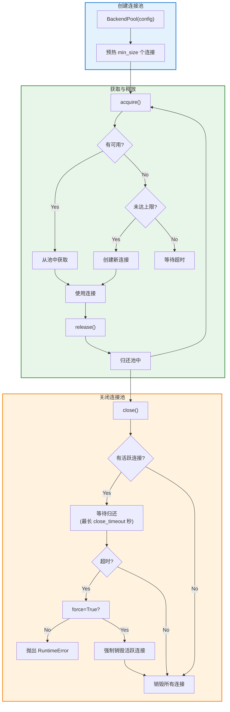
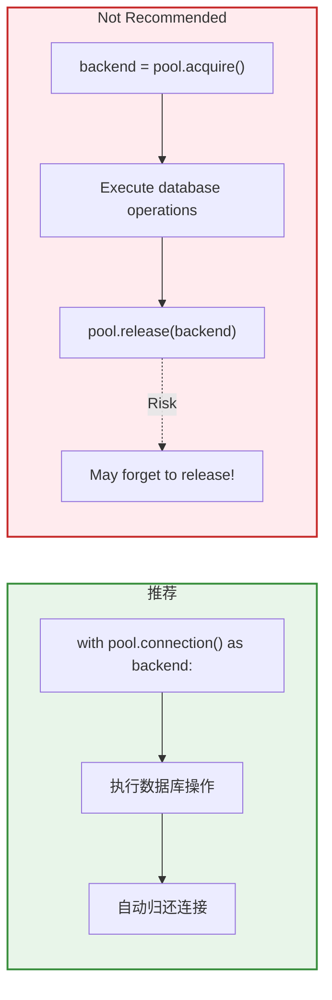
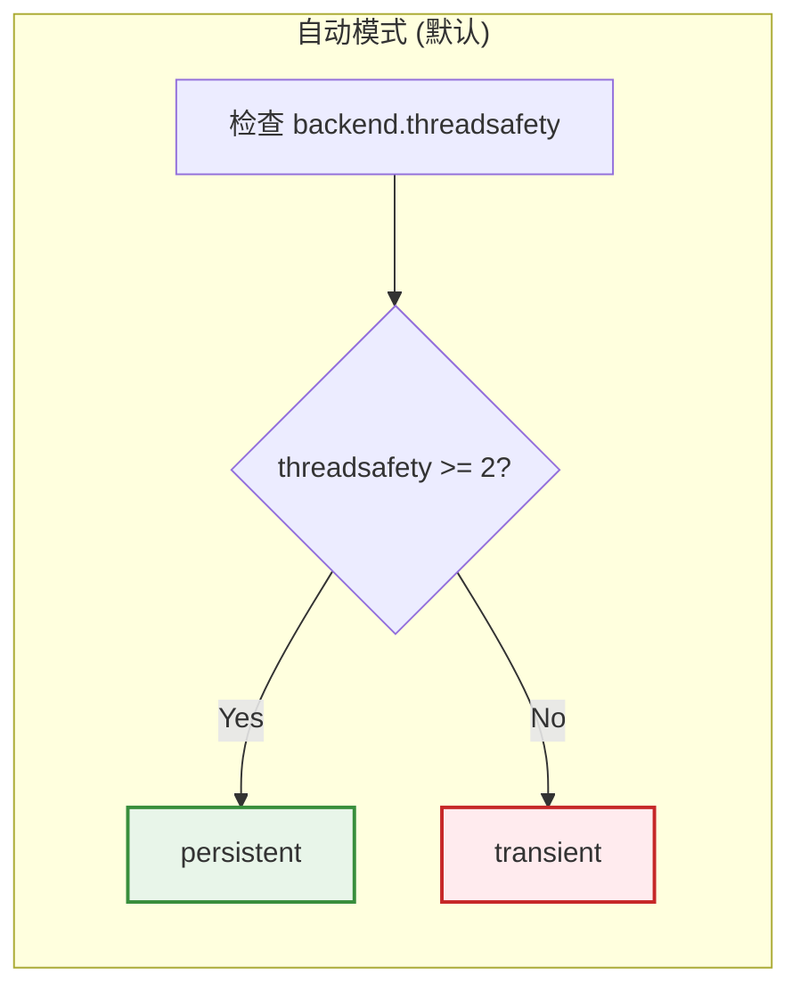
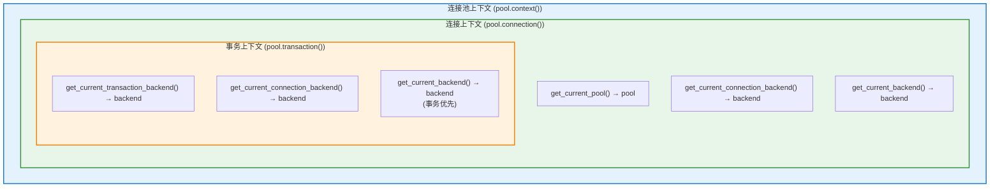
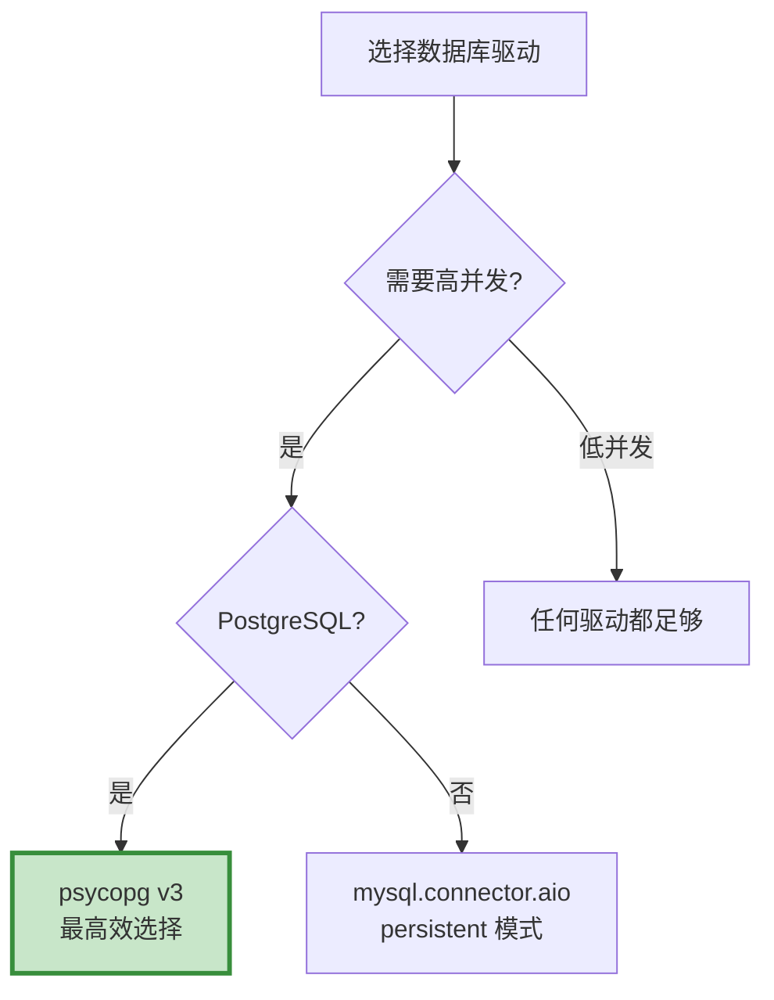

# 连接池

连接池模块提供高效的数据库连接管理，支持连接复用、生命周期管理和上下文感知访问模式。

## 概述

连接池通过以下方式提升应用性能：

- **连接复用**：避免每次操作都创建新连接的开销
- **生命周期管理**：自动清理空闲或过期的连接
- **资源限制**：通过连接限制防止数据库过载
- **上下文感知**：使类能够感知当前连接/事务上下文

## 连接池工作流

### 连接生命周期



### 推荐用法：上下文管理器



## 快速开始

### 同步与异步 API 一致性

**重要**：连接池模块在同步和异步实现之间提供完整的 API 一致性。两者使用相同的方法名、参数和行为 — 唯一的区别是 `async`/`await` 关键字。

| 操作 | 同步 | 异步 |
|------|------|------|
| 创建连接池 (推荐) | `BackendPool.create(config)` | `await AsyncBackendPool.create(config)` |
| 创建连接池 (延迟初始化) | `BackendPool(config)` | `AsyncBackendPool(config)` |
| 获取连接 | `pool.acquire()` | `await pool.acquire()` |
| 释放连接 | `pool.release(backend)` | `await pool.release(backend)` |
| 连接上下文 | `with pool.connection() as backend:` | `async with pool.connection() as backend:` |
| 事务上下文 | `with pool.transaction() as backend:` | `async with pool.transaction() as backend:` |
| 连接池上下文 | `with pool.context() as ctx:` | `async with pool.context() as ctx:` |
| 关闭连接池 | `pool.close()` | `await pool.close()` |
| 健康检查 | `pool.health_check()` | `await pool.health_check()` |
| 手动空闲清理 | `pool.cleanup_idle_connections()` | `await pool.cleanup_idle_connections()` |
| 启用/禁用空闲清理 | `pool.idle_cleanup_enabled = True/False` | `await pool.set_idle_cleanup_enabled(True/False)` |

### 同步用法

```python
from rhosocial.activerecord.connection.pool import PoolConfig, BackendPool
from rhosocial.activerecord.backend.impl.sqlite import SQLiteBackend

# Create connection pool
config = PoolConfig(
    min_size=2,      # Minimum connections to maintain
    max_size=10,     # Maximum connections allowed
    backend_factory=lambda: SQLiteBackend(database="app.db")
)

# Recommended: Create with factory method (immediate warmup)
pool = BackendPool.create(config)

# Alternative: Direct construction (lazy initialization)
# pool = BackendPool(config)

# Method 1: Manual acquire/release
backend = pool.acquire()
try:
    result = backend.execute("SELECT * FROM users WHERE id = ?", [1])
finally:
    pool.release(backend)

# Method 2: Connection context manager
with pool.connection() as backend:
    result = backend.execute("SELECT * FROM users WHERE id = ?", [1])
    # Connection automatically released

# Method 3: Transaction context manager
with pool.transaction() as backend:
    backend.execute("INSERT INTO users (name) VALUES (?)", ("Alice",))
    backend.execute("INSERT INTO orders (user_id) VALUES (?)", (1,))
    # Auto commit on success, rollback on exception

# 使用完毕后关闭连接池
pool.close()
```

### 异步用法

```python
from rhosocial.activerecord.connection.pool import PoolConfig, AsyncBackendPool
from rhosocial.activerecord.backend.impl.sqlite.backend.async_backend import AsyncSQLiteBackend

# 创建连接池 (配置结构相同)
config = PoolConfig(
    min_size=2,      # 最小连接数
    max_size=10,     # 最大连接数
    backend_factory=lambda: AsyncSQLiteBackend(database="app.db")
)

# 推荐：创建并预热 (与同步 BackendPool 行为一致)
pool = await AsyncBackendPool.create(config)

# 替代：创建但不预热 (延迟初始化)
# pool = AsyncBackendPool(config)
# 连接在首次 acquire 时创建

# 方法 1：手动 acquire/release (只需添加 await)
backend = await pool.acquire()
try:
    result = await backend.execute("SELECT * FROM users WHERE id = ?", [1])
finally:
    await pool.release(backend)

# 方法 2：连接上下文管理器 (只需添加 async/await)
async with pool.connection() as backend:
    result = await backend.execute("SELECT * FROM users WHERE id = ?", [1])
    # 连接自动释放

# 方法 3：事务上下文管理器 (只需添加 async/await)
async with pool.transaction() as backend:
    await backend.execute("INSERT INTO users (name) VALUES (?)", ("Alice",))
    await backend.execute("INSERT INTO orders (user_id) VALUES (?)", (1,))
    # 成功则自动提交，异常则回滚

# 关闭连接池 (添加 await)
await pool.close()
```

## 配置

### PoolConfig Options

```python
from rhosocial.activerecord.connection.pool import PoolConfig

config = PoolConfig(
    # Connection limits
    min_size=1,              # Minimum connections (default: 1)
    max_size=10,             # Maximum connections (default: 10)

    # Timeout settings
    timeout=30.0,            # Acquire timeout in seconds (default: 30.0)
    idle_timeout=300.0,      # Idle connection timeout (default: 300.0)
    max_lifetime=3600.0,     # Maximum connection lifetime (default: 3600.0)
    close_timeout=5.0,       # Graceful close wait time (default: 5.0)

    # Validation settings
    validate_on_borrow=True, # Validate when acquiring (default: True)
    validate_on_return=False,# Validate when releasing (default: False)
    validation_query="SELECT 1",  # Query for validation (default: "SELECT 1")

    # Idle connection cleanup settings
    idle_cleanup_enabled=True,   # Enable background idle cleanup (default: True)
    idle_cleanup_interval=60.0,  # Cleanup scan interval in seconds (default: 60.0)

    # Connection lifecycle settings
    auto_connect_on_acquire=True,     # Automatically connect when acquiring (default: True)
    auto_disconnect_on_release=True,  # Automatically disconnect when releasing (default: True)

    # Connection mode (新增 - 见下文)
    connection_mode="auto",        # "auto" | "persistent" | "transient"

    # Backend creation
    backend_factory=None,    # Factory function to create backends
    backend_config=None,     # Or config dict for built-in backends
)
```

### Backend Configuration

You can configure backends in two ways:

**1. Using backend_factory (recommended for custom backends):**

```python
def create_backend():
    return SQLiteBackend(
        database="app.db",
        timeout=10.0
    )

config = PoolConfig(
    min_size=2,
    max_size=10,
    backend_factory=create_backend
)
```

**2. Using backend_config (for built-in SQLite):**

```python
config = PoolConfig(
    min_size=2,
    max_size=10,
    backend_config={
        'type': 'sqlite',
        'database': 'app.db'
    }
)
```

### 连接模式 (connection_mode)

`connection_mode` 参数控制连接在整个生命周期中的管理方式。这对于不同的后端线程安全级别尤为重要。



#### 模式对比

| 模式 | 连接时机 | 断开时机 | 适用后端 |
|------|----------|----------|----------|
| `persistent` | 创建/预热时 | `close()` | PostgreSQL (threadsafety=2) |
| `transient` | `acquire()` | `release()` | SQLite, MySQL (threadsafety<2) |
| `auto` (默认) | 基于 threadsafety 自动检测 | 自动检测 | 所有后端 |

#### 模式详情

**持久模式** (`connection_mode="persistent"`):

- 在创建/预热时建立连接
- 在 acquire/release 周期内保持连接
- 只有 `close()` 才断开它们
- 适用于线程安全的后端，如 PostgreSQL (psycopg)

```python
# PostgreSQL — 持久模式 (从 threadsafety=2 自动检测)
config = PoolConfig(
    connection_mode="persistent",  # 或 "auto" (默认)
    min_size=2,
    max_size=10,
    backend_factory=lambda: PostgresBackend(host="localhost")
)
pool = BackendPool.create(config)
# 连接在 acquire/release 之间保持连接
```

**临时模式** (`connection_mode="transient"`):

- 在 acquire 时建立连接 (如果 `auto_connect_on_acquire=True`)
- 在 release 时断开连接 (如果 `auto_disconnect_on_release=True`)
- 适用于非线程安全的后端，如 SQLite, MySQL

```python
# SQLite — 临时模式 (从 threadsafety=1 自动检测)
config = PoolConfig(
    connection_mode="transient",  # 或 "auto" (默认)
    min_size=1,
    max_size=5,
    backend_factory=lambda: SQLiteBackend(database="app.db")
)
pool = BackendPool.create(config)
# 每次 acquire() → 连接，每次 release() → 断开
```

#### 后端线程安全

| 数据库 | threadsafety | 自动模式结果 |
|----------|--------------|------------------|
| PostgreSQL (psycopg v3) | 2 | `persistent` |
| SQLite | 1 | `transient` |
| MySQL (mysql-connector) | 1 | `transient` |

## 上下文感知

上下文感知是一种强大的功能，允许上下文内的类感知当前连接池、连接和事务。

### 理解上下文层级



### 上下文函数

**同步上下文函数：**

```python
from rhosocial.activerecord.connection.pool import (
    get_current_pool,
    get_current_transaction_backend,
    get_current_connection_backend,
    get_current_backend,
)
```

| 函数 | 描述 |
|----------|-------------|
| `get_current_pool()` | 获取当前同步连接池 |
| `get_current_transaction_backend()` | 获取当前同步事务后端 |
| `get_current_connection_backend()` | 获取当前同步连接后端 |
| `get_current_backend()` | 获取当前同步后端 (事务优先，然后连接) |

**异步上下文函数：**

```python
from rhosocial.activerecord.connection.pool import (
    get_current_async_pool,
    get_current_async_transaction_backend,
    get_current_async_connection_backend,
    get_current_async_backend,
)
```

| 函数 | 描述 |
|----------|-------------|
| `get_current_async_pool()` | 获取当前异步连接池 |
| `get_current_async_transaction_backend()` | 获取当前异步事务后端 |
| `get_current_async_connection_backend()` | 获取当前异步连接后端 |
| `get_current_async_backend()` | 获取当前异步后端 (事务优先，然后连接) |

### 连接池上下文

连接池上下文设置连接池上下文，允许 ActiveRecord 集成：

```python
with pool.context() as ctx:
    # 在上下文中，ActiveRecord 可以感知连接池
    # 这使 ActiveRecord 能够使用连接池的连接
    users = User.query().all()
```

### 连接上下文

连接上下文提供类可以感知的连接：

```python
with pool.context():
    # 尚无连接
    assert get_current_connection_backend() is None

    with pool.connection() as backend:
        # 上下文内的类可以感知连接
        current = get_current_connection_backend()
        assert current is backend

        # 服务类可以使用连接
        process_user_data(backend)

    # 连接已释放
    assert get_current_connection_backend() is None
```

### 事务上下文

The transaction context sets both transaction and connection:

```python
with pool.context():
    with pool.transaction() as backend:
        # Both transaction and connection are set
        tx = get_current_transaction_backend()
        conn = get_current_connection_backend()
        assert tx is backend
        assert conn is backend

        # Execute operations
        backend.execute("INSERT INTO users (name) VALUES (?)", ("Alice",))
        backend.execute("INSERT INTO orders (user_id) VALUES (?)", (1,))
        # 自动提交
```

### 嵌套上下文

嵌套上下文自动重用现有的连接/事务：

```python
with pool.connection() as outer_conn:
    # outer_conn 处于活跃状态

    with pool.connection() as inner_conn:
        # inner_conn 与 outer_conn 相同 (重用)
        assert inner_conn is outer_conn

    # 仍在外部连接上下文中
    assert get_current_connection_backend() is outer_conn
```

这可以防止连接泄漏并确保事务一致性。

### 实际示例：服务层

```python
from rhosocial.activerecord.connection.pool import (
    BackendPool, PoolConfig,
    get_current_connection_backend,
    get_current_transaction_backend,
)

class UserService:
    """使用上下文感知数据库操作的服务。"""

    def create_user_with_profile(self, name: str, bio: str):
        """在单个事务中创建用户和资料。"""
        # 如果在上下文中，使用现有事务，否则启动新事务
        backend = get_current_transaction_backend()
        if backend is None:
            # 不在事务上下文中 - 如果正确调用则不应该发生
            raise RuntimeError("必须在事务上下文中调用")

        # 创建用户
        backend.execute(
            "INSERT INTO users (name) VALUES (?)",
            [name]
        )
        user_id = backend.last_insert_rowid()

        # 创建资料
        backend.execute(
            "INSERT INTO profiles (user_id, bio) VALUES (?, ?)",
            [user_id, bio]
        )

        return user_id

# 用法
pool = BackendPool(config)

def setup_user(name: str, bio: str):
    with pool.context():
        with pool.transaction():
            service = UserService()
            user_id = service.create_user_with_profile(name, bio)
            # 自动提交
    return user_id
```

### ActiveRecord 集成

**关键特性**：ActiveRecord 模型自动感知连接池上下文。当在 `pool.connection()` 或 `pool.transaction()` 上下文中时，模型的 `backend()` 方法返回上下文提供的连接，而不是类级别的后端。

#### 工作原理

```python
from rhosocial.activerecord.model import ActiveRecord
from rhosocial.activerecord.field import IntegerPKMixin

class User(IntegerPKMixin, ActiveRecord):
    __table_name__ = "users"
    id: Optional[int] = None
    name: str
    email: str
```

**`backend()` 方法的优先级顺序：**

1. **上下文后端** (如果在 `pool.connection()` 或 `pool.transaction()` 中)
2. **类级别后端** (通过 `Model.configure()` 配置的 `__backend__`)

#### 同步示例

```python
# 配置模型使用后端 (后备)
User.configure(SQLiteConnectionConfig(database="app.db"), SQLiteBackend)

# 不在上下文中 - 使用类后端
backend1 = User.backend()  # 返回 __backend__

# With pool context - uses pool connection
config = PoolConfig(
    min_size=1,
    max_size=5,
    backend_factory=lambda: SQLiteBackend(database="app.db")
)
pool = BackendPool(config)

with pool.context():
    with pool.connection() as conn:
        backend2 = User.backend()  # Returns conn (not __backend__)
        assert backend2 is conn

        # Queries automatically use the connection
        users = User.query().where(User.c.name == "Alice").all()

    with pool.transaction() as tx:
        backend3 = User.backend()  # Returns tx
        assert backend3 is tx

        # All operations in the same transaction
        User(name="Bob", email="bob@example.com").save()
        User(name="Carol", email="carol@example.com").save()
        # 自动提交，失败则回滚
```

#### 异步示例

```python
from rhosocial.activerecord.model import AsyncActiveRecord

class AsyncUser(IntegerPKMixin, AsyncActiveRecord):
    __table_name__ = "users"
    id: Optional[int] = None
    name: str
    email: str

# 配置异步模型
await AsyncUser.configure(SQLiteConnectionConfig(database="app.db"), AsyncSQLiteBackend)

# 在异步连接池上下文中
async_pool = AsyncBackendPool(config)

async with async_pool.context():
    async with async_pool.transaction() as tx:
        backend = AsyncUser.backend()  # 返回 tx
        assert backend is tx

        # 所有操作在同一事务中
        await AsyncUser(name="Dave", email="dave@example.com").save()
        # 自动提交
```

#### 查询类

所有查询类也支持上下文感知：

- **ActiveQuery**: `Model.query().backend()` 返回上下文后端
- **CTEQuery**: `CTEQuery(backend).backend()` 如果有可用则返回上下文后端
- **SetOperationQuery**: Union/Intersect/Except 查询使用上下文后端

```python
with pool.transaction() as tx:
    # ActiveQuery
    query = User.query()
    assert query.backend() is tx

    # CTEQuery
    from rhosocial.activerecord.query import CTEQuery
    cte = CTEQuery(some_backend)  # 构造器后端
    assert cte.backend() is tx    # 但返回上下文后端

    # SetOperationQuery
    q1 = User.query()
    q2 = User.query()
    union_query = q1.union(q2)
    assert union_query.backend() is tx
```

#### 同步/异步隔离

**重要**：同步和异步上下文严格隔离：

- 同步类 (`ActiveRecord`, `ActiveQuery`) 只检查 `get_current_backend()`
- 异步类 (`AsyncActiveRecord`, `AsyncActiveQuery`) 只检查 `get_current_async_backend()`

```python
# 同步模型在异步上下文中 - 返回类后端
with async_pool.connection() as conn:
    sync_backend = User.backend()  # 返回 __backend__，不是 conn
    async_backend = AsyncUser.backend()  # 返回 conn

# 异步模型在同步上下文中 - 返回类后端
with sync_pool.connection() as conn:
    sync_backend = User.backend()  # 返回 conn
    async_backend = AsyncUser.backend()  # 返回 __backend__，不是 conn
```

## 统计与监控

### 连接池统计

```python
stats = pool.get_stats()

print(f"总创建: {stats.total_created}")
print(f"总获取: {stats.total_acquired}")
print(f"总释放: {stats.total_released}")
print(f"总空闲清理: {stats.total_idle_cleaned}")  # 新增
print(f"当前可用: {stats.current_available}")
print(f"当前使用中: {stats.current_in_use}")
print(f"利用率: {stats.utilization_rate:.2%}")
print(f"运行时间: {stats.uptime:.1f} 秒")
```

### 健康检查

```python
health = pool.health_check()
# 返回:
# {
#     'healthy': True,
#     'closed': False,
#     'utilization': 0.4,
#     'stats': {
#         'available': 3,
#         'in_use': 2,
#         'total': 5,
#         'errors': 0
#     }
# }
```

## 空闲连接清理

连接池支持自动清理超过超时的空闲连接，以优化资源使用。

### 工作原理

当连接空闲时间超过 `idle_timeout` (默认 300 秒) 时，后台清理线程会自动销毁它，同时始终保持至少 `min_size` 个连接。

```text
连接数变化:
min_size --(预热)--> min_size --(按需)--> max_size
                          ↑                          ↓
                          │                   (空闲超时后自动清理)
                          │
                     (保持 min_size 连接)
```

### 配置示例

```python
config = PoolConfig(
    min_size=1,
    max_size=10,
    idle_timeout=300.0,        # 空闲 5 分钟后可清理
    idle_cleanup_enabled=True, # 启用自动清理 (默认)
    idle_cleanup_interval=60.0,# 每分钟扫描一次 (默认)
    backend_factory=lambda: SQLiteBackend(database="app.db")
)
pool = BackendPool(config)
```

### 运行时控制

可以在运行时启用或禁用自动清理：

```python
# 禁用自动清理
pool.idle_cleanup_enabled = False

# 重新启用
pool.idle_cleanup_enabled = True

# 异步版本 (推荐用于异步池)
await pool.set_idle_cleanup_enabled(False)
```

### 手动触发清理

可以手动触发空闲连接清理：

```python
# 同步
cleaned = pool.cleanup_idle_connections()
print(f"清理了 {cleaned} 个空闲连接")

# 异步
cleaned = await pool.cleanup_idle_connections()
```

### 监控清理统计

```python
stats = pool.get_stats()
print(f"总空闲连接清理: {stats.total_idle_cleaned}")

# Or via dictionary
stats_dict = stats.to_dict()
print(f"Total idle connections cleaned: {stats_dict['total_idle_cleaned']}")
```

### Use Cases

**Case 1: Applications with fluctuating traffic**

```python
# Peak hours: connections may reach max_size
# Off-peak: automatically reclaim idle connections
config = PoolConfig(
    min_size=2,           # Keep 2 resident connections
    max_size=20,          # Up to 20 at peak
    idle_timeout=60.0,    # Can be cleaned after 1 minute idle
    backend_factory=lambda: SQLiteBackend(database="app.db")
)
```

**Case 2: Scheduled task scenarios**

```python
# Use connections during task execution
# Idle connections are cleaned after task completes
with pool.connection() as backend:
    backend.execute("SELECT * FROM orders WHERE status = 'pending'")
    # Execute task...

# Connection returned, will be cleaned after idle timeout
```

**Case 3: When fine-grained control is needed**

```python
# Disable automatic cleanup, manual control
config = PoolConfig(
    min_size=1,
    max_size=10,
    idle_timeout=60.0,
    idle_cleanup_enabled=False,  # Disable auto cleanup
    backend_factory=lambda: SQLiteBackend(database="app.db")
)
pool = BackendPool(config)

# Manually cleanup at specific times
def on_batch_complete():
    cleaned = pool.cleanup_idle_connections()
    logger.info(f"批次完成，清理了 {cleaned} 个空闲连接")
```

## 最佳实践

### 1. 资源管理职责

**核心原则：谁创建，谁管理。**

```python
# ✓ 好：关闭你自己配置的后端
User.configure(SQLiteConnectionConfig(database="app.db"), SQLiteBackend)
# ... 使用它 ...
User.__backend__.disconnect()  # 应用关闭时关闭

# ✓ 好：让连接池管理来自连接池的连接
with pool.connection() as backend:
    # 不要调用 backend.disconnect()!
    # 连接在上下文退出时自动归还连接池
    result = backend.execute("SELECT * FROM users")

# ✗ 不好：手动关闭从连接池获取的连接
with pool.connection() as backend:
    result = backend.execute("SELECT * FROM users")
    backend.disconnect()  # 错误！这会破坏连接池状态
```

**重要说明**：

| 后端来源 | 管理职责 | 如何关闭 |
| -------------- | ------------------------- | ------------ |
| `Model.configure()` | 应用程序 | 调用 `backend.disconnect()` |
| `pool.connection()` | 连接池 | 上下文退出时自动归还 |
| `pool.transaction()` | 连接池 | 提交/回滚后自动归还 |
| `pool.acquire()` | 应用程序 | 必须调用 `pool.release()` |

### 2. 连接池生命周期

```python
# 好：在应用启动时创建连接池
pool = BackendPool(config)

try:
    # 应用运行
    run_application(pool)
finally:
    # 干净关闭
    pool.close()
```

### 3. 上下文管理

```python
# 好：使用上下文管理器
with pool.connection() as backend:
    result = backend.execute("SELECT * FROM users")

# 不好：手动 acquire 但没有正确清理
backend = pool.acquire()
result = backend.execute("SELECT * FROM users")
# 忘记释放 - 连接泄漏!
```

### 4. 事务范围

```python
# 好：最小事务范围
with pool.transaction() as backend:
    # 只执行数据库操作
    backend.execute("INSERT INTO users (name) VALUES (?)", ("Alice",))

# 不好：事务中长时间运行的操作
with pool.transaction() as backend:
    backend.execute("INSERT INTO orders (...) VALUES (...)")
    # 事务中调用外部 API - 不好!
    external_api.create_invoice()  # 可能导致事务超时
```

### 5. 连接池大小

```python
# Web 应用：pool_size ≈ (cpu_cores * 2) + disk_spindles
# 后台 worker：更小的连接池，更长的连接

# 开发环境
config = PoolConfig(min_size=1, max_size=5, ...)

# 生产环境 (Web)
config = PoolConfig(min_size=5, max_size=20, ...)

# 生产环境 (后台 worker)
config = PoolConfig(min_size=2, max_size=10, ...)
```

## 错误处理

### 超时错误

```python
from rhosocial.activerecord.connection.pool import BackendPool, PoolConfig

config = PoolConfig(
    max_size=2,
    timeout=5.0,  # 5 second timeout
    backend_factory=lambda: SQLiteBackend(database="app.db")
)
pool = BackendPool(config)

try:
    backend = pool.acquire(timeout=1.0)  # Override timeout
except TimeoutError as e:
    print(f"Could not acquire connection: {e}")
    stats = pool.get_stats()
    print(f"Pool status: {stats.current_in_use}/{stats.current_total} in use")
```

### Validation Failures

```python
config = PoolConfig(
    validate_on_borrow=True,
    validation_query="SELECT 1",
    backend_factory=lambda: SQLiteBackend(database="app.db")
)
pool = BackendPool(config)

stats = pool.get_stats()
if stats.total_validation_failures > 0:
    print(f"警告: {stats.total_validation_failures} 次验证失败")
```

## 线程安全

> **重要**：对于 `threadsafety < 2` 的后端 (SQLite, MySQL)，连接池自动使用**线程本地存储**模式，每个线程维护自己的连接子池。这完全消除了跨线程连接问题。

### 后端线程安全级别

| 数据库 | threadsafety | BackendPool 行为 |
|----------|-------------|---------------------------|
| PostgreSQL (psycopg v3) | 2 | 标准 QueuePool，连接可以跨线程共享 |
| SQLite (aiosqlite) | 1 | 线程本地存储模式，每个线程有自己的连接 |
| MySQL (mysql-connector) | 1 | 线程本地存储模式，每个线程有自己的连接 |
| MySQL (mysql.connector.aio) | 1 | 异步持久模式，连接在事件循环内复用 |

### 后端驱动性能对比

不同驱动和连接模式对性能有显著影响。以下是 1000 次查询的压力测试结果（20 线程 × 50 迭代）：

| 驱动 | threadsafety | connection_mode | 耗时 | 备注 |
|------|--------------|----------------|------|------|
| MySQL (mysql-connector) | 1 | **transient** | ~175s | 每次 acquire 创建连接 |
| MySQL (mysql.connector.aio) | 1 | **persistent** | 3.83s | 连接可复用 |
| PostgreSQL (psycopg) | 2 | persistent | 1.61s | 真正的跨线程共享 |
| PostgreSQL (psycopg, async) | 2 | persistent | 2.19s | 异步复用 |

#### 关键发现

1. **连接模式影响巨大**：
   - `transient` 模式：每次 acquire 都要创建连接，释放时断开
   - `persistent` 模式：连接在整个生命周期内保持复用

2. **线程安全级别决定连接模式**：
   - `threadsafety=1`：只能使用 `transient` 模式（每个线程独立连接）
   - `threadsafety=2`：使用 `persistent` 模式（连接可跨线程共享）

3. **psycopg(v3) 效率最高**：
   - 内置连接池和完整锁机制
   - 支持 `threadsafety=2`，连接可真正跨线程共享
   - 避免重复创建/断开连接的开销

#### 选择建议



| 场景 | 推荐驱动 | connection_mode | 原因 |
|------|---------|----------------|------|
| **高并发多线程同步** | PostgreSQL + psycopg | persistent | threadsafety=2，连接共享 |
| **高并发异步** | PostgreSQL + psycopg | persistent | 最佳性能 |
| **中等并发** | MySQL + mysql.connector.aio | persistent | async 模式下效率尚可 |
| **低并发/简单场景** | 任意 | auto | 差异不明显 |

#### 代码示例

**PostgreSQL 高并发场景（推荐）：**

```python
config = PoolConfig(
    min_size=10,
    max_size=50,
    connection_mode="auto",  # threadsafety=2 → persistent
    backend_factory=lambda: PostgresBackend(host="localhost")
)
pool = BackendPool.create(config)
# 连接在线程间高效共享
```

**MySQL 异步场景：**

```python
import asyncio
if sys.platform == 'win32':
    asyncio.set_event_loop_policy(asyncio.WindowsSelectorEventLoopPolicy())

config = PoolConfig(
    min_size=10,
    max_size=50,
    connection_mode="auto",  # async mode → persistent
    backend_factory=lambda: AsyncMySQLBackend(host="localhost")
)
pool = AsyncBackendPool.create(config)
```

### 线程本地模式工作原理

当 `threadsafety < 2` 时，连接池自动为每个线程创建独立的连接子池。连接从不跨线程共享，消除跨线程关闭问题：

```python
config = PoolConfig(
    min_size=1,
    max_size=5,
    backend_factory=lambda: SQLiteBackend(database="app.db")
)
pool = BackendPool(config)

# 每个线程从自己的子池获取连接
def worker():
    with pool.connection() as backend:
        # 连接在同一线程中创建和关闭
        backend.execute("SELECT 1")

threading.Thread(target=worker).start()  # 无跨线程问题!
```

### auto_connect/disconnect 的连接生命周期

默认情况下，`auto_connect_on_acquire=True` 和 `auto_disconnect_on_release=True` 意味着：

1. **acquire()** → 自动调用 `backend.connect()`
2. **release()** → 自动调用 `backend.disconnect()`

This ensures connections are always used in the thread that created them, preventing cross-thread errors for `threadsafety < 2` backends.

```python
# Default behavior (recommended for all backends)
config = PoolConfig(
    auto_connect_on_acquire=True,    # Connect on acquire
    auto_disconnect_on_release=True, # Disconnect on release
)

# For advanced use cases where YOU manage connection lifecycle:
config = PoolConfig(
    auto_connect_on_acquire=False,   # You call backend.connect() manually
    auto_disconnect_on_release=False, # You call backend.disconnect() manually
)
pool = BackendPool(config)

backend = pool.acquire()
backend.connect()  # Your responsibility
# ... use backend ...
backend.disconnect() # 你的责任
pool.release(backend)
```

### 何时禁用 auto_connect/auto_disconnect

只有当你需要精确控制连接时间并理解其影响时才禁用：

```python
# 不推荐，除非有特定需求
config = PoolConfig(
    auto_connect_on_acquire=False,
    auto_disconnect_on_release=False,
)
pool = BackendPool(config)

# 警告：你必须手动管理 connect/disconnect
# 不这样做会导致连接泄漏
# 不在正确线程中断开会导致跨线程错误
```

有两种用法模式：

#### 模式 1：手动连接管理

当你需要精细控制连接时间时，直接使用 `backend.connect()` 和 `backend.disconnect()`：

```python
from rhosocial.activerecord.connection import BackendGroup
from rhosocial.activerecord.backend.impl.sqlite import SQLiteBackend

# 创建并配置 BackendGroup
group = BackendGroup(
    name="app",
    models=[User, Post],
    config=sqlite_config,
    backend_class=SQLiteBackend,
)
group.configure()

# 获取共享的后端实例
backend = group.get_backend()

# 手动连接
backend.connect()
backend.introspect_and_adapt()
try:
    # 执行操作
    User.create(name="Alice", email="alice@example.com")
    users = User.query().all()
finally:
    # 使用完毕后断开
    backend.disconnect()
```

#### 模式 2：基于上下文的自动管理 (推荐)

使用 `backend.context()` 自动连接/断开 — 进入上下文时连接，退出时断开：

```python
from rhosocial.activerecord.connection import BackendGroup
from rhosocial.activerecord.backend.impl.sqlite import SQLiteBackend

# Create and configure a BackendGroup
group = BackendGroup(
    name="app",
    models=[User, Post],
    config=sqlite_config,
    backend_class=SQLiteBackend,
)
group.configure()

backend = group.get_backend()

# Context automatically manages connect/disconnect
with backend.context():
    # Connected — introspect_and_adapt() called automatically on first entry
    User.create(name="Alice", email="alice@example.com")
    users = User.query().all()
# Auto-disconnected on context exit
```

This pattern is especially useful in multi-threaded scenarios:

```python
import threading

def worker(worker_id):
    """Each thread manages its own connection via context."""
    with backend.context():  # Connect in this thread
        User.create(name=f"User-{worker_id}")
        users = User.query().all()
    # Auto-disconnect — no cross-thread issues

threads = [threading.Thread(target=worker, args=(i,)) for i in range(10)]
for t in threads:
    t.start()
for t in threads:
    t.join()
```

### 同步连接池 (仅 PostgreSQL)

同步 `BackendPool` 使用 `threading.RLock` 和 `threading.Condition` 是线程安全的。多个线程可以安全地并发获取和释放连接。 **这适用于 PostgreSQL (threadsafety=2)，其连接可以跨线程共享。**

```python
import threading
from rhosocial.activerecord.connection.pool import PoolConfig, BackendPool

# PostgreSQL — 适合连接池 (threadsafety=2)
config = PoolConfig(
    min_size=2,
    max_size=10,
    backend_factory=lambda: PostgresBackend(host="localhost", database="mydb")
)
pool = BackendPool.create(config)

def worker(worker_id):
    with pool.connection() as backend:
        result = backend.execute("SELECT * FROM users WHERE id = $1", [worker_id])
        print(f"Worker {worker_id}: {result}")

threads = [threading.Thread(target=worker, args=(i,)) for i in range(10)]
for t in threads:
    t.start()
for t in threads:
    t.join()

pool.close()
```

### 异步连接池

`AsyncBackendPool` 在单线程事件循环上运行，因此不涉及跨线程问题。它可以在任何异步上下文中与任何后端一起使用。

```python
import asyncio
from rhosocial.activerecord.connection.pool import PoolConfig, AsyncBackendPool

pool = AsyncBackendPool(config)

async def worker(worker_id):
    async with pool.connection() as backend:
        result = await backend.execute("SELECT * FROM users WHERE id = $1", [worker_id])
        print(f"Worker {worker_id}: {result}")

async def main():
    tasks = [worker(i) for i in range(10)]
    await asyncio.gather(*tasks)

asyncio.run(main())
```

## Bug 修复与已知问题

### aiosqlite 线程泄漏修复

在之前的版本中，有两个 bug 导致异步池测试在进程退出时挂起：

#### Bug 1: 未 join() aiosqlite 后台线程

`AsyncSQLiteBackend.disconnect()` 方法调用了 `close()`，但没有调用后台线程的 `join()`。aiosqlite 的 `Connection` 类继承自 `threading.Thread`，且 `daemon=False`。没有 `join()`，非守护线程会阻止进程退出。

**修复**: 在 `close()` 后添加了 `join(timeout=5.0)`:

```python
async def disconnect(self) -> None:
    if self._connection is not None:
        conn = self._connection
        await conn.close()
        if hasattr(conn, 'join'):
            conn.join(timeout=5.0)  # 等待后台线程
        self._connection = None
```

#### Bug 2: 无防重复连接 guard

在 `transient` 模式下启用 `validate_on_borrow=True` 时，`acquire()` 会在验证期间通过 `execute()` 自动连接，然后又通过 `auto_connect_on_acquire` 再次调用 `connect()` — 静默覆盖 `_connection` 并导致旧线程永久泄漏。

**修复**: async 和 sync 版本的 `SQLiteBackend.connect()` 现在都会在创建新连接前先断开现有连接:

```python
def connect(self) -> None:
    # Guard: 在创建新连接前先断开现有连接
    if self._connection is not None:
        self.disconnect()
    # ... 创建新连接 ...
```

这些修复确保:
1. pool.close() 后进程正常退出
2. 启用验证的 transient 模式下无线程泄漏
3. sync 和 async SQLiteBackend 与连接池配合正常工作
