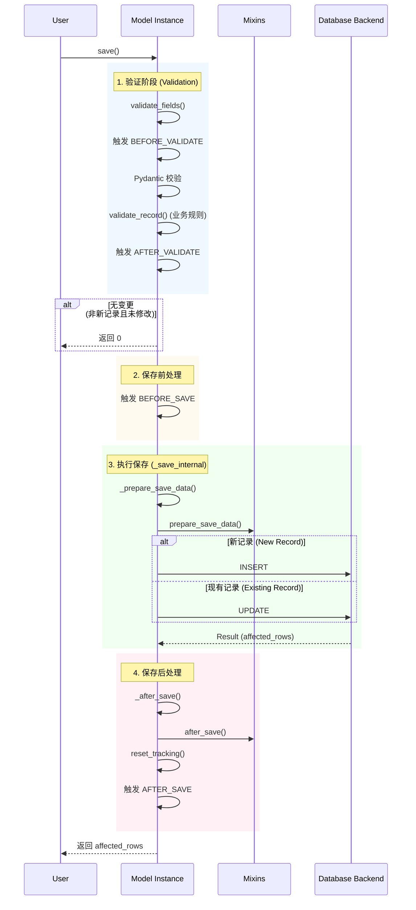

# 生命周期事件 (Lifecycle Events)

rhosocial-activerecord 提供了一套完整的生命周期事件系统，允许你在模型保存、删除、验证前后插入自定义逻辑。

## 支持的事件

定义在 `rhosocial.activerecord.interface.base.ModelEvent` 枚举中：

*   `BEFORE_VALIDATE`: 验证前
*   `AFTER_VALIDATE`: 验证后
*   `BEFORE_SAVE`: 保存前（创建或更新）
*   `AFTER_SAVE`: 保存后（创建或更新）
*   `BEFORE_DELETE`: 删除前
*   `AFTER_DELETE`: 删除后

## save() 方法生命周期

下图展示了 `save()` 方法的完整执行流程及事件触发点：



## 异常处理与事务

事件处理器的执行是同步的，并且是 `save()` 流程的一部分。因此：

1.  **异常中断**：如果任何一个事件处理器抛出异常，整个 `save()` 过程将立即中断，后续步骤（包括实际的数据库操作或后续事件）都不会执行。异常会向上传播给调用者。
2.  **事务回滚**：如果 `save()` 操作被包裹在数据库事务中（推荐做法），事件处理器引发的异常将导致整个事务回滚。这确保了数据的一致性——例如，如果 `AFTER_SAVE` 钩子失败，之前在 `save()` 中执行的数据库 INSERT/UPDATE 操作也会被回滚。

## 注册事件处理器

### 1. 使用 `on` 方法

你可以在 `__init__` 或其他地方使用 `on` 方法注册实例级别的回调。

```python
from rhosocial.activerecord.model import ActiveRecord, ModelEvent

class User(ActiveRecord):
    username: str

    def __init__(self, **data):
        super().__init__(**data)
        self.on(ModelEvent.BEFORE_SAVE, self.encrypt_password)

    def encrypt_password(self, instance, **kwargs):
        # 加密逻辑
        pass
```

### 2. 使用 Mixin (推荐)

Mixin 是复用事件逻辑的最佳方式。例如，`TimestampMixin` 就是通过注册事件来实现的。

```python
class TimestampMixin:
    def __init__(self, **data):
        super().__init__(**data)
        self.on(ModelEvent.BEFORE_SAVE, self._update_timestamps)

    def _update_timestamps(self, instance, is_new=False, **kwargs):
        now = datetime.utcnow()
        if is_new:
            self.created_at = now
        self.updated_at = now
```

## 回调函数签名

回调函数应接受 `instance` 和 `**kwargs` 参数。

```python
def callback(instance: 'ActiveRecord', **kwargs):
    # instance: 触发事件的模型实例
    # kwargs: 上下文参数
    pass
```

### 特定事件参数

*   `BEFORE_SAVE`, `AFTER_SAVE`:
    *   `is_new` (bool): 是否为新记录
*   `AFTER_SAVE`:
    *   `result` (QueryResult): 数据库操作结果（包含 `affected_rows`, `data` 等）

## 示例：自动生成 UUID

```python
import uuid
from rhosocial.activerecord.model import ActiveRecord
from rhosocial.activerecord.interface.base import ModelEvent

class UUIDMixin:
    def __init__(self, **data):
        super().__init__(**data)
        self.on(ModelEvent.BEFORE_SAVE, self._ensure_id)

    def _ensure_id(self, instance, is_new=False, **kwargs):
        if is_new and not self.id:
            self.id = str(uuid.uuid4())

class User(UUIDMixin, ActiveRecord):
    id: str
    username: str
```
