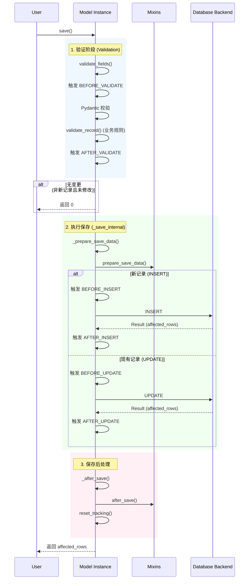

# 生命周期事件 (Lifecycle Events)

rhosocial-activerecord 提供了一套完整的生命周期事件系统，允许你在模型插入、更新、删除、验证前后插入自定义逻辑。

## 支持的事件

定义在 `rhosocial.activerecord.interface.base.ModelEvent` 枚举中：

### 验证事件
*   `BEFORE_VALIDATE`: 验证前
*   `AFTER_VALIDATE`: 验证后

### 插入事件（新记录）
*   `BEFORE_INSERT`: INSERT 操作前
*   `AFTER_INSERT`: INSERT 操作后

### 更新事件（现有记录）
*   `BEFORE_UPDATE`: UPDATE 操作前
*   `AFTER_UPDATE`: UPDATE 操作后

### 删除事件
*   `BEFORE_DELETE`: 删除前
*   `AFTER_DELETE`: 删除后

## 钩子方法与事件枚举对照

你可以通过两种方式响应生命周期事件：

| 钩子方法 | 事件枚举 | 触发时机 |
|---------|---------|---------|
| `before_validate()` | `BEFORE_VALIDATE` | Pydantic 验证前 |
| `after_validate()` | `AFTER_VALIDATE` | Pydantic 验证后 |
| - | `BEFORE_INSERT` | INSERT 前（新记录） |
| - | `AFTER_INSERT` | INSERT 后（新记录） |
| - | `BEFORE_UPDATE` | UPDATE 前（现有记录） |
| - | `AFTER_UPDATE` | UPDATE 后（现有记录） |
| `before_delete()` | `BEFORE_DELETE` | DELETE 前 |
| `after_delete()` | `AFTER_DELETE` | DELETE 后 |

**两种方式的区别**：

*   **钩子方法**：在模型类中覆写方法，适合简单的业务逻辑
*   **事件监听**：通过 `self.on(ModelEvent.XXX, callback)` 注册，适合需要动态添加/移除监听器的场景

> 💡 **AI提示词示例**: "如何使用 BEFORE_INSERT 和 BEFORE_UPDATE 事件分别为新记录和现有记录执行不同的逻辑？"

## save() 方法生命周期

下图展示了 `save()` 方法的完整执行流程及事件触发点：


```mermaid
sequenceDiagram
    participant User
    participant Model as Model Instance
    participant Mixins
    participant DB as Database Backend

    User->>Model: save()

    rect rgb(240, 248, 255)
        Note over Model: 1. 验证阶段 (Validation)
        Model->>Model: validate_fields()
        Model->>Model: 触发 BEFORE_VALIDATE
        Model->>Model: Pydantic 校验
        Model->>Model: validate_record() (业务规则)
        Model->>Model: 触发 AFTER_VALIDATE
    end

    alt 无变更 (非新记录且未修改)
        Model-->>User: 返回 0
    end

    rect rgb(240, 255, 240)
        Note over Model: 2. 执行保存 (_save_internal)
        Model->>Model: _prepare_save_data()
        Model->>Mixins: prepare_save_data()

        alt 新记录 (INSERT)
            Model->>Model: 触发 BEFORE_INSERT
            Model->>DB: INSERT
            DB-->>Model: Result (affected_rows)
            Model->>Model: 触发 AFTER_INSERT
        else 现有记录 (UPDATE)
            Model->>Model: 触发 BEFORE_UPDATE
            Model->>DB: UPDATE
            DB-->>Model: Result (affected_rows)
            Model->>Model: 触发 AFTER_UPDATE
        end
    end

    rect rgb(255, 240, 245)
        Note over Model: 3. 保存后处理
        Model->>Model: _after_save()
        Model->>Mixins: after_save()
        Model->>Model: reset_tracking()
    end

    Model-->>User: 返回 affected_rows
```

## 异常处理与事务

事件处理器的执行是同步的，并且是 `save()` 流程的一部分。因此：

1.  **异常中断**：如果任何一个事件处理器抛出异常，整个 `save()` 过程将立即中断，后续步骤（包括实际的数据库操作或后续事件）都不会执行。异常会向上传播给调用者。
2.  **事务回滚**：如果 `save()` 操作被包裹在数据库事务中（推荐做法），事件处理器引发的异常将导致整个事务回滚。这确保了数据的一致性——例如，如果 `AFTER_UPDATE` 钩子失败，之前在 `save()` 中执行的数据库 UPDATE 操作也会被回滚。

## 注册事件处理器

### 1. 使用 `on` 方法

你可以在 `__init__` 或其他地方使用 `on` 方法注册实例级别的回调。

```python
from rhosocial.activerecord.model import ActiveRecord, ModelEvent
from typing import Dict, Any

class User(ActiveRecord):
    username: str

    def __init__(self, **data):
        super().__init__(**data)
        self.on(ModelEvent.BEFORE_INSERT, self.encrypt_password)

    def encrypt_password(
        self,
        instance: 'User',
        data: Dict[str, Any],
        **kwargs
    ) -> None:
        # 新记录的加密逻辑
        pass
```

### 2. 使用 Mixin (推荐)

Mixin 是复用事件逻辑的最佳方式。例如，`TimestampMixin` 通过注册分离的事件来实现 INSERT 和 UPDATE 的不同处理。

```python
from typing import Union, Dict, Any
from datetime import datetime, timezone
from rhosocial.activerecord.interface.base import ModelEvent
from rhosocial.activerecord.interface.model import IActiveRecord, IAsyncActiveRecord

class TimestampMixin:
    def __init__(self, **data):
        super().__init__(**data)
        self.on(ModelEvent.BEFORE_INSERT, self._set_timestamps_on_insert)
        self.on(ModelEvent.BEFORE_UPDATE, self._set_updated_at)

    def _set_timestamps_on_insert(
        self,
        instance: Union['IActiveRecord', 'IAsyncActiveRecord'],
        data: Dict[str, Any],
        **kwargs
    ) -> None:
        now = datetime.now(timezone.utc)
        instance.created_at = now
        instance.updated_at = now
        data['created_at'] = now
        data['updated_at'] = now

    def _set_updated_at(
        self,
        instance: Union['IActiveRecord', 'IAsyncActiveRecord'],
        data: Dict[str, Any],
        **kwargs
    ) -> None:
        now = datetime.now(timezone.utc)
        instance.updated_at = now
        data['updated_at'] = now
```

## 回调函数签名

回调函数应接受 `instance` 和额外的上下文参数。

> **注意**：`instance` 参数的类型取决于回调定义的位置：
> - **在具体模型类中**：使用具体模型类型（如 `User`、`Product`）
> - **在 Mixin 中**：使用 `Union['ActiveRecord', 'AsyncActiveRecord']`，因为 Mixin 同时适用于同步和异步模型

### 重要约束

**1. 类型匹配**：回调函数的 `instance` 类型必须与实际模型类型匹配：
- 在 `User(ActiveRecord)` 的回调中 → `instance` 是 `User`/`ActiveRecord`
- 在 `AsyncUser(AsyncActiveRecord)` 的回调中 → `instance` 是 `AsyncUser`/`AsyncActiveRecord`
- **不能混用类型**，除非回调仅访问实例属性（不涉及 I/O 操作）

**2. 轻量操作**：回调函数应当是轻量级的、非阻塞的：
- 避免重计算或长时间运行的操作
- 避免阻塞式 I/O（网络请求、文件操作等）
- 回调在 save/delete 流程中同步执行，会阻塞主操作
- 对于异步模型，如需 I/O 操作应使用异步操作，但要保持快速

### 在具体模型类中

```python
from rhosocial.activerecord.model import ActiveRecord
from rhosocial.activerecord.interface.base import ModelEvent
from typing import Dict, Any

class User(ActiveRecord):
    username: str

    def __init__(self, **data):
        super().__init__(**data)
        self.on(ModelEvent.BEFORE_INSERT, self.encrypt_password)

    def encrypt_password(
        self,
        instance: 'User',  # 具体类型 - 这里始终是 User
        data: Dict[str, Any],
        **kwargs
    ) -> None:
        # instance 这里始终是 User 类型
        instance.encrypted_password = hash(instance.username)
```

### 在 Mixin 中（同时适用于同步和异步）

```python
from typing import Union, Dict, Any
from rhosocial.activerecord.interface.model import IActiveRecord, IAsyncActiveRecord

class TimestampMixin:
    def _set_timestamps_on_insert(
        self,
        instance: Union['IActiveRecord', 'IAsyncActiveRecord'],  # 可能是任一种
        data: Dict[str, Any],
        **kwargs
    ) -> None:
        # 同时适用于 ActiveRecord 和 AsyncActiveRecord
        instance.created_at = datetime.now(timezone.utc)
```

### 特定事件参数

| 事件 | 参数 |
|------|------|
| `BEFORE_INSERT` | `data: Dict[str, Any]` - 待插入数据（可修改） |
| `AFTER_INSERT` | `data: Dict[str, Any]`, `result: QueryResult` - 数据库操作结果 |
| `BEFORE_UPDATE` | `data: Dict[str, Any]`, `dirty_fields: Set[str]` - 变更字段名 |
| `AFTER_UPDATE` | `data: Dict[str, Any]`, `dirty_fields: Set[str]`, `result: QueryResult` |

### 修改保存数据

你可以在 `BEFORE_INSERT` 和 `BEFORE_UPDATE` 回调中修改 `data` 字典来改变保存的内容：

```python
import uuid
from typing import Dict, Any, Set
from rhosocial.activerecord.model import ActiveRecord

def before_insert_handler(
    instance: 'ActiveRecord',  # 或使用具体模型类型如 'User'
    data: Dict[str, Any],
    **kwargs
) -> None:
    # 在插入前添加计算字段
    data['uuid'] = str(uuid.uuid4())
    data['status'] = 'pending'

def before_update_handler(
    instance: 'ActiveRecord',  # 或使用具体模型类型如 'User'
    data: Dict[str, Any],
    dirty_fields: Set[str],
    **kwargs
) -> None:
    # 当特定字段变更时设置状态
    if 'email' in dirty_fields:
        data['email_verified'] = False
```

## 示例：自动生成 UUID

```python
import uuid
from typing import Union, Dict, Any
from rhosocial.activerecord.interface.base import ModelEvent
from rhosocial.activerecord.interface.model import IActiveRecord, IAsyncActiveRecord

class UUIDMixin:
    def __init__(self, **data):
        super().__init__(**data)
        self.on(ModelEvent.BEFORE_INSERT, self._ensure_id)

    def _ensure_id(
        self,
        instance: Union['IActiveRecord', 'IAsyncActiveRecord'],
        data: Dict[str, Any],
        **kwargs
    ) -> None:
        if not instance.id:
            instance.id = str(uuid.uuid4())
            data['id'] = instance.id

class User(UUIDMixin, ActiveRecord):
    id: str
    username: str
```

## 示例：使用 AFTER_UPDATE 实现乐观锁

```python
from rhosocial.activerecord.field.version import OptimisticLockMixin
from rhosocial.activerecord.interface.base import ModelEvent
from rhosocial.activerecord.backend.errors import DatabaseError

class Product(OptimisticLockMixin, ActiveRecord):
    name: str
    price: float
    version: int

# OptimisticLockMixin 使用 AFTER_UPDATE 来验证更新：
# - 检查 result.affected_rows > 0
# - 如果记录被其他进程更新则抛出 DatabaseError
```

## 迁移指南

### 从 BEFORE_SAVE/AFTER_SAVE 迁移

如果你之前使用 `BEFORE_SAVE` 或 `AFTER_SAVE` 事件，请按以下方式迁移：

| 旧事件 | 条件 | 新事件 |
|--------|------|--------|
| `BEFORE_SAVE` + `is_new=True` | → | `BEFORE_INSERT` |
| `BEFORE_SAVE` + `is_new=False` | → | `BEFORE_UPDATE` |
| `AFTER_SAVE` + `is_new=True` | → | `AFTER_INSERT` |
| `AFTER_SAVE` + `is_new=False` | → | `AFTER_UPDATE` |

**旧代码：**
```python
def handler(instance, is_new=False, **kwargs):
    if is_new:
        # INSERT 逻辑
        pass
    else:
        # UPDATE 逻辑
        pass
```

**新代码：**
```python
from typing import Dict, Any, Set
from rhosocial.activerecord.model import ActiveRecord

def insert_handler(
    instance: 'ActiveRecord',  # 或使用你的具体模型类型
    data: Dict[str, Any],
    **kwargs
) -> None:
    # 仅 INSERT 逻辑
    pass

def update_handler(
    instance: 'ActiveRecord',  # 或使用你的具体模型类型
    data: Dict[str, Any],
    dirty_fields: Set[str],
    **kwargs
) -> None:
    # 仅 UPDATE 逻辑
    pass

instance.on(ModelEvent.BEFORE_INSERT, insert_handler)
instance.on(ModelEvent.BEFORE_UPDATE, update_handler)
```