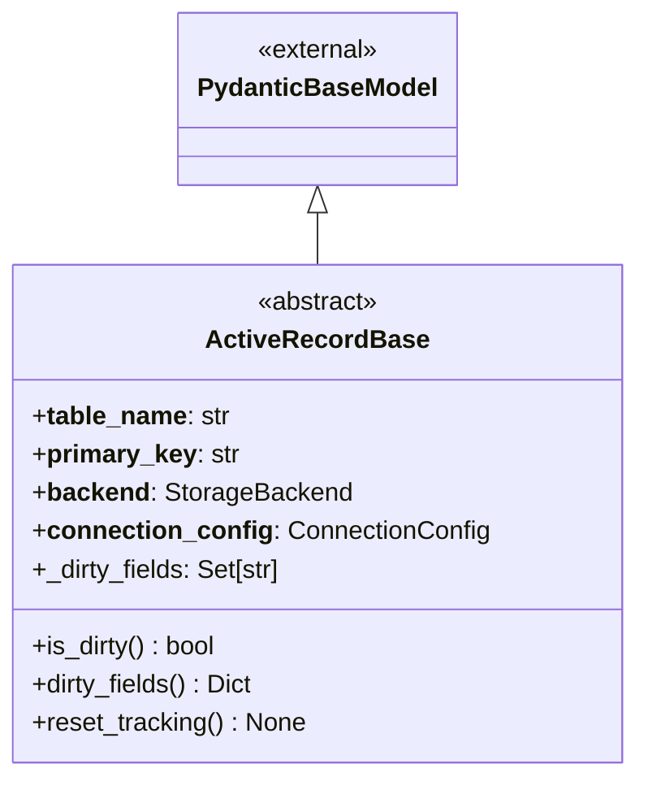
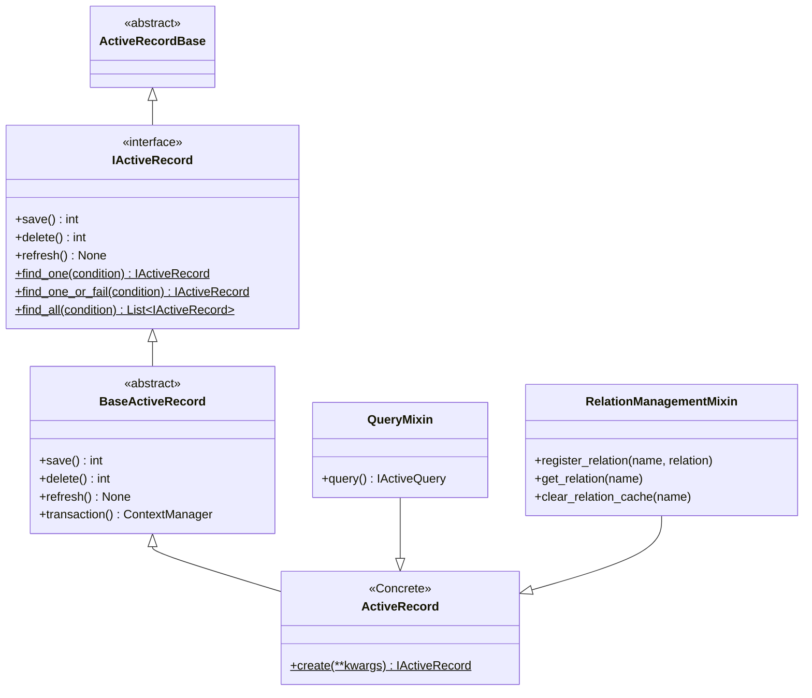
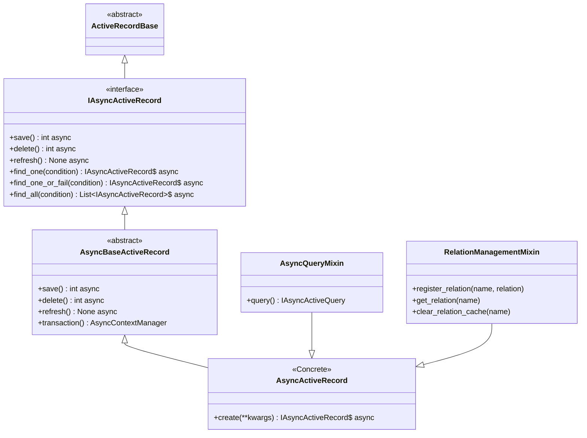
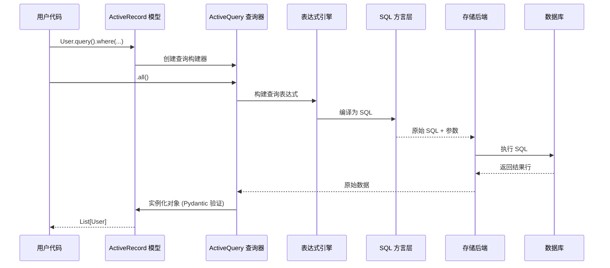

# 架构设计 (Architecture)

本库采用分层架构设计，以确保可维护性、可测试性和灵活性。

## 组件关系图 (Component Relationships)

架构分为三个主要部分：核心基石、同步实现和异步实现。

### 1. 核心基石 (`ActiveRecordBase`)

`ActiveRecordBase` 是所有模型的共同祖先。它连接了 Pydantic 的数据验证能力和 ActiveRecord 模式。

### 2. 同步架构 (`ActiveRecord`)

此图展示了同步实现的继承层次结构。它遵循从接口定义到面向用户的具体类的路径。

### 3. 异步架构 (`AsyncActiveRecord`)

异步实现镜像了同步结构，但使用了兼容异步的接口和 Mixin。

## 查询的生命周期 (The Life of a Query)

