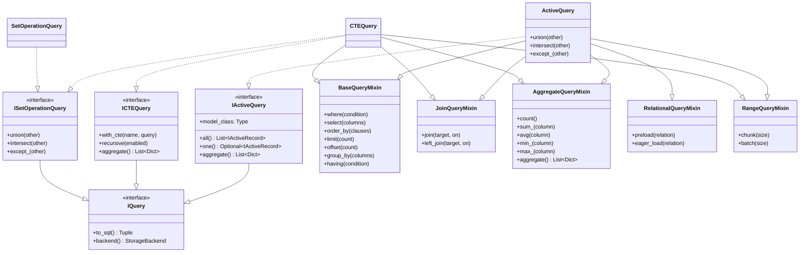

# 架构设计 (Architecture)

本库采用分层架构设计，以确保可维护性、可测试性和灵活性。架构的一个关键方面是**同步异步对等**原则，确保同步和异步实现在功能上等价且API保持一致。

## 组件关系图 (Component Relationships)

架构分为三个主要部分：核心基石、同步实现和异步实现。设计强调**同步异步对等**，两种实现方式在结构和功能上相互镜像。

> **关于 SQLite 异步后端**: 请注意，本库中包含的 SQLite 异步后端实现主要是为了测试目的（验证异步抽象的有效性及与同步实现的等价性），并不建议在生产环境中作为高性能异步解决方案使用。对于生产环境的异步需求，请使用 `rhosocial-activerecord-mysql`、`rhosocial-activerecord-postgres` 等专用后端包。

### 1. 核心基石 (`ActiveRecordBase`)

`ActiveRecordBase` 是所有模型的共同祖先。它连接了 Pydantic 的数据验证能力和 ActiveRecord 模式。

### 2. 同步架构 (`ActiveRecord`)

此图展示了同步实现的继承层次结构。它遵循从接口定义到面向用户的具体类的路径。

### 3. 异步架构 (`AsyncActiveRecord`)

异步实现镜像了同步结构，但使用了兼容异步的接口和 Mixin。这体现了**同步异步对等**原则的实际应用，两种实现遵循相同的架构模式并提供等价的功能。

### 4. 查询架构 (Query Architecture)

查询系统采用组合模式，通过 Mixin 复用功能，并支持同步和异步操作。特别地，`IActiveQuery` 和 `IAsyncActiveQuery` 提供了 `aggregate()` 方法，用于在不适合或不需要映射为 `ActiveRecord` 实例时，获取数据库的原始执行结果（字典列表）。

#### 同步查询 (Sync Query)

#### 异步查询 (Async Query)

## 同步异步对等实践 (Sync-Async Parity in Action)

架构通过结构和功能对称性展示了**同步异步对等**原则：

*   **结构对称性**: 同步和异步实现遵循相同的架构模式，具有对应的类和接口。
*   **功能等价性**: 同步版本中可用的每个操作在异步版本中都有直接等价的实现。
*   **接口一致性**: 方法签名在同步和异步版本之间保持一致，仅在 `async`/`await` 关键字的使用上有所不同。
*   **Mixin 复用**: 许多组件如 `RelationManagementMixin`、`ColumnNameMixin` 和 `FieldAdapterMixin` 在同步和异步实现之间共享。

## 查询的生命周期 (The Life of a Query)

### 流程详解 (Detailed Flow)

1.  **启动 (Initiation)**
    用户调用 `User.query()`。模型实例化一个 `ActiveQuery` 构建器，并注入当前模型的上下文。此时，查询构建器知道它服务于哪个模型以及对应的数据表。

2.  **条件收集 (Condition Collection)**
    用户链式调用 `.where()`, `.select()` 等方法。这一阶段主要是收集查询所需的各种条件和参数。值得注意的是，SQL 构建可以随时进行，不仅限于最后时刻。

3.  **构建 SQL (SQL Construction)**
    当用户调用 `.all()`, `.one()` 或 `.aggregate()` 时，或者需要查看生成的 SQL 时，查询构建器会将收集到的条件传递给 `Dialect`（方言层）。方言层负责将抽象的条件转换为特定数据库的 SQL 语法（例如处理不同数据库的分页语法差异或参数占位符风格）。

4.  **执行 (Execution)**
    构建好的 SQL 和参数被传递给 `StorageBackend`。后端负责从连接池获取连接、执行查询，并处理底层的数据库游标。对于异步操作，这里会使用 `await` 非阻塞地等待数据库响应。

5.  **映射 (ORM Mapping)**
    数据库返回的是原始的行数据（通常是元组或字典）。
    *   **如果调用 `.all()` 或 `.one()`**：`ActiveRecord` 接收这些数据，利用 Pydantic 的解析能力，将其转换为强类型的模型实例。这一步不仅是数据填充，还包括了类型转换和验证，确保返回给用户的对象是安全可靠的。
    *   **如果调用 `.aggregate()`**：跳过映射步骤，直接返回原始的字典列表 (`List[Dict]`)。这对于聚合查询或不需要模型开销的场景非常有用。
