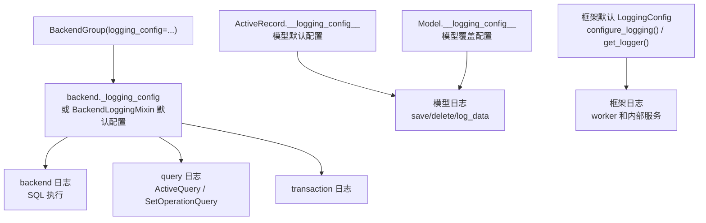

# 8. 日志系统

`rhosocial-activerecord` 日志系统提供隔离的日志器和可配置的数据摘要能力，不会修改应用程序根日志器。

## 配置归属

现在没有 logging manager singleton。日志配置只属于以下归属点之一：

1. **ActiveRecord 默认配置**：`ActiveRecord.__logging_config__` 控制未覆盖配置的模型日志。
2. **具体模型配置**：`Model.__logging_config__` 控制单个模型类。
3. **backend 配置**：backend 实例或 `BackendGroup(..., logging_config=...)` 控制 backend、query、transaction 日志。
4. **非模型框架默认配置**：`configure_logging()` 和 `get_logger(name)` 仅用于不归属 model/backend 的框架日志器。



## 快速开始

```python
import logging
from typing import Optional

from rhosocial.activerecord.logging import LoggingConfig, LogDataMode
from rhosocial.activerecord.model import ActiveRecord

ActiveRecord.__logging_config__ = LoggingConfig(
    default_level=logging.INFO,
    log_data_mode=LogDataMode.SUMMARY,
)

class User(ActiveRecord):
    __table_name__ = "users"
    id: Optional[int] = None
    username: str
    password: str

class AuditUser(ActiveRecord):
    __table_name__ = "audit_users"
    __logging_config__ = LoggingConfig(log_data_mode=LogDataMode.KEYS_ONLY)
    id: Optional[int] = None
    username: str
    password: str
```

## 非模型框架日志器

`configure_logging()` 只用于 model/backend 归属之外的框架日志器：

```python
import logging
from rhosocial.activerecord.logging import configure_logging, get_logger

configure_logging(level=logging.INFO, propagate=False)
logger = get_logger("rhosocial.activerecord.worker")
```

## 数据模式

`LoggingConfig.log_data_mode` 使用 `LogDataMode` 枚举：

| 模式 | 行为 |
| ---- | ---- |
| `LogDataMode.HIDDEN` | 整个 payload 显示为 `"<hidden>"` |
| `LogDataMode.KEYS_ONLY` | 只显示 key 和类型提示，敏感字段仍会被屏蔽 |
| `LogDataMode.SUMMARY` | 屏蔽敏感字段并截断大值 |
| `LogDataMode.FULL` | 显示完整 payload，仅适合受控调试 |

## 示例代码

完整示例位于 `docs/examples/chapter_09_logging/`：

| 文件 | 说明 |
| ---- | ---- |
| [01_basic_configuration.py](../../examples/chapter_09_logging/01_basic_configuration.py) | ActiveRecord 默认配置、模型覆盖、框架日志配置 |
| [02_data_summarization.py](../../examples/chapter_09_logging/02_data_summarization.py) | `LogDataMode` 与 `SummarizerConfig` |
| [03_per_logger_config.py](../../examples/chapter_09_logging/03_per_logger_config.py) | 所属 `LoggingConfig` 内的 per-logger 规则 |
| [04_advanced_scenarios.py](../../examples/chapter_09_logging/04_advanced_scenarios.py) | 生产/开发配置与 `BackendGroup` |

```bash
cd python-activerecord
source .venv3.8/bin/activate
python docs/examples/chapter_09_logging/01_basic_configuration.py
```
