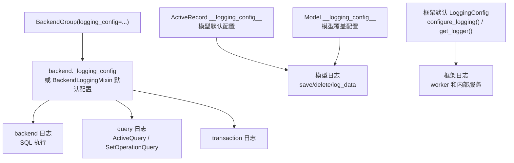

# 日志系统

`rhosocial-activerecord` 日志系统提供隔离的日志器和可配置的数据摘要能力，不会修改应用程序根日志器。

## 配置归属

现在没有 logging manager singleton。日志配置只属于以下归属点之一：

1. **ActiveRecord 默认配置**：`ActiveRecord.__logging_config__` 控制未覆盖配置的模型日志。
2. **具体模型配置**：`Model.__logging_config__` 控制单个模型类。
3. **backend 配置**：backend 实例或 `BackendGroup(..., logging_config=...)` 控制 backend、query、transaction 日志。
4. **非模型框架默认配置**：`configure_logging()` 和 `get_logger(name)` 仅用于不归属 model/backend 的框架日志器。



## 快速开始

```python
import logging
from typing import Optional

from rhosocial.activerecord.logging import LoggingConfig, LogDataMode
from rhosocial.activerecord.model import ActiveRecord

ActiveRecord.__logging_config__ = LoggingConfig(
    default_level=logging.INFO,
    log_data_mode=LogDataMode.SUMMARY,
)

class User(ActiveRecord):
    __table_name__ = "users"
    id: Optional[int] = None
    username: str
    password: str

class AuditUser(ActiveRecord):
    __table_name__ = "audit_users"
    __logging_config__ = LoggingConfig(log_data_mode=LogDataMode.KEYS_ONLY)
    id: Optional[int] = None
    username: str
    password: str
```

## 非模型框架日志器

`configure_logging()` 只用于 model/backend 归属之外的框架日志器：

```python
import logging
from rhosocial.activerecord.logging import configure_logging, get_logger

configure_logging(level=logging.INFO, propagate=False)
logger = get_logger("rhosocial.activerecord.worker")
```

## 数据模式

`LoggingConfig.log_data_mode` 使用 `LogDataMode` 枚举：

| 模式 | 行为 |
| ---- | ---- |
| `LogDataMode.HIDDEN` | 整个 payload 显示为 `"<hidden>"` |
| `LogDataMode.KEYS_ONLY` | 只显示 key 和类型提示，敏感字段仍会被屏蔽 |
| `LogDataMode.SUMMARY` | 屏蔽敏感字段并截断大值 |
| `LogDataMode.FULL` | 显示完整 payload，仅适合受控调试 |

## Web 应用中的日志落地

在 FastAPI 等 Web 应用中，除了框架的 `LoggingConfig`，通常还需要统一的应用日志输出。参考真实项目实践（如 webcrawler），推荐组合使用：

1. **`ActiveRecordFormatter`**：框架提供的格式化器，为 ORM 内部日志（`模块:行号`）与应用日志提供统一格式：

```python
from rhosocial.activerecord.logging import ActiveRecordFormatter

formatter = ActiveRecordFormatter()
# 默认格式：%(asctime)s - %(levelname)s - [%(subpackage_module)s] - %(message)s
# 输出示例：2024-01-15 10:30:45,123 - DEBUG - [rhosocial.activerecord.backend.base:42] - Executing query: ...
```

2. **文件轮转 + 控制台双输出**：`TimedRotatingFileHandler` 按时间轮转（小时/天），配合 `StreamHandler` 输出到 stderr：

```python
import logging
import sys
from logging.handlers import TimedRotatingFileHandler
from pathlib import Path

from rhosocial.activerecord.logging import ActiveRecordFormatter

def setup_logging(log_dir="logs", log_filename="app", level="INFO", when="d", backup_count=7):
    Path(log_dir).mkdir(parents=True, exist_ok=True)
    formatter = ActiveRecordFormatter()

    file_handler = TimedRotatingFileHandler(
        filename=str(Path(log_dir) / f"{log_filename}.log"),
        when=when, backupCount=backup_count, encoding="utf-8",
    )
    file_handler.setFormatter(formatter)

    console_handler = logging.StreamHandler(sys.stderr)
    console_handler.setFormatter(formatter)

    root = logging.getLogger()
    root.setLevel(getattr(logging, level.upper(), logging.INFO))
    root.handlers.clear()
    root.addHandler(file_handler)
    root.addHandler(console_handler)

    # 让 uvicorn 的访问/错误日志转发到 root，与 ORM 日志格式统一
    for name in ("uvicorn", "uvicorn.access", "uvicorn.error"):
        uv = logging.getLogger(name)
        uv.handlers.clear()
        uv.propagate = True
```

3. **整合进 FastAPI lifespan**：应用启动时调用一次，之后 ORM 内部日志（SQL 执行、模型操作）与应用日志、uvicorn 访问日志共用同一套格式。

> **与框架 `LoggingConfig` 的关系**：框架的模型/后端日志器由各自的 `LoggingConfig` 管理，默认 `propagate=False`（不污染根日志器）。上面的落地方式是**应用层**将 handler 挂到 root，并显式让 uvicorn 转发——两者不冲突：框架日志由 `LoggingConfig` 控制格式与敏感信息屏蔽，应用日志由 root logger 统一输出。

完整的可运行示例见 [FastAPI 集成场景](../scenarios/fastapi.md#7-日志配置)（`docs/examples/chapter_14_scenarios/fastapi_blog/app/logging_conf.py`）。

## 示例代码

完整示例位于 `docs/examples/chapter_09_logging/`：

| 文件 | 说明 |
| ---- | ---- |
| [01_basic_configuration.py](../../examples/chapter_09_logging/01_basic_configuration.py) | ActiveRecord 默认配置、模型覆盖、框架日志配置 |
| [02_data_summarization.py](../../examples/chapter_09_logging/02_data_summarization.py) | `LogDataMode` 与 `SummarizerConfig` |
| [03_per_logger_config.py](../../examples/chapter_09_logging/03_per_logger_config.py) | 所属 `LoggingConfig` 内的 per-logger 规则 |
| [04_advanced_scenarios.py](../../examples/chapter_09_logging/04_advanced_scenarios.py) | 生产/开发配置与 `BackendGroup` |

```bash
cd python-activerecord
source .venv3.8/bin/activate
python docs/examples/chapter_09_logging/01_basic_configuration.py
```
