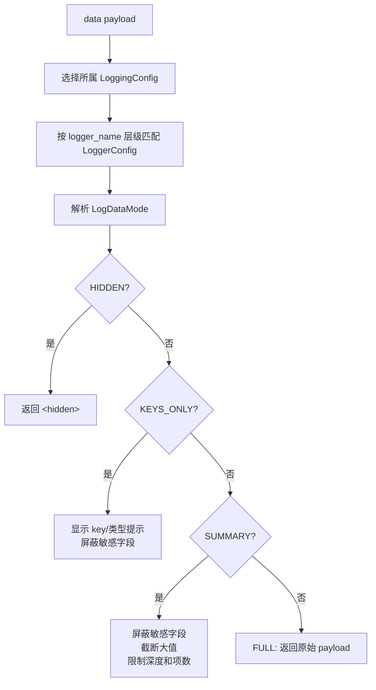

# 数据摘要

`LoggingConfig` 是日志 data payload 展示策略的唯一来源。日志调用点不通过临时参数覆盖显示模式。



## 敏感字段

`SummarizerConfig` 会按字段名屏蔽敏感数据，匹配不区分大小写。默认字段包括 password、token、secret、api_key、credential、private_key 等。

```python
from rhosocial.activerecord.logging import LoggingConfig, LogDataMode, SummarizerConfig
from rhosocial.activerecord.model import ActiveRecord

ActiveRecord.__logging_config__ = LoggingConfig(
    log_data_mode=LogDataMode.SUMMARY,
    summarizer_config=SummarizerConfig(
        sensitive_fields={"password", "token", "api_key", "credit_card", "ssn"},
        mask_placeholder="[REDACTED]",
    ),
)
```

追加字段并保留默认字段：

```python
current = ActiveRecord.__logging_config__.summarizer_config.sensitive_fields
ActiveRecord.__logging_config__.summarizer_config = SummarizerConfig(
    sensitive_fields=current | {"credit_card", "ssn"},
)
```

## 数据模式

### Hidden

```python
from rhosocial.activerecord.logging import LogDataMode

ActiveRecord.__logging_config__.log_data_mode = LogDataMode.HIDDEN
# 结果: "<hidden>"
```

### Keys Only

```python
ActiveRecord.__logging_config__.log_data_mode = LogDataMode.KEYS_ONLY
# 结果: {'title': '<str>', 'content': '<str>', 'password': '***MASKED***'}
```

### Summary

```python
ActiveRecord.__logging_config__.log_data_mode = LogDataMode.SUMMARY
# 结果: {'title': 'Short', 'content': 'Lorem ipsum...[truncated, 1000 chars total]', 'password': '***MASKED***'}
```

### Full

```python
ActiveRecord.__logging_config__.log_data_mode = LogDataMode.FULL
# 结果包含完整值，不屏蔽、不截断。
```

`FULL` 可能暴露敏感数据，只适合受控调试。

## 配置选项

| 选项 | 默认值 | 说明 |
| ---- | ------ | ---- |
| `max_string_length` | 100 | 字符串截断阈值 |
| `max_bytes_length` | 64 | bytes 截断阈值 |
| `max_dict_items` | 10 | dict/list 最多展示项数 |
| `max_depth` | 5 | 递归数据最大深度 |
| `sensitive_fields` | 内置敏感字段集合 | 要屏蔽的字段名 |
| `mask_placeholder` | `***MASKED***` | 屏蔽占位符，可为字符串或 callable |
| `field_maskers` | `{}` | 字段级自定义 masker |
| `string_placeholder` | `...[truncated, {length} chars total]` | 字符串截断占位符 |
| `show_type_hint` | `True` | 截断消息中显示类型提示 |

## 自定义 Masker

```python
from rhosocial.activerecord.logging import SummarizerConfig

config = SummarizerConfig(
    sensitive_fields={"password", "email", "api_key"},
    mask_placeholder="[REDACTED]",
    field_maskers={
        "email": lambda value: str(value).split("@")[0][:1] + "***@" + str(value).split("@")[1]
        if "@" in str(value)
        else "***",
        "password": lambda value: "*" * min(len(str(value)), 8),
    },
)
ActiveRecord.__logging_config__.summarizer_config = config
```

屏蔽优先级：

1. 字段级 `field_maskers`
2. 全局 `mask_placeholder`
3. masker 抛错时回退到 `***MASKED***`

## 模型用法

```python
import logging
from typing import Optional

from rhosocial.activerecord.logging import LoggingConfig, LogDataMode
from rhosocial.activerecord.model import ActiveRecord

class User(ActiveRecord):
    __table_name__ = "users"
    __logging_config__ = LoggingConfig(log_data_mode=LogDataMode.SUMMARY)
    id: Optional[int] = None
    username: str
    password: str

User.log_data(logging.INFO, "Creating user", {
    "username": "john",
    "password": "secret123",
    "bio": "A" * 1000,
})
```

## Backend 集成

backend、query、transaction 日志使用 backend 的 `LoggingConfig`，不使用 `ActiveRecord.__logging_config__`：

```python
from rhosocial.activerecord.backend.impl.sqlite import SQLiteBackend, SQLiteConnectionConfig
from rhosocial.activerecord.logging import LoggingConfig, LogDataMode

backend_config = LoggingConfig(log_data_mode=LogDataMode.KEYS_ONLY)
User.configure(SQLiteConnectionConfig(database=":memory:"), SQLiteBackend, logging_config=backend_config)
```
