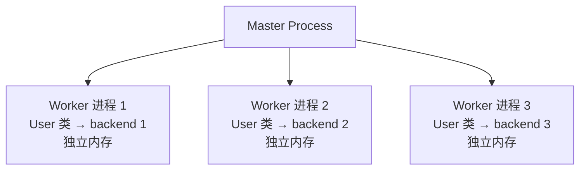
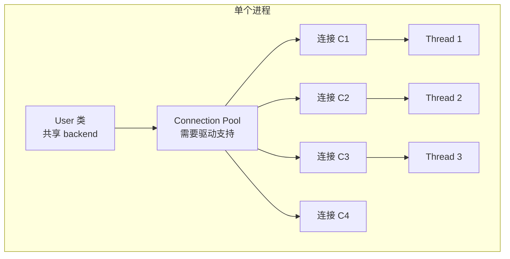

# 线程安全与并发配置 (Thread Safety and Concurrent Configuration)

在多线程环境下——Web 服务器、后台 Worker、异步框架——错误的连接管理是导致数据异常和难以
复现的 Bug 的最常见来源之一。本文介绍在并发场景中正确配置模型所需注意的事项。

> 💡 **AI 提示词：** "我的 Flask/FastAPI 应用在高并发下行为异常——查询偶尔返回错误结果或报错，
> 这有可能是连接问题吗？"

---

## 1. 在应用启动时集中调用 configure()

`configure()` 是**类级别**的操作，它将后端实例赋给模型类，并由该类的所有实例共享。
应在任何请求或 Worker 线程启动之前，恰好调用一次。

```python
# ✅ 正确：在应用启动时配置
# app.py / main.py
from rhosocial.activerecord.backend.impl.sqlite import SQLiteBackend, SQLiteConnectionConfig
from myapp.models import User, Order, Product

def create_app():
    config = SQLiteConnectionConfig(database="app.db")
    User.configure(config, SQLiteBackend)
    Order.configure(config, SQLiteBackend)   # 共享后端——同一连接池
    # ... 其他初始化 ...
    return app
```

```python
# ❌ 错误：在请求处理函数中调用 configure()
@app.get("/users")
def list_users():
    User.configure(config, SQLiteBackend)   # 每次请求都会重置后端！
    return User.query().all()
```

**为什么有问题**：在请求处理函数中调用 `configure()` 会在每次请求时替换共享后端。
并发负载下，一个请求可能在另一个请求执行查询的中途覆盖其后端，导致数据被读写到错误的数据库。

---

## 2. SQLite 与线程安全

SQLite 的默认连接模式（`check_same_thread=True`）只允许一个线程使用同一个连接。
内置的 `SQLiteBackend` 会处理这一约束，但需要注意以下几点。

### 单线程服务器（开发环境）

Flask 内置开发服务器等单线程服务器下，单个 `SQLiteBackend` 实例是安全的：

```python
# 单线程开发服务器——一个连接，一个线程
config = SQLiteConnectionConfig(database="dev.db")
User.configure(config, SQLiteBackend)
```

### 多线程服务器（生产环境）

对于多线程 WSGI 服务器（Gunicorn sync worker、uWSGI），每个线程必须拥有独立连接。
最简单的做法是在 post-fork 钩子中按进程配置：

```python
# gunicorn.conf.py
def post_fork(server, worker):
    """在 fork 后的每个 Worker 进程中调用。"""
    from rhosocial.activerecord.backend.impl.sqlite import SQLiteBackend, SQLiteConnectionConfig
    from myapp.models import Base  # 基础模型类或所有模型类

    config = SQLiteConnectionConfig(database="app.db")
    Base.configure(config, SQLiteBackend)
```

> ⚠️ **不要在 fork 前配置**：如果在主进程中调用 `configure()` 后再 fork，所有 Worker
> 会共享同一个连接对象。这是不安全的，会导致 `check_same_thread` 报错或静默的数据损坏。

### 异步服务器（ASGI）

对于运行协程的 ASGI 服务器（Uvicorn、Hypercorn），事件循环运行在单线程中，
因此单个后端实例通常是安全的：

```python
# FastAPI 启动事件
from contextlib import asynccontextmanager
from fastapi import FastAPI

@asynccontextmanager
async def lifespan(app: FastAPI):
    # 启动时配置
    config = SQLiteConnectionConfig(database="app.db")
    User.configure(config, SQLiteBackend)
    yield
    # 关闭时清理（如需要）

app = FastAPI(lifespan=lifespan)
```

---

## 3. MySQL / PostgreSQL 后端

对于服务器型数据库，后端使用连接池。关键参数如下：

```python
from rhosocial.activerecord.backend.impl.mysql import MySQLBackend, MySQLConnectionConfig

config = MySQLConnectionConfig(
    host="db.example.com",
    port=3306,
    database="myapp",
    user="app",
    password="...",
    pool_size=5,          # 每个 Worker 进程的连接数
    pool_timeout=30,      # 等待空闲连接的超时秒数
    pool_recycle=3600,    # 1 小时后回收连接
)
User.configure(config, MySQLBackend)
```

**连接池大小经验公式**：

```
pool_size = (每个 Worker 的 CPU 核数) × 2 + 1
```

对于运行 4 个 Gunicorn Worker 的 4 核机器，从每个 Worker `pool_size=9` 开始，
根据实际等待时间调整。

### 连接保活（Keep-Alive）

服务器型数据库（MySQL、PostgreSQL）通常会断开长时间空闲的连接。例如：

- MySQL 默认 `wait_timeout=28800`（8 小时）
- PostgreSQL 默认 `tcp_keepalives_idle` 等参数

如果连接池中的连接被服务器断开，下次使用时会报错。**解决方案**：

**方法一：定期回收连接**（推荐）

使用 `pool_recycle` 参数，在连接空闲一定时间后自动回收：

```python
# MySQL 示例
config = MySQLConnectionConfig(
    pool_recycle=3600,  # 1 小时回收，小于数据库的 wait_timeout
)

# PostgreSQL 示例
from rhosocial.activerecord.backend.impl.postgresql import PostgreSQLConnectionConfig
config = PostgreSQLConnectionConfig(
    pool_recycle=3600,
)
```

**方法二：TCP Keep-Alive**

在连接配置中启用 TCP 保活，让操作系统定期发送保活包：

```python
# MySQL 示例
config = MySQLConnectionConfig(
    # ... 其他参数 ...
    # 启用 TCP keep-alive（mysql-connector-python 支持）
    # 注意：参数名因驱动而异
)

# PostgreSQL 示例
config = PostgreSQLConnectionConfig(
    # psycopg v3 默认启用 TCP keepalive
    # 可通过环境变量或驱动参数调整
)
```

**方法三：主动 Ping 保活**

所有后端都提供 `ping()` 方法，可以主动检测连接状态并自动重连。适用于需要精确控制
连接生命周期的场景：

```python
# 同步版本
def ensure_connection():
    """确保连接可用，必要时重连。"""
    if not User.__backend__.ping(reconnect=True):
        raise RuntimeError("无法连接数据库")

# 异步版本
async def ensure_connection_async():
    """异步确保连接可用。"""
    if not await User.__backend__.ping(reconnect=True):
        raise RuntimeError("无法连接数据库")
```

**典型应用场景**：

```python
# 场景 1：长时间任务开始前检查
def process_batch(batch_id: int):
    ensure_connection()  # 确保连接可用
    # ... 批处理逻辑 ...

# 场景 2：定时健康检查（适用于后台 Worker）
import schedule

def health_check():
    if not User.__backend__.ping():
        logger.warning("数据库连接已断开，尝试重连...")
        User.__backend__.ping(reconnect=True)

schedule.every(5).minutes.do(health_check)

# 场景 3：从连接池借用连接前验证
class ConnectionGuard:
    def __enter__(self):
        User.__backend__.ping(reconnect=True)
        return self

    def __exit__(self, *args):
        pass

# 使用
with ConnectionGuard():
    User.query().all()
```

> 💡 **最佳实践**：
> - 优先使用 `pool_recycle`，它更可靠且不依赖网络配置
> - 将回收时间设置为数据库超时时间的 50%~70%
> - 对于关键任务，可在执行前调用 `ping()` 进行双重保障

---

## 4. 多 Worker 模式选择

当需要并发处理请求或任务时，有两种主要的 Worker 模式。选择哪种模式会影响模型配置方式
以及对数据库驱动的要求。

### 4.1 多进程 Worker（推荐）

**推荐使用成熟的多进程框架**，如 Gunicorn、uWSGI、Celery、Uvicorn 等。



**优势**：

- **进程隔离**：每个 Worker 有独立的内存空间，同一个 `User` 类在不同进程中配置不同后端，互不干扰
- **语义统一**：无论使用哪种数据库后端（SQLite、MySQL、PostgreSQL），配置模式完全一致
- **无需关心驱动差异**：连接池、线程安全等问题由框架和后端自动处理

**配置方式**：在每个 Worker 进程启动时独立调用 `configure()`：

```python
# Gunicorn 配置示例
# gunicorn.conf.py
def post_fork(server, worker):
    """在 fork 后的每个 Worker 进程中调用。"""
    from rhosocial.activerecord.backend.impl.mysql import MySQLBackend, MySQLConnectionConfig
    from myapp.models import User, Order

    config = MySQLConnectionConfig(
        host="db.example.com",
        database="myapp",
        pool_size=5,
    )
    User.configure(config, MySQLBackend)
    Order.configure(config, MySQLBackend)
```

```python
# Celery 配置示例
# celeryconfig.py 或 tasks.py
from celery import Celery

app = Celery('myapp')

@app.on_after_configure.connect
def setup_models(sender, **kwargs):
    """在 Worker 启动时配置模型。"""
    from rhosocial.activerecord.backend.impl.mysql import MySQLBackend, MySQLConnectionConfig
    from myapp.models import User

    config = MySQLConnectionConfig(...)
    User.configure(config, MySQLBackend)
```

```python
# Uvicorn + FastAPI 配置示例
from contextlib import asynccontextmanager
from fastapi import FastAPI

@asynccontextmanager
async def lifespan(app: FastAPI):
    # 每个 Worker 进程启动时配置
    from rhosocial.activerecord.backend.impl.mysql import MySQLBackend, MySQLConnectionConfig
    from myapp.models import User

    config = MySQLConnectionConfig(...)
    User.configure(config, MySQLBackend)
    yield

app = FastAPI(lifespan=lifespan)

# 启动命令：uvicorn app:app --workers 4
```

> 💡 **关键点**：多进程模式下，**不需要为每个 Worker 创建不同的模型类**。
> 同一个 `User` 类在每个进程中独立配置，进程间的内存隔离保证了安全性。

### 4.2 多线程 Worker（需注意驱动差异）

如果必须使用多线程 Worker（如自定义线程池），则需要依赖数据库驱动的连接池功能。



**前提条件**：数据库驱动必须支持连接池，且线程安全。

**不同驱动的连接池支持情况**：

| 后端 | 同步驱动 | 连接池支持 | 异步驱动 | 连接池支持 |
|------|----------|-----------|----------|-----------|
| **MySQL** | `mysql-connector-python` | ✅ 内置 | `aiomysql` | ❌ 无 |
| **PostgreSQL** | `psycopg` (v3) | ✅ 内置 | `asyncpg` | ✅ 内置 |
| **SQLite** | `sqlite3` (标准库) | ❌ 单连接 | `aiosqlite` | ❌ 单连接 |

> ⚠️ **重要提示**：如果使用的驱动不支持连接池，在多线程环境下会出现连接竞争问题。
> 这种情况下应改用多进程 Worker 模式。

**多线程配置示例**（仅适用于支持连接池的驱动）：

```python
import threading
from concurrent.futures import ThreadPoolExecutor
from rhosocial.activerecord.backend.impl.mysql import MySQLBackend, MySQLConnectionConfig
from myapp.models import User

# 在主线程配置一次（连接池会自动管理多线程访问）
config = MySQLConnectionConfig(
    host="db.example.com",
    database="myapp",
    pool_size=10,        # 连接池大小 ≥ 线程数
    pool_timeout=30,
)
User.configure(config, MySQLBackend)

def worker_task(user_id: int):
    """线程池中的任务。"""
    user = User.find_one(user_id)
    # ... 处理逻辑 ...

# 使用线程池
with ThreadPoolExecutor(max_workers=10) as executor:
    executor.map(worker_task, range(100))
```

### 4.3 模式选择建议

| 场景 | 推荐模式 | 原因 |
|------|----------|------|
| Web 服务（生产环境） | 多进程（Gunicorn/Uvicorn） | 进程隔离，稳定性高 |
| 后台任务队列 | 多进程（Celery） | 任务隔离，故障不传播 |
| CPU 密集型 + 数据库 | 多进程 | 避免 GIL 阻塞 |
| I/O 密集型（异步驱动） | 单进程多协程（Uvicorn） | 协程切换开销小 |
| 必须共享内存的场景 | 多线程 + 连接池 | 仅限支持连接池的驱动 |

> 💡 **最佳实践**：除非有明确的共享内存需求，否则优先选择多进程模式。
> 这样可以避免数据库驱动差异带来的问题，配置语义也更统一。

---

## 5. 启动时检测未配置的模型

在所有 `configure()` 调用完成后，立即添加显式检查，在服务任何请求之前捕获遗漏：

```python
REQUIRED_MODELS = [User, Order, Product, UserMetric]

def assert_all_configured():
    unconfigured = [
        cls.__name__
        for cls in REQUIRED_MODELS
        if "__backend__" not in cls.__dict__ or cls.__dict__["__backend__"] is None
    ]
    if unconfigured:
        raise RuntimeError(
            f"以下模型未配置：{', '.join(unconfigured)}。"
            "请在启动服务器前为每个模型调用 configure()。"
        )

# 在应用工厂中，返回 app 之前调用
assert_all_configured()
```

---

## 6. 线程安全检查清单

- [ ] `configure()` 在应用启动时调用一次，不在请求处理函数中调用
- [ ] 对于 fork 类服务器（Gunicorn sync worker）：在 `post_fork` 钩子中配置，不在 fork 前配置
- [ ] 对于异步服务器（Uvicorn）：在 `lifespan` 启动事件中配置
- [ ] SQLite：每个进程/线程使用独立后端，避免跨线程共享连接
- [ ] MySQL / PostgreSQL：`pool_size` 根据 Worker 并发数调整
- [ ] 启动时断言验证所有必需模型已配置
- [ ] **多 Worker 场景优先选择多进程模式**，避免数据库驱动差异问题
- [ ] 使用多线程模式前，确认数据库驱动支持连接池

---

## 可运行示例

参见 [`docs/examples/chapter_03_modeling/concurrency.py`](../../../examples/chapter_03_modeling/concurrency.py)，
该脚本自包含，完整演示了上述四种模式。

---

## 另请参阅

- [多个独立连接](best_practices.md#8-多个独立连接-multiple-independent-connections) — 共享字段但使用不同数据库的两种模式
- [环境隔离配置](configuration_management.md) — dev / test / prod 配置管理
- [并发与乐观锁](../performance/concurrency.md) — 使用 `OptimisticLockMixin` 处理并发写入
