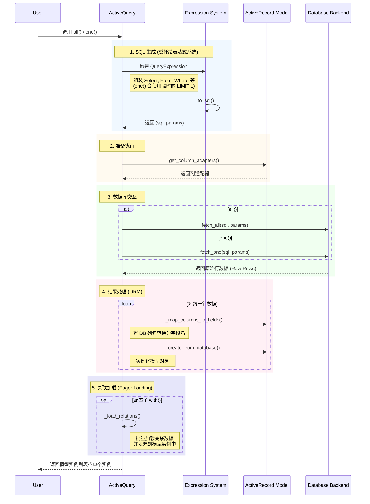
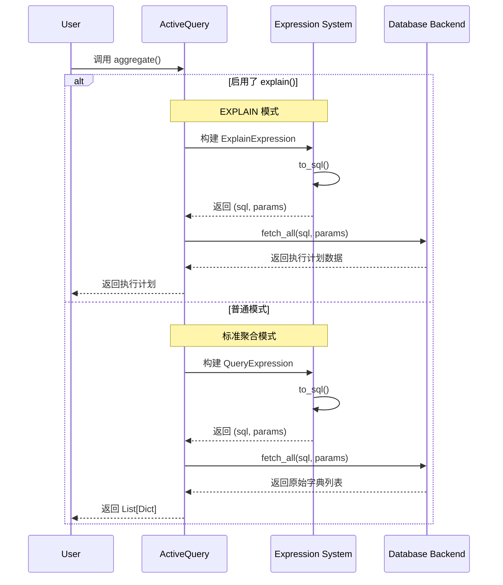

# ActiveQuery (模型查询)

`ActiveQuery` 是 `rhosocial-activerecord` 中最常用的查询对象，专为查询和操作 `ActiveRecord` 模型而设计。它通过混入（Mixin）多个功能模块，提供了丰富的查询能力。

默认情况下，`ActiveQuery` 的查询结果是模型实例（Model Instances）。

## BaseQueryMixin (基础构建块)

提供了构建 SQL 查询的基础方法。

### `select(*columns)`

指定要查询的列。如果不指定，默认查询所有列（`SELECT *`）。

*   **用法示例**：

```python
# 查询所有列
users = User.query().all()

# 仅查询特定列
users = User.query().select(User.c.id, User.c.name).all()

# 使用别名 (as_)
users = User.query().select(User.c.name.as_("username"), User.c.email).all()
```

*   **注意事项**：
    *   如果只选择了部分列，返回的模型实例中未被选择的字段将为默认值或 `None`（取决于模型定义）。
    *   在严格模式下，如果后续逻辑依赖于未被选中的字段，可能会导致错误。

### `where(condition)`

添加过滤条件（AND 逻辑）。

*   **用法示例**：

```python
# 简单条件
User.query().where(User.c.id == 1)

# 组合条件 (AND)
User.query().where((User.c.age >= 18) & (User.c.is_active == True))

# 组合条件 (OR) - 注意：需要使用 | 运算符
User.query().where((User.c.role == 'admin') | (User.c.role == 'moderator'))

# 字典传参 (自动作为 AND 处理)
User.query().where({"name": "Alice", "age": 25})
```

*   **注意事项**：
    *   **优先级问题**：在使用 `&` (AND) 和 `|` (OR) 时，**务必使用括号**包裹每个子条件，因为 Python 中位运算符的优先级较高。
    *   **None 值处理**：如果字典传参中包含 `None`，会自动转换为 `IS NULL` 检查。

### `order_by(*columns)`

指定排序规则。

*   **用法示例**：

```python
# 单列升序
User.query().order_by(User.c.created_at)

# 多列排序 (先按 role 升序，再按 age 降序)
User.query().order_by(User.c.role, (User.c.age, "DESC"))
```

### `limit(limit, offset=None)` / `offset(offset)`

分页查询。

*   **用法示例**：

```python
# 获取前 10 条
User.query().limit(10)

# 跳过前 20 条，取 10 条 (即第 3 页)
User.query().limit(10, offset=20)
# 或者
User.query().offset(20).limit(10)
```

### `group_by(*columns)` / `having(condition)`

分组统计。

*   **用法示例**：

```python
# 统计每个角色的用户数量
# SELECT role, COUNT(*) FROM users GROUP BY role HAVING COUNT(*) > 5
User.query() \
    .select(User.c.role, func.count().as_("count")) \
    .group_by(User.c.role) \
    .having(func.count() > 5) \
    .aggregate()
```

### `distinct(enable=True)`

去除重复行。

```python
# 获取所有不重复的角色
User.query().select(User.c.role).distinct().all()
```

### `explain()`

获取查询执行计划，用于性能分析。

```python
plan = User.query().where(User.c.id == 1).explain()
print(plan)
```

### 窗口函数支持

`select` 方法支持窗口函数（Window Functions）。

```python
from rhosocial.activerecord.backend.expression.window import Window, Rank

# 对每个类别的文章按浏览量排名
window = Window.partition_by(Post.c.category_id).order_by((Post.c.views, "DESC"))
rank_col = Rank().over(window).as_('rank')

results = Post.query().select(Post.c.title, rank_col).aggregate()
```

## JoinQueryMixin (连接查询)

提供了多表连接查询的能力。

*   `join(target, on=None, alias=None)`: 内连接 (INNER JOIN)。
*   `left_join(target, on=None, alias=None)`: 左外连接 (LEFT JOIN)。
*   `right_join(target, on=None, alias=None)`: 右外连接 (RIGHT JOIN)。
*   `full_join(target, on=None, alias=None)`: 全外连接 (FULL JOIN)。
*   `cross_join(target, alias=None)`: 交叉连接 (CROSS JOIN)。

*   **用法示例**：

```python
# 内连接：查找发表过文章的用户
User.query().join(Post, on=(User.c.id == Post.c.user_id))

# 左连接：查找所有用户及其文章（如果有）
User.query().left_join(Post, on=(User.c.id == Post.c.user_id))

# 带别名的连接 (自连接)
# 查找员工及其经理
Manager = User.c.with_table_alias("manager")
User.query().join(User, on=(User.c.manager_id == Manager.id), alias="manager")
```

*   **注意事项**：
    *   在连接查询中引用列时，建议明确指定表名（如 `User.c.id`），以避免歧义。
    *   使用别名时，确保 `on` 条件中引用的是别名对象的列。

## AggregateQueryMixin (聚合查询)

提供了数据统计和聚合能力。

### 简单聚合
直接返回标量值。

*   `count(column=None)`: 统计行数。
*   `sum(column)`: 计算总和。
*   `avg(column)`: 计算平均值。
*   `min(column)`: 查找最小值。
*   `max(column)`: 查找最大值。

### 复杂聚合
*   `aggregate(**kwargs)`: 执行复杂的聚合查询，返回字典。

*   **用法示例**：

```python
# 简单统计
total_users = User.query().count()
max_age = User.query().max(User.c.age)

# 复杂聚合：同时计算总分和平均分
stats = User.query().aggregate(
    total_score=User.c.score.sum(),
    avg_score=User.c.score.avg()
)
# 返回: {'total_score': 1000, 'avg_score': 85.5}
```

## RangeQueryMixin (范围与便捷过滤)

提供了常用的便捷过滤方法，这些方法在内部会被转换为 `where` 条件。

*   `in_list(column, values)`: `IN` 查询。
*   `not_in(column, values)`: `NOT IN` 查询。
*   `between(column, start, end)`: `BETWEEN` 查询。
*   `not_between(column, start, end)`: `NOT BETWEEN` 查询。
*   `like(column, pattern)` / `not_like(...)`: 大小写敏感的模式匹配。
*   `ilike(column, pattern)` / `not_ilike(...)`: 大小写不敏感的模式匹配。
*   `is_null(column)` / `is_not_null(column)`: NULL check。

*   **用法示例**：

```python
# ID 在列表中
User.query().in_list(User.c.id, [1, 2, 3])

# 名字以 "A" 开头
User.query().like(User.c.name, "A%")

# 年龄在 20 到 30 之间
User.query().between(User.c.age, 20, 30)
```

*   **注意事项**：
    *   `like` 和 `ilike` 需要自行在 pattern 中包含通配符 `%` 或 `_`。
    *   `in_list` 如果传入空列表，可能会生成 `FALSE` 条件（取决于数据库方言）。

## RelationalQueryMixin (关联加载)

提供了关联关系预加载能力，用于解决 N+1 查询问题。
关于缓存机制和 N+1 问题的详细解释，请参阅 [缓存机制](../performance/caching.md)。

*   `with_(*relations)`: 预加载关联关系。
*   `includes(*relations)`: `with_` 的别名。

`with_()` 方法支持三种主要用法：

### 1. 简单预加载 (Simple Eager Loading)

使用关联名称字符串，加载直接关联的模型。

```python
# 预加载用户的文章
users = User.query().with_("posts").all()

# 同时加载多个关联
users = User.query().with_("posts", "profile").all()
```

### 2. 嵌套预加载 (Nested Eager Loading)

使用点号 (`.`) 分隔的路径字符串，加载深层关联。

```python
# 加载用户的文章，以及每篇文章的评论
users = User.query().with_("posts.comments").all()

# 加载更深层级：用户的文章 -> 评论 -> 作者
users = User.query().with_("posts.comments.author").all()
```

### 3. 带查询修改器的预加载 (Eager Loading with Modifiers)

使用元组 `(relation_name, modifier_func)`，对关联查询进行自定义（如过滤、排序）。
`modifier_func` 接收一个查询对象，并应返回修改后的查询对象。

```python
# 预加载用户的文章，但只加载状态为 'published' 的文章
users = User.query().with_(
    ("posts", lambda q: q.where(Post.c.status == 'published'))
).all()

# 预加载文章的评论，并按创建时间倒序排列
posts = Post.query().with_(
    ("comments", lambda q: q.order_by((Comment.c.created_at, "DESC")))
).all()

# 混合使用：嵌套加载 + 修改器
# 注意：修改器只应用于元组中指定的这一层关联
users = User.query().with_(
    "posts",
    ("posts.comments", lambda q: q.order_by((Comment.c.created_at, "DESC")))
).all()
```

*   **注意事项**：
    *   关联名称必须与模型中定义的 `HasOne`, `HasMany`, `BelongsTo` 字段名一致。
    *   修改器函数必须返回查询对象。

## 集合操作发起

`ActiveQuery` 可以作为集合操作的左操作数。除了使用方法调用外，还支持使用 Python 运算符重载来发起集合操作。

*   `union(other)` 或 `+`: 发起 UNION 操作。
*   `intersect(other)` 或 `&`: 发起 INTERSECT 操作。
*   `except_(other)` 或 `-`: 发起 EXCEPT 操作。

返回的对象是一个 `SetOperationQuery` 实例，可以继续链式调用（如 `order_by`, `limit` 等）或直接执行（如 `all`, `to_sql`）。

*   **用法示例**：

```python
q1 = User.query().where(User.c.age > 20)
q2 = User.query().where(User.c.age < 30)

# 使用方法调用
union_q = q1.union(q2)

# 使用运算符重载
intersect_q = q1 & q2  # INTERSECT
except_q = q1 - q2     # EXCEPT
union_q_op = q1 + q2   # UNION

# 查看 SQL
sql, params = intersect_q.to_sql()
print(sql)
# SELECT * FROM users WHERE age > ? INTERSECT SELECT * FROM users WHERE age < ?
```

## 预定义查询范围 (Scopes)

为了提高代码的可重用性和可读性，建议在 Model 类中定义类方法来封装常用的查询条件。这类似于其他框架中的 Scope 概念。

由于 `Model.query()` 返回一个新的查询对象，你可以在其基础上链式调用方法，并返回配置好的查询对象。

### 示例

假设我们有一个博客系统，包含 `Post`（文章）和 `Comment`（评论）模型。我们希望经常查询“已发布且评论最多”的文章。

```python
class Post(Model):
    # ... 字段定义 ...

    @classmethod
    def query_published(cls):
        """预定义查询：仅包含已发布的文章"""
        return cls.query().where(cls.c.status == "published")

    @classmethod
    def query_with_most_comments(cls):
        """预定义查询：按评论数降序排列"""
        # 假设 Comment 表有 post_id 字段
        # 这里使用子查询或 join 来统计评论数
        return cls.query_published() \
            .select(cls.c.title, func.count(Comment.c.id).as_("comment_count")) \
            .left_join(Comment, on=(cls.c.id == Comment.c.post_id)) \
            .group_by(cls.c.id) \
            .order_by(("comment_count", "DESC"))

# 使用
# 获取已发布且评论最多的前 5 篇文章
top_posts = Post.query_with_most_comments().limit(5).all()
```

这种模式的好处是：
1.  **封装复杂逻辑**：调用者无需关心底层的 Join 和 Where 条件。
2.  **可链式调用**：返回的是 `ActiveQuery` 对象，因此可以继续调用 `limit()`, `offset()`, `all()` 等方法。
3.  **代码复用**：`query_with_most_comments` 内部复用了 `query_published`。

## 执行方法

这些方法会触发数据库查询并返回结果。

*   `all() -> List[Model]`: 返回所有匹配的模型实例列表。
    *   **注意**：在此方法前调用 `explain()` **无效**。如果需要获取执行计划，请使用 `aggregate()`。
*   `one() -> Optional[Model]`: 返回第一条匹配的记录，如果没有找到则返回 None。
    *   **注意**：在此方法前调用 `explain()` **无效**。
*   `exists() -> bool`: 检查是否存在匹配的记录。
    *   此方法由 `AggregateQueryMixin` 提供。
    *   **注意**：在此方法前调用 `explain()` **无效**。
*   `to_sql() -> Tuple[str, List[Any]]`: 返回生成的 SQL 语句和参数（不执行查询）。

*   **调试技巧**：
    *   在执行 `all()` 或 `one()` 之前，可以调用 `to_sql()` 查看生成的 SQL，这对于排查查询错误非常有帮助。

```python
sql, params = User.query().where(User.c.id == 1).to_sql()
print(sql, params)
# SELECT * FROM users WHERE id = ? [1]
```

## 查询生命周期与执行流程

为了更好地理解 `ActiveQuery` 是如何工作的，以下展示了 `all()`、`one()` 和 `aggregate()` 方法的执行生命周期。

**重要说明**：`ActiveQuery` 本身并不负责拼接 SQL 字符串，它仅仅是调用底层**表达式系统**（Expression System）来构建查询。所有的 SQL 生成工作都委托给了表达式系统，确保了 SQL 的安全性和对不同数据库方言的兼容性。

### 1. `all()` 和 `one()` 的生命周期

这两个方法主要用于获取模型实例。流程包括构建表达式、SQL 生成、数据库执行、数据映射和模型实例化。



### 2. `aggregate()` 的生命周期

`aggregate()` 方法用于返回原始字典数据，常用于统计分析或无需模型实例化的场景。它同样依赖表达式系统生成 SQL。


